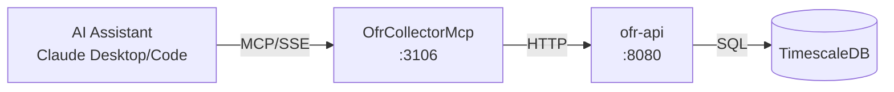

# OfrCollector MCP Server

MCP server providing Claude Desktop and Claude Code direct access to ATLAS Office of Financial Research (OFR) financial stress and funding market data.

## Overview

Exposes OfrCollector REST API as MCP tools, enabling AI assistants to query the Financial Stress Index (FSI), Short-term Funding Monitor (STFM), and Hedge Fund Monitor (HFM) data collected from OFR.

## Architecture



## MCP Tools

### FSI (Financial Stress Index) Tools

| Tool Name | Description | Key Parameters |
|-----------|-------------|----------------|
| `get_fsi_latest` | Get latest FSI with category and regional breakdowns | None |
| `get_fsi_history` | Get historical FSI observations | `start_date`, `end_date` |

FSI provides breakdowns by:
- **Category**: Credit, Equity Valuation, Funding, Safe Assets, Volatility
- **Region**: US, Advanced Economies, Emerging Markets

### STFM (Short-term Funding Monitor) Tools

| Tool Name | Description | Key Parameters |
|-----------|-------------|----------------|
| `list_stfm_series` | List all configured STFM series | None |
| `get_stfm_latest` | Get latest observation for a STFM series | `series_id` |
| `get_stfm_observations` | Get historical STFM observations | `series_id`, `start_date`, `end_date` |

STFM tracks:
- Repo rates (DVP, GCF, tri-party)
- SOFR (Secured Overnight Financing Rate)
- Treasury bill rates
- Money market fund rates
- Commercial paper rates

### HFM (Hedge Fund Monitor) Tools

| Tool Name | Description | Key Parameters |
|-----------|-------------|----------------|
| `list_hfm_series` | List all configured HFM series | None |
| `get_hfm_latest` | Get latest observation for a HFM series | `series_id` |
| `get_hfm_observations` | Get historical HFM observations | `series_id`, `start_date`, `end_date` |

HFM tracks hedge fund leverage and risk indicators from SEC filings.

### General Tools

| Tool Name | Description | Key Parameters |
|-----------|-------------|----------------|
| `categories` | List all available OFR data categories | None |
| `health` | Get OfrCollector service health status | None |

### Data Collection Admin Tools

| Tool Name | Description | Key Parameters |
|-----------|-------------|----------------|
| `trigger_fsi_collection` | Trigger immediate FSI data collection | None |
| `trigger_stfm_collection` | Trigger STFM data collection | `dataset` (optional) |
| `trigger_hfm_collection` | Trigger HFM data collection | `dataset` (optional) |
| `trigger_fsi_backfill` | Trigger FSI historical backfill | `start_date`, `end_date` |
| `trigger_stfm_series_collection` | Trigger collection for specific STFM series | `series_id` |
| `trigger_hfm_series_collection` | Trigger collection for specific HFM series | `series_id` |

### STFM Series Management Tools

| Tool Name | Description | Key Parameters |
|-----------|-------------|----------------|
| `list_stfm_series_admin` | List all STFM series including inactive | None |
| `add_stfm_series` | Add new STFM series to track | `series_id`, `backfill` |
| `toggle_stfm_series` | Enable or disable STFM series | `series_id` |
| `delete_stfm_series` | Delete STFM series and observations | `series_id` |
| `trigger_stfm_series_backfill` | Trigger historical backfill for STFM series | `series_id`, `start_date`, `end_date` |

### HFM Series Management Tools

| Tool Name | Description | Key Parameters |
|-----------|-------------|----------------|
| `list_hfm_series_admin` | List all HFM series including inactive | None |
| `add_hfm_series` | Add new HFM series to track | `series_id`, `backfill` |
| `toggle_hfm_series` | Enable or disable HFM series | `series_id` |
| `delete_hfm_series` | Delete HFM series and observations | `series_id` |
| `trigger_hfm_series_backfill` | Trigger historical backfill for HFM series | `series_id`, `start_date`, `end_date` |

## Configuration

### Environment Variables

| Variable | Default | Description |
|----------|---------|-------------|
| `OFRCOLLECTOR_API_URL` | `http://ofr-api:8080` | Backend service URL |
| `OFRCOLLECTOR_MCP_LOG_LEVEL` | `Warning` | Logging level |
| `OFRCOLLECTOR_MCP_TIMEOUT_SECONDS` | `30` | HTTP request timeout |

### Port Mapping

- Internal: 8080
- External (host): 3106
- SSE endpoint: `http://mercury:3106/sse`

## Development

### Build
```bash
.devcontainer/compile.sh
```

### Build Container
```bash
.devcontainer/build.sh
```

## Deployment

```bash
ansible-playbook playbooks/deploy.yml --tags ofr-collector-mcp
```

## Claude Desktop Integration

Add to `~/.config/Claude/claude_desktop_config.json` (Linux) or `~/Library/Application Support/Claude/claude_desktop_config.json` (macOS):

```json
{
  "mcpServers": {
    "ofr-collector": {
      "command": "uvx",
      "args": ["mcp-proxy", "http://mercury:3106/sse"]
    }
  }
}
```

Claude Desktop uses stdio transport, so `mcp-proxy` bridges stdio to SSE.

## Usage Examples

**Check financial stress:**
```
User: "What's the current financial stress level?"
Claude calls: get_fsi_latest()
Response: "FSI at 0.3 (elevated from -0.2 last week).
Credit stress contributing +0.4, driven by emerging market spreads."
```

**Review repo rates:**
```
User: "Show me recent repo rate trends"
Claude calls: get_stfm_latest("REPO-DVP-AR-TOT-P")
Response: "DVP repo rate: 5.32% (up 5bp from last week)"
```

**SOFR history:**
```
User: "What's SOFR been doing?"
Claude calls: get_stfm_observations("SOFR-AVG-30", start_date="2024-12-01")
Response: "30-day avg SOFR ranged 4.85-4.92% in December"
```

## See Also

- [OfrCollector](../OfrCollector/README.md) - Backend service documentation
- [ThresholdEngineMcp](../ThresholdEngineMcp/README.md) - Pattern evaluation using OFR data
