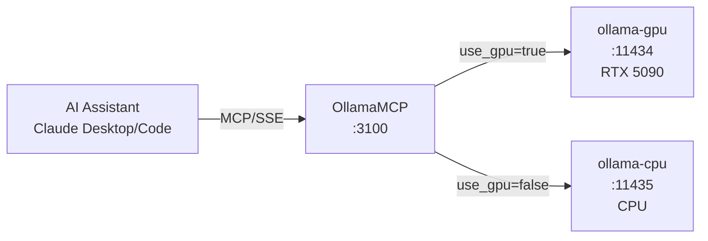

# Ollama MCP Server

MCP server providing Claude Desktop and Claude Code access to local Ollama LLM instances for text generation, chat, and model management.

## Overview

Bridges AI assistants to self-hosted Ollama instances, enabling local LLM inference without external API dependencies. Supports both GPU-accelerated (RTX 5090) and CPU fallback instances with dynamic routing.

## Architecture



## MCP Tools

### Generation Tools

| Tool Name | Description | Key Parameters |
|-----------|-------------|----------------|
| `ollama_generate` | Generate text completion | `model`, `prompt`, `system`, `temperature`, `use_gpu` |
| `ollama_chat` | Multi-turn chat with context | `model`, `messages`, `temperature`, `use_gpu` |

**Chat message format:**
```json
{
  "messages": [
    { "role": "system", "content": "You are a helpful assistant." },
    { "role": "user", "content": "Hello!" },
    { "role": "assistant", "content": "Hi there!" },
    { "role": "user", "content": "What can you do?" }
  ]
}
```

### Model Management Tools

| Tool Name | Description | Key Parameters |
|-----------|-------------|----------------|
| `ollama_list_models` | List available models on GPU or CPU instance | `use_gpu` |
| `ollama_pull_model` | Download model from Ollama library (10min timeout) | `model`, `use_gpu` |
| `ollama_model_info` | Get detailed model metadata | `model`, `use_gpu` |

## Configuration

### Environment Variables

| Variable | Default | Description |
|----------|---------|-------------|
| `OLLAMA_GPU_URL` | `http://ollama-gpu:11434` | GPU instance URL |
| `OLLAMA_CPU_URL` | `http://ollama-cpu:11434` | CPU instance URL |
| `MCP_PORT` | `3100` | SSE server port |
| `MCP_HOST` | `0.0.0.0` | Bind address |

### Port Mapping

- Internal: 8080
- External (host): 3100
- SSE endpoint: `http://mercury:3100/sse`

## Development

### Build Container
```bash
.devcontainer/build.sh
```

## Deployment

```bash
ansible-playbook playbooks/deploy.yml --tags ollama-mcp
```

## Claude Desktop Integration

Add to `~/.config/Claude/claude_desktop_config.json` (Linux) or `~/Library/Application Support/Claude/claude_desktop_config.json` (macOS):

```json
{
  "mcpServers": {
    "ollama": {
      "command": "uvx",
      "args": ["mcp-proxy", "http://mercury:3100/sse"]
    }
  }
}
```

Claude Desktop uses stdio transport, so `mcp-proxy` bridges stdio to SSE.

## Usage Examples

**Quick generation:**
```
User: "Generate a haiku about coding"
Claude calls: ollama_generate(model="llama3.2:3b", prompt="Write a haiku about coding")
Response: "Fingers on the keys / Logic flows like morning streams / Bugs become features"
```

**Code review with GPU:**
```
User: "Review this function using the local model"
Claude calls: ollama_chat(
  model="codellama:13b",
  messages=[
    {"role": "system", "content": "You are a senior code reviewer."},
    {"role": "user", "content": "Review: function add(a,b){return a+b}"}
  ],
  use_gpu=true
)
```

**Check available models:**
```
User: "What models do I have locally?"
Claude calls: ollama_list_models(use_gpu=true)
Response: "Found 5 models on GPU: llama3.2:3b, qwen2.5:14b, codellama:13b, mistral:7b, deepseek-coder:6.7b"
```

**Download new model:**
```
User: "Pull the Mistral model"
Claude calls: ollama_pull_model(model="mistral:7b", use_gpu=true)
Response: "Successfully pulled mistral:7b on GPU"
```

## See Also

- [FredCollectorMcp](../FredCollectorMcp/README.md) - FRED data access
- [ThresholdEngineMcp](../ThresholdEngineMcp/README.md) - Pattern evaluation access
- [SecMasterMcp](../SecMasterMcp/README.md) - Instrument search and metadata
