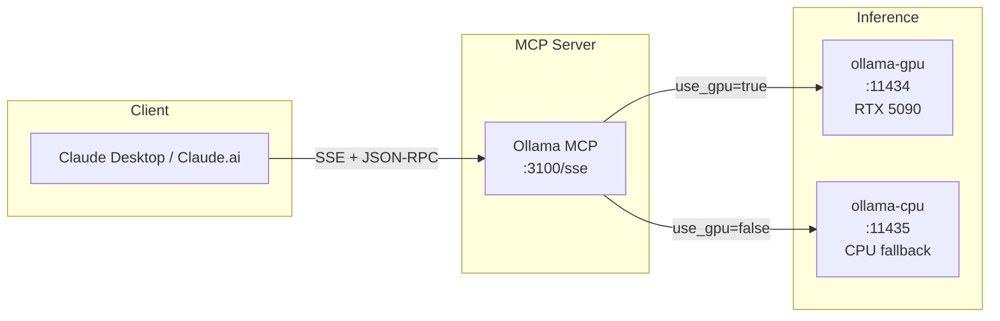

# Ollama MCP Server

MCP server exposing local Ollama instances (GPU/CPU) as tools for Claude Desktop.

## Overview

Bridges Claude Desktop to self-hosted Ollama, providing:
- **GPU/CPU Selection**: Route requests to RTX 5090 (32GB VRAM) or CPU fallback
- **Text Generation**: Completion and multi-turn chat
- **Model Management**: List, pull, and inspect models
- **No External API**: All inference runs locally

## Architecture



## Technology Stack

- **.NET 9 / C# 13** - Consistent with ATLAS platform
- **MCP Transport**: SSE (Server-Sent Events over HTTP)
- **HTTP Client**: Direct Ollama API calls

---

## MCP Tools (5 Tools)

### Generation Tools

#### `ollama_generate`
Generate text completion using Ollama.

**Parameters:**
| Name | Type | Required | Description |
|------|------|----------|-------------|
| `model` | string | Yes | Model name (e.g., "llama3.2:3b", "qwen2.5:14b") |
| `prompt` | string | Yes | The prompt text |
| `system` | string | No | Optional system message |
| `temperature` | number | No | Temperature 0.0-2.0 (default: 0.7) |
| `use_gpu` | boolean | No | Use GPU (true) or CPU (false), default: true |

**Returns:** Generated text completion

---

#### `ollama_chat`
Multi-turn chat with Ollama model.

**Parameters:**
| Name | Type | Required | Description |
|------|------|----------|-------------|
| `model` | string | Yes | Model name |
| `messages` | array | Yes | Chat messages with role/content |
| `temperature` | number | No | Temperature (default: 0.7) |
| `use_gpu` | boolean | No | Use GPU (default: true) |

**Message format:**
```json
{
  "messages": [
    { "role": "system", "content": "You are a helpful assistant." },
    { "role": "user", "content": "Hello!" },
    { "role": "assistant", "content": "Hi there!" },
    { "role": "user", "content": "What can you do?" }
  ]
}
```

**Returns:** Assistant response text

---

### Model Management Tools

#### `ollama_list_models`
List available Ollama models.

**Parameters:**
| Name | Type | Required | Description |
|------|------|----------|-------------|
| `use_gpu` | boolean | No | Check GPU (true) or CPU (false), default: true |

**Returns:**
```
Found 5 models on GPU instance:
- llama3.2:3b
- qwen2.5:14b
- codellama:13b
- mistral:7b
- deepseek-coder:6.7b
```

---

#### `ollama_pull_model`
Download a model from Ollama library.

**Parameters:**
| Name | Type | Required | Description |
|------|------|----------|-------------|
| `model` | string | Yes | Model name to pull (e.g., "llama3.2:3b") |
| `use_gpu` | boolean | No | Pull to GPU (true) or CPU (false), default: true |

**Returns:** Success confirmation

**Note:** 10-minute timeout for large model downloads.

---

#### `ollama_model_info`
Get detailed model information.

**Parameters:**
| Name | Type | Required | Description |
|------|------|----------|-------------|
| `model` | string | Yes | Model name |
| `use_gpu` | boolean | No | Query GPU (true) or CPU (false), default: true |

**Returns:** Model metadata (parameters, license, template, etc.)

---

## Configuration

### Environment Variables

```bash
OLLAMA_GPU_URL=http://ollama-gpu:11434   # GPU instance
OLLAMA_CPU_URL=http://ollama-cpu:11434   # CPU fallback
MCP_PORT=3100                             # SSE server port
MCP_HOST=0.0.0.0                          # Bind address
```

### Claude Desktop Configuration

`~/.config/Claude/claude_desktop_config.json`:
```json
{
  "mcpServers": {
    "ollama": {
      "command": "uvx",
      "args": ["mcp-proxy", "http://mercury:3100/sse"]
    }
  }
}
```

Claude Desktop doesn't natively support SSE transport, so `mcp-proxy` bridges stdio to SSE.

---

## Usage Examples

### Quick Generation
```
User: "Generate a haiku about coding"

Claude calls: ollama_generate(model="llama3.2:3b", prompt="Write a haiku about coding")

Response: "Fingers on the keys / Logic flows like morning streams / Bugs become features"
```

### Code Review with GPU
```
User: "Review this function using the local model"

Claude calls: ollama_chat(
  model="codellama:13b",
  messages=[
    {"role": "system", "content": "You are a senior code reviewer."},
    {"role": "user", "content": "Review: function add(a,b){return a+b}"}
  ],
  use_gpu=true
)
```

### Check Available Models
```
User: "What models do I have locally?"

Claude calls: ollama_list_models(use_gpu=true)

Response: Lists all models on the GPU instance
```

### Download New Model
```
User: "Pull the Mistral model"

Claude calls: ollama_pull_model(model="mistral:7b", use_gpu=true)

Response: "Successfully pulled mistral:7b on GPU"
```

---

## Deployment

Via Ansible (recommended):
```bash
cd ~/ATLAS/ansible
ansible-playbook playbooks/site.yml
```

Manual container run:
```bash
sudo nerdctl run -d \
  --name ollama-mcp \
  --network ai-network \
  -p 3100:3100 \
  -e OLLAMA_GPU_URL=http://ollama-gpu:11434 \
  -e OLLAMA_CPU_URL=http://ollama-cpu:11434 \
  ollama-mcp:latest
```

## Test

```bash
# Health check
curl http://localhost:3100/sse

# Should return:
# event: endpoint
# data: http://localhost:3100/messages/
```

---

## See Also

- [FredCollectorMcp](../FredCollectorMcp/README.md) - FRED economic data access
- [ThresholdEngineMcp](../ThresholdEngineMcp/README.md) - Pattern evaluation access
