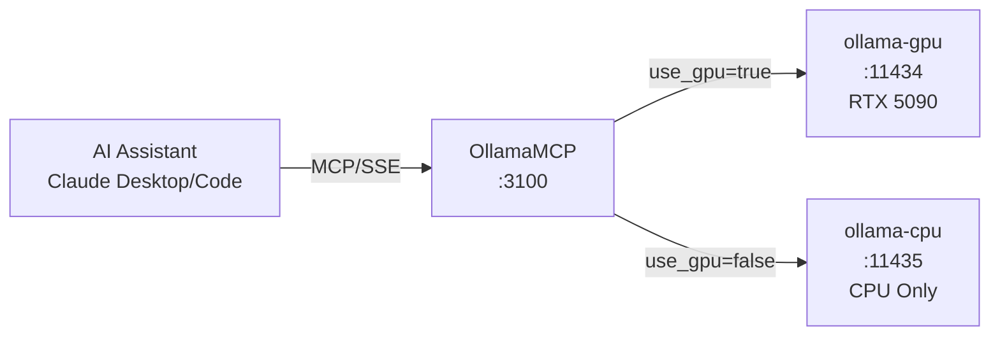

# OllamaMCP

MCP server providing Claude Desktop and Claude Code access to local Ollama LLM instances for text generation, chat, and model management.

## Overview

Bridges AI assistants to self-hosted Ollama instances, enabling local LLM inference without external API dependencies. Supports both GPU-accelerated and CPU fallback instances with dynamic routing via the `use_gpu` parameter on each tool call.

## Architecture



Requests are routed to GPU or CPU instance based on the `use_gpu` parameter (defaults to GPU).

## Features

- **Dual Instance Routing**: Dynamic GPU/CPU selection per request
- **Text Generation**: Single-prompt completions via `ollama_generate`
- **Multi-turn Chat**: Conversational context via `ollama_chat`
- **Model Management**: List, pull, and inspect models

## Configuration

| Variable | Default | Description |
|----------|---------|-------------|
| `OLLAMA_GPU_URL` | `http://ollama-gpu:11434` | GPU instance URL |
| `OLLAMA_CPU_URL` | `http://ollama-cpu:11435` | CPU instance URL |
| `MCP_PORT` | `3100` | SSE server port |
| `MCP_HOST` | `0.0.0.0` | Bind address |

## API (MCP Tools)

### Generation Tools

| Tool | Description | Key Parameters |
|------|-------------|----------------|
| `ollama_generate` | Text completion | `model`, `prompt`, `system`, `temperature`, `use_gpu` |
| `ollama_chat` | Multi-turn chat | `model`, `messages`, `temperature`, `use_gpu` |

### Model Management Tools

| Tool | Description | Key Parameters |
|------|-------------|----------------|
| `ollama_list_models` | List available models | `use_gpu` |
| `ollama_pull_model` | Download model | `model`, `use_gpu` |
| `ollama_model_info` | Model metadata | `model`, `use_gpu` |

### Chat Message Format

```json
{
  "messages": [
    { "role": "system", "content": "You are a helpful assistant." },
    { "role": "user", "content": "Hello!" }
  ]
}
```

## Project Structure

```
OllamaMCP/
├── Program.cs           # MCP server, tool definitions, Ollama client
├── OllamaMcp.csproj     # .NET 9 project file
├── Containerfile        # Container build definition
└── .devcontainer/
    ├── compile.sh       # Build script
    └── build.sh         # Container build script
```

## Development

### Prerequisites

- VS Code with Dev Containers extension
- Access to Ollama instances (GPU/CPU)

### Getting Started

1. Open in VS Code: `code OllamaMCP/`
2. Reopen in Container (Cmd/Ctrl+Shift+P -> "Dev Containers: Reopen in Container")
3. Build: `.devcontainer/compile.sh`

### Build Container

```bash
.devcontainer/build.sh
```

## Deployment

```bash
ansible-playbook playbooks/deploy.yml --tags ollama-mcp
```

## Ports

| Port | Description |
|------|-------------|
| 3100 | SSE server (internal and host-mapped) |

SSE endpoint: `http://mercury:3100/sse`

## Claude Desktop Integration

Add to `~/.config/Claude/claude_desktop_config.json`:

```json
{
  "mcpServers": {
    "ollama": {
      "command": "uvx",
      "args": ["mcp-proxy", "http://mercury:3100/sse"]
    }
  }
}
```

Claude Desktop uses stdio transport; `mcp-proxy` bridges stdio to SSE.

## See Also

- [Ollama Documentation](https://github.com/ollama/ollama/tree/main/docs)
- [MCP Specification](https://modelcontextprotocol.io/)
- [SecMaster MCP](../SecMaster/mcp/README.md) - Instrument search and metadata
- [FredCollector MCP](../FredCollector/mcp/README.md) - FRED data access
