# ATLAS - Adaptive Tactical Liquidity & Asset System

## Overview

ATLAS is a systematic macro regime identification framework designed to optimize portfolio allocation across all phases of the economic cycle. The system combines quantitative indicator tracking with rules-based decision protocols to guide tactical allocation between growth and defensive positioning based on objective economic assessment.

**Framework Purpose**: Economic cycle classification, regime change detection, and systematic allocation optimization  
**Architecture**: Event-driven data collection with rules-based decision engine  
**Philosophy**: Objective, data-driven analysis equally sensitive to both risk and opportunity signals  
**Core Principle**: Let the data determine positioning - no predetermined bias toward defensive or aggressive allocation

## Table of Contents

- [Documentation Structure](#documentation-structure)
- [Core Objectives](#core-objectives)
- [Framework Architecture](#framework-architecture)
  - [Macro Scoring Methodology](#macro-scoring-methodology)
  - [Indicator Categories with Symmetric Signals](#indicator-categories-with-symmetric-signals)
  - [Decision Protocols](#decision-protocols)
  - [Rebalancing Framework](#rebalancing-framework)
- [Project Components](#project-components)
  - [FredCollector - Economic Data Collection](#1-fredcollector---economic-data-collection)
  - [AlphaVantageCollector - Commodity Data](#1b-alphavantgecollector---commodity-data-collection)
  - [NasdaqCollector - LBMA Gold Prices](#1c-nasdaqcollector---lbma-gold-price-collection)
  - [ThresholdEngine - Pattern Evaluation & Regime Detection](#2-thresholdengine---pattern-evaluation--regime-detection)
  - [AlertService - Notification Delivery](#3-alertservice---notification-delivery)
  - [Analysis Tools](#4-analysis-tools-planned---q1-q2-2026)
  - [Alternative Data Integration](#5-alternative-data-integration-planned---q2-q3-2026)
- [Technical Stack](#technical-stack)
- [Decision Framework](#decision-framework)
  - [Operating Modes](#operating-modes)
  - [Data Verification Protocol](#data-verification-protocol-critical)
  - [Framework Rules](#framework-rules)
  - [Execution Patterns](#execution-patterns)
- [Architecture](#architecture)
- [Repository Structure](#repository-structure)
- [Getting Started](#getting-started)
  - [Prerequisites](#prerequisites)
  - [Quick Start (FredCollector)](#quick-start-fredcollector)
- [Development Philosophy](#development-philosophy)
  - [Container-First Development](#container-first-development)
  - [Engineering Principles](#engineering-principles)
  - [Code Standards](#code-standards)
- [Project Timeline](#project-timeline)
  - [Historical Evolution](#historical-evolution)
  - [Development Roadmap](#development-roadmap)
- [Quantitative Thresholds Reference](#quantitative-thresholds-reference)
  - [Key Market Thresholds](#key-market-thresholds)
- [Contributing](#contributing)
- [License](#license)

---

## Documentation Structure

**For Humans** (detailed, comprehensive):
- **[docs/ARCHITECTURE.md](./docs/ARCHITECTURE.md)** - Microservices separation decision record, system architecture
- **[docs/FRED_DATA_RESEARCH.md](./docs/FRED_DATA_RESEARCH.md)** - FRED API data source research and indicator mapping
- **[README.md](./README.md)** (this file) - Project overview, framework methodology, getting started

**For AI Coding Assistants** (compact, token-efficient):
- **[CLAUDE.md](./CLAUDE.md)** - Core code generation rules and standards
- **[STATE.md](./STATE.md)** - Project-wide state tracking
- **Service-specific documentation** (each service directory):
  - `.cursorrules` - Cursor/Claude Code instructions (FredCollector)
  - `progress.md` - Epic tracking and status (compact format)

The AI-facing documentation follows the compact syntax from CLAUDE.md (85% token reduction) for efficient context loading by Cursor and Claude Code.

## Core Objectives

1. **Macro Regime Identification**: Classify current economic state across six-zone spectrum (Crisis → Recession → Late Cycle → Neutral → Recovery → Growth)
2. **Cycle Transition Detection**: Identify inflection points and regime changes in real-time through leading indicator analysis
3. **Opportunity Recognition**: Signal undervaluation, recovery phases, and growth acceleration for tactical equity deployment
4. **Risk Management**: Monitor recession probability, financial stress, and systemic risk for defensive positioning when warranted
5. **Systematic Decision Protocols**: Quantitative allocation frameworks with symmetric rules for both offensive and defensive moves
6. **Data Independence**: Self-hosted infrastructure reducing reliance on external data providers and government sources

## Framework Architecture

### Macro Scoring Methodology

ATLAS aggregates indicators across six weighted categories to produce a composite macro score that ranges from -30 (severe crisis) to +30 (strong growth):

```
Composite_Score = Σ(Category_Score × Weight)

Categories:
- Recession Indicators (35% weight): -10 to +10 range
- Liquidity Metrics (25% weight): -10 to +10 range
- Financial Stress (10% weight): -10 to +10 range
- Growth Indicators (20% weight): -10 to +10 range
- Currency/Risk Sentiment (10% weight): -5 to +5 range
- Inflation Signals (10% weight): -5 to +5 range
```

**Score Interpretation & Allocation Ranges**:

| Regime | Score Range | Defensive % | Growth % | Typical Conditions |
|--------|-------------|-------------|----------|-------------------|
| **Crisis** | < -20 | 80-90% | 10-20% | Credit freeze, systemic stress, severe recession |
| **Recession** | -20 to -10 | 70-80% | 20-30% | Contracting GDP, rising unemployment, negative earnings |
| **Late Cycle** | -10 to 0 | 55-70% | 30-45% | Slowing growth, elevated valuations, tightening credit |
| **Neutral** | 0 to +10 | 40-55% | 45-60% | Stable growth, moderate valuations, balanced risks |
| **Recovery** | +10 to +20 | 20-40% | 60-80% | Accelerating growth, improving employment, earnings recovery |
| **Growth** | > +20 | 10-20% | 80-90% | Strong GDP, full employment, expanding credit, low stress |

### Indicator Categories with Symmetric Signals

Each category contains both bearish and bullish indicators, scored on a -2 to +2 scale:

#### Recession Indicators (35% weight)

**Contractionary Signals** (-2 to 0):
- Freight volumes declining (trucking -15%+, Baltic <600, rail carloads -10%+)
- Consumer sentiment <80 (U. Michigan) or confidence <90 (Conference Board)
- Manufacturing contraction (ISM <48, PMI <47, new orders declining)
- Labor market weakening (initial claims >400K, continued claims rising, JOLTS <7M)
- Yield curve inverted 2s10s (recession within 12-18 months historically)
- Corporate earnings declining (negative YoY for 2+ quarters)

**Expansionary Signals** (0 to +2):
- Freight volumes accelerating (Baltic >1500, trucking tonnage >5% YoY, rail growth >3%)
- Consumer sentiment >100, confidence >110 (strength and improving)
- Manufacturing expansion (ISM >52, PMI >53, new orders accelerating for 3+ months)
- Labor market strength (claims <300K sustained, JOLTS >8M, quits rate >2.5%)
- Steep yield curve (2s10s >100bps, positive term premium)
- Corporate earnings growth (>10% YoY for 2+ quarters, guidance upgrades)

#### Liquidity Metrics (25% weight)

**Risk-Off Signals** (-2 to 0):
- VIX >25 sustained (3+ days), realized vol >20%
- Dollar strength (DXY >110, safe-haven flows)
- Credit spreads widening (HY >400bps, IG >150bps, trending wider)
- Fed balance sheet contracting (QT accelerating), M2 growth <0%
- SOFR spikes >50bps above target, repo market stress
- Commodity weakness (Cu/Au <0.18, broad commodity decline)

**Risk-On Signals** (0 to +2):
- VIX <15 sustained, realized vol <12%, complacency indicators present
- Dollar weakness (DXY <95, risk appetite)
- Credit spreads compressing (HY <300bps, IG <100bps, tightening trend)
- Fed balance sheet expanding (QE active), M2 growth >6%
- SOFR stable at target, abundant liquidity, reverse repo facility elevated
- Commodity strength (Cu/Au >0.25, broad-based rally, backwardation)

#### Financial Stress (10% weight)

**Stress Signals** (-2 to 0):
- NBFI stress: HY spreads >350bps, CLO spreads widening, private credit distress
- Regional bank weakness: KRE underperforming SPX >10%, deposit flight
- Bankruptcy surge: 2+ events >$500M within 30 days, rising chapter 11 filings
- Fed emergency facilities activated: Standing Repo >$50B, discount window usage spiking
- Money market stress: Prime/government spread >50bps, redemptions accelerating

**Stability Signals** (0 to +2):
- NBFI health: HY spreads <250bps and stable, CLO issuance strong, private credit flowing
- Regional bank strength: KRE outperforming or matching SPX, deposit growth
- Bankruptcy normalcy: <1 event >$500M monthly, chapter 11 filings at historical lows
- Fed facilities dormant: Standing Repo <$10B, discount window minimal usage
- Money market calm: Prime/government spread <20bps, steady inflows

#### Growth Indicators (20% weight)

**Contractionary Signals** (-2 to 0):
- GDP growth <1% (or negative for 2 quarters), GDI diverging downward
- Industrial production declining >3% YoY, capacity utilization <75%
- Retail sales negative YoY nominal (or real declining >2%)
- Semiconductor bookings declining, chip orders/billings ratio <1.0
- Housing starts <1.2M annualized, permits declining, mortgage apps -20%+ YoY

**Expansionary Signals** (0 to +2):
- GDP growth >3%, GDI confirming or stronger, potential output expansion
- Industrial production accelerating >3% YoY, capacity utilization >80%
- Retail sales growing >5% YoY nominal (>3% real), broad-based strength
- Semiconductor bookings accelerating, chip orders/billings >1.10, backlog building
- Housing starts >1.5M annualized, permits rising, mortgage apps positive YoY

#### Valuation Metrics

**Overvaluation Signals** (caution on incremental equity exposure):
- Shiller CAPE >30 (historical 90th percentile)
- Market Cap / GDP >180% (Buffett Indicator stretched)
- Forward P/E >20x when rates >4%, earnings yield <5%
- Equity risk premium <3% (stocks expensive vs bonds)

**Undervaluation Signals** (opportunity for equity deployment):
- Shiller CAPE <20 (historical median or below)
- Market Cap / GDP <120% (reasonable relative to economy)
- Forward P/E <15x or <12x in higher rate environments
- Equity risk premium >5% (stocks attractive vs bonds)

#### Currency/Risk Sentiment (10% weight)

**Risk-Off / Defensive** (-1 to 0):
- DXY >110 (flight to safety)
- EM currencies weakening >10% vs USD
- Gold outperforming equities, hitting new highs
- Bitcoin declining >30% from peak (risk appetite waning)

**Risk-On / Growth** (0 to +1):
- DXY <95 (risk appetite, global growth)
- EM currencies strengthening vs USD
- Commodities outperforming, cyclical strength
- Bitcoin rallying (speculative appetite strong)

#### Inflation Signals (10% weight)

**Deflationary / Disinflationary** (-1 to 0):
- CPI <2% YoY, trending lower, core <2%
- PCE <2%, supercore declining
- Wage growth <3%, labor cost pressures easing
- Commodity prices declining, energy weak

**Inflationary** (0 to +1):
- CPI >4% YoY and rising, core >3%
- PCE >3%, supercore accelerating
- Wage growth >5%, labor costs rising
- Commodity prices surging, energy strong, supply shocks

### Decision Protocols

#### Symmetric Allocation Framework

**Allocation adjustments triggered by sustained macro score movements** (score stable for 30+ days or confirmed by multiple leading indicators):

```mermaid
flowchart TD
    subgraph Input
        MS[Macro Score]
    end

    subgraph Regime Classification
        MS --> |"> +20"| G[🟢 Growth]
        MS --> |"+10 to +20"| R[🔵 Recovery]
        MS --> |"0 to +10"| N[⚪ Neutral]
        MS --> |"-10 to 0"| LC[🟡 Late Cycle]
        MS --> |"-20 to -10"| RC[🟠 Recession]
        MS --> |"< -20"| CR[🔴 Crisis]
    end

    subgraph Allocation Targets
        G --> GA["Defensive: 10-20%<br/>Equity: 80-90%<br/>Focus: Cyclicals, small caps, EM"]
        R --> RA["Defensive: 20-40%<br/>Equity: 60-80%<br/>Focus: Quality growth, financials"]
        N --> NA["Defensive: 40-55%<br/>Equity: 45-60%<br/>Focus: Balanced, diversified"]
        LC --> LCA["Defensive: 55-70%<br/>Equity: 30-45%<br/>Focus: Min vol, dividends"]
        RC --> RCA["Defensive: 70-80%<br/>Equity: 20-30%<br/>Focus: Treasuries, quality bonds"]
        CR --> CRA["Defensive: 80-90%<br/>Equity: 10-20%<br/>Focus: T-bills, cash"]
    end
```



**Regime Actions Detail:**

| Regime | Score | Defensive | Equity | Strategy Focus |
|--------|-------|-----------|--------|----------------|
| **Growth** | > +20 | 10-20% | 80-90% | Cyclicals, small caps, international, EM. Deploy cash over 60-90 days |
| **Recovery** | +10 to +20 | 20-40% | 60-80% | Quality growth, financials, industrials. Scale into risk assets |
| **Neutral** | 0 to +10 | 40-55% | 45-60% | Balanced portfolio, diversified sectors, quality bias |
| **Late Cycle** | -10 to 0 | 55-70% | 30-45% | Min volatility, dividends, short duration. Build cash reserves |
| **Recession** | -20 to -10 | 70-80% | 20-30% | Treasuries, quality bonds, defensive sectors. Preserve capital |
| **Crisis** | < -20 | 80-90% | 10-20% | T-bills, short-duration treasuries, cash. Maximum preservation |

#### VIX-Based Tactical Deployment (Offensive)

Deploy idle cash into equity when volatility spikes create tactical opportunities:

**Level 1: VIX > 22** (3+ day sustained)
- Deploy: $25,000 - $100,000 (based on macro score context)
- Target: Quality companies, minimum volatility funds, defensive equity
- If macro score > -5: Lean toward larger deployment ($75K-$100K)
- If macro score < -15: Conservative deployment ($25K-$50K)

**Level 2: VIX > 30** (2+ day sustained)
- Deploy: $150,000 - $500,000 (systematic scale-in)
- Target: Broad market index funds, quality growth, oversold names
- If macro score > 0: Maximum deployment ($400K-$500K)
- If macro score < -10: Moderate deployment ($150K-$250K)

**Deployment Constraints**:
- Maximum per event: 50% of available cash
- Minimum cash retention: 25% of portfolio always held
- Scale-in over 5-10 trading days (not lump sum)
- Rebalance to target allocation within 90 days post-deployment

#### NBFI Stress Escalation (Defensive)

Move to 70-75% defensive if 2+ of the following trigger simultaneously:

**Trigger Conditions**:
1. ⚠️ HY credit spreads > 350bps (critical at >550bps)
2. ⚠️ 2+ bankruptcy events >$500M within 30 days
3. ⚠️ KRE underperforms SPX by >10% over 30 days
4. ⚠️ Fed emergency lending: Standing Repo >$50B or discount window spike
5. ⚠️ CLO AAA spreads >150bps or widening >50bps in 30 days
6. ⚠️ Money market prime/government spread >50bps

**Escalation Actions**:
- Immediate reduction of equity exposure by 10-15 percentage points
- Increase T-bill and short-duration treasury allocation
- Reduce corporate bond exposure (even IG)
- Weekly monitoring until 2+ triggers clear for 30+ days

#### Cycle Position Analysis

Replace "bubble timing" with objective cycle assessment:

**Cycle Analysis Methodology**:

The system tracks multiple dimensions to assess where the economy is within the business cycle:

- **Duration Tracking**: Months elapsed since regime transition, historical cycle length comparison
- **Policy Context**: Fed monetary policy stance (tightening vs easing), fiscal policy direction
- **Historical Analogs**: Pattern matching with past cycles (1987, 1998, 2000, 2007, 2020)
- **Valuation Context**: Multiple metrics (CAPE, Buffett Indicator, forward P/E, equity risk premium)
- **Structural Factors**: Leverage ratios, NBFI system size, reflexive product penetration

**Example Historical Analysis** (2000 Tech Bubble):
- Duration: 18 months of late-cycle signals before peak
- Policy Context: Fed tightening cycle (6.5% terminal rate)
- Valuation: CAPE 44 (extreme), forward P/E 28x
- Structural: Lower leverage (~300% GDP), less NBFI presence
- Outcome: Rapid contraction once Fed broke inflation

**Example Historical Analysis** (1998 LTCM Crisis):
- Duration: Mid-cycle signals, not late-cycle
- Policy Context: Fed easing cycle (emergency cuts)
- Valuation: CAPE 33 (elevated but not extreme)
- Structural: Hedge fund contagion, Russian default trigger
- Outcome: Cycle extension of 18-24 months post-crisis

**Monitoring for Regime Change**:
- **To Neutral/Recovery**: 3+ growth indicators turning positive, macro score sustained >0
- **To Recession**: 2+ recession indicators confirming, macro score sustained <-10
- **To Crisis**: NBFI stress triggers + credit event + Fed emergency action

### Rebalancing Framework

**Time-Based Reviews**:
- **Daily** (5 minutes): VIX, DXY, credit spreads, Cu/Au ratio
- **Weekly** (20 minutes): Full indicator scan, NBFI check, sentiment surveys
- **Monthly** (60 minutes): ISM/PMI release analysis, Fed policy assessment, portfolio rebalance

**Event-Driven Rebalancing**:
- Macro score moves by ±3 points and sustains for 30 days
- VIX triggers fire (automated alerts via Fidelity + ntfy.sh)
- 2+ NBFI stress triggers fire simultaneously
- Major Fed policy shift (unscheduled meeting, emergency action)
- Allocation drift >5% from target due to market moves

**Tax-Optimized Execution Hierarchy**:
1. **401(k) accounts**: Rebalance freely (no tax impact)
2. **IRA/SEP-IRA accounts**: Rebalance freely (tax-deferred)
3. **HSA accounts**: Rebalance freely (tax-free if used for medical)
4. **Roth accounts**: Prioritize for growth positions (tax-free gains)
5. **Brokerage accounts**: Tax-loss harvest, consider holding periods, prioritize qualified dividends
6. **Cash deployment**: Use new capital before selling existing positions

## Project Components

### 1. FredCollector - Economic Data Collection

**Purpose**: Automated collection system for Federal Reserve Economic Data (FRED) API
**Status**: ✅ 100% complete (12 epics)
**Technology**: .NET 9, C# 13, TimescaleDB, Linux containers
**Coverage**: 39 series configured, 800,000+ searchable FRED series

**Completed Epics**:
- ✅ E1: Project Foundation (100%)
- ✅ E2: FRED API Integration (100% - 55 tests passing)
- ✅ E3: Recession Indicators MVP (100% - 7 series automated)
- ✅ E5: Historical Backfill (100% - automated startup backfill)
- ✅ E6: Liquidity Indicators (100% - VIX, DXY, credit spreads, 6 series)
- ✅ E7: Growth/Valuation Indicators (100% - 12 series)
- ✅ E8: REST API (100% - endpoints for series, observations, alerts)
- ✅ E9: Production Deployment (100% - containers, monitoring)
- ✅ E10: Observability (100% - 20+ metrics, distributed tracing, Grafana dashboards)
- ✅ E11: gRPC Event Streaming (100% - deployed, production ready)
- ✅ E12: Series Discovery (100% - search API with filtering/sorting)

**Note**: E4 (Threshold Alerting) was extracted to ThresholdEngine microservice per architectural decision.

**New in E12 - Series Discovery API**:
- `GET /api/series/search` - Search 800,000+ FRED series
- Filtering by frequency, popularity, active status
- Sorting by popularity, title, last updated, relevance
- `isAlreadyCollected` enrichment for existing series

**Tests**: 378/378 passing (287 unit + 91 integration)

**Architecture Highlight**: Epic 4 (Threshold Alerting) has been extracted into a separate ThresholdEngine microservice per the architectural decision record in [docs/ARCHITECTURE.md](./docs/ARCHITECTURE.md). This maintains clean separation of concerns: FredCollector handles data collection only, while ThresholdEngine evaluates rules and AlertService delivers notifications.

**Core Capabilities**:
- **Multi-Series Collection**: Parallel collection with configurable concurrency
- **Historical Backfill**: Arbitrary time periods for any series
- **Configurable Schedules**: Daily/weekly/monthly/quarterly per series
- **Rate Limiting**: Token bucket implementation (120 req/min FRED compliance)
- **Resilience Patterns**: Polly retry, circuit breaker, timeout for robust collection
- **Time-Series Optimization**: TimescaleDB hypertables for efficient storage and queries
- **REST API**: Downstream consumption of collected data

**Architecture Highlights**:
- Event-driven with System.Threading.Channels (no MediatR dependency)
- Repository pattern with EF Core for data access
- OpenTelemetry observability with Loki integration
- Container-first: dev environment === production environment
- VS Code Dev Containers for zero environment drift

**Indicator Coverage Examples**:

*Recession Indicators* (automated):
- ICSA: Initial Claims (weekly, >400K threshold)
- IPMAN: Industrial Production - Manufacturing (monthly, <100 threshold)
- UMCSENT: Consumer Sentiment (monthly, <80 threshold)
- SOFR: Secured Overnight Financing Rate (daily)
- DGS10: 10-Year Treasury (daily, yield curve calculation)
- UNRATE: Unemployment Rate (monthly, Sahm Rule)
- FEDFUNDS: Federal Funds Rate (daily)

*Liquidity Metrics* (Epic 6 - complete):
- VIX, DXY, credit spreads, Fed balance sheet, M2, commodities

*Growth Indicators* (Epic 7 - complete):
- GDP, industrial production, retail sales, housing

**Not Limited To Current Set**:
- Can collect any of 12,000+ FRED series
- Supports calculated indicators (ratios, spreads, transformations)
- Extensible to non-FRED data sources
- Designed for long-term expansion

See [docs/FRED_DATA_RESEARCH.md](./docs/FRED_DATA_RESEARCH.md) for detailed FRED series research and indicator mapping.

[Technical documentation](./FredCollector/README.md)

### 1b. AlphaVantageCollector - Commodity Data Collection

**Purpose**: Automated collection of commodity prices from Alpha Vantage API
**Status**: ✅ Complete
**Technology**: .NET 9, C# 13, TimescaleDB, Linux containers

**Data Coverage**:
- WTI Crude Oil (daily prices)
- Brent Crude Oil (daily prices)
- Natural Gas (daily prices)

**Core Capabilities**:
- Daily commodity price collection via Alpha Vantage API
- gRPC event streaming (shared `ObservationEventStream` contract)
- Full OpenTelemetry observability (traces, metrics, logs)
- Rate limiting for API compliance

[Technical documentation](./AlphaVantageCollector/README.md)

### 1c. NasdaqCollector - LBMA Gold Price Collection

**Purpose**: Automated collection of LBMA gold prices from Nasdaq Data Link
**Status**: ✅ Complete
**Technology**: .NET 9, C# 13, TimescaleDB, Linux containers

**Data Coverage**:
- LBMA Gold Price AM (London AM fixing)
- LBMA Gold Price PM (London PM fixing)

**Core Capabilities**:
- Daily LBMA gold price collection
- gRPC event streaming (shared `ObservationEventStream` contract)
- REST API for data queries
- Full OpenTelemetry observability (traces, metrics, logs)
- Revision detection for price corrections

[Technical documentation](./NasdaqCollector/README.md)

### 2. ThresholdEngine - Pattern Evaluation & Regime Detection

**Purpose**: Evaluate configurable C# expressions against economic data to detect regime transitions and generate allocation signals
**Status**: ✅ Complete (100% - all 9 epics done)
**Technology**: .NET 9, C# 13, Roslyn, TimescaleDB, Linux containers
**Architecture**: Event-driven microservice consuming ObservationCollectedEvent, publishing ThresholdCrossedEvent

**Completed Epics**:
- ✅ E1: Foundation (100% - project structure, dependencies, dev container)
- ✅ E2: Pattern Configuration System (100% - JSON loading, hot reload, 40 tests)
- ✅ E3: Expression Compilation (100% - Roslyn compiler, caching, 75 tests)
- ✅ E4: Pattern Evaluation Engine (100% - context API, evaluation service)
- ✅ E5: Event Integration (100% - event bus, subscribers, publishers)
- ✅ E6: Regime Transition Detection (100% - macro score, hysteresis)
- ✅ E7: Pattern Library (100% - 31 patterns across 5 categories)
- ✅ E8: Production Deployment (100% - containerized, deployed, running)
- ✅ E9: Observability & Metrics (100% - 17 metrics, 5 Grafana dashboards)

**Tests**: 153/153 passing | **Patterns**: 31 configured

**Core Capabilities**:
- **Pattern Evaluation**: Roslyn-based compilation of C# expressions from JSON configuration
- **Rich Context API**: `PatternEvaluationContext` provides 10 data access helpers (GetLatest, GetYoY, GetMA, GetSpread, GetRatio, GetLowest, GetHighest, IsSustained, etc.)
- **Signal Generation**: -2 to +2 signal strength matching ATLAS framework
- **Confidence Scoring**: Data freshness, completeness, and regime applicability factors
- **Hot Reload**: Configuration changes without service restart
- **Type Safety**: Compile-time validation of expressions
- **Production Ready**: Deployed with full observability stack integration

**Architecture Highlights**:
- Event-driven with System.Threading.Channels (no MediatR dependency)
- Repository pattern for data access (shared ObservationRepository with FredCollector)
- OpenTelemetry observability with distributed tracing
- Container-first: dev environment === production environment
- VS Code Dev Containers for zero environment drift

**Pattern Categories** (31 patterns total):
- **NBFI Stress** (8): HY spreads, KRE underperformance, bankruptcy clusters, standing repo stress, reverse repo liquidity, Chicago conditions, St. Louis stress index
- **Recession** (8): Sahm Rule, consumer confidence collapse, freight recession, initial claims spike, jobs contraction, industrial contraction, continuing claims, yield curve inversion
- **Growth** (5): GDP acceleration, industrial production expansion, retail sales surge, housing starts, industrial production
- **Liquidity** (5): VIX deployment L1/L2, DXY risk-off, credit spread widening, Fed liquidity contraction
- **Valuation** (5): CAPE attractive, Buffett indicator, forward P/E value, equity risk premium, equal weight indicator

[Technical documentation](./ThresholdEngine/README.md)

### 3. AlertService - Notification Delivery

**Purpose**: Receives alerts from Prometheus/Alertmanager and dispatches notifications to configured channels (ntfy, email, Slack, PagerDuty, etc.)
**Status**: ✅ Complete (100%)
**Technology**: .NET 9, ASP.NET Core, MailKit, OpenTelemetry


**Key Features**:
- **Flexible Routing**: Configure severity-based routing (critical → email+ntfy, warning → ntfy only, etc.)
- **Multiple Channels**: Ntfy push notifications, email (SMTP), easily extensible for Slack/PagerDuty
- **Alertmanager Integration**: Accepts standard Prometheus webhook format
- **Direct Webhooks**: Simple JSON API for any service to send alerts
- **Full Observability**: OpenTelemetry traces, metrics, structured logs with span enrichment
- **Weekday-Aware Alerting**: Prevents weekend spam for business-hours-only alerts
- **State-Based Suppression**: 24-hour repeat intervals for persistent conditions (macro scores)

**Alert Routing**:
```yaml
Critical (P1):  Email + Ntfy, repeat every 1h
Warning (P2):   Ntfy, repeat every 2h  
Macro Alerts:   Ntfy, repeat every 24h (state-based)
Info (P3):      Ntfy, repeat every 12h
```

**Channel Configuration**:
- **Ntfy**: Self-hosted or ntfy.sh, with priority mapping and emoji tags
- **Email**: SMTP with TLS, customizable templates
- **Extensible**: Implement `INotificationChannel` interface for new channels

**Architecture Separation**: Extracted from ThresholdEngine to maintain clean boundaries - ThresholdEngine evaluates rules, AlertService delivers notifications. This allows independent scaling and prevents coupling notification logic with rule evaluation.

[Technical documentation](./AlertService/README.md)

### 4. Analysis Tools (Planned - Q1-Q2 2026)

**C# Analysis Engine**:
- **Portfolio Allocation Calculator**: Translate macro score to target allocation
- **Risk Metrics Computation**: Volatility, beta, correlation analysis, max drawdown
- **Tax-Optimized Rebalancing**: Minimize tax impact while achieving target allocation
- **Scenario Analysis**: What-if modeling for macro score changes
- **Stress Testing**: Portfolio impact under historical crisis scenarios

**Rust Performance Tools**:
- **Historical Backtesting**: Test allocation rules against historical data (1980-present)
- **Monte Carlo Simulation**: Statistical distribution of outcomes under various regimes
- **High-Frequency Processing**: Real-time indicator updates and calculations
- **Statistical Analysis**: Correlation decay detection, regime change probability

**Visualization Dashboard**:
- **Real-Time Monitoring**: Live indicator status, macro score trending
- **Historical Comparison**: Current state vs historical analogs (2000, 2007, 2020)
- **Portfolio Allocation**: Visual representation of current vs target allocation
- **Alert Management**: VIX triggers, NBFI stress, threshold breaches
- **Regime Classification**: Visual heatmap of category scores and weights

### 5. Alternative Data Integration (Planned - Q2-Q3 2026)

**Private Sector Data Sources** (diversify beyond government data):
- **Truflation**: Real-time inflation tracking (daily vs monthly CPI lag)
- **Indeed Job Postings**: Real-time labor market proxy (weekly vs monthly BLS lag)
- **Mastercard SpendingPulse**: Consumer spending proxy (weekly vs monthly lag)
- **FreightWaves SONAR**: Real-time freight data (trucking, rail, ocean)
- **Zillow Housing Data**: Real-time housing market metrics

**Web Scraping Infrastructure**:
- **RSS Feed Monitoring**: Macro research, Fed communications, earnings calls
- **Structured Data Extraction**: Key data sources (earnings reports, Fed minutes)
- **Change Detection**: Alert on material changes to monitored sources
- **Rate-Limited Crawling**: Respectful practices, robots.txt compliance

**Machine Learning Components** (exploratory):
- **Correlation Decay Detection**: Identify when historical indicator relationships break down
- **Regime Change Prediction**: Lead indicator combinations for regime transitions
- **Anomaly Detection**: Flag unusual patterns in indicator relationships
- **Natural Language Processing**: Sentiment analysis of Fed communications, earnings calls

## Technical Stack

**Data Collection**:
- .NET 9 (C# 13) for service development
- TimescaleDB (PostgreSQL + time-series extensions)
- containerd/nerdctl for container orchestration
- Multi-stage Dockerfiles (development + runtime)

**Observability**:
- OpenTelemetry (OTLP) for traces, metrics, and logs
- Tempo for distributed tracing backend
- Prometheus for metrics storage and querying
- Loki for log aggregation with trace correlation
- Grafana for unified dashboards (9 dashboards: FredCollector, ThresholdEngine x4, system x2, infrastructure, GPU)
- Serilog for structured logging (correlated with traces)

**Deployment**:
- Linux containers (Ubuntu 24)
- Self-hosted infrastructure (AMD Threadripper 9960X, 128GB RAM)
- nerdctl compose orchestration
- Bash automation scripts

**Development**:
- VS Code Dev Containers (zero environment drift)
- Multi-stage builds (dev environment === production)
- EF Core migrations for schema management
- xUnit + integration tests

**Notifications**:
- ntfy.sh (self-hosted push notifications)
- Email via configurable SMTP (MailKit)
- Extensible notification system for custom alerts

## Decision Framework

### Operating Modes

- **Research (R)**: Investigate new strategies, data sources, and historical analogs
- **Innovate (N)**: Develop new analytical approaches and indicator combinations
- **Plan (P)**: Design implementations, architectures, and deployment strategies
- **Execute (X)**: Monitor indicators, assess regime, make allocation decisions
- **Review (V)**: Evaluate performance, backtest rules, refine framework

### Data Verification Protocol (CRITICAL)

All financial facts require tool verification before use in decision-making:

**Freshness Requirements**:
- Market data (prices, rates, spreads): <1 day
- Economic indicators (GDP, employment, ISM): <30 days
- Corporate earnings and guidance: <90 days
- Macro score components: <7 days for leading indicators

**Confidence Threshold**: 75%+ required for actionable decisions
- Below 75%: Abstain from action, gather more data
- 75-85%: Proceed with caution, use smaller position sizes
- 85-95%: Standard confidence, full position sizing
- 95%+: High confidence, can accelerate execution

**LLM Training Data Limitations**:

When using AI assistants (like Claude) with the ATLAS system, remember:
- LLM training data has a cutoff date (typically 2-12 months behind current date)
- Any market data, prices, indicators, or economic releases after cutoff are unknown to the LLM
- **All financial facts must be tool-verified** regardless of LLM statements
- LLMs may hallucinate outdated or incorrect market data
- Always verify: prices, economic releases, Fed decisions, corporate earnings

### Framework Rules

1. **VERIFY**: Tool → Fresh data → Cross-validate → 75%+ confidence threshold
2. **CITE**: Every fact needs [Source | Date | Confidence level]
3. **ABSTAIN**: If verification fails, provide decision framework without specific recommendation
4. **SYSTEMATIC**: Follow rules-based protocols, eliminate emotional decision-making
5. **REPRODUCIBLE**: All analysis must be verifiable and repeatable by third party
6. **BALANCED**: Equal scrutiny to bullish and bearish signals, no confirmation bias
7. **QUANTITATIVE**: Numerical thresholds for all decisions, no subjective interpretation

### Execution Patterns


**Example Decision Flow**:
```
User: "Should I deploy cash now?"

1. VERIFY: Check VIX (tool), check macro score (tools), check recent indicators (tools)
2. CROSS-VALIDATE: Multiple sources for VIX, credit spreads, market conditions
3. CALCULATE CONFIDENCE: All sources agree? 95%. Sources conflict? 60-70%.
4. APPLY RULES: 
   - IF VIX >22 AND macro score >-5 AND confidence >85% → Deploy $75K-$100K (Level 1)
   - IF VIX >30 AND macro score >0 AND confidence >85% → Deploy $400K-$500K (Level 2)
   - IF confidence <75% → Abstain, gather more data
5. RESPOND (example): 
   "VIX at 24.3 [Source: Yahoo Finance, 2025-XX-XX, 95% confidence]. 
    Macro score -4.4 [Last verified: recent]. Level 1 trigger activated.
    Recommendation: Deploy $75K-$85K given late cycle macro context.
    Allocation suggestion: 60% minimum volatility, 40% quality dividend."
```

## Architecture

**⚠️ IMPORTANT**: The ATLAS system follows a microservices architecture with clear separation of concerns. See [docs/ARCHITECTURE.md](./docs/ARCHITECTURE.md) for the comprehensive architectural decision record explaining how data collection, threshold evaluation, and alerting are separated into dedicated services.


**Key Architectural Principles**:
- **Data Collectors** (FredCollector, AlphaVantageCollector, NasdaqCollector): Poll sources, publish events
- **ThresholdEngine**: Subscribes to all events, evaluates rules, publishes breaches
- **AlertService**: Delivers notifications (email, push, etc.)
- **Event-Driven**: System.Threading.Channels (MVP) or message queue (production scale)

## Repository Structure

```
ATLAS/
├── docs/                   # 📚 Human-facing documentation (verbose)
│   ├── ARCHITECTURE.md     # Microservices separation decision record
│   ├── OBSERVABILITY.md    # Metrics, tracing, logging patterns
│   └── FRED_DATA_RESEARCH.md # FRED API research and indicator mapping
├── Events/                  # Shared event contracts (gRPC proto + C# types)
│   └── src/
│       └── Events/            # ObservationCollectedEvent, ThresholdCrossedEvent, etc.
├── FredCollector/          # FRED API data collection service
│   ├── src/                # C# source code (.NET 9)
│   ├── tests/              # Unit and integration tests
│   └── .devcontainer/      # VS Code Dev Container config
├── AlphaVantageCollector/  # Commodity prices (WTI, Brent, Natural Gas)
│   ├── src/                # C# source code (.NET 9)
│   └── .devcontainer/      # VS Code Dev Container config
├── NasdaqCollector/        # LBMA gold price collection
│   ├── src/                # C# source code (.NET 9)
│   └── .devcontainer/      # VS Code Dev Container config
├── ThresholdEngine/        # Pattern evaluation & regime detection service
│   ├── progress.md         # 🤖 Epic tracking (compact format)
│   ├── src/                # C# source code (.NET 9)
│   │   ├── Core/           # Domain models, interfaces, entities
│   │   ├── Infrastructure/ # Compilation, configuration, data access
│   │   ├── Application/    # Business logic (evaluation services)
│   │   └── Service/        # Worker service entry point
│   ├── tests/              # Unit and integration tests (153 tests passing)
│   ├── config/             # Pattern configurations (31 JSON files)
│   └── .devcontainer/      # VS Code Dev Container config
├── OllamaMCP/              # MCP server for Claude Desktop
│   ├── Program.cs          # C# source code (.NET 9)
│   ├── OllamaMcp.csproj    # Project file
│   ├── Containerfile       # Container build definition
│   └── README.md           # MCP server documentation
├── infrastructure/         # Infrastructure-as-code definitions
│   ├── compose.yaml.j2     # Service orchestration template (21 services, Ansible/Jinja2)
│   ├── monitoring/         # Prometheus configs, 9 Grafana dashboards
│   └── README.md           # Infrastructure documentation
├── ansible/                # Deployment automation (HOW to deploy)
│   ├── playbooks/          # Ansible playbooks
│   ├── inventory/          # Host definitions
│   ├── scripts/            # Utility scripts (ZFS tuning, template validation)
│   └── README.md           # Ansible documentation
├── FredCollectorClient/    # gRPC client library for FredCollector
├── markitdownMCP/          # MarkItDown MCP server
├── CLAUDE.md               # 🤖 Core code generation rules and standards
└── STATE.md                # Project-wide state tracking
```

**Documentation Organization**:
- **📚 docs/** - Human-facing: detailed, comprehensive, can be verbose
- **🤖 FredCollector/progress.md** - AI-facing: compact syntax, token-efficient
- **🤖 ThresholdEngine/progress.md** - AI-facing: compact syntax, token-efficient
- **🤖 CLAUDE.md** - Code generation rules for all AI assistants
- **📊 STATE.md** - Current project state and infrastructure status

## Getting Started

### Prerequisites

- **Container Runtime**: containerd with nerdctl
- **IDE**: VS Code or Cursor with Dev Containers extension
- **Git**: 2.40+
- **FRED API Key**: Free registration at https://fred.stlouisfed.org/
- **TimescaleDB**: 2.14+ (or use provided docker-compose)

### Quick Start

**Production Deployment** (Ansible - Recommended):

```bash
# Clone repository
git clone https://github.com/jpansarasa/ATLAS.git
cd ATLAS/ansible

# Deploy full infrastructure stack
ansible-playbook playbooks/site.yml

# Verify services
sudo systemctl status atlas.service
cd /opt/ai-inference && sudo nerdctl compose ps
```

This deploys all ATLAS services (FredCollector, ThresholdEngine, observability stack, etc.) via Ansible. See [ansible/README.md](./ansible/README.md) for detailed deployment documentation.

**Development** (Dev Containers):

For service-specific development, each service supports VS Code Dev Containers:

```bash
# FredCollector development
cd ATLAS/FredCollector
code .
# Command Palette: "Dev Containers: Reopen in Container"

# ThresholdEngine development
cd ATLAS/ThresholdEngine
code .
# Command Palette: "Dev Containers: Reopen in Container"
```

Dev containers automatically connect to shared infrastructure (TimescaleDB, observability stack) via `ai-network`.

See service-specific README files for detailed setup:
- [FredCollector documentation](./FredCollector/README.md)
- [ThresholdEngine documentation](./ThresholdEngine/README.md)
- [Infrastructure documentation](./infrastructure/README.md)
- [Ansible deployment guide](./ansible/README.md)

## Development Philosophy

### Container-First Development

- All development, debugging, and testing happens inside containers
- Dev environment === Production environment (zero configuration drift)
- Multi-stage Dockerfiles with development and runtime targets
- VS Code Dev Containers for full IDE experience in container
- No local SDK installations required
- Consistent behavior across all machines

### Engineering Principles

- **Explicit over Implicit**: No magic strings, use constants/enums
- **Repository Pattern**: Clean separation of data access from business logic
- **Event-Driven Architecture**: Native .NET channels for decoupled components
- **Observability from Day One**: OpenTelemetry, structured logging, tracing
- **Defensive Programming**: Comprehensive error handling, validation, resilience
- **Production-Grade Everywhere**: No "dev-only" shortcuts, treat dev like prod
- **Testable Architecture**: Dependency injection, interface-based design
- **Quantitative Decision-Making**: No gut feelings, all rules have numeric thresholds

### Code Standards

- **C# Conventions**: Microsoft C# coding conventions
- **Documentation**: XML documentation on all public APIs
- **Test Coverage**: Minimum 80% line coverage for business logic
- **Integration Tests**: Database-dependent tests with shared TimescaleDB
- **No Mocking Frameworks**: Simple hand-rolled test doubles for clarity
- **Immutable Data**: Prefer immutable records for domain models
- **Async/Await**: Consistent async patterns, no sync-over-async

## Project Timeline

### Historical Evolution

- **2018-2022**: Manual monitoring, spreadsheet-based tracking, learning phase
- **2023**: Framework formalization, systematic indicator selection
- **2024**: Expansion to comprehensive coverage (40+ indicators)
- **2025**: Architecture design, technology selection, automation initiative begins

### Development Roadmap

The system follows a phased development approach with clear milestones:

**Phase 1: Data Foundation** ✅ Complete
- ✅ FredCollector architecture established
- ✅ TimescaleDB integration and optimization
- ✅ Event-driven data collection with resilience patterns
- ✅ Container-first development workflow
- ✅ OpenTelemetry observability baseline

**Phase 2: Core Indicator Automation** ✅ Complete
- ✅ FRED data collection for 29 configured series
- ✅ Event system with System.Threading.Channels
- ✅ Historical backfill infrastructure (BackfillService)
- ✅ Comprehensive testing (319 tests passing)
- ✅ Production deployment (Epic 9 - complete)
- ✅ REST API (Epic 8 - complete)
- ✅ gRPC Event Streaming (Epic 11 - 100%, production deployed)

**Phase 2.1: Comprehensive Indicator Coverage** ✅ Complete
- ✅ Liquidity Indicators (6 series: VIX, DXY, credit spreads, Fed balance sheet, M2)
- ✅ Growth/Valuation Indicators (12 series: GDP, industrial production, retail sales, housing)
- ✅ Observability framework (20+ metrics, distributed tracing, Grafana dashboards)

**Phase 2.5: Pattern Evaluation System** ✅ Complete
- ✅ ThresholdEngine architecture established
- ✅ Pattern configuration system with hot reload
- ✅ Roslyn-based expression compilation
- ✅ Pattern evaluation engine with data access context
- ✅ Event integration (E5 - complete)
- ✅ Regime transition detection (E6 - complete)
- ✅ Pattern library with 24 patterns (E7 - complete)
- ✅ Production deployment (E8 - complete)
- ✅ Observability with 5 Grafana dashboards (E9 - complete)
- ✅ Comprehensive testing (153 tests passing)

**Phase 3: Integration & Expansion** (Current)
- End-to-end FredCollector → ThresholdEngine event flow validation
- Pattern enablement by adding required series (currently 29 of 40+ target)
- gRPC streaming performance benchmarks
- Notification system integration (ntfy.sh, email)

**Phase 4: Analysis Tools**
- C# Analysis Engine: allocation calculator, risk metrics, tax-optimized rebalancing
- Alternative data integration: Truflation, Indeed, Mastercard SpendingPulse
- Web scraping infrastructure: RSS feeds, structured data extraction
- Enhanced visualization: indicator dashboard prototype

**Phase 5: Advanced Analytics**
- Rust Backtesting Engine: historical validation across multiple cycles
- Monte Carlo simulation for scenario analysis
- Machine learning components: correlation decay detection, regime prediction
- Full dashboard: real-time monitoring, historical comparison, alert management
- Performance optimization: sub-second indicator updates

**Phase 6: Production Hardening**
- High availability and disaster recovery implementation
- Expanded data sources: private credit metrics, NBFI stress indicators
- Advanced analytics: comprehensive scenario analysis, stress testing
- Framework validation: multi-year backtest results across regimes
- Documentation: user guide, API reference, operations runbook

## Quantitative Thresholds Reference

### Key Market Thresholds

**Copper/Gold Ratio** (economic activity proxy):
- Bear Market: <0.15 (severe contraction)
- Neutral: 0.15 - 0.22 (stable)
- Bull Market: >0.22 (expansion)

**Baltic Dry Index** (global trade):
- Bear Market: <600 (weak demand)
- Neutral: 600 - 1500 (moderate)
- Bull Market: >1500 (strong demand)

**High-Yield Credit Spread** (credit stress):
- Bull Market: <400bps (tight credit)
- Neutral: 400 - 550bps (moderate)
- Bear Market: >550bps (credit stress)

**Russell 2000 / S&P 500 Ratio** (risk appetite):
- Bear Market: <0.50 (defensive positioning)
- Neutral: 0.50 - 0.65 (balanced)
- Bull Market: >0.65 (risk-on)

**Global M2 Growth YoY** (liquidity):
- Tight: <2% (liquidity contraction)
- Neutral: 2% - 6% (moderate)
- Loose: >6% (liquidity expansion)

**Real Interest Rates** (10Y TIPS yield):
- Tight: >2% (restrictive policy)
- Neutral: 0% - 2% (moderate)
- Loose: <0% (accommodative policy)

**Dollar Index (DXY)** (risk sentiment):
- Risk-Off: >110 (flight to safety)
- Neutral: 95 - 110 (balanced)
- Risk-On: <95 (risk appetite)

## Contributing

This is a personal portfolio management system. The code is open for reference and educational purposes, but external contributions are not being accepted at this time.

## License

Proprietary - Personal use only

---

**Disclaimer**: This system is designed for personal portfolio management and educational purposes. It is not investment advice. All investment decisions involve risk. Past performance does not guarantee future results. The framework provides objective data analysis but does not guarantee profitable outcomes. Markets can remain irrational longer than you can remain solvent. Consult qualified financial professionals for investment guidance.

---

**Last Updated**: 2025-11-29
**Framework Version**: 4.5
**Project Status**: Production Ready
- **FredCollector**: ✅ 100% complete (12 epics, 378 tests, production deployed)
- **AlphaVantageCollector**: ✅ Complete (commodity prices, production deployed)
- **NasdaqCollector**: ✅ Complete (LBMA gold, production deployed)
- **ThresholdEngine**: ✅ 100% complete (9 epics, 153 tests, production deployed)
- **AlertService**: ✅ 100% complete (notifications working, production deployed)
- **Infrastructure**: 21 services running, 9 Grafana dashboards, full observability stack
