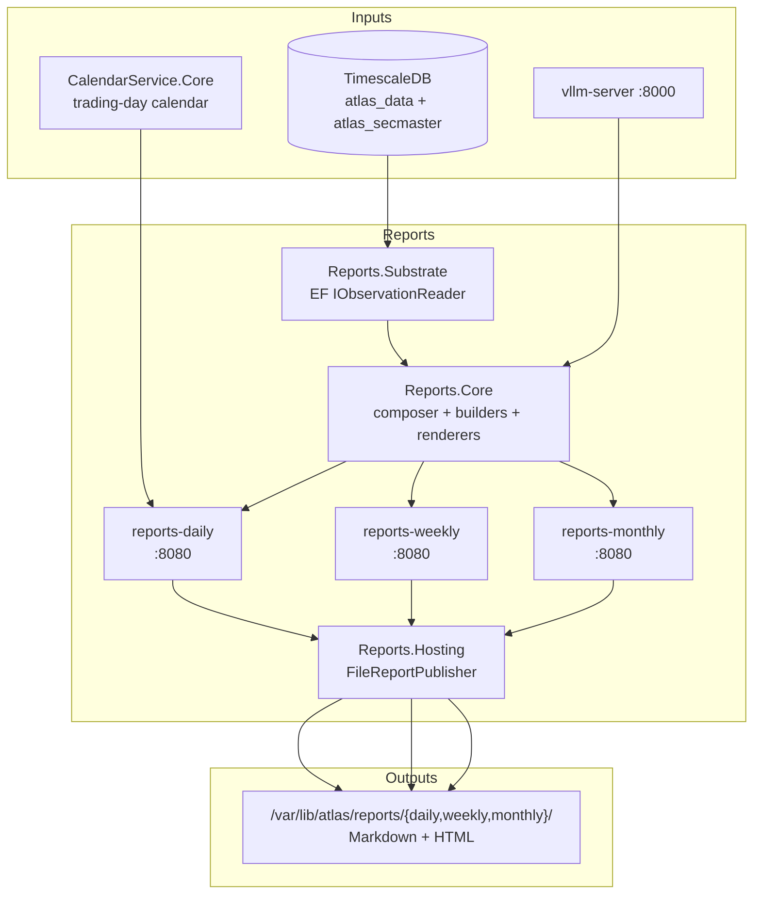

# Reports

Scheduled report-generation stack — produces daily, weekly, and monthly Markdown + HTML reports from the MacroSubstrate observation store.

## Overview

`Reports/` is a multi-project .NET 10 solution comprising three batch hosts (`Reports.DailyHost`, `Reports.WeeklyHost`, `Reports.MonthlyHost`) that share three libraries (`Reports.Core`, `Reports.Hosting`, `Reports.Substrate`). Each host owns its own `Telemetry/` adapter (in-host, not a separate project) wiring the shared `FileReportPublisher` to a cadence-specific meter / activity source. Each host runs as its own container, fires on its cadence (daily 02:00 UTC, weekly Monday 02:00 UTC, monthly 1st-of-month 02:00 UTC), composes a four-section report from MacroSubstrate observations, and writes Markdown + HTML files to a host-mounted output directory. News summaries are rendered by the shared `vllm-server` (Qwen2.5-32B-Instruct-AWQ) when reachable, falling back to a deterministic heuristic otherwise.

## Architecture



Each host loads the same `Reports.Core` composer (Scoped, captures a per-cycle `MacroSubstrateDbContext`), runs four section builders in sequence (`NewsSummary`, `WordCloud`, `SectorRadar`, `MacroSignalRadar`), then `FileReportPublisher` writes one file per renderer via atomic temp-file rename. Scheduled cycles are the source of truth; the per-host `POST /api/reports/{cadence}/run` endpoint is a localhost-only side channel for SRE-triggered backfills.

## Features

- **Three cadences, one library** — `Daily`, `Weekly`, `Monthly` share `Reports.Core` (composer + builders + renderers); only the schedule and window resolver differ.
- **Four-section template** — news summary (vLLM-backed with heuristic fallback), word cloud, 11-axis sector radar, 8-axis macro-signal radar. Defined in `Reports.Core/Sections/ReportSections.cs`.
- **Multi-format output** — Markdown (canonical) and HTML (notification-friendly) renderers, both registered by default.
- **Atomic file publish** — `FileReportPublisher` writes via `{tmp}` + same-directory rename, so directory pollers never see a half-written file.
- **Trading-day-aware daily window** — `TradingDayWindowResolver` consults `CalendarService.Core` to skip weekends and NYSE holidays; weekly + monthly windows are calendar-based (ISO Mon–Mon UTC, 1st-of-month UTC).
- **vLLM with heuristic fallback** — `VllmNewsSummaryGenerator` calls vLLM `/v1/completions`; on timeout / HTTP error / empty response it delegates to `HeuristicNewsSummaryGenerator` and the renderer caveat surfaces the fallback.
- **On-demand HTTP trigger** — `POST /api/reports/{cadence}/run` (localhost-only via `RequireHost`) runs a one-shot cycle and returns the published file paths.
- **OTEL throughout** — every host emits traces (`Reports<Cadence>ReportActivitySource` + `ReportsActivitySource` + `MacroSubstrateTelemetry`) and metrics to `otel-collector:4317`; structured Serilog JSON also goes to stdout for `nerdctl logs` fallback.
- **Scope-validated DI** — `ValidateScopes = true` + `ValidateOnBuild = true` in every environment; a regressed Scoped→Singleton registration fails at container build, not on cycle 2.

## Configuration

Connection strings + the optional vLLM news-summary section are required; everything else has defaults. Per-host `Reports:<Cadence>` sections control schedule and output.

| Variable | Description | Default |
|---|---|---|
| `ConnectionStrings__AtlasData` | TimescaleDB connection for `atlas_data` (macro/market observations). | Required |
| `ConnectionStrings__SecMaster` | TimescaleDB connection for `atlas_secmaster` (versioned mapping lookups; `MappingVersionLookupUnavailableException` on every report if missing). | Required |
| `OpenTelemetry__OtlpEndpoint` | OTLP gRPC endpoint for traces, metrics, logs. | `http://otel-collector:4317` |
| `OpenTelemetry__ServiceName` | OTEL service name. | `reports-{daily,weekly,monthly}-host` |
| `OpenTelemetry__ServiceVersion` | OTEL service version tag. | `1.0.0` |
| `Reports__{Daily,Weekly,Monthly}__FireAtUtc` | Cycle fire time, UTC `HH:mm`. | appsettings: `02:00` / `03:00` / `04:00` — compose overrides to `02:00` for all three hosts |
| `Reports__Weekly__FireDayOfWeek` | Weekly fire day. | `Monday` |
| `Reports__Monthly__FireDayOfMonth` | Monthly fire day (1–28). | `1` |
| `Reports__{Daily,Weekly,Monthly}__Formats__N` | Renderer formats to emit (`Markdown`, `Html`). | `Markdown` + `Html` |
| `Reports__{Daily,Weekly,Monthly}__OutputDirectory` | Container-internal path the publisher writes to (bind-mounted to host). | `/var/lib/atlas/reports/{cadence}` |
| `Reports__{Daily,Weekly,Monthly}__RunOnStartIfMissed` | If `true`, run once on boot when the most recent scheduled fire was missed. | `true` |
| `Reports__NewsSummary__Vllm__Endpoint` | vLLM base URL; presence of this key opts the host into `AddVllmNewsSummary`. Absent → `HeuristicNewsSummaryGenerator` only. | (compose: `http://vllm-server:8000`) |

## API Endpoints

Each host exposes the same shape on port 8080 (container-internal only — `RequireHost("localhost", "127.0.0.1", "[::1]")` rejects external callers with 404). Trigger via `sudo nerdctl exec <container> wget -O- --post-data='' http://localhost:8080/api/reports/<cadence>/run`.

### REST API (Port 8080, internal)

| Endpoint | Method | Host | Description |
|---|---|---|---|
| `/api/reports/daily/run` | POST | `reports-daily` | Run one daily cycle now; returns window + published file paths. |
| `/api/reports/weekly/run` | POST | `reports-weekly` | Run one weekly cycle now; returns window + published file paths. |
| `/api/reports/monthly/run` | POST | `reports-monthly` | Run one monthly cycle now; returns window + published file paths. |
| `/health/live` | GET | all | Liveness probe (always 200 if process is up). |
| `/health/ready` | GET | all | Readiness probe — verifies `MacroSubstrateDbContext` is reachable. |

Response shape (all three `/run` endpoints):

```json
{
  "windowStart": "2026-05-26T00:00:00.0000000Z",
  "windowEnd":   "2026-05-27T00:00:00.0000000Z",
  "elapsedMilliseconds": 4231,
  "files": [
    { "format": "Markdown", "path": "/var/lib/atlas/reports/daily/daily-2026-05-26.md",   "bytes": 8421 },
    { "format": "Html",     "path": "/var/lib/atlas/reports/daily/daily-2026-05-26.html", "bytes": 14008 }
  ]
}
```

## Project Structure

```
Reports/
├── src/
│   ├── Reports.Core/           # Composer, section builders, renderers, generators (library, no EF)
│   ├── Reports.Substrate/      # EF-backed IObservationReader over MacroSubstrate
│   ├── Reports.Hosting/        # IReportPublisher + IPublisherTelemetry seam + FileReportPublisher
│   ├── Reports.DailyHost/      # Daily web host (worker + endpoint + scheduling + telemetry)
│   ├── Reports.WeeklyHost/     # Weekly web host
│   └── Reports.MonthlyHost/    # Monthly web host
├── tests/
│   └── Reports.UnitTests/      # xUnit suite covering Core + Substrate + Hosting + each host
└── .devcontainer/              # Dev container (compose.yaml + devcontainer.json + compile.sh)
```

## Development

### Prerequisites

- VS Code with Dev Containers extension
- Access to the shared `ai-inference` network (provides `timescaledb` + observability stack)

### Getting Started

1. Open in VS Code: `code Reports/`
2. Reopen in Container (Cmd/Ctrl+Shift+P -> "Dev Containers: Reopen in Container")
3. Build: `dotnet build src/Reports.DailyHost`
4. Run: `dotnet run --project src/Reports.DailyHost`

### Build & Test

```bash
.devcontainer/compile.sh             # build all 6 projects + run xUnit suite
.devcontainer/compile.sh --no-test   # build only
```

No `build.sh` — container images are built by compose (`Reports/src/Reports.<Cadence>Host/Containerfile`, monorepo build context) and pushed by the ansible playbook.

## Deployment

Each host is deployed by its own ansible tag against the project-level `deploy.yml`:

```bash
ansible-playbook playbooks/deploy.yml --tags reports-daily
ansible-playbook playbooks/deploy.yml --tags reports-weekly
ansible-playbook playbooks/deploy.yml --tags reports-monthly
```

Containers: `reports-daily`, `reports-weekly`, `reports-monthly`. Output bind-mounts: `/var/lib/atlas/reports/{cadence}` (host) → same path (container). Resource limits per host: 512M / 1.0 CPU.

## Ports

All three hosts expose only the container-internal HTTP surface — none are host-mapped. Reports has no external callers; the `/run` endpoint is locked to loopback by `RequireHost`.

| Port | Type | Description |
|---|---|---|
| 8080 | HTTP (container) | REST `/api/reports/{cadence}/run` + `/health/live` + `/health/ready` |
| N/A | Host | No host port exposed |

## See Also

- [Reports.Core](src/Reports.Core/README.md) — cadence-agnostic composer + builders + renderers (also documents `IObservationReader`, `INewsSummaryGenerator`, and the OTEL surface)
- [MacroSubstrate](../MacroSubstrate/README.md) — upstream observation store
- [CalendarService](../CalendarService/README.md) — trading-day calendar consumed by `TradingDayWindowResolver`
- [SentinelCollector](../SentinelCollector/README.md) — shares the `vllm-server` runtime for LLM-backed summaries
