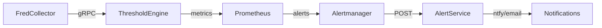

# STATE.md [ATLAS Infrastructure]

## COMPLETED_TASKS

### E2 NasdaqCollector (COMPLETE)

**Goal**: Ingest LBMA gold prices from Nasdaq Data Link into ATLAS
**Status**: ✓ Implementation Complete

```
NasdaqCollector/
├── Core/           Domain models (NasdaqSeries, NasdaqObservation)
├── Application/    Services (NasdaqCollectionService)
├── Infrastructure/ NasdaqApiClient, NasdaqRepository (Dapper)
├── Grpc/          ObservationEventStreamService
└── Service/       Worker host, DI, Kestrel config
```

**API**: Nasdaq Data Link v3 (https://data.nasdaq.com/api/v3)
**Ports**: 5004 (HTTP), 5005 (gRPC)
**Interval**: 6 hours (gold fixes twice daily)
**Tests**: 3 passing

### E3 AlphaVantageCollector (COMPLETE)

**Goal**: Ingest copper and WTI oil prices from Alpha Vantage into ATLAS
**Status**: ✓ Implementation Complete

```
AlphaVantageCollector/
├── Core/           Domain models, SeriesType enum (Copper, WTI)
├── Application/    CollectionScheduler with rate limiting (25/day)
├── Infrastructure/ AlphaVantageApiClient, AlphaVantageRepository
├── Grpc/          ObservationEventStreamService
└── Service/       Worker host, DI, Kestrel config
```

**API**: Alpha Vantage v1 (https://www.alphavantage.co)
**Ports**: 5006 (HTTP), 5007 (gRPC)
**Rate Limit**: 25 requests/day (free tier)
**Tests**: 9 passing

### Next Steps for Both
- ◯ Run database migrations
- ◯ Deploy services via Ansible
- ◯ Configure API keys (NASDAQ_API_KEY, ALPHAVANTAGE_API_KEY)
- ◯ Integration test with ThresholdEngine
- ◯ Add Cu/Au ratio pattern to ThresholdEngine

---

## PREVIOUS_TASK: Holiday-Aware Calendar (COMPLETE)

**Branch**: `feature/holiday-aware-alerts` ✓
- ✓ IHolidayCalendarService + Quartz HolidayCalendar
- ✓ fredcollector_market_open gauge
- ✓ Updated Prometheus alerts
- ✓ Unit tests (36 new tests, 299 total passing)

---

## CURRENT_STATUS [2025-11-23]

### FredCollector: 100% Complete
✓ E1-E11: Production ready (100%)

### ThresholdEngine: 100% Complete
✓ E1-E9: All epics complete (100%)
✓ Production deployed, dashboards live

### AlertService: 100% Complete
✓ E1: AlertService (100%) - deployed, notifications working, alert rules tuned

## EPIC_STATUS

### FredCollector [production_ready]
| Epic | Status | Description |
|------|--------|-------------|
| E1 | ✅ 100% | Foundation - .NET9, TimescaleDB, dev containers |
| E2 | ✅ 100% | FRED Integration - HTTP client, rate limiting, resilience |
| E3 | ✅ 100% | Recession Indicators - 7 series (ICSA, IPMAN, UMCSENT, etc.) |
| E4 | ➡️ moved | Threshold Alerting → ThresholdEngine microservice |
| E5 | ✅ 100% | Historical Backfill - automated startup, bulk insert |
| E6 | ✅ 100% | Liquidity Indicators - 6 series (VIX, DXY, credit spreads) |
| E7 | ✅ 100% | Growth/Valuation - 12 series (GDP, industrial, housing) |
| E8 | ✅ 100% | REST API - /series, /observations, /latest, /alerts |
| E9 | ✅ 100% | Production Deploy - containers, systemd, monitoring |
| E10 | ✅ 100% | Observability - 20+ metrics, tracing, dashboards |
| E11 | ✅ 100% | gRPC Event Streaming - deployed, production ready |
| E12 | ✅ 100% | Series Discovery - search API with filtering/sorting |

**Tests**: 378/378 passing | **Series**: 39 configured

### ThresholdEngine [integration_ready]
| Epic | Status | Description |
|------|--------|-------------|
| E1 | ✅ 100% | Foundation - project structure, dependencies |
| E2 | ✅ 100% | Pattern Configuration - JSON loading, hot reload (40 tests) |
| E3 | ✅ 100% | Expression Compilation - Roslyn compiler, caching (75 tests) |
| E4 | ✅ 100% | Pattern Evaluation - context API, evaluation service |
| E5 | ✅ 100% | Event Integration - event bus, subscribers |
| E6 | ✅ 100% | Regime Transition Detection - macro score, hysteresis |
| E7 | ✅ 100% | Pattern Library - 20+ patterns (PR #28 merged) |
| E8 | ✅ 100% | Production Deployment - containerized, deployed, running |
| E9 | ✅ 100% | Observability - 17 metrics, 5 dashboards (PR #29 merged) |

**Tests**: 153/153 passing | **Patterns**: 31 configured

### AlertService [production_ready]
| Feature | Status | Description |
|---------|--------|-------------|
| HTTP API | ✅ 100% | POST /alerts endpoint with async queue |
| NtfyChannel | ✅ 100% | ntfy.sh push notifications |
| EmailChannel | ✅ 100% | SMTP email via MailKit |
| Dispatcher | ✅ 100% | BackgroundService with routing rules |
| Containerfile | ✅ 100% | Runtime image with Serilog native span support |
| Deployment | ✅ 100% | Deployed via Ansible, running on port 8081 |
| Alert Tuning | ✅ 100% | Weekday-aware, 24h state-based suppression |

**Architecture**:
- Sink pattern: services POST to /alerts
- Async dispatch via System.Threading.Channels
- Pluggable INotificationChannel implementations
- Severity-based routing (critical→all, warning→ntfy, info→email)

## SERVICES [19_running]

### Core Data Services
- fred-collector:5002 → data collection worker + gRPC streaming
- fred-api:5001 → REST API
- threshold-engine:5003 → pattern evaluation worker
- alert-service:8081 → notification sink (ntfy, email)
- timescaledb:5432 → TimescaleDB (39 series, hypertables)

### AI/Inference
- ollama-gpu:11434 → RTX 5090 (32GB VRAM)
- ollama-cpu:11435 → CPU fallback

### MCP Servers
- ollama-mcp:3100 → Ollama inference (Claude Desktop)
- markitdown-mcp:3102 → document conversion
- fredcollector-mcp:3103 → FRED data access
- thresholdengine-mcp:3104 → pattern evaluation

### Observability Stack
- prometheus:9090 → metrics collection
- alertmanager:9093 → alert routing → alert-service
- grafana:3000 → visualization (8 dashboards)
- loki:3101 → log aggregation
- tempo:3200 → distributed tracing
- otel-collector:4317 → OTLP receiver

### System Monitoring
- node-exporter:9100 → system metrics
- gpu-exporter:9835 → NVIDIA metrics

## PIPELINE [end_to_end_operational]



All services deployed and operational. Full observability stack live (traces, metrics, logs).

## NEXT_ACTIONS

1. **Alert Rule Refinement**: Continue monitoring production alerts, adjust thresholds as patterns emerge
2. **Phase 2 Planning**: Calculated indicators (CAPE, ERP, Forward P/E) for valuation patterns

## DEPLOYMENT

```bash
# Full deployment
cd ~/ATLAS/ansible
ansible-playbook playbooks/site.yml

# Service management
sudo systemctl status atlas.service
sudo nerdctl compose ps
```

---
**UPDATED**: 2025-11-27 | **STATUS**: production_ready | **DOCS_SYNC**: v5
