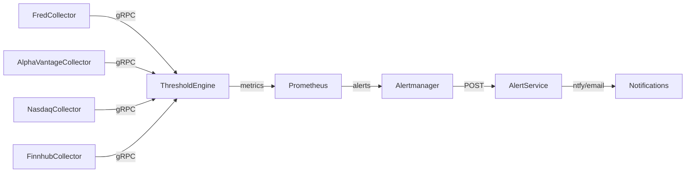

# STATE.md [ATLAS Infrastructure]

## CURRENT_STATUS [2025-11-30]

### All Services: Production Ready ✅

| Service | Status | Tests | Description |
|---------|--------|-------|-------------|
| FredCollector | ✅ 100% | 378 | FRED economic data collection |
| ThresholdEngine | ✅ 100% | 153 | Pattern evaluation & regime detection |
| AlertService | ✅ 100% | 15+ | Notification dispatch (ntfy, email) |
| CalendarService | ✅ 100% | 5 | Trading day validation & market status |
| FinnhubCollector | ✅ 100% | 5 | Stock quotes, sentiment, analyst ratings |
| AlphaVantageCollector | ✅ 100% | 5 | Commodity prices (WTI, Brent, NatGas) |
| NasdaqCollector | ✅ 100% | 5 | LBMA gold prices (AM/PM fixings) |

**Total Tests**: 550+ passing

---

## SERVICES [22_running]

### Core Data Collectors
| Service | Ports | API | Interval |
|---------|-------|-----|----------|
| fred-collector | 5001 (REST), 5002 (gRPC) | FRED v1 | 6 hours |
| alphavantage-collector | 5003 (HTTP), 5004 (gRPC) | Alpha Vantage | 25/day limit |
| nasdaq-collector | 5005 (HTTP), 5006 (gRPC) | Nasdaq Data Link v3 | 6 hours |
| finnhub-collector | 5007 (HTTP), 5008 (gRPC) | Finnhub v1 | 60 req/min |

### Processing & Alerting
| Service | Port | Purpose |
|---------|------|---------|
| threshold-engine | 5009 | Pattern evaluation, regime detection |
| alert-service | 8081 | Notification sink (ntfy, email) |
| calendar-service | - | Market status, trading day rules |
| timescaledb | 5432 | TimescaleDB (hypertables) |

### AI/Inference
| Service | Port | Hardware |
|---------|------|----------|
| ollama-gpu | 11434 | RTX 5090 (32GB VRAM) |
| ollama-cpu | 11435 | CPU fallback |

### MCP Servers (Claude Desktop)
| Service | Port | Purpose |
|---------|------|---------|
| ollama-mcp | 3100 | Ollama inference |
| markitdown-mcp | 3102 | Document conversion |
| fredcollector-mcp | 3103 | FRED data access |
| thresholdengine-mcp | 3104 | Pattern evaluation |

### Observability Stack
| Service | Port | Purpose |
|---------|------|---------|
| prometheus | 9090 | Metrics collection |
| alertmanager | 9093 | Alert routing → AlertService |
| grafana | 3000 | 9 dashboards |
| loki | 3101 | Log aggregation |
| tempo | 3200 | Distributed tracing |
| otel-collector | 4317 | OTLP receiver |
| node-exporter | 9100 | System metrics |
| gpu-exporter | 9835 | NVIDIA metrics |

---

## EPIC_STATUS

### FredCollector [production_ready]
| Epic | Status | Description |
|------|--------|-------------|
| E1 | ✅ | Foundation - .NET9, TimescaleDB, dev containers |
| E2 | ✅ | FRED Integration - HTTP client, rate limiting |
| E3 | ✅ | Recession Indicators - 7 series |
| E4 | ➡️ | Threshold Alerting → ThresholdEngine |
| E5 | ✅ | Historical Backfill - automated startup |
| E6 | ✅ | Liquidity Indicators - 6 series |
| E7 | ✅ | Growth/Valuation - 12 series |
| E8 | ✅ | REST API - /series, /observations, /latest |
| E9 | ✅ | Production Deploy - containers, systemd |
| E10 | ✅ | Observability - 20+ metrics, tracing |
| E11 | ✅ | gRPC Event Streaming |
| E12 | ✅ | Series Discovery - search API |

**Series**: 25 configured | **Tests**: 378 passing

### ThresholdEngine [production_ready]
| Epic | Status | Description |
|------|--------|-------------|
| E1 | ✅ | Foundation - project structure |
| E2 | ✅ | Pattern Configuration - JSON, hot reload |
| E3 | ✅ | Expression Compilation - Roslyn, caching |
| E4 | ✅ | Pattern Evaluation - context API |
| E5 | ✅ | Event Integration - multi-collector gRPC |
| E6 | ✅ | Regime Transition Detection - hysteresis |
| E7 | ✅ | Pattern Library - 40 patterns |
| E8 | ✅ | Production Deployment |
| E9 | ✅ | Observability - 17 metrics, 5 dashboards |

**Patterns**: 40 configured | **Tests**: 153 passing

### Pattern Library [40_patterns]
| Category | Count | Examples |
|----------|-------|----------|
| Recession | 12 | Sahm Rule, yield curve, claims |
| Liquidity | 8 | VIX L1/L2, DXY, credit spreads |
| NBFI Stress | 9 | HY spreads, KRE, bankruptcy |
| Growth | 5 | GDP, industrial, retail, housing |
| Valuation | 5 | CAPE, Buffett, forward P/E |
| Commodity | 1 | Cu/Au ratio |

### AlertService [production_ready]
| Feature | Status | Description |
|---------|--------|-------------|
| HTTP API | ✅ | POST /alerts with async queue |
| NtfyChannel | ✅ | ntfy.sh push notifications |
| EmailChannel | ✅ | SMTP via MailKit |
| Dispatcher | ✅ | BackgroundService with routing |
| Alert Tuning | ✅ | Weekday-aware, 24h suppression |

### FinnhubCollector [production_ready]
| Feature | Status | Description |
|---------|--------|-------------|
| Stock Quotes | ✅ | Real-time price data |
| News Sentiment | ✅ | Sentiment scoring |
| Analyst Ratings | ✅ | Consensus tracking |
| Economic Calendar | ✅ | Event scheduling |
| Rate Limiting | ✅ | 60 req/min |

**Tables**: 12 | **Tests**: 5 passing

### CalendarService [production_ready]
| Feature | Status | Description |
|---------|--------|-------------|
| Market Status API | ✅ | Open/closed detection |
| Holiday Integration | ✅ | Nager.Date API |
| Trading Day Rules | ✅ | Business day calculation |
| Shared Core Library | ✅ | Used by all collectors |

---

## PIPELINE [end_to_end_operational]



All collectors → ThresholdEngine → Prometheus → Alertmanager → AlertService → Notifications

---

## DEPLOYMENT

```bash
# Full deployment
cd ~/ATLAS/deployment/ansible
ansible-playbook playbooks/site.yml

# Service management
sudo systemctl status atlas.service
sudo nerdctl compose ps
```

**Infrastructure**:
- Host: AMD Threadripper 9960X, 128GB RAM, RTX 5090
- Storage: NVMe 1.8TB (fast), SATA 5.2TB (bulk)
- Database: TimescaleDB with hypertables

---

## NEXT_ACTIONS

1. **Alert Rule Refinement**: Monitor production alerts, adjust thresholds
2. **Phase 2 Planning**: Calculated indicators (CAPE, ERP, Forward P/E)

---
**UPDATED**: 2025-11-30 | **STATUS**: production_ready | **DOCS_SYNC**: v6
