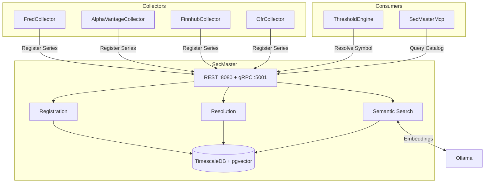

# SecMaster

Centralized instrument metadata and intelligent source resolution service for ATLAS.

## Overview

SecMaster provides a single source of truth for financial instrument definitions and context-aware routing to data sources. Collectors register their series capabilities via gRPC, and consumers resolve symbols to the optimal data source based on frequency, latency, and collector preferences. Includes hybrid search combining SQL, fuzzy matching, vector similarity, and RAG-powered natural language queries via Ollama.

## Architecture



Collectors register series at startup via gRPC streaming (fire-and-forget). Consumers resolve symbols to optimal data sources. Semantic search uses Ollama for embeddings and RAG synthesis.

## Features

- **Instrument Registry**: Central catalog of financial instruments with metadata and source mappings
- **Context-Aware Resolution**: Routes lookups to optimal source by frequency, latency, and priority
- **Hybrid Search**: SQL exact match, fuzzy text, vector similarity, and RAG synthesis pipeline
- **Collector Gateway**: Unified API for searching and managing series across all data collectors
- **Catalog Discovery**: Search upstream collectors for new instruments and promote to collection
- **Embedding Backfill**: Background service auto-generates vector embeddings for new instruments

## Configuration

| Variable | Description | Default |
|----------|-------------|---------|
| `ConnectionStrings__SecMaster` | PostgreSQL connection string | Required |
| `Ollama__Url` | Ollama API endpoint for generation | `http://ollama-gpu:11434` |
| `Ollama__EmbeddingUrl` | Ollama API endpoint for embeddings | `http://ollama-cpu:11434` |
| `Ollama__EmbeddingModel` | Model for vector embeddings | `bge-m3` |
| `Ollama__GenerationModel` | Model for RAG synthesis | `qwen2.5:32b-instruct` |
| `SemanticSearch__VectorHighConfidenceThreshold` | High confidence similarity threshold | `0.8` |
| `SemanticSearch__DefaultMinScore` | Default minimum similarity score | `0.5` |
| `Collectors__FredCollectorUrl` | FRED collector URL | `http://fred-collector:8080` |
| `Collectors__FinnhubCollectorUrl` | Finnhub collector URL | `http://finnhub-collector:8080` |
| `Collectors__OfrCollectorUrl` | OFR collector URL | `http://ofr-collector:8080` |
| `Collectors__AlphaVantageCollectorUrl` | AlphaVantage collector URL | `http://alphavantage-collector:8080` |
| `InstrumentConfiguration__ConfigDirectory` | Path to instrument config files | `/app/config` |

## API Endpoints

### REST API (Port 8080)

| Endpoint | Method | Description |
|----------|--------|-------------|
| `/api/instruments` | GET | List all instruments |
| `/api/instruments` | POST | Create instrument |
| `/api/instruments/{id}` | GET/PUT/DELETE | CRUD by ID |
| `/api/instruments/{id}/sources` | GET | Get source mappings for instrument |
| `/api/instruments/by-symbol/{symbol}` | GET | Get by symbol |
| `/api/resolve/{symbol}` | GET | Resolve symbol to best data source |
| `/api/resolve` | POST | Resolve with context (frequency, lag, preference) |
| `/api/resolve/batch` | GET | Batch resolve multiple symbols |
| `/api/resolve/lookup/{collector}/{sourceId}` | GET | Reverse lookup by collector and source ID |
| `/api/register` | POST | Register a data source from a collector |
| `/api/search` | GET | Fuzzy text search |
| `/api/semantic/search` | GET | Vector similarity search |
| `/api/semantic/resolve` | GET | Hybrid resolution (SQL, fuzzy, vector, RAG) |
| `/api/semantic/ask` | POST | Natural language Q&A with RAG |
| `/api/catalog/search` | GET | Search catalog with upstream discovery |
| `/api/catalog/{id}/promote` | POST | Promote discovered instrument to collection |
| `/api/collectors/search` | GET | Smart search across all collectors |
| `/api/collectors/{collector}/series` | GET | List series for a collector |
| `/api/collectors/{collector}/series` | POST | Add series to a collector |
| `/api/collectors/{collector}/series/{id}/toggle` | PUT | Toggle series active status |
| `/api/collectors/{collector}/series/{id}` | DELETE | Remove series from collector |

### gRPC Services (Port 5001)

| Service | Method | Description |
|---------|--------|-------------|
| `SecMasterRegistry` | `RegisterSeries` | Register single series (fire-and-forget) |
| `SecMasterRegistry` | `RegisterSeriesBatch` | Batch registration via client streaming |
| `SecMasterResolver` | `ResolveSymbol` | Resolve symbol to best data source |
| `SecMasterResolver` | `ResolveBatch` | Batch resolution via server streaming |
| `SecMasterResolver` | `LookupSource` | Reverse lookup by collector and source ID |

## Project Structure

```
SecMaster/
├── src/
│   ├── Configuration/    # Options classes (collectors, semantic search)
│   ├── Data/             # DbContext, entities, migrations, repositories
│   ├── Endpoints/        # REST API handlers
│   ├── Grpc/             # gRPC service implementations
│   ├── HealthChecks/     # Database health check
│   ├── Models/           # Resolution models
│   ├── Services/         # Registration, resolution, semantic search, collector clients
│   └── Telemetry/        # OpenTelemetry metrics and tracing
├── tests/                # Unit and integration tests
├── mcp/                  # MCP server for Claude Code integration
├── config/               # Instrument configuration files
└── .devcontainer/        # Dev container config
```

## Development

### Prerequisites
- VS Code with Dev Containers extension
- Access to shared infrastructure (PostgreSQL, observability stack)

### Getting Started

1. Open in VS Code: `code SecMaster/`
2. Reopen in Container (Cmd/Ctrl+Shift+P -> "Dev Containers: Reopen in Container")
3. Build and test: `.devcontainer/compile.sh`
4. Build without tests: `.devcontainer/compile.sh --no-test`

### Build Container

```bash
.devcontainer/build.sh
```

## Deployment

```bash
ansible-playbook playbooks/deploy.yml --tags secmaster
```

## Ports

| Port | Type | Description |
|------|------|-------------|
| 8080 | Internal | REST API (HTTP/1.1 + HTTP/2) |
| 5001 | Internal | gRPC (HTTP/2 only) |

No host-mapped ports. All access is container-to-container only. The MCP server (`secmaster-mcp`) exposes port 3107 for external access.

## See Also

- [SecMaster MCP](mcp/README.md) - MCP server for Claude Code integration
- [ThresholdEngine](../ThresholdEngine/README.md) - Primary consumer of resolution services
- [FredCollector](../FredCollector/README.md) - Economic data collector
- [FinnhubCollector](../FinnhubCollector/README.md) - Stock quotes and sentiment
- [OfrCollector](../OfrCollector/README.md) - Financial stability data
- [AlphaVantageCollector](../AlphaVantageCollector/README.md) - Market data collector
