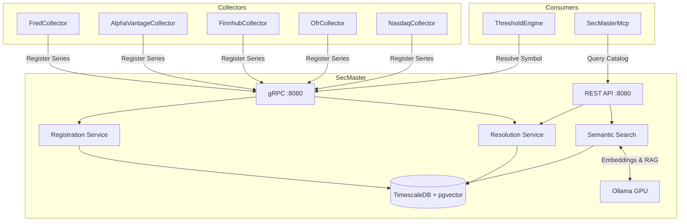

# SecMaster

Centralized instrument metadata and intelligent source resolution service for ATLAS.

## Overview

SecMaster provides a single source of truth for financial instrument definitions and context-aware routing to data sources. Collectors register their series capabilities, and consumers resolve symbols to the appropriate data source based on frequency, latency requirements, and collector preferences. Includes hybrid search combining SQL, fuzzy matching, vector similarity, and RAG-powered natural language queries.

## Architecture



## Features

- **Instrument Registry**: Central catalog of financial instruments with metadata
- **Context-Aware Resolution**: Routes symbol lookups to optimal data source by frequency and latency
- **Fire-and-Forget Registration**: Collectors register series asynchronously at startup
- **Frequency Hierarchy**: Higher frequencies satisfy lower (intraday > daily > monthly)
- **Hybrid Search**: SQL exact match → fuzzy text → vector similarity → RAG synthesis
- **Semantic Search**: pgvector + Ollama embeddings for natural language queries
- **Collector Gateway**: Unified API for searching and managing all data collectors
- **Source Priority**: Primary/alternative source routing with configurable preferences
- **gRPC + REST**: Dual protocol support (gRPC for services, REST for tools)

## Configuration

| Variable | Default | Description |
|----------|---------|-------------|
| `ConnectionStrings__SecMaster` | Required | PostgreSQL connection string |
| `ASPNETCORE_URLS` | `http://+:8080` | Listen address |
| `OpenTelemetry__OtlpEndpoint` | `http://otel-collector:4317` | OTLP collector endpoint |
| `Ollama__Url` | `http://ollama-gpu:11434` | Ollama API endpoint |
| `Ollama__EmbeddingModel` | `nomic-embed-text` | Model for 768-dim vector embeddings |
| `Ollama__GenerationModel` | `llama3.2:3b` | Model for RAG synthesis |
| `SemanticSearch__VectorHighConfidenceThreshold` | `0.8` | High confidence similarity threshold |
| `SemanticSearch__DefaultMinScore` | `0.5` | Default minimum similarity score |

## API Endpoints

### REST API (Port 8080 internal, 5017 on host)

#### Instruments

| Method | Endpoint | Description |
|--------|----------|-------------|
| GET | `/api/instruments` | List all instruments with pagination |
| GET | `/api/instruments/{id}` | Get instrument by ID |
| GET | `/api/instruments/by-symbol/{symbol}` | Get instrument by symbol |
| POST | `/api/instruments` | Create new instrument |
| PUT | `/api/instruments/{id}` | Update existing instrument |
| DELETE | `/api/instruments/{id}` | Delete instrument |
| GET | `/api/instruments/{id}/sources` | List source mappings for instrument |

#### Resolution

| Method | Endpoint | Description |
|--------|----------|-------------|
| GET | `/api/resolve/{symbol}` | Resolve symbol with default context |
| POST | `/api/resolve` | Resolve with custom context (frequency, lag, preference) |
| GET | `/api/resolve/batch?symbols=A,B,C` | Batch resolve multiple symbols |
| GET | `/api/resolve/lookup/{collector}/{sourceId}` | Reverse lookup by collector and source ID |

#### Search

| Method | Endpoint | Description |
|--------|----------|-------------|
| GET | `/api/search?q={query}` | Fuzzy text search across instruments |

#### Semantic Search

| Method | Endpoint | Description |
|--------|----------|-------------|
| GET | `/api/semantic/search` | Vector similarity search by natural language |
| GET | `/api/semantic/resolve` | Hybrid resolution (SQL → fuzzy → vector → RAG) |
| POST | `/api/semantic/ask` | Natural language Q&A with RAG synthesis |
| POST | `/api/semantic/embed/{id}` | Generate embedding for specific instrument |
| POST | `/api/semantic/embed/backfill` | Backfill missing embeddings for all instruments |

#### Collector Gateway

| Method | Endpoint | Description |
|--------|----------|-------------|
| GET | `/api/collectors/search?q={query}` | Smart search across all collectors with asset class routing |
| GET | `/api/collectors/fred/series` | List FRED series |
| POST | `/api/collectors/fred/series` | Add FRED series |
| PUT | `/api/collectors/fred/series/{seriesId}/toggle` | Toggle FRED series active status |
| DELETE | `/api/collectors/fred/series/{seriesId}` | Remove FRED series |
| GET | `/api/collectors/finnhub/series` | List Finnhub series |
| POST | `/api/collectors/finnhub/series` | Add Finnhub series |
| PUT | `/api/collectors/finnhub/series/{seriesId}/toggle` | Toggle Finnhub series |
| DELETE | `/api/collectors/finnhub/series/{seriesId}` | Remove Finnhub series |
| GET | `/api/collectors/alphavantage/series` | List AlphaVantage series |
| POST | `/api/collectors/alphavantage/series` | Add AlphaVantage series |
| PUT | `/api/collectors/alphavantage/series/{seriesId}/toggle` | Toggle AlphaVantage series |
| DELETE | `/api/collectors/alphavantage/series/{seriesId}` | Remove AlphaVantage series |
| GET | `/api/collectors/ofr/stfm` | List OFR short-term funding monitor series |
| GET | `/api/collectors/ofr/hfm` | List OFR hedge fund monitor series |

#### Registration

| Method | Endpoint | Description |
|--------|----------|-------------|
| POST | `/api/register` | Register source mapping (used by collectors) |

#### Health

| Method | Endpoint | Description |
|--------|----------|-------------|
| GET | `/health` | Health check endpoint |

### gRPC Services (Port 8080 internal, 5017 on host)

#### RegistryGrpcService

```protobuf
service SecMasterRegistry {
    rpc RegisterSeries(RegisterSeriesRequest) returns (RegisterSeriesResponse);
    rpc RegisterSeriesBatch(stream RegisterSeriesRequest) returns (RegisterSeriesBatchResponse);
}
```

Used by collectors for fire-and-forget series registration at startup.

#### ResolverGrpcService

```protobuf
service SecMasterResolver {
    rpc ResolveSymbol(ResolveRequest) returns (ResolveResponse);
    rpc ResolveBatch(ResolveBatchRequest) returns (stream ResolveResponse);
    rpc LookupSource(LookupRequest) returns (LookupResponse);
}
```

Used by ThresholdEngine and other consumers for symbol resolution.

## Project Structure

```
SecMaster/
├── src/
│   ├── SecMaster.csproj
│   ├── Program.cs                   # Application entry point
│   ├── DependencyInjection.cs       # Service registration
│   ├── appsettings.json             # Configuration
│   ├── Data/                        # DbContext, entities, migrations
│   ├── Endpoints/                   # REST API endpoint handlers
│   ├── Grpc/                        # gRPC service implementations
│   ├── Services/                    # Registration, resolution, semantic search
│   ├── Repositories/                # Data access layer
│   ├── Models/                      # Domain models and DTOs
│   ├── Telemetry/                   # OpenTelemetry activity source, metrics
│   ├── Protos/                      # gRPC protocol definitions
│   └── Containerfile                # Multi-stage Docker build
├── config/
│   └── series-publication-frequencies.json  # Reference data for freshness
├── .devcontainer/
│   ├── build.sh                     # Container image build script
│   ├── compile.sh                   # Compile and test script
│   ├── compose.yaml                 # Dev container configuration
│   └── devcontainer.json            # VS Code dev container config
└── tests/
    └── SecMaster.UnitTests/         # Unit test project
```

## Development

### Compile and Test

```bash
.devcontainer/compile.sh
```

### Build Container Image

```bash
.devcontainer/build.sh
```

### Deploy

```bash
cd deployment/ansible
ansible-playbook playbooks/deploy.yml --tags secmaster
```

## Ports

| Port | Description |
|------|-------------|
| 8080 | Container internal (HTTP/1.1 REST + HTTP/2 gRPC) |
| 5017 | Host access (mapped to container 8080) |

## Database

SecMaster uses TimescaleDB (PostgreSQL) with:
- **EF Core migrations**: Auto-applied on startup via `db.Database.MigrateAsync()`
- **pgvector extension**: 768-dimensional vector similarity search with HNSW indexing
- **pg_trgm extension**: Fuzzy text search using trigram matching
- **Unique constraints**: Ensures `(Collector, SourceId)` pairs are unique
- **JSONB metadata**: Extensible metadata storage for instruments

## Hybrid Search Strategy

SecMaster implements a cascading search strategy for maximum flexibility:

1. **SQL Exact Match**: Direct symbol lookup (fastest)
2. **Fuzzy Text Search**: Trigram similarity matching (handles typos)
3. **Vector Similarity**: Semantic search via embeddings (understands context)
4. **RAG Synthesis**: Natural language generation with LLM (conversational queries)

Each level falls through to the next if no confident match is found.

## See Also

- [SecMasterMcp](../SecMasterMcp/README.md) - MCP server for Claude Code integration
- [ThresholdEngine](../ThresholdEngine/README.md) - Primary consumer of resolution services
- [FredCollector](../FredCollector/README.md) - Economic data collector (registers FRED series)
- [FinnhubCollector](../FinnhubCollector/README.md) - Stock quotes and sentiment (registers equity series)
- [OfrCollector](../OfrCollector/README.md) - Financial stability data (registers OFR series)
