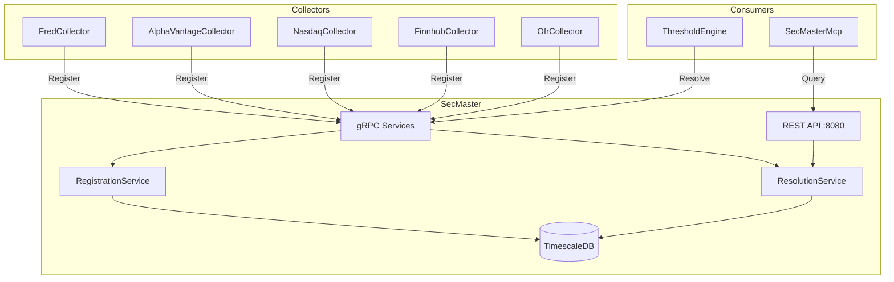
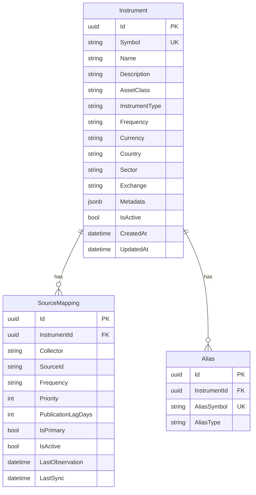
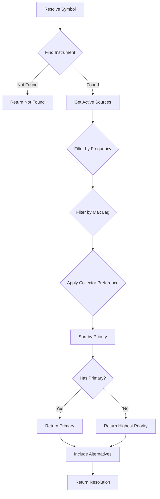

# SecMaster

Centralized instrument metadata and source resolution service for the ATLAS ecosystem.

## Overview

SecMaster provides a single source of truth for financial instrument definitions and intelligent routing to data sources. It enables collectors to register their series and consumers to resolve symbols to the appropriate data source based on context (frequency, latency requirements, collector preference).

## Architecture



## Data Model



## Resolution Algorithm



**Frequency Hierarchy** (higher satisfies lower):
- intraday > daily > weekly > monthly > quarterly > annual

## API Endpoints

### Instruments

| Method | Endpoint | Description |
|--------|----------|-------------|
| GET | `/api/instruments` | List all instruments |
| GET | `/api/instruments/{id}` | Get by ID |
| GET | `/api/instruments/by-symbol/{symbol}` | Get by symbol |
| POST | `/api/instruments` | Create instrument |
| PUT | `/api/instruments/{id}` | Update instrument |
| DELETE | `/api/instruments/{id}` | Delete instrument |
| GET | `/api/instruments/{id}/sources` | List source mappings |

### Resolution

| Method | Endpoint | Description |
|--------|----------|-------------|
| GET | `/api/resolve/{symbol}` | Resolve symbol |
| POST | `/api/resolve` | Resolve with context |
| GET | `/api/resolve/batch?symbols=A,B,C` | Batch resolve |
| GET | `/api/resolve/lookup/{collector}/{sourceId}` | Reverse lookup |

### Registration

| Method | Endpoint | Description |
|--------|----------|-------------|
| POST | `/api/register` | Register source mapping |

### Search

| Method | Endpoint | Description |
|--------|----------|-------------|
| GET | `/api/search?q={query}` | Fuzzy search |

## gRPC Services

### SecMasterRegistry
```protobuf
service SecMasterRegistry {
    rpc RegisterSeries(RegisterSeriesRequest) returns (RegisterSeriesResponse);
    rpc RegisterSeriesBatch(stream RegisterSeriesRequest) returns (RegisterSeriesBatchResponse);
}
```

### SecMasterResolver
```protobuf
service SecMasterResolver {
    rpc ResolveSymbol(ResolveRequest) returns (ResolveResponse);
    rpc ResolveBatch(ResolveBatchRequest) returns (stream ResolveResponse);
    rpc LookupSource(LookupRequest) returns (LookupResponse);
}
```

## Integration

### Collector Registration

Collectors register their series on startup using fire-and-forget semantics:

```csharp
await _secMasterClient.RegisterAsync(new RegistrationRequest
{
    Collector = "FredCollector",
    SourceId = "UNRATE",
    Symbol = "UNRATE",
    Name = "Unemployment Rate",
    AssetClass = "Economic",
    Frequency = "monthly"
});
```

Registration is idempotent and gracefully degrades if SecMaster is unavailable.

### Consumer Resolution

ThresholdEngine resolves symbols to route data requests:

```csharp
var resolution = await _resolver.ResolveAsync("UNRATE", new ResolutionContext
{
    Frequency = "daily",
    MaxLagDays = 1,
    PreferCollector = "FredCollector"
});

// resolution.ResolvedSource.Collector = "FredCollector"
// resolution.ResolvedSource.SourceId = "UNRATE"
```

## Configuration

| Variable | Default | Description |
|----------|---------|-------------|
| `ConnectionStrings__SecMaster` | - | PostgreSQL connection string |
| `ASPNETCORE_URLS` | `http://+:8080` | Listen address |
| `OpenTelemetry__OtlpEndpoint` | `http://otel-collector:4317` | OTLP endpoint |
| `OpenTelemetry__ServiceName` | `secmaster` | Service name for traces |

## Development

### Build
```bash
SecMaster/.devcontainer/compile.sh
```

### Build Container
```bash
SecMaster/.devcontainer/build.sh
```

### Deploy
```bash
ansible-playbook playbooks/deploy.yml --tags secmaster -i inventory/hosts.yml
```

## Observability

### Metrics
- `secmaster_resolution_requests_total` - Resolution request counter
- `secmaster_registration_requests_total` - Registration counter by collector
- `secmaster_resolution_duration_seconds` - Resolution latency histogram
- `secmaster_instruments_created_total` - Instruments created by asset class

### Tracing
All operations emit OpenTelemetry spans under `SecMaster.Resolution` and `SecMaster.Registration` activities.

## MCP Server

SecMasterMcp exposes tools for AI assistants:

| Tool | Description |
|------|-------------|
| `search_instruments` | Fuzzy search by name/symbol |
| `get_instrument` | Get instrument details |
| `resolve_source` | Resolve symbol with context |
| `resolve_batch` | Batch resolution |
| `list_sources` | List sources for instrument |
| `lookup_by_collector_id` | Reverse lookup |
| `health` | Health check |

## Database

SecMaster uses TimescaleDB (PostgreSQL) with:
- `pg_trgm` extension for fuzzy search
- Unique constraints on `(Collector, SourceId)` pairs
- JSONB metadata column for extensibility
- Auto-migration on startup
