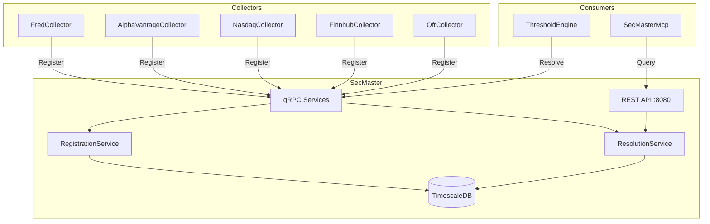
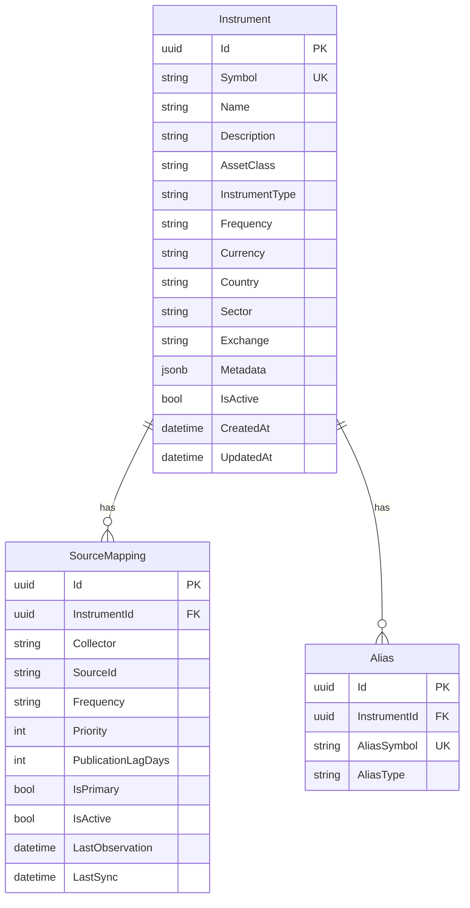
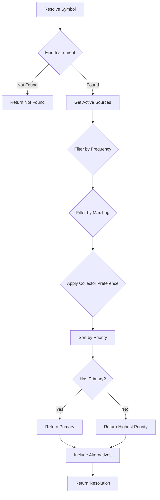

# SecMaster

Centralized instrument metadata and source resolution service for the ATLAS ecosystem.

## Overview

SecMaster provides a single source of truth for financial instrument definitions and intelligent routing to data sources. It enables collectors to register their series and consumers to resolve symbols to the appropriate data source based on context (frequency, latency requirements, collector preference).

## Architecture



## Data Model



## Resolution Algorithm



**Frequency Hierarchy** (higher satisfies lower):
- intraday > daily > weekly > monthly > quarterly > annual

## API Endpoints

### Instruments

| Method | Endpoint | Description |
|--------|----------|-------------|
| GET | `/api/instruments` | List all instruments |
| GET | `/api/instruments/{id}` | Get by ID |
| GET | `/api/instruments/by-symbol/{symbol}` | Get by symbol |
| POST | `/api/instruments` | Create instrument |
| PUT | `/api/instruments/{id}` | Update instrument |
| DELETE | `/api/instruments/{id}` | Delete instrument |
| GET | `/api/instruments/{id}/sources` | List source mappings |

### Resolution

| Method | Endpoint | Description |
|--------|----------|-------------|
| GET | `/api/resolve/{symbol}` | Resolve symbol |
| POST | `/api/resolve` | Resolve with context |
| GET | `/api/resolve/batch?symbols=A,B,C` | Batch resolve |
| GET | `/api/resolve/lookup/{collector}/{sourceId}` | Reverse lookup |

### Health

| Method | Endpoint | Description |
|--------|----------|-------------|
| GET | `/health` | Health check endpoint |

### Registration

| Method | Endpoint | Description |
|--------|----------|-------------|
| POST | `/api/register` | Register source mapping |

### Search

| Method | Endpoint | Description |
|--------|----------|-------------|
| GET | `/api/search?q={query}` | Fuzzy search |

### Collector Gateway

SecMaster provides unified access to all data collectors through smart routing and management endpoints.

#### Search
| Method | Endpoint | Description |
|--------|----------|-------------|
| GET | `/api/collectors/search?q={query}` | Smart search across all collectors |

The unified search endpoint analyzes queries and routes them to appropriate collectors based on asset class inference:
- Economic indicators → FRED
- Equity symbols → Finnhub
- Treasury/funding rates → OFR
- Commodity/currency data → AlphaVantage

#### List Series
| Method | Endpoint | Description |
|--------|----------|-------------|
| GET | `/api/collectors/fred/series` | List FRED series |
| GET | `/api/collectors/finnhub/series` | List Finnhub series |
| GET | `/api/collectors/ofr/stfm` | List OFR short-term funding series |
| GET | `/api/collectors/ofr/hfm` | List OFR hedge fund monitor series |
| GET | `/api/collectors/alphavantage/series` | List AlphaVantage series |

#### Manage Series (FRED)
| Method | Endpoint | Description |
|--------|----------|-------------|
| POST | `/api/collectors/fred/series` | Add FRED series |
| PUT | `/api/collectors/fred/series/{seriesId}/toggle` | Toggle FRED series active status |
| DELETE | `/api/collectors/fred/series/{seriesId}` | Remove FRED series |

#### Manage Series (Finnhub)
| Method | Endpoint | Description |
|--------|----------|-------------|
| POST | `/api/collectors/finnhub/series` | Add Finnhub series |
| PUT | `/api/collectors/finnhub/series/{seriesId}/toggle` | Toggle Finnhub series active status |
| DELETE | `/api/collectors/finnhub/series/{seriesId}` | Remove Finnhub series |

#### Manage Series (AlphaVantage)
| Method | Endpoint | Description |
|--------|----------|-------------|
| POST | `/api/collectors/alphavantage/series` | Add AlphaVantage series |
| PUT | `/api/collectors/alphavantage/series/{seriesId}/toggle` | Toggle AlphaVantage series active status |
| DELETE | `/api/collectors/alphavantage/series/{seriesId}` | Remove AlphaVantage series |

**Note:** OFR series are read-only and managed through configuration files.

## gRPC Services

SecMaster exposes two gRPC services on port 8080 (internal) / 5017 (host):

### RegistryGrpcService
```protobuf
service SecMasterRegistry {
    rpc RegisterSeries(RegisterSeriesRequest) returns (RegisterSeriesResponse);
    rpc RegisterSeriesBatch(stream RegisterSeriesRequest) returns (RegisterSeriesBatchResponse);
}
```

### ResolverGrpcService
```protobuf
service SecMasterResolver {
    rpc ResolveSymbol(ResolveRequest) returns (ResolveResponse);
    rpc ResolveBatch(ResolveBatchRequest) returns (stream ResolveResponse);
    rpc LookupSource(LookupRequest) returns (LookupResponse);
}
```

## Integration

### Collector Registration

Collectors register their series on startup using fire-and-forget semantics:

```csharp
await _secMasterClient.RegisterAsync(new RegistrationRequest
{
    Collector = "FredCollector",
    SourceId = "UNRATE",
    Symbol = "UNRATE",
    Name = "Unemployment Rate",
    AssetClass = "Economic",
    Frequency = "monthly"
});
```

Registration is idempotent and gracefully degrades if SecMaster is unavailable.

### Consumer Resolution

ThresholdEngine resolves symbols to route data requests:

```csharp
var resolution = await _resolver.ResolveAsync("UNRATE", new ResolutionContext
{
    Frequency = "daily",
    MaxLagDays = 1,
    PreferCollector = "FredCollector"
});

// resolution.ResolvedSource.Collector = "FredCollector"
// resolution.ResolvedSource.SourceId = "UNRATE"
```

## Ports

| Port | Description |
|------|-------------|
| **5017** | Host access (mapped to container 8080) |
| **8080** | Container internal (HTTP/1.1 REST + HTTP/2 gRPC) |

## Configuration

| Variable | Default | Description |
|----------|---------|-------------|
| `ConnectionStrings__SecMaster` | - | PostgreSQL connection string |
| `ASPNETCORE_URLS` | `http://+:8080` | Listen address |
| `OpenTelemetry__OtlpEndpoint` | `http://otel-collector:4317` | OTLP endpoint |
| `Ollama__Url` | `http://ollama-gpu:11434` | Ollama API endpoint |
| `Ollama__EmbeddingModel` | `nomic-embed-text` | Model for embeddings |
| `Ollama__GenerationModel` | `llama3.2:3b` | Model for RAG synthesis |
| `SemanticSearch__VectorHighConfidenceThreshold` | `0.8` | Vector match confidence threshold |
| `SemanticSearch__DefaultMinScore` | `0.5` | Default minimum similarity score |

## Development

### Build
```bash
SecMaster/.devcontainer/compile.sh
```

### Build Container
```bash
SecMaster/.devcontainer/build.sh
```

### Deploy
```bash
ansible-playbook playbooks/deploy.yml --tags secmaster -i inventory/hosts.yml
```

## Observability

### Metrics
- `secmaster_resolution_requests_total` - Resolution request counter
- `secmaster_registration_requests_total` - Registration counter by collector
- `secmaster_resolution_duration_seconds` - Resolution latency histogram
- `secmaster_instruments_created_total` - Instruments created by asset class

### Tracing
All operations emit OpenTelemetry spans under `SecMaster.Resolution` and `SecMaster.Registration` activities.

## MCP Server

SecMasterMcp (port 3107) exposes tools for AI assistants. See [SecMasterMcp/README.md](../SecMasterMcp/README.md) for details.

| Tool | Description |
|------|-------------|
| `search_instruments` | Fuzzy search by name/symbol |
| `get_instrument` | Get instrument details |
| `resolve_source` | Resolve symbol with context |
| `resolve_batch` | Batch resolution |
| `list_sources` | List sources for instrument |
| `lookup_by_collector_id` | Reverse lookup |
| `semantic_search` | Vector similarity search |
| `ask_secmaster` | Natural language Q&A with RAG |
| `hybrid_resolve` | Hybrid resolution (SQL→Vector→RAG) |
| `health` | Health check |

## Semantic Search

SecMaster includes semantic vector search powered by:
- **pgvector**: PostgreSQL extension for vector similarity search
- **Ollama**: Local embeddings via `nomic-embed-text` model (768-dimensional vectors)
- **HNSW indexing**: Fast approximate nearest neighbor search
- **Hybrid resolution**: SQL → Fuzzy → Vector → RAG synthesis
- **RAG synthesis**: Natural language query answering using `llama3.2:3b`

### Semantic Endpoints

| Method | Endpoint | Description |
|--------|----------|-------------|
| GET | `/api/semantic/search` | Vector similarity search |
| GET | `/api/semantic/resolve` | Hybrid resolution (SQL→Vector→RAG) |
| POST | `/api/semantic/ask` | Natural language Q&A with RAG |
| POST | `/api/semantic/embed/{id}` | Generate embedding for instrument |
| POST | `/api/semantic/embed/backfill` | Backfill all missing embeddings |

### Example Queries

```bash
# Vector similarity search
curl "http://localhost:5017/api/semantic/search?q=unemployment%20indicator&minScore=0.5&limit=10"

# Natural language query
curl -X POST "http://localhost:5017/api/semantic/ask" \
  -H "Content-Type: application/json" \
  -d '{"query": "What data do you have for tracking inflation?"}'

# Hybrid resolve (tries SQL, fuzzy, vector, RAG in sequence)
curl "http://localhost:5017/api/semantic/resolve?q=job%20market%20health&enableRag=true"
```

## Database

SecMaster uses TimescaleDB (PostgreSQL) with:
- **EF Core migrations** for schema management (auto-applied on startup)
- `pgvector` extension for semantic vector search
- `pg_trgm` extension for fuzzy text search
- Unique constraints on `(Collector, SourceId)` pairs
- JSONB metadata column for extensibility
- HNSW vector indexes for efficient similarity search
