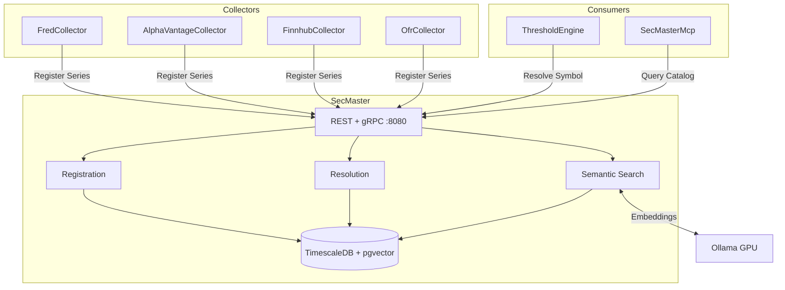

# SecMaster

Centralized instrument metadata and intelligent source resolution service for ATLAS.

## Overview

SecMaster provides a single source of truth for financial instrument definitions and context-aware routing to data sources. Collectors register their series capabilities, and consumers resolve symbols to the appropriate data source based on frequency, latency requirements, and collector preferences. Includes hybrid search combining SQL, fuzzy matching, vector similarity, and RAG-powered natural language queries via Ollama.

## Architecture



Collectors register series at startup (fire-and-forget). Consumers resolve symbols to optimal data sources. Semantic search uses Ollama for embeddings and RAG synthesis.

## Features

- **Instrument Registry**: Central catalog of financial instruments with metadata
- **Context-Aware Resolution**: Routes lookups to optimal source by frequency and latency
- **Frequency Hierarchy**: Higher frequencies satisfy lower (intraday > daily > monthly)
- **Hybrid Search**: SQL exact -> fuzzy text -> vector similarity -> RAG synthesis
- **Collector Gateway**: Unified API for searching and managing all data collectors
- **gRPC + REST**: Dual protocol (gRPC for services, REST for tools/MCP)

## Configuration

| Variable | Default | Description |
|----------|---------|-------------|
| `ConnectionStrings__SecMaster` | Required | PostgreSQL connection string |
| `Ollama__Url` | `http://ollama-gpu:11434` | Ollama API endpoint |
| `Ollama__EmbeddingModel` | `bge-m3` | Model for 1024-dim vector embeddings |
| `Ollama__GenerationModel` | `qwen2.5:32b-instruct` | Model for RAG synthesis |
| `SemanticSearch__VectorHighConfidenceThreshold` | `0.8` | High confidence similarity threshold |
| `SemanticSearch__DefaultMinScore` | `0.5` | Default minimum similarity score |
| `Collectors__FredCollectorUrl` | `http://fred-collector:8080` | FRED collector URL |
| `Collectors__FinnhubCollectorUrl` | `http://finnhub-collector:8080` | Finnhub collector URL |
| `Collectors__OfrCollectorUrl` | `http://ofr-collector:8080` | OFR collector URL |
| `Collectors__AlphaVantageCollectorUrl` | `http://alphavantage-collector:8080` | AlphaVantage collector URL |

## API Endpoints

### REST API (Port 8080)

| Endpoint | Method | Description |
|----------|--------|-------------|
| `/api/instruments` | GET/POST | List or create instruments |
| `/api/instruments/{id}` | GET/PUT/DELETE | CRUD by ID |
| `/api/instruments/by-symbol/{symbol}` | GET | Get by symbol |
| `/api/resolve/{symbol}` | GET | Resolve symbol to data source |
| `/api/resolve` | POST | Resolve with custom context |
| `/api/resolve/batch` | GET | Batch resolve multiple symbols |
| `/api/search` | GET | Fuzzy text search |
| `/api/semantic/search` | GET | Vector similarity search |
| `/api/semantic/resolve` | GET | Hybrid resolution (SQL -> fuzzy -> vector -> RAG) |
| `/api/semantic/ask` | POST | Natural language Q&A with RAG |
| `/api/catalog/search` | GET | Search with upstream discovery |
| `/api/collectors/search` | GET | Smart search across all collectors |
| `/api/collectors/{collector}/series` | GET/POST/PUT/DELETE | Manage collector series |

### gRPC Services (Port 8080)

| Service | Method | Description |
|---------|--------|-------------|
| `SecMasterRegistry` | `RegisterSeries` | Register single series (fire-and-forget) |
| `SecMasterRegistry` | `RegisterSeriesBatch` | Batch registration with streaming |
| `SecMasterResolver` | `ResolveSymbol` | Resolve symbol to best data source |
| `SecMasterResolver` | `ResolveBatch` | Batch resolution with streaming |
| `SecMasterResolver` | `LookupSource` | Reverse lookup by collector and source ID |

## Project Structure

```
SecMaster/
├── src/
│   ├── Data/           # DbContext, entities, migrations
│   ├── Endpoints/      # REST API handlers
│   ├── Grpc/           # gRPC service implementations
│   ├── Services/       # Registration, resolution, semantic search
│   ├── Repositories/   # Data access layer
│   └── Telemetry/      # OpenTelemetry metrics and tracing
├── tests/              # Unit tests
└── .devcontainer/      # Dev container config
```

## Development

```bash
# Compile and test
.devcontainer/compile.sh

# Build container image
.devcontainer/build.sh
```

## Deployment

```bash
ansible-playbook playbooks/deploy.yml --tags secmaster
```

## Ports

| Port | Type | Description |
|------|------|-------------|
| 8080 | Internal | REST API + gRPC (HTTP/1.1 and HTTP/2) |
| 5017 | Host | External access mapped to container 8080 |

## See Also

- [SecMaster MCP](mcp/README.md) - MCP server for Claude Code integration
- [ThresholdEngine](../ThresholdEngine/README.md) - Primary consumer of resolution services
- [FredCollector](../FredCollector/README.md) - Economic data collector
- [FinnhubCollector](../FinnhubCollector/README.md) - Stock quotes and sentiment
- [OfrCollector](../OfrCollector/README.md) - Financial stability data
