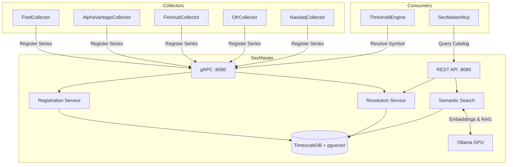

# SecMaster

Centralized instrument metadata and intelligent source resolution service for ATLAS.

## Overview

SecMaster provides a single source of truth for financial instrument definitions and context-aware routing to data sources. Collectors register their series capabilities, and consumers resolve symbols to the appropriate data source based on frequency, latency requirements, and collector preferences. Includes hybrid search combining SQL, fuzzy matching, vector similarity, and RAG-powered natural language queries via Ollama.

## Architecture



## Features

- **Instrument Registry**: Central catalog of financial instruments with metadata
- **Context-Aware Resolution**: Routes symbol lookups to optimal data source by frequency and latency
- **Fire-and-Forget Registration**: Collectors register series asynchronously at startup
- **Frequency Hierarchy**: Higher frequencies satisfy lower (intraday > daily > monthly)
- **Hybrid Search**: SQL exact match -> fuzzy text -> vector similarity -> RAG synthesis
- **Semantic Search**: pgvector + Ollama embeddings for natural language queries
- **Collector Gateway**: Unified API for searching and managing all data collectors
- **Source Priority**: Primary/alternative source routing with configurable preferences
- **gRPC + REST**: Dual protocol support (gRPC for services, REST for tools)

## Configuration

| Variable | Default | Description |
|----------|---------|-------------|
| `ConnectionStrings__SecMaster` | Required | PostgreSQL connection string |
| `OpenTelemetry__OtlpEndpoint` | `http://otel-collector:4317` | OTLP collector endpoint |
| `Ollama__Url` | `http://ollama-gpu:11434` | Ollama API endpoint |
| `Ollama__EmbeddingModel` | `bge-m3` | Model for 1024-dim vector embeddings |
| `Ollama__GenerationModel` | `qwen2.5:32b-instruct` | Model for RAG synthesis |
| `Ollama__MaxTextLength` | `10000` | Max text length for embedding |
| `SemanticSearch__VectorHighConfidenceThreshold` | `0.8` | High confidence similarity threshold |
| `SemanticSearch__DefaultMinScore` | `0.5` | Default minimum similarity score |
| `SemanticSearch__DefaultLimit` | `10` | Default result limit |
| `EmbeddingBackfill__StartupDelaySeconds` | `5` | Delay before backfill starts |
| `EmbeddingBackfill__PollingIntervalMinutes` | `5` | Backfill polling interval |
| `Collectors__FredCollectorUrl` | `http://fred-collector:8080` | FRED collector URL |
| `Collectors__FinnhubCollectorUrl` | `http://finnhub-collector:8080` | Finnhub collector URL |
| `Collectors__OfrCollectorUrl` | `http://ofr-collector:8080` | OFR collector URL |
| `Collectors__AlphaVantageCollectorUrl` | `http://alphavantage-collector:8080` | AlphaVantage collector URL |

## API Endpoints

### REST API (Port 8080)

#### Instruments

| Method | Endpoint | Description |
|--------|----------|-------------|
| GET | `/api/instruments` | List instruments with pagination |
| GET | `/api/instruments/{id}` | Get instrument by ID |
| GET | `/api/instruments/by-symbol/{symbol}` | Get instrument by symbol |
| POST | `/api/instruments` | Create new instrument |
| PUT | `/api/instruments/{id}` | Update existing instrument |
| DELETE | `/api/instruments/{id}` | Delete instrument |
| GET | `/api/instruments/{id}/sources` | List source mappings |

#### Resolution

| Method | Endpoint | Description |
|--------|----------|-------------|
| GET | `/api/resolve/{symbol}` | Resolve symbol with default context |
| POST | `/api/resolve` | Resolve with custom context |
| GET | `/api/resolve/batch?symbols=A,B,C` | Batch resolve multiple symbols |
| GET | `/api/resolve/lookup/{collector}/{sourceId}` | Reverse lookup by collector |

#### Search

| Method | Endpoint | Description |
|--------|----------|-------------|
| GET | `/api/search?q={query}` | Fuzzy text search across instruments |

#### Semantic Search

| Method | Endpoint | Description |
|--------|----------|-------------|
| GET | `/api/semantic/search` | Vector similarity search |
| GET | `/api/semantic/resolve` | Hybrid resolution (SQL -> fuzzy -> vector -> RAG) |
| POST | `/api/semantic/ask` | Natural language Q&A with RAG |
| POST | `/api/semantic/embed/{id}` | Generate embedding for instrument |
| POST | `/api/semantic/embed/backfill` | Backfill missing embeddings |

#### Catalog

| Method | Endpoint | Description |
|--------|----------|-------------|
| GET | `/api/catalog/search?q={query}` | Search with optional upstream discovery |
| POST | `/api/catalog/{instrumentId}/promote` | Promote discovered instrument to collection |

#### Collector Gateway

| Method | Endpoint | Description |
|--------|----------|-------------|
| GET | `/api/collectors/search?q={query}` | Smart search across all collectors |
| GET | `/api/collectors/fred/series` | List FRED series |
| POST | `/api/collectors/fred/series` | Add FRED series |
| PUT | `/api/collectors/fred/series/{id}/toggle` | Toggle FRED series |
| DELETE | `/api/collectors/fred/series/{id}` | Remove FRED series |
| GET | `/api/collectors/finnhub/series` | List Finnhub series |
| POST | `/api/collectors/finnhub/series` | Add Finnhub series |
| PUT | `/api/collectors/finnhub/series/{id}/toggle` | Toggle Finnhub series |
| DELETE | `/api/collectors/finnhub/series/{id}` | Remove Finnhub series |
| GET | `/api/collectors/alphavantage/series` | List AlphaVantage series |
| POST | `/api/collectors/alphavantage/series` | Add AlphaVantage series |
| PUT | `/api/collectors/alphavantage/series/{id}/toggle` | Toggle AlphaVantage series |
| DELETE | `/api/collectors/alphavantage/series/{id}` | Remove AlphaVantage series |
| GET | `/api/collectors/ofr/stfm` | List OFR short-term funding series |
| GET | `/api/collectors/ofr/hfm` | List OFR hedge fund series |

### gRPC Services (Port 8080)

#### SecMasterRegistry

| Method | Description |
|--------|-------------|
| `RegisterSeries` | Register single series (fire-and-forget) |
| `RegisterSeriesBatch` | Batch registration with streaming |

#### SecMasterResolver

| Method | Description |
|--------|-------------|
| `ResolveSymbol` | Resolve symbol to best data source |
| `ResolveBatch` | Batch resolution with streaming response |
| `LookupSource` | Reverse lookup by collector and source ID |

## Project Structure

```
SecMaster/
├── src/
│   ├── Program.cs                   # Application entry point
│   ├── DependencyInjection.cs       # Service registration
│   ├── appsettings.json             # Configuration
│   ├── Data/                        # DbContext, entities, migrations
│   ├── Endpoints/                   # REST API endpoint handlers
│   ├── Grpc/                        # gRPC service implementations
│   ├── Services/                    # Registration, resolution, semantic search
│   ├── Repositories/                # Data access layer
│   ├── Models/                      # Domain models and DTOs
│   ├── Configuration/               # Options classes
│   ├── Telemetry/                   # OpenTelemetry activity source, metrics
│   └── Containerfile                # Multi-stage container build
├── tests/
│   └── SecMaster.UnitTests/         # Unit test project
└── .devcontainer/
    ├── build.sh                     # Container image build script
    ├── compile.sh                   # Compile and test script
    └── compose.yaml                 # Dev container configuration
```

## Development

### Compile and Test

```bash
.devcontainer/compile.sh
```

### Build Container Image

```bash
.devcontainer/build.sh
```

## Deployment

```bash
ansible-playbook playbooks/deploy.yml --tags secmaster
```

## Ports

| Port | Type | Description |
|------|------|-------------|
| 8080 | HTTP (internal) | REST API + gRPC (HTTP/1.1 and HTTP/2) |
| 5017 | HTTP (host) | Host access mapped to container 8080 |

## See Also

- [SecMasterMcp](../SecMasterMcp/README.md) - MCP server for Claude Code integration
- [ThresholdEngine](../ThresholdEngine/README.md) - Primary consumer of resolution services
- [FredCollector](../FredCollector/README.md) - Economic data collector
- [FinnhubCollector](../FinnhubCollector/README.md) - Stock quotes and sentiment
- [OfrCollector](../OfrCollector/README.md) - Financial stability data
- [Events](../Events/README.md) - Shared gRPC contracts
