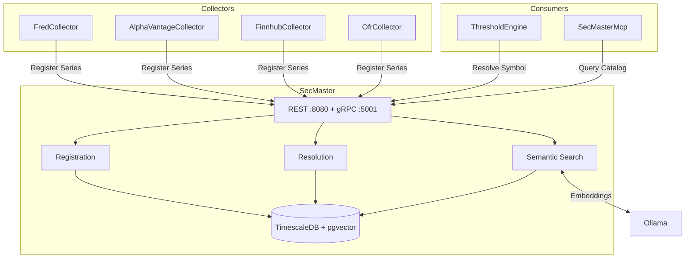

# SecMaster

Centralized instrument metadata and intelligent source resolution service for ATLAS.

> 🤖 **Agents:** read **[AGENT_README.md](AGENT_README.md)** first — the dense architecture card.

## Overview

SecMaster provides a single source of truth for financial instrument definitions and context-aware routing to data sources. Collectors register their series capabilities via gRPC, and consumers resolve symbols to the optimal data source based on frequency, latency, and collector preferences. Includes hybrid search combining SQL, fuzzy matching, vector similarity, and RAG-powered natural language queries via Ollama.

## Architecture


```mermaid
flowchart TD
    subgraph Collectors
        FC[FredCollector]
        AV[AlphaVantageCollector]
        FH[FinnhubCollector]
        OFR[OfrCollector]
    end

    subgraph SecMaster
        API[REST :8080 + gRPC :5001]
        REG[Registration]
        RES[Resolution]
        SEM[Semantic Search]
        DB[(TimescaleDB + pgvector)]
    end

    subgraph Consumers
        TE[ThresholdEngine]
        MCP[SecMasterMcp]
    end

    FC & AV & FH & OFR -->|Register Series| API
    API --> REG --> DB
    TE -->|Resolve Symbol| API
    MCP -->|Query Catalog| API
    API --> RES & SEM --> DB
    SEM <-->|Embeddings| OLLAMA[Ollama]
```

Collectors register series at startup via gRPC streaming (fire-and-forget). Consumers resolve symbols to optimal data sources. Semantic search uses Ollama for embeddings and RAG synthesis.

## Features

- **Instrument Registry**: Central catalog of financial instruments with metadata and source mappings
- **Context-Aware Resolution**: Routes lookups to optimal source by frequency, latency, and priority
- **Hybrid Search**: SQL exact match, fuzzy text, vector similarity, and RAG synthesis pipeline
- **Collector Gateway**: Per-collector read/write surface for searching and managing series across FRED, Finnhub, AlphaVantage, and OFR
- **Catalog Discovery**: Search upstream collectors for new instruments and promote to collection
- **Background Enrichment**: OpenFIGI symbology enrichment, EDGAR filer ingestion, NAICS / ATLAS sector classification backfill, embedding backfill
- **Manual Sector Overrides**: Lifecycle-tracked, audited override layer with admin dashboard
- **Entity Resolution Composer**: Batch NER → canonical-instrument + NAICS + ATLAS sector grounding for qualitative-extraction (F4.6.4)
- **Cross-Reference Identifiers**: CUSIP / ISIN / FIGI / ticker → canonical identifier set

## Configuration

| Variable | Description | Default |
|----------|-------------|---------|
| `ConnectionStrings__SecMaster` | Primary PostgreSQL connection (atlas_secmaster) | Required |
| `AtlasData__ConnectionString` | Cross-DB read connection for atlas_data (dedup grouping reads FRED/OFR/Sentinel observations). Empty/null short-circuits dedup providers to empty results. | empty |
| `Ollama__Url` | Ollama API endpoint for generation | `http://ollama-gpu:11434` |
| `Ollama__EmbeddingUrl` | Ollama API endpoint for embeddings (falls back to `Url` if unset) | `http://ollama-cpu:11434` (appsettings) |
| `Ollama__EmbeddingModel` | Model for vector embeddings | `bge-m3` (appsettings; options-class default is `nomic-embed-text`) |
| `Ollama__GenerationModel` | Model for RAG synthesis (production override: `qwen2.5:7b-instruct`) | `qwen2.5:32b-instruct` |
| `Ollama__MaxTextLength` | Truncate-before-embed character cap | `10000` |
| `SemanticSearch__VectorHighConfidenceThreshold` | High-confidence similarity threshold | `0.8` |
| `SemanticSearch__DefaultMinScore` | Default minimum similarity score | `0.75` |
| `SemanticSearch__VectorSimilarityFloor` | Hard floor on cosine scores before CoVe / downstream verification (kill switch: `0`) | `0.5` |
| `SemanticSearch__RagStrictMode` | Tightened prompt + NO_MATCH short-circuit + token-overlap verification + asset-class pre-filter | `true` |
| `SemanticSearch__DefaultLimit` | Default search result limit | `10` |
| `SemanticSearch__RagContextMaxTokens` | RAG context window cap (tokens) | `2000` |
| `SemanticSearch__RagDefaultMinScore` | Default min similarity for RAG retrieval | `0.3` |
| `SemanticSearch__RagDefaultLimit` | Default RAG retrieval result count | `5` |
| `SemanticSearch__MinLocalResultsBeforeDiscovery` | Trigger upstream discovery when local hits below this | `3` |
| `SemanticSearch__MinScoreBeforeDiscovery` | Trigger upstream discovery when best local score below this | `0.8` |
| `SemanticSearch__EmbeddingCacheSize` | LRU embedding cache size (entries) | `10000` |
| `SemanticSearch__EmbeddingCacheEnabled` | Cache kill switch (`false` = pass-through) | `true` |
| `Embedding__TemplateVersion` | Active embedding template; bump triggers re-embed of stale rows | `v5` |
| `EmbeddingBackfill__StartupDelaySeconds` | Delay before backfill loop starts | `5` |
| `EmbeddingBackfill__PollingIntervalMinutes` | Backfill polling interval | `5` |
| `EmbeddingBackfill__DelayBetweenEmbeddingsMs` | Throttle between embedding calls | `100` |
| `Enrichment__Enabled` | Master flag for the OpenFIGI enrichment background service | `true` |
| `Enrichment__IntervalSeconds` | Enrichment cycle interval | `300` |
| `Enrichment__BatchSize` | Rows per enrichment cycle | `200` |
| `Enrichment__RetryAfterDays` | Re-attempt previously-failed rows after N days | `90` |
| `Enrichment__IntervalBetweenCallsMs` | Throttle between OpenFIGI calls | `100` |
| `OpenFigi__BaseUrl` | OpenFIGI API base URL | `https://api.openfigi.com` |
| `OpenFigi__ApiKey` | OpenFIGI API key (optional; raises rate limits) | null |
| `OpenFigi__MaxJobsPerRequest` | Jobs per OpenFIGI batch request | `100` |
| `OpenFigi__IntervalBetweenBatchesMs` | Throttle between OpenFIGI batches | `250` |
| `OpenFigi__RequestTimeout` | Per-request timeout | `30s` |
| `OpenFigi__Enabled` | Per-client kill switch | `true` |
| `EdgarIngestion__RefreshIntervalDays` | EDGAR filer refresh cadence | `7` |
| `EdgarIngestion__UserAgentHeader` | EDGAR-mandated UA header | `ATLAS Matrix Bot james.pansarasa@gmail.com` |
| `EdgarIngestion__MaxRequestsPerSecond` | EDGAR rate-limit ceiling (10 req/s documented; default leaves headroom) | `8` |
| `EdgarIngestion__EnabledOnStartup` | Run initial ingest on startup | `true` |
| `EdgarIngestion__SeedCikList` | Comma-separated CIKs to seed in addition to the bootstrap CSV | empty |
| `EdgarIngestion__BootstrapCsvPath` | Bootstrap CSV (columns: `cik,ticker,company_name`); resolved against `AppContext.BaseDirectory` | `data/edgar-bootstrap-ciks.csv` |
| `EdgarIngestion__SubmissionsBaseUrl` | EDGAR submissions host | `https://data.sec.gov` |
| `EdgarIngestion__TickersBaseUrl` | EDGAR tickers host | `https://www.sec.gov` |
| `EntityResolution__Enabled` | Master flag for the on-demand resolver composer | `true` |
| `EntityResolution__MinConfidence` | Minimum confidence required to include a candidate in the response (user decision Q3: 0.8, NOT spec's 0.7) | `0.8` |
| `EntityResolution__MaxCandidatesPerRequest` | Per-request soft cap on raw candidates | `10` |
| `EntityResolution__MaxCandidatesPerRequestUpperBound` | Hard 400-trigger; defends against hostile fan-out | `100` |
| `EntityResolution__ArticleContextMaxChars` | Cap on `ArticleContext` payload | `32000` |
| `EntityResolution__OpenFigiCacheHitTtl` | Positive-cache TTL | `90d` |
| `EntityResolution__OpenFigiCacheMissTtl` | Negative-cache TTL (shorter so freshly-IPO'd tickers retry) | `7d` |
| `Collectors__FredCollectorUrl` | FRED collector URL | `http://fred-collector:8080` |
| `Collectors__FinnhubCollectorUrl` | Finnhub collector URL | `http://finnhub-collector:8080` |
| `Collectors__OfrCollectorUrl` | OFR collector URL | `http://ofr-collector:8080` |
| `Collectors__AlphaVantageCollectorUrl` | AlphaVantage collector URL | `http://alphavantage-collector:8080` |
| `InstrumentConfiguration__ConfigDirectory` | Path to instrument JSON config files (host-mounted at `/app/config`) | `/app/config` |
| `NaicsImporter__RunOnStartup` | Run NAICS import on startup | `true` |
| `NaicsImporter__Vintage` | NAICS vintage stamped on imported rows | `2022` |
| `NaicsImporter__CsvPath` | NAICS CSV path (resolved against `AppContext.BaseDirectory`) | `data/naics-2022.csv` |
| `AtlasSectorRollupImporter__RunOnStartup` | Run ATLAS sector rollup import on startup | `true` |
| `AtlasSectorRollupImporter__MappingVersion` | Version stamped on every rollup row (kept in lock-step with CSV filename) | `v1.0` |
| `AtlasSectorRollupImporter__CsvPath` | Rollup CSV path | `data/atlas-sector-rollup-v1.0.csv` |
| `SignalIdentityImporter__RunOnStartup` | Run signal-identity import on startup | `true` |
| `SignalIdentityImporter__CsvPath` | Signal-identity CSV path | `data/signal-identities-v1.csv` |
| `InstrumentClassificationBackfill__RunOnStartup` | Run classification backfill on startup (skips already-classified rows) | `true` |
| `InstrumentClassificationBackfill__ForceRerun` | Re-classify every instrument regardless of current `classification_source` | `false` |
| `InstrumentClassificationBackfill__IntervalHours` | Periodic re-run cadence (null = startup-only) | null |
| `InstrumentClassificationBackfill__UnresolvedAlertThreshold` | Warning-log threshold (fraction of cycle Total unresolved) | `0.20` |
| `InstrumentClassificationBackfill__UnresolvedAlertMinTotal` | Minimum cycle Total before alert threshold fires | `50` |
| `Kestrel__HttpPort` | REST API port | `8080` |
| `Kestrel__GrpcPort` | gRPC port | `5001` |
| `OpenTelemetry__OtlpEndpoint` | OTLP exporter target (Loki / Tempo / Prometheus via collector) | `http://otel-collector:4317` |
| `OpenTelemetry__ServiceName` | Service name tag in OTEL resource attributes | `SecMaster` |
| `OpenTelemetry__ServiceVersion` | Service version tag in OTEL resource attributes | `1.0.0` |

## API Endpoints

REST endpoints are split across the following endpoint groups under `src/Endpoints/`:

- **InstrumentEndpoints** (`/api/instruments`) — CRUD over instruments + source mappings + by-symbol lookup.
- **InstrumentOverrideEndpoints** (`/api/instruments/{id}/sector-override`, `/api/instruments/sector-overrides/{overrideId}`, `/api/admin/sector-overrides`) — manual sector override lifecycle (5 routes total).
- **ResolutionEndpoints** (`/api/resolve`) — symbol → source resolution (single, batch, reverse).
- **RegistrationEndpoints** (`/api/register`) — collector-side source registration.
- **SearchEndpoints** (`/api/search`) — fuzzy text search.
- **SemanticSearchEndpoints** (`/api/semantic`) — vector / hybrid / hybrid-local / RAG / embed.
- **CatalogEndpoints** (`/api/catalog`) — upstream discovery + promotion.
- **CollectorEndpoints** (`/api/collectors`) — per-collector gateway: cross-collector smart search + per-collector list/add/toggle/remove for FRED, Finnhub, AlphaVantage; read-only list for OFR (STFM / HFM).
- **AtlasSectorEndpoints** (`/api/atlas-sectors`) — 11-sector ATLAS taxonomy lookups + NAICS rollups (3 reads, no writes).
- **NaicsEndpoints** (`/api/naics`) — NAICS code hierarchy (browse + resolve, 3 reads).
- **SignalIdentitiesEndpoints** (`/api/signal-identities`) — signal-identity dedup grouping for cross-source equivalents (5 reads).
- **EdgarEndpoints** (`/api/edgar`) — EDGAR filer registry (CIK / ticker lookup, manual refresh kick).
- **IdentifiersEndpoints** (`/api/identifiers`) — generic identifier-resolution surface (CUSIP / ISIN / FIGI / ticker).
- **AdminEndpoints** (`/api/admin`) — catalog coverage report + FRED-hijack dedup ops (also hosts the admin `sector-overrides` listing).
- **EntityResolutionEndpoints** (`/api/resolve-entities`) — on-demand entity-resolution composer for F4.6.4 qualitative-extraction grounding. POST a batch of NER candidates + article context; returns a confidence-filtered list of canonical instruments with NAICS + ATLAS sector grounding.

### REST API (Port 8080)

| Endpoint | Method | Description |
|----------|--------|-------------|
| `/api/instruments/` | GET | List all instruments (`?activeOnly=` filter) |
| `/api/instruments/` | POST | Create instrument |
| `/api/instruments/{id:guid}` | GET | Get by ID |
| `/api/instruments/{id:guid}` | PUT | Update instrument |
| `/api/instruments/{id:guid}` | DELETE | Delete instrument |
| `/api/instruments/{id:guid}/sources` | GET | Get source mappings for instrument |
| `/api/instruments/by-symbol/{symbol}` | GET | Get by symbol |
| `/api/instruments/{instrumentId:guid}/sector-override` | GET | Active sector override (404 when none) |
| `/api/instruments/{instrumentId:guid}/sector-override` | POST | Set / supersede active sector override |
| `/api/instruments/{instrumentId:guid}/sector-overrides/history` | GET | Override history for an instrument |
| `/api/instruments/sector-overrides/{overrideId:guid}` | DELETE | Revoke an active sector override (idempotent) |
| `/api/resolve/{symbol}` | GET | Resolve symbol to best data source |
| `/api/resolve/` | POST | Resolve with context (frequency, lag, preference) |
| `/api/resolve/batch` | GET | Batch resolve multiple symbols |
| `/api/resolve/lookup/{collector}/{sourceId}` | GET | Reverse lookup by collector and source ID |
| `/api/resolve-entities/` | POST | Resolve a batch of NER candidates to canonical instruments with NAICS + ATLAS sector grounding (F4.6.4) |
| `/api/register/` | POST | Register a data source from a collector |
| `/api/search/` | GET | Fuzzy text search |
| `/api/semantic/search` | GET | Vector similarity search |
| `/api/semantic/resolve` | GET | Hybrid resolution (SQL → Vector → RAG, with upstream discovery) |
| `/api/semantic/resolve-local` | GET | Hybrid resolution restricted to local catalog (no upstream discovery) |
| `/api/semantic/ask` | POST | Natural language Q&A with RAG synthesis |
| `/api/semantic/embed/{instrumentId:guid}` | POST | Force-embed a single instrument |
| `/api/semantic/embed/backfill` | POST | Backfill embeddings for missing/stale rows |
| `/api/catalog/search` | GET | Search catalog with optional upstream discovery (`?discover=`) |
| `/api/catalog/{instrumentId:guid}/promote` | POST | Promote discovered instrument to active collection |
| `/api/collectors/search` | GET | Cross-collector smart search via SmartRouter |
| `/api/collectors/fred/series` | GET | List active FRED series |
| `/api/collectors/fred/series` | POST | Add a series to FRED collector |
| `/api/collectors/fred/series/{seriesId}/toggle` | PUT | Toggle FRED series active status |
| `/api/collectors/fred/series/{seriesId}` | DELETE | Remove series from FRED collector |
| `/api/collectors/finnhub/series` | GET | List active Finnhub series |
| `/api/collectors/finnhub/series` | POST | Add a series to Finnhub collector |
| `/api/collectors/finnhub/series/{seriesId}/toggle` | PUT | Toggle Finnhub series active status |
| `/api/collectors/finnhub/series/{seriesId}` | DELETE | Remove series from Finnhub collector |
| `/api/collectors/alphavantage/series` | GET | List active AlphaVantage series |
| `/api/collectors/alphavantage/series` | POST | Add a series to AlphaVantage collector |
| `/api/collectors/alphavantage/series/{seriesId}/toggle` | PUT | Toggle AlphaVantage series active status |
| `/api/collectors/alphavantage/series/{seriesId}` | DELETE | Remove series from AlphaVantage collector |
| `/api/collectors/ofr/stfm` | GET | List OFR Short-term Funding Monitor series (read-only) |
| `/api/collectors/ofr/hfm` | GET | List OFR Hedge Fund Monitor series (read-only) |
| `/api/atlas-sectors/` | GET | List the 11 ATLAS sectors |
| `/api/atlas-sectors/resolve` | GET | Resolve a NAICS code to its ATLAS sector under the given mapping version (default: latest) |
| `/api/atlas-sectors/{sectorCode}/naics` | GET | List NAICS codes that roll up to a sector |
| `/api/naics/` | GET | Browse NAICS codes by prefix |
| `/api/naics/{parentCode}/children` | GET | List immediate children of a NAICS code |
| `/api/naics/{code}` | GET | Resolve a NAICS code (with rollup target + leaf-first hierarchy chain) |
| `/api/signal-identities/` | GET | List signal identities (capped at 1000) |
| `/api/signal-identities/by-alias` | GET | Lookup signal identity by alias |
| `/api/signal-identities/by-category/{category}` | GET | List by signal category |
| `/api/signal-identities/{id}` | GET | Signal-identity detail (kebab-case id) |
| `/api/signal-identities/{id}/dedup` | GET | Dedup grouping (cross-source observations in `[from, to)`) |
| `/api/edgar/filers/{cik}` | GET | EDGAR filer by CIK (digits or zero-padded 10-digit) |
| `/api/edgar/filers/by-ticker/{ticker}` | GET | EDGAR filer by ticker (case-insensitive) |
| `/api/edgar/refresh` | POST | Manually kick the EDGAR ingestion background service (bypasses skip-if-fresh) |
| `/api/identifiers/resolve` | GET | Resolve generic identifier (`?cusip=` / `?isin=` / `?figi=` / `?ticker=` + optional `?exchange=`) |
| `/api/admin/catalog/coverage` | GET | Catalog field-population coverage report |
| `/api/admin/catalog/dedupe-fred-hijacks` | POST | Soft-delete FRED-hijack rows (admin, manual; idempotent) |
| `/api/admin/sector-overrides` | GET | List all currently-active instrument sector overrides (paginated, default limit 100) |
| `/health` | GET | Health check (returns JSON with per-check status) |


### gRPC

Proto: `Events/src/Events/Protos/secmaster.proto` (package `atlas.secmaster`, C# namespace `ATLAS.SecMaster.Grpc`).

**Exposes (server):**

| Service | Method | Direction | Description |
|---------|--------|-----------|-------------|
| `SecMasterRegistry` | `RegisterSeries` | unary | Collectors register a single series (fire-and-forget) |
| `SecMasterRegistry` | `RegisterSeriesBatch` | client-stream → unary | Batch registration; clients stream `SeriesRegistration` messages |
| `SecMasterResolver` | `ResolveSymbol` | unary | Resolve canonical symbol → best `SourceMapping` |
| `SecMasterResolver` | `ResolveBatch` | unary → server-stream | Batch symbol resolution; server streams `ResolveResponse` per symbol |
| `SecMasterResolver` | `LookupSource` | unary | Reverse lookup: collector+source-id → canonical instrument |

**Consumes (client):** none — SecMaster is a pure gRPC server on this transport.

**Callers:** Collectors call `SecMasterRegistry` (fire-and-forget registration). ThresholdEngine calls `SecMasterResolver.ResolveBatch` at load time for pattern validation and `DataWarmupService` routing.

## Project Structure

```
SecMaster/
├── src/
│   ├── Configuration/    # Options classes (Ollama, SemanticSearch, Collectors, AtlasData, Enrichment, OpenFigi, EdgarIngestion, EntityResolution, InstrumentConfiguration, NaicsImporter, AtlasSectorRollupImporter, SignalIdentityImporter, InstrumentClassificationBackfill)
│   ├── Data/
│   │   ├── Configurations/  # EF entity configurations
│   │   ├── Entities/        # 12 entities — see list below
│   │   ├── Migrations/      # 37 EF migration files (12 migrations × Designer/Snapshot + 1 ModelSnapshot)
│   │   ├── Repositories/    # query / persistence helpers
│   │   └── SecMasterDbContext.cs
│   ├── Endpoints/        # 15 REST endpoint groups (see API Endpoints)
│   ├── Grpc/             # gRPC service implementations (Registry + Resolver)
│   ├── HealthChecks/     # DatabaseHealthCheck
│   ├── Models/           # Resolution, EntityResolution, IdentifierResolution, ClassificationSource, SignalIdentityCategory
│   ├── Services/         # Registration, resolution, semantic search, importers, background workers, collector clients, OpenFIGI, EDGAR, dedup
│   ├── Telemetry/        # SecMasterActivitySource + SecMasterMeter (OpenTelemetry)
│   ├── Containerfile     # multi-stage: build → development | runtime
│   ├── DependencyInjection.cs
│   ├── Program.cs
│   ├── ProblemTypes.cs
│   ├── SecMaster.csproj
│   └── appsettings.json
├── tests/                # SecMaster.UnitTests + SecMaster.IntegrationTests
├── mcp/                  # MCP server (separate Containerfile; see mcp/README.md)
├── config/instruments/   # Host-mounted instrument JSON config (live-reloaded)
├── data/                 # Bundled CSVs (NAICS 2022, ATLAS sector rollup v1.0, signal identities v1, EDGAR bootstrap CIKs)
├── docs/                 # Service-local docs (e.g. openfigi-verification.md)
├── scripts/              # Build / migration helpers
├── openapi.json          # Generated OpenAPI spec
└── .devcontainer/        # Dev container config + compile.sh + build.sh
```

### Entities (`src/Data/Entities/`)

- `InstrumentEntity` — primary instrument row (symbol, name, asset class, NAICS + ATLAS sector tags).
- `InstrumentEmbeddingEntity` — pgvector embedding (bge-m3, 1024-dim) for semantic search.
- `InstrumentSectorOverrideEntity` — manual ATLAS-sector override (lifecycle-tracked, FK to instrument).
- `SourceMappingEntity` — instrument ↔ collector source-id mapping (with frequency/lag metadata).
- `AliasEntity` — alternate symbols / tickers for an instrument.
- `AtlasSectorEntity` — 11-row ATLAS sector taxonomy (FK target).
- `NaicsCodeEntity` — full NAICS 2022 hierarchy.
- `NaicsSectorRollupEntity` — NAICS → ATLAS sector rollup mappings.
- `SignalIdentityEntity` — cross-source signal-identity grouping (dedup target).
- `EdgarFilerEntity` — EDGAR filer registry (CIK + tickers).
- `MappingVersionEntity` — version-pinned mappings for reproducible resolution.
- `OpenFigiLookupCacheEntity` — cached OpenFIGI symbology lookups (rate-limit protection).

## Development

### Prerequisites
- VS Code with Dev Containers extension
- Access to shared infrastructure (PostgreSQL, observability stack)

### Getting Started

1. Open in VS Code: `code SecMaster/`
2. Reopen in Container (Cmd/Ctrl+Shift+P -> "Dev Containers: Reopen in Container")
3. Build and run unit tests: `.devcontainer/compile.sh`
4. Build without tests: `.devcontainer/compile.sh --no-test`
5. Build + unit + integration tests (requires DB): `.devcontainer/compile.sh --integration`

### Build Container

```bash
.devcontainer/build.sh           # cached
.devcontainer/build.sh --no-cache
```

## Deployment

```bash
ansible-playbook playbooks/deploy.yml --tags secmaster
```

## Ports

| Port | Type | Description |
|------|------|-------------|
| 8080 | Internal | REST API (HTTP/1.1 + HTTP/2) |
| 5001 | Internal | gRPC (HTTP/2 only) |

No host-mapped ports. All access is container-to-container only. The MCP server (`secmaster-mcp`) exposes port 3107 for external access.

## See Also

- [SecMaster MCP](mcp/README.md) - MCP server for Claude Code integration
- [ThresholdEngine](../ThresholdEngine/README.md) - Primary consumer of resolution services
- [FredCollector](../FredCollector/README.md) - Economic data collector
- [FinnhubCollector](../FinnhubCollector/README.md) - Stock quotes and sentiment
- [OfrCollector](../OfrCollector/README.md) - Financial stability data
- [AlphaVantageCollector](../AlphaVantageCollector/README.md) - Market data collector
