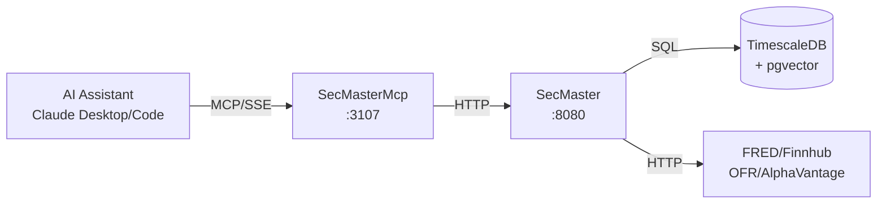

# SecMaster MCP

MCP server exposing ATLAS instrument metadata, semantic search, and data collector management to AI assistants.

## Overview

SecMasterMcp provides Claude Desktop and Claude Code direct access to the SecMaster security master database via MCP (Model Context Protocol). It enables searching instruments, resolving symbols to data sources, performing semantic similarity searches with vector embeddings, asking natural language questions via RAG synthesis, and managing series across all ATLAS data collectors.

## Architecture



AI assistants connect via SSE, SecMasterMcp proxies requests to the SecMaster backend, which queries TimescaleDB (with pgvector for embeddings) and routes collector operations to the appropriate services.

## Features

- **Instrument Search**: SQL, fuzzy (pg_trgm), and semantic (pgvector) search modes
- **Symbol Resolution**: Resolve symbols to optimal data sources by frequency and lag
- **RAG Q&A**: Natural language questions answered via retrieval-augmented generation
- **Collector Gateway**: Unified interface to manage series across all collectors
- **Hybrid Resolution**: Cascading strategy from exact match to semantic to RAG

## Configuration

| Variable | Description | Default |
|----------|-------------|---------|
| `SECMASTER_API_URL` | Backend service URL | `http://secmaster:8080` |
| `SECMASTER_MCP_LOG_LEVEL` | Logging level | `Warning` |
| `SECMASTER_MCP_TIMEOUT_SECONDS` | HTTP request timeout | `30` |

## MCP Tools

### Search and Resolution

| Tool | Description |
|------|-------------|
| `search_instruments` | Search by name, symbol, description |
| `search_catalog` | Search with optional upstream discovery |
| `get_instrument` | Get instrument details by symbol/ID |
| `resolve_source` | Resolve symbol to best data source |
| `resolve_batch` | Resolve multiple symbols |
| `list_sources` | List all sources for an instrument |
| `lookup_by_collector_id` | Reverse lookup by collector ID |
| `promote_instrument` | Promote discovered to active collection |

### Semantic Search

| Tool | Description |
|------|-------------|
| `semantic_search` | Search via 768-dim embeddings |
| `ask_secmaster` | Natural language Q&A with RAG |
| `hybrid_resolve` | SQL -> Fuzzy -> Vector -> RAG cascade |

### Collector Gateway

| Tool | Description |
|------|-------------|
| `search_collectors` | Smart-routed search across all collectors |
| `list_{collector}_series` | List active series (FRED, Finnhub, AlphaVantage, OFR STFM/HFM) |
| `add_{collector}_series` | Add series to collection |
| `toggle_{collector}_series` | Toggle series active/inactive |
| `remove_{collector}_series` | Remove series from collection |
| `health` | Service health status |

## Project Structure

```
SecMaster/mcp/
├── Tools/
│   └── SecMasterTools.cs   # MCP tool definitions
├── Program.cs              # Entry point
├── SecMasterMcp.csproj
├── Containerfile
└── README.md
```

## Development

### Prerequisites

- VS Code with Dev Containers extension
- Access to shared infrastructure (PostgreSQL, observability stack)

### Getting Started

1. Open in VS Code: `code SecMaster/`
2. Reopen in Container (Cmd/Ctrl+Shift+P -> "Dev Containers: Reopen in Container")
3. Build: `dotnet build mcp/SecMasterMcp.csproj`

### Build Container

```bash
SecMaster/.devcontainer/build.sh
```

## Deployment

```bash
ansible-playbook playbooks/deploy.yml --tags secmaster-mcp
```

## Ports

| Port | Description |
|------|-------------|
| 8080 | HTTP API (internal) |
| 3107 | SSE endpoint (host-mapped) |

## Claude Desktop Integration

Add to `~/.config/Claude/claude_desktop_config.json`:

```json
{
  "mcpServers": {
    "secmaster": {
      "command": "uvx",
      "args": ["mcp-proxy", "http://mercury:3107/sse"]
    }
  }
}
```

Claude Desktop uses stdio transport, so `mcp-proxy` bridges stdio to SSE.

## Usage Examples

```
# Basic search
search_instruments(query="unemployment", asset_class="Economic")

# Semantic search
semantic_search(query="job market health", min_score=0.6)

# Natural language Q&A
ask_secmaster(question="What inflation data is available?")

# Manage series
add_finnhub_series(symbol="NDAQ", priority=10)
```

## See Also

- [SecMaster](../README.md) - Backend service
- [FredCollector MCP](../../FredCollector/mcp/README.md) - FRED data access
- [FinnhubCollector MCP](../../FinnhubCollector/mcp/README.md) - Stock market data
- [OfrCollector MCP](../../OfrCollector/mcp/README.md) - OFR financial stress data
