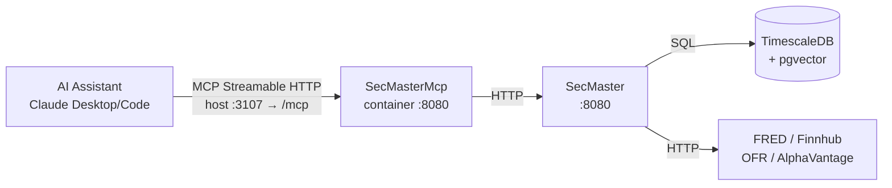

# SecMaster MCP

MCP server exposing ATLAS instrument metadata, NAICS / ATLAS-sector taxonomy, signal-identity dedup, EDGAR filer lookup, semantic search, and data-collector management to AI assistants.

## Overview

SecMasterMcp provides Claude Desktop and Claude Code with direct access to the SecMaster service via MCP (Model Context Protocol). It proxies tool calls to the SecMaster HTTP API: instrument search and resolution, NAICS / ATLAS-sector taxonomy and overrides, identifier cross-reference (CUSIP / ISIN / FIGI / ticker → OpenFIGI fallback), signal-identity catalog and dedup grouping, EDGAR filer lookup, semantic / RAG / hybrid resolution, and series management across all ATLAS collectors (FRED, Finnhub, AlphaVantage).

## Architecture


```mermaid
flowchart LR
    AI[AI Assistant<br/>Claude Desktop/Code] -->|MCP Streamable HTTP<br/>host :3107 → /mcp| MCP[SecMasterMcp<br/>container :8080]
    MCP -->|HTTP| SM[SecMaster<br/>:8080]
    SM -->|SQL| DB[(TimescaleDB<br/>+ pgvector)]
    SM -->|HTTP| Collectors[FRED / Finnhub<br/>OFR / AlphaVantage]
```

AI assistants connect over MCP Streamable HTTP at `/mcp`. SecMasterMcp forwards each tool call to the SecMaster backend, which queries TimescaleDB (with pgvector for embeddings) and routes collector operations to the appropriate services.

## Features

- **Instrument Search & Resolution**: exact / fuzzy / semantic search, batch resolve, reverse lookup by collector id
- **NAICS & ATLAS Sectors**: resolve a NAICS code to its hierarchy chain or to one of the 11 ATLAS sectors; list NAICS by prefix or by sector
- **Identifier Cross-Reference**: resolve CUSIP / ISIN / FIGI / ticker to the canonical identifier set (cache-first, OpenFIGI fallback for ticker)
- **Signal-Identity Catalog**: list / lookup conceptual signal handles, and group all substrate observations sharing one signal id in a window
- **EDGAR Filer Lookup**: CIK or ticker → filer name, SIC, derived NAICS-2022
- **Sector Overrides**: set / get / revoke / list-history of manual instrument → ATLAS-sector overrides (audited)
- **Semantic & RAG**: pgvector semantic search, natural-language RAG Q&A, and a hybrid SQL → fuzzy → vector → RAG cascade
- **Collector Gateway**: list / add / toggle / remove series on FRED, Finnhub, AlphaVantage; list-only for OFR STFM and HFM; smart-routed search across all collectors

## Configuration

| Variable | Description | Default |
|----------|-------------|---------|
| `SECMASTER_API_URL` | Backend SecMaster HTTP base URL | `http://secmaster:8080` |
| `SECMASTER_MCP_TIMEOUT_SECONDS` | HTTP client timeout (seconds) | `30` (Containerfile) / `180` (deployed via `compose.yaml`) |
| `ASPNETCORE_URLS` | Kestrel bind URL inside the container | `http://+:8080` |

Log level is hardcoded to `Warning` (see `Program.cs`); it is not env-configurable.

## API Endpoints

The MCP server's public surface is its set of MCP tools, served over MCP Streamable HTTP at `POST /mcp` (container port 8080, host port 3107). A liveness probe is exposed at `GET /health`.

### Search, Resolution & Catalog

| Tool | Description |
|------|-------------|
| `search_instruments` | Search by name, symbol, or description (optional asset-class filter) |
| `search_catalog` | Catalog search with optional upstream discovery (`discover=true` → Finnhub / AlphaVantage / FRED) |
| `get_instrument` | Get instrument details by symbol or UUID |
| `resolve_source` | Resolve a symbol to the best data source (frequency / lag / preferred collector) |
| `resolve_batch` | Resolve a comma-separated list of symbols |
| `list_sources` | List all sources registered for a symbol |
| `lookup_by_collector_id` | Reverse lookup: collector + source id → instrument |
| `promote_instrument` | Promote a discovered instrument to active collection on a collector |
| `resolve_identifiers` | Resolve CUSIP / ISIN / FIGI / ticker to the canonical identifier set (OpenFIGI fallback for ticker) |

### NAICS & ATLAS Sectors

| Tool | Description |
|------|-------------|
| `resolve_naics` | NAICS code → row + leaf-first hierarchy chain to the sector |
| `list_naics` | List NAICS rows whose code starts with a prefix (max 200, ceiling 1000) |
| `resolve_atlas_sector` | NAICS-6 → one of the 11 ATLAS sectors (version- or as-of-aware) |
| `list_atlas_sectors` | List the 11 ATLAS sector codes + display names |
| `list_naics_for_sector` | List NAICS rollups mapped to a given ATLAS sector (max 200, ceiling 1000) |

### Signal Identities

| Tool | Description |
|------|-------------|
| `list_signal_identities` | List the signal-identity catalog (optional category filter) |
| `lookup_signal_identity` | Look up a signal identity by id or alias |
| `dedup_grouping` | All observations sharing a signal-identity id in a `[from, to)` UTC window |

### EDGAR

| Tool | Description |
|------|-------------|
| `lookup_edgar_filer` | SEC EDGAR filer by CIK or ticker (returns name, SIC, derived NAICS-2022) |

### Instrument Sector Overrides

| Tool | Description |
|------|-------------|
| `set_instrument_sector_override` | Set or supersede a manual ATLAS-sector override (requires reason + created_by) |
| `get_instrument_sector_override` | Get the currently-active override for an instrument |
| `list_instrument_sector_override_history` | Full audit history (active + revoked, newest first) |
| `revoke_instrument_sector_override` | Revoke an active override by id (idempotent) |

### Semantic & RAG

| Tool | Description |
|------|-------------|
| `semantic_search` | pgvector semantic search (min_score, limit, optional upstream discovery) |
| `ask_secmaster` | Natural-language Q&A synthesized via RAG |
| `hybrid_resolve` | Cascade: exact SQL → fuzzy → vector → RAG |

### Collector Gateway

| Tool | Description |
|------|-------------|
| `search_collectors` | Smart-routed search across FRED, Finnhub, OFR, AlphaVantage |
| `list_fred_series` / `list_finnhub_series` / `list_alphavantage_series` | List active series for the collector |
| `list_ofr_stfm_series` / `list_ofr_hfm_series` | List OFR Short-term Funding Monitor / Hedge Fund Monitor series (list-only) |
| `add_fred_series` / `add_finnhub_series` / `add_alphavantage_series` | Add a series to the collector |
| `toggle_fred_series` / `toggle_finnhub_series` / `toggle_alphavantage_series` | Toggle a series active/inactive |
| `remove_fred_series` / `remove_finnhub_series` / `remove_alphavantage_series` | Remove a series from the collector |

### Service

| Tool | Description |
|------|-------------|
| `health` | Proxies the SecMaster backend `/health` |

## Project Structure

```
SecMaster/mcp/
├── Tools/
│   └── SecMasterTools.cs        # MCP tool definitions
├── Client/Generated/            # NSwag-generated client (from ../openapi.json, build-time)
├── Program.cs                   # Entry point
├── SecMasterMcp.csproj
├── Containerfile
└── README.md
```

The typed backend client (`SecMasterApiClient`) is regenerated from `SecMaster/openapi.json` at build time via NSwag. Tools that hit endpoints not yet in the committed OpenAPI spec (NAICS, ATLAS sectors, identifier resolve, signal identities, EDGAR, sector overrides) use a fallback named HTTP client (`SecMasterRest`) until the spec is regenerated.

## Development

### Prerequisites

- VS Code with Dev Containers extension
- Access to shared infrastructure (PostgreSQL + observability stack)

### Getting Started

1. Open in VS Code: `code SecMaster/`
2. Reopen in Container (Cmd/Ctrl+Shift+P → "Dev Containers: Reopen in Container")
3. Build: `dotnet build mcp/SecMasterMcp.csproj`

### Build Container

```bash
SecMaster/.devcontainer/build.sh
```

## Deployment

```bash
ansible-playbook playbooks/deploy.yml --tags secmaster-mcp
```

## Ports

| Port | Description |
|------|-------------|
| 8080 | HTTP — `/mcp` (MCP Streamable HTTP) + `/health` (container-internal) |
| 3107 | Host-mapped to container `8080` (per `/opt/ai-inference/compose.yaml`) |

> **Not this project:** port `3120` is the shared `dsl-parser-mcp` compose sidecar (a separate service); it is neither served nor consumed by this MCP.

## Claude Desktop Integration

Add to `~/.config/Claude/claude_desktop_config.json`:

```json
{
  "mcpServers": {
    "secmaster": {
      "command": "uvx",
      "args": ["mcp-proxy", "http://mercury:3107/mcp"]
    }
  }
}
```

Claude Desktop uses stdio transport; `mcp-proxy` bridges stdio to the Streamable HTTP endpoint at `/mcp`.

## Usage Examples

```
# Catalog search
search_instruments(query="unemployment", asset_class="Economic")

# NAICS → ATLAS sector
resolve_atlas_sector(naics="334111")

# Identifier cross-reference
resolve_identifiers(input_kind="cusip", value="037833100")

# Signal-identity dedup window
dedup_grouping(signal_identity_id="cpi-headline-yoy",
               from_iso="2026-05-01T00:00:00Z",
               to_iso="2026-05-09T00:00:00Z")

# Semantic search
semantic_search(query="job market health", min_score=0.6)

# Natural-language Q&A
ask_secmaster(question="What inflation data is available?")

# Manage series
add_finnhub_series(symbol="NDAQ", priority=10)
```

## See Also

- [SecMaster](../README.md) — Backend service
- [FredCollector MCP](../../FredCollector/mcp/README.md) — FRED data access
- [FinnhubCollector MCP](../../FinnhubCollector/mcp/README.md) — Stock market data
- [OfrCollector MCP](../../OfrCollector/mcp/README.md) — OFR financial stress data
