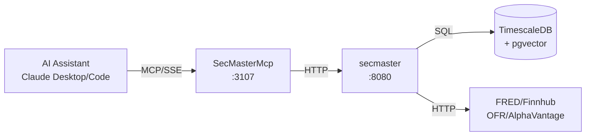

# SecMaster MCP Server

MCP server providing Claude Desktop and Claude Code direct access to ATLAS instrument metadata, semantic search, and data collector management.

## Overview

Exposes SecMaster REST API as MCP tools, enabling AI assistants to search instruments, resolve symbols to data sources, perform semantic searches with vector similarity, ask natural language questions with RAG synthesis, and manage series across all ATLAS data collectors.

## Architecture



## MCP Tools

### Basic Search & Resolution

| Tool Name | Description | Key Parameters |
|-----------|-------------|----------------|
| `search_instruments` | Search by name, symbol, or description | `query`, `asset_class`, `limit` |
| `get_instrument` | Get detailed instrument info by symbol or ID | `identifier` |
| `resolve_source` | Resolve symbol to best data source | `symbol`, `frequency`, `max_lag`, `prefer_collector` |
| `resolve_batch` | Resolve multiple symbols in single request | `symbols`, `frequency` |
| `list_sources` | List all data sources for an instrument | `symbol` |
| `lookup_by_collector_id` | Reverse lookup: collector ID to instrument | `collector`, `source_id` |

### Semantic Search (Vector-based)

| Tool Name | Description | Key Parameters |
|-----------|-------------|----------------|
| `semantic_search` | Search using semantic similarity (768-dim embeddings) | `query`, `min_score`, `limit` |
| `ask_secmaster` | Natural language Q&A with RAG synthesis | `question` |
| `hybrid_resolve` | Multi-strategy: SQL → Fuzzy → Vector → RAG | `query`, `enable_rag`, `min_score`, `limit` |

**How semantic search works:**
- Query converted to 768-dimensional embedding via `nomic-embed-text` model
- Cosine similarity search against instrument embeddings in pgvector
- Results ranked by relevance score (0-1)

**Hybrid resolve strategy:**
1. **SQL**: Exact symbol match
2. **Fuzzy**: pg_trgm text similarity
3. **Vector**: Semantic similarity search
4. **RAG**: Natural language synthesis via `llama3.2:3b`

### Collector Gateway (15 tools)

Unified access to all data collectors with smart routing.

#### Cross-Collector Search

| Tool Name | Description | Key Parameters |
|-----------|-------------|----------------|
| `search_collectors` | Search across all collectors with smart routing | `query`, `limit` |

Smart routing examples:
- "unemployment" → FRED
- "AAPL" → Finnhub
- "repo rates" → OFR
- "gold prices" → AlphaVantage

#### List Series (5 tools - read-only)

| Tool Name | Description |
|-----------|-------------|
| `list_fred_series` | List all active FRED series |
| `list_finnhub_series` | List all active Finnhub series |
| `list_ofr_stfm_series` | List OFR Short-term Funding Monitor series |
| `list_ofr_hfm_series` | List OFR Hedge Fund Monitor series |
| `list_alphavantage_series` | List all active AlphaVantage series |

#### Add Series (3 tools)

| Tool Name | Description | Key Parameters |
|-----------|-------------|----------------|
| `add_fred_series` | Add series to FRED collector | `series_id`, `priority` |
| `add_finnhub_series` | Add series to Finnhub collector | `symbol`, `priority` |
| `add_alphavantage_series` | Add series to AlphaVantage collector | `symbol`, `type`, `title`, `priority` |

#### Toggle Series (3 tools)

| Tool Name | Description | Key Parameters |
|-----------|-------------|----------------|
| `toggle_fred_series` | Toggle FRED series active/inactive | `series_id` |
| `toggle_finnhub_series` | Toggle Finnhub series active/inactive | `series_id` |
| `toggle_alphavantage_series` | Toggle AlphaVantage series active/inactive | `series_id` |

#### Remove Series (3 tools)

| Tool Name | Description | Key Parameters |
|-----------|-------------|----------------|
| `remove_fred_series` | Remove series from FRED collector | `series_id` |
| `remove_finnhub_series` | Remove series from Finnhub collector | `series_id` |
| `remove_alphavantage_series` | Remove series from AlphaVantage collector | `series_id` |

**Note:** OFR series are read-only and managed via configuration files.

### Health

| Tool Name | Description | Key Parameters |
|-----------|-------------|----------------|
| `health` | Get SecMaster service health status | None |

## Configuration

### Environment Variables

| Variable | Default | Description |
|----------|---------|-------------|
| `SECMASTER_API_URL` | `http://secmaster:8080` | Backend service URL |
| `SECMASTER_MCP_LOG_LEVEL` | `Warning` | Logging level |
| `SECMASTER_MCP_TIMEOUT_SECONDS` | `30` | HTTP request timeout |

### Port Mapping

- Internal: 8080
- External (host): 3107
- SSE endpoint: `http://mercury:3107/sse`

## Development

### Build
```bash
.devcontainer/compile.sh
```

### Build Container
```bash
.devcontainer/build.sh
```

## Deployment

```bash
ansible-playbook playbooks/deploy.yml --tags secmaster-mcp
```

## Claude Desktop Integration

Add to `~/.config/Claude/claude_desktop_config.json` (Linux) or `~/Library/Application Support/Claude/claude_desktop_config.json` (macOS):

```json
{
  "mcpServers": {
    "secmaster": {
      "command": "uvx",
      "args": ["mcp-proxy", "http://mercury:3107/sse"]
    }
  }
}
```

Claude Desktop uses stdio transport, so `mcp-proxy` bridges stdio to SSE.

## Usage Examples

**Basic search:**
```
User: "Search for unemployment data"
Claude calls: search_instruments(query="unemployment", asset_class="Economic")
Response: "Found UNRATE: Unemployment Rate (FRED, monthly)"
```

**Semantic search:**
```
User: "What instruments measure job market health?"
Claude calls: semantic_search(query="job market health", min_score=0.6)
Response: "UNRATE (0.89), ICSA (0.81), PAYEMS (0.78)"
```

**Natural language Q&A:**
```
User: "What inflation data is available?"
Claude calls: ask_secmaster(question="What inflation data is available?")
Response: "ATLAS tracks CPI, PCE, and PPI from FRED..."
```

**Smart collector search:**
```
User: "Find repo rate data"
Claude calls: search_collectors(query="repo rates")
Response: "OFR STFM: REPO-DVP-AR-TOT-P, REPO-GCF-AR-TOT-P..."
```

**Manage series:**
```
User: "Add NASDAQ to tracking"
Claude calls: add_finnhub_series(symbol="NDAQ", priority=10)
Response: "Added NDAQ to Finnhub collector"
```

## See Also

- [SecMaster](../SecMaster/README.md) - Backend service documentation
- [FredCollectorMcp](../FredCollectorMcp/README.md) - FRED data access
- [FinnhubMcp](../FinnhubMcp/README.md) - Stock market data access
- [OfrCollectorMcp](../OfrCollectorMcp/README.md) - OFR financial stress data
