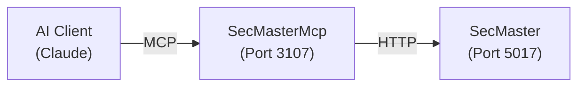

# SecMasterMcp

Model Context Protocol (MCP) server for the SecMaster service - provides AI assistants with tools to search, resolve, and query financial instrument metadata.

## Overview

SecMasterMcp exposes SecMaster's functionality through standardized MCP tools, enabling AI assistants to:
- Search instruments by name, symbol, or natural language
- Resolve symbols to data sources with context-aware routing
- Query instrument metadata and source mappings
- Perform semantic searches using vector similarity
- Ask natural language questions with RAG synthesis

## Architecture



## MCP Tools (10 Tools)

### Basic Search & Resolution

#### `search_instruments`
Search for instruments by name, symbol, or description.

**Parameters:**
- `query` (required): Search query (e.g., 'unemployment', 'AAPL')
- `asset_class` (optional): Filter by asset class (Economic, Equity, Commodity, Index, Currency, Rate)
- `limit` (optional): Maximum results (default: 20)

**Example:**
```json
{
  "query": "unemployment",
  "asset_class": "Economic",
  "limit": 10
}
```

#### `get_instrument`
Get detailed information about an instrument by symbol or ID.

**Parameters:**
- `identifier` (required): Symbol like 'UNRATE' or UUID

**Returns:** Full instrument details including source mappings, aliases, and external identifiers (FIGI, CUSIP, SEDOL, ISIN).

#### `resolve_source`
Resolve a symbol to the best data source based on context.

**Parameters:**
- `symbol` (required): Symbol to resolve
- `frequency` (optional): Required frequency (any, intraday, daily, weekly, monthly, quarterly, annual)
- `max_lag` (optional): Maximum publication lag in days
- `prefer_collector` (optional): Preferred collector name

**Returns:** Resolved source with alternatives.

#### `resolve_batch`
Resolve multiple symbols in a single request.

**Parameters:**
- `symbols` (required): Comma-separated list (e.g., 'UNRATE,SOFR,GDP')
- `frequency` (optional): Required frequency

#### `list_sources`
List all data sources available for an instrument.

**Parameters:**
- `symbol` (required): Symbol to look up

#### `lookup_by_collector_id`
Reverse lookup: find instrument by collector-specific ID.

**Parameters:**
- `collector` (required): Collector name (e.g., 'FredCollector')
- `source_id` (required): Collector-specific ID (e.g., 'UNRATE')

### Semantic Search (Vector-based)

#### `semantic_search`
Search instruments using semantic similarity - understands natural language queries.

**Parameters:**
- `query` (required): Natural language query (e.g., 'economic indicator for job market health', 'inflation measures')
- `min_score` (optional): Minimum similarity score 0-1 (default: 0.5, higher = more relevant)
- `limit` (optional): Maximum results (default: 10)

**Example:**
```json
{
  "query": "What measures stock market volatility?",
  "min_score": 0.6,
  "limit": 5
}
```

**How it works:** Converts query to 768-dimensional embedding using `nomic-embed-text` model, then performs cosine similarity search against instrument embeddings in pgvector.

#### `ask_secmaster`
Ask a natural language question and get a synthesized answer using RAG.

**Parameters:**
- `question` (required): Question about instruments (e.g., 'What data do you have for tracking inflation?')

**Returns:** Synthesized answer from `llama3.2:3b` model with relevant instrument matches.

**Example:**
```json
{
  "question": "Which instruments measure unemployment?"
}
```

#### `hybrid_resolve`
Advanced resolution using multi-strategy approach: SQL → Fuzzy → Vector → RAG.

**Parameters:**
- `query` (required): Can be exact symbol or natural language
- `enable_rag` (optional): Enable RAG synthesis for ambiguous queries (default: true)
- `min_score` (optional): Minimum vector similarity 0-1 (default: 0.5)
- `limit` (optional): Maximum vector results (default: 5)

**Resolution Strategy:**
1. **SQL**: Try exact symbol match
2. **Fuzzy**: Try fuzzy text search (pg_trgm)
3. **Vector**: Semantic similarity search
4. **RAG**: Natural language synthesis if no clear match

**Returns:** Resolution with method used (sql/fuzzy/vector/rag) and relevant results.

### Health

#### `health`
Get SecMaster service health status.

**Returns:** Health status and check results.

## Port Mapping

- Internal: 8080
- External (host): 3107
- SSE endpoint: http://mercury:3107/sse

## Configuration

### Environment Variables

```bash
SECMASTER_API_URL=http://secmaster:8080
SECMASTER_MCP_LOG_LEVEL=Warning
SECMASTER_MCP_TIMEOUT_SECONDS=30
```

### Connection

SSE endpoint: `http://mercury:3107/sse`

## Development

### Build
```bash
SecMasterMcp/.devcontainer/compile.sh
```

### Build Container
```bash
SecMasterMcp/.devcontainer/build.sh
```

### Deploy
```bash
ansible-playbook playbooks/deploy.yml --tags secmaster-mcp -i inventory/hosts.yml
```

## Usage with Claude Desktop

Add to Claude Desktop config (`~/Library/Application Support/Claude/claude_desktop_config.json` on macOS):

```json
{
  "mcpServers": {
    "secmaster": {
      "command": "uvx",
      "args": ["mcp-proxy", "http://mercury:3107/sse"]
    }
  }
}
```

Claude Desktop doesn't natively support SSE transport, so `mcp-proxy` bridges stdio↔SSE.

## Example Interactions

### Basic Search
```
User: Search for unemployment data
Tool: search_instruments(query="unemployment", asset_class="Economic")
```

### Semantic Search
```
User: What instruments measure job market health?
Tool: semantic_search(query="job market health", min_score=0.6)
```

### Natural Language Query
```
User: What inflation data is available?
Tool: ask_secmaster(question="What inflation data is available?")
```

### Hybrid Resolution
```
User: Find data for treasury yields
Tool: hybrid_resolve(query="treasury yields", enable_rag=true)
```

## Integration with SecMaster

SecMasterMcp is a thin wrapper that:
1. Exposes SecMaster REST API as MCP tools
2. Handles parameter validation and error handling
3. Formats responses for AI consumption
4. Maps HTTP status codes to appropriate MCP responses

All data comes directly from SecMaster - SecMasterMcp maintains no state.

## Observability

SecMasterMcp emits OpenTelemetry traces for all tool invocations, forwarded to the ATLAS observability stack (Tempo/Loki/Prometheus/Grafana).

## See Also

- [SecMaster README](../SecMaster/README.md) - Core service documentation
- [MCP Specification](https://modelcontextprotocol.io) - Model Context Protocol
