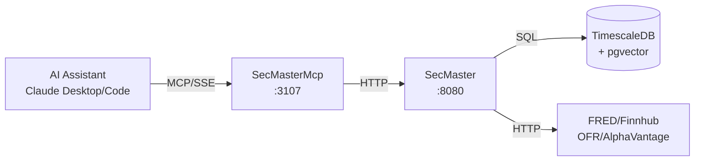

# SecMasterMcp

MCP server exposing ATLAS instrument metadata, semantic search, and data collector management to AI assistants.

## Overview

SecMasterMcp provides Claude Desktop and Claude Code direct access to the SecMaster security master database via MCP (Model Context Protocol). It enables searching instruments, resolving symbols to data sources, performing semantic similarity searches with vector embeddings, asking natural language questions via RAG synthesis, and managing series across all ATLAS data collectors.

## Architecture



## MCP Tools

### Basic Search and Resolution

| Tool | Description | Key Parameters |
|------|-------------|----------------|
| `search_instruments` | Search by name, symbol, description | `query`, `asset_class`, `limit` |
| `search_catalog` | Search with optional upstream discovery | `query`, `discover`, `asset_class` |
| `get_instrument` | Get instrument details by symbol/ID | `identifier` |
| `resolve_source` | Resolve symbol to best data source | `symbol`, `frequency`, `max_lag` |
| `resolve_batch` | Resolve multiple symbols | `symbols`, `frequency` |
| `list_sources` | List all sources for an instrument | `symbol` |
| `lookup_by_collector_id` | Reverse lookup by collector ID | `collector`, `source_id` |
| `promote_instrument` | Promote discovered to active collection | `instrument_id`, `collector` |

### Semantic Search (Vector-based)

| Tool | Description | Key Parameters |
|------|-------------|----------------|
| `semantic_search` | Search via 768-dim embeddings | `query`, `min_score`, `limit`, `discover` |
| `ask_secmaster` | Natural language Q&A with RAG | `question` |
| `hybrid_resolve` | SQL -> Fuzzy -> Vector -> RAG | `query`, `enable_rag`, `min_score` |

**Hybrid resolve strategy:**
1. SQL exact symbol match
2. pg_trgm fuzzy text similarity
3. pgvector semantic similarity
4. RAG synthesis via llama3.2:3b

### Collector Gateway

| Tool | Description |
|------|-------------|
| `search_collectors` | Smart-routed search across all collectors |
| `list_fred_series` | List active FRED series |
| `list_finnhub_series` | List active Finnhub series |
| `list_ofr_stfm_series` | List OFR Short-term Funding series |
| `list_ofr_hfm_series` | List OFR Hedge Fund Monitor series |
| `list_alphavantage_series` | List active AlphaVantage series |
| `add_fred_series` | Add FRED series |
| `add_finnhub_series` | Add Finnhub series |
| `add_alphavantage_series` | Add AlphaVantage series |
| `toggle_fred_series` | Toggle FRED series active/inactive |
| `toggle_finnhub_series` | Toggle Finnhub series |
| `toggle_alphavantage_series` | Toggle AlphaVantage series |
| `remove_fred_series` | Remove FRED series |
| `remove_finnhub_series` | Remove Finnhub series |
| `remove_alphavantage_series` | Remove AlphaVantage series |
| `health` | Service health status |

## Configuration

| Variable | Default | Description |
|----------|---------|-------------|
| `SECMASTER_API_URL` | `http://secmaster:8080` | Backend service URL |
| `SECMASTER_MCP_LOG_LEVEL` | `Warning` | Logging level |
| `SECMASTER_MCP_TIMEOUT_SECONDS` | `30` | HTTP request timeout |

### Port Mapping

- Internal: 8080
- External (host): 3107
- SSE endpoint: `http://mercury:3107/sse`

## Project Structure

```
SecMasterMcp/
├── .devcontainer/
│   ├── build.sh           # Container build script
│   ├── compile.sh         # Compile and test
│   └── compose.yaml       # Dev container compose
├── src/
│   ├── Client/
│   │   ├── ISecMasterClient.cs
│   │   ├── SecMasterClient.cs
│   │   └── Models/SecMasterModels.cs
│   ├── Tools/
│   │   └── SecMasterTools.cs
│   ├── Program.cs
│   ├── SecMasterMcp.csproj
│   └── Containerfile
└── README.md
```

## Development

### Prerequisites

- .NET 9 SDK
- VS Code with Dev Containers extension

### Build

```bash
.devcontainer/compile.sh
```

### Build Container

```bash
.devcontainer/build.sh
```

## Deployment

```bash
ansible-playbook playbooks/deploy.yml --tags secmaster-mcp
```

## Claude Desktop Integration

Add to `~/.config/Claude/claude_desktop_config.json` (Linux) or `~/Library/Application Support/Claude/claude_desktop_config.json` (macOS):

```json
{
  "mcpServers": {
    "secmaster": {
      "command": "uvx",
      "args": ["mcp-proxy", "http://mercury:3107/sse"]
    }
  }
}
```

Claude Desktop uses stdio transport, so `mcp-proxy` bridges stdio to SSE.

## Usage Examples

**Basic search:**
```
User: "Search for unemployment data"
Claude calls: search_instruments(query="unemployment", asset_class="Economic")
```

**Semantic search:**
```
User: "What instruments measure job market health?"
Claude calls: semantic_search(query="job market health", min_score=0.6)
```

**Natural language Q&A:**
```
User: "What inflation data is available?"
Claude calls: ask_secmaster(question="What inflation data is available?")
```

**Smart collector search:**
```
User: "Find repo rate data"
Claude calls: search_collectors(query="repo rates")
```

**Manage series:**
```
User: "Add NASDAQ to tracking"
Claude calls: add_finnhub_series(symbol="NDAQ", priority=10)
```

## See Also

- [SecMaster](../SecMaster/README.md) - Backend service
- [FredCollectorMcp](../FredCollectorMcp/README.md) - FRED data access
- [FinnhubMcp](../FinnhubMcp/README.md) - Stock market data
- [OfrCollectorMcp](../OfrCollectorMcp/README.md) - OFR financial stress data
