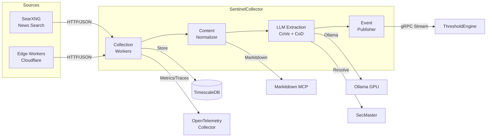

# SentinelCollector

Alternative data collection and LLM-powered extraction service for ATLAS.

## Overview

SentinelCollector collects unstructured web content from news sources via SearXNG and edge workers, then uses LLM-powered extraction (Chain of Verification + Chain of Density) to identify economic data points. Extracted observations are resolved against SecMaster and streamed to downstream consumers via gRPC. The service handles content normalization, epistemic certainty classification, and context summarization for RAG consumption.

## Architecture



## Features

- **SearXNG Collection**: Scheduled news search across Google, Bing, and DuckDuckGo for economic indicator keywords
- **Edge Sync**: Pulls content from Cloudflare edge workers for low-latency web capture
- **Content Normalization**: Converts HTML/PDF to markdown via Markitdown MCP for consistent LLM input
- **Chain of Verification (CoVe)**: Multi-pass LLM extraction with self-verification to reduce hallucinations
- **Chain of Density (CoD)**: Progressive summarization for context-rich RAG embeddings
- **Epistemic Classification**: Categorizes certainty (Definite, Expected, Speculative, Conditional)
- **SecMaster Resolution**: Maps extracted descriptions to canonical instrument IDs via semantic search
- **Event Streaming**: Real-time gRPC streams of high-confidence observations for ThresholdEngine
- **Polly Resilience**: Circuit breakers and retry policies for all external HTTP calls
- **Full Observability**: OpenTelemetry instrumentation (metrics, traces, logs to OTLP)

## Configuration

| Variable | Description | Default |
|----------|-------------|---------|
| `ConnectionStrings__AtlasDb` | PostgreSQL connection string | **Required** |
| `Extraction__OllamaEndpoint` | Ollama API endpoint | `http://ollama-gpu:11434` |
| `Extraction__Model` | LLM model for extraction | `qwen2.5:32b-instruct` |
| `Extraction__TimeoutSeconds` | LLM request timeout | `120` |
| `EdgeSync__Endpoint` | Edge worker sync endpoint | **Required** |
| `EdgeSync__ApiKey` | Edge worker API key | **Required** |
| `EdgeSync__PollIntervalSeconds` | Sync polling interval | `300` |
| `Searxng__Endpoint` | SearXNG instance URL | `http://searxng:8888` |
| `Searxng__PollIntervalMinutes` | Search polling interval | `60` |
| `SecMaster__Endpoint` | SecMaster API endpoint | `http://secmaster:8080` |
| `Markitdown__Endpoint` | Markitdown MCP endpoint | `http://markitdown-mcp:3102` |
| `OpenTelemetry__OtlpEndpoint` | OTLP collector endpoint | `http://otel-collector:4317` |

## API Endpoints

### REST API

| Endpoint | Method | Description |
|----------|--------|-------------|
| `/admin/stats` | GET | Collection and extraction statistics |
| `/admin/sources` | GET | Content sources with counts and last collection time |
| `/admin/recent` | GET | Recent raw content items (query: limit) |
| `/admin/observations` | GET | Recent extracted observations (query: limit) |
| `/health` | GET | Health check with component status |
| `/health/ready` | GET | Readiness check (database, Ollama) |
| `/health/live` | GET | Liveness check |
| `/swagger` | GET | OpenAPI documentation (dev only) |

### gRPC API

**Service**: `ObservationEventStream` (port 5001)

| Method | Description |
|--------|-------------|
| `SubscribeToEvents` | Stream events in real-time from checkpoint |
| `GetEventsSince` | Replay events from timestamp (supports limit) |
| `GetEventsBetween` | Get events in time range |
| `GetLatestEventTime` | Get timestamp of latest event |
| `GetHealth` | Health check with event statistics |

## Project Structure

```
SentinelCollector/
├── src/
│   ├── Configuration/         # Options classes (EdgeSync, Extraction, Searxng, etc.)
│   ├── Data/                  # EF Core DbContext, repositories, migrations
│   ├── Endpoints/             # Minimal API endpoints (AdminEndpoints)
│   ├── Entities/              # Domain models (RawContent, ExtractedObservation, EventEntity)
│   ├── Extraction/            # LLM extraction (ChainOfVerification, ChainOfDensity, prompts)
│   ├── Grpc/                  # gRPC service and repositories (EventStreamService)
│   ├── HealthChecks/          # Database and Ollama health checks
│   ├── Publishers/            # Event publisher for gRPC stream
│   ├── Services/              # HTTP clients (Ollama, SecMaster, SearXNG, EdgeSync, Markitdown)
│   ├── Telemetry/             # OpenTelemetry meters and activity sources
│   ├── Workers/               # Background workers (EdgeSyncWorker, ExtractionProcessor, SearxngCollectionScheduler)
│   ├── prompts/               # LLM prompt templates (extraction, density)
│   ├── Program.cs             # Application entry point
│   ├── DependencyInjection.cs # Service registration
│   └── Containerfile          # Multi-stage container build
├── tests/
│   └── SentinelCollector.UnitTests/     # Unit tests
└── .devcontainer/             # VS Code dev container
```

## Development

### Using Dev Container

```bash
# Open in VS Code and select "Reopen in Container"
cd /workspace/SentinelCollector/src
dotnet run
```

### Compile

```bash
.devcontainer/compile.sh
```

### Build Container Image

```bash
.devcontainer/build.sh
```

### Run LLM Benchmarks

See `/LlmBenchmark` at the repo root for LLM accuracy benchmarks.

## Deployment

```bash
ansible-playbook playbooks/deploy.yml --tags sentinel-collector
```

## Ports

| Port | Type | Description |
|------|------|-------------|
| 8080 | HTTP (container) | REST API, health checks, Swagger |
| 5001 | HTTP/2 (container) | gRPC event stream |

## See Also

- [ThresholdEngine](../ThresholdEngine/README.md) - Consumes observation events
- [SecMaster](../SecMaster/README.md) - Instrument resolution and catalog
- [Events](../Events/README.md) - Shared gRPC event contracts
