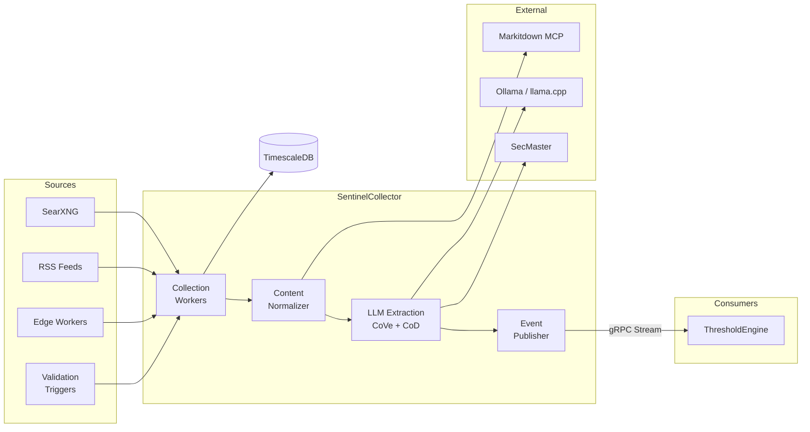

# SentinelCollector

Alternative data collection and LLM-powered extraction service for ATLAS.

## Overview

SentinelCollector collects unstructured web content from news sources via SearXNG, RSS feeds, and Cloudflare edge workers, then uses LLM-powered extraction (Chain of Verification + Chain of Density) to identify economic data points. Extracted observations are resolved against SecMaster and streamed to downstream consumers via gRPC. The service includes a review UI for human-in-the-loop verification and validation triggers that fire targeted searches when upstream data releases or threshold crossings occur.

## Architecture



Collection workers ingest content from multiple sources, normalize it to markdown, extract observations via LLM, resolve against SecMaster, and publish events over gRPC for ThresholdEngine consumption.

## Features

- **SearXNG Collection**: Scheduled news search across configurable engines with daily, weekly, and market-hours schedules
- **RSS Feed Collection**: Configurable RSS/Atom feed polling with per-feed intervals and category tagging
- **Edge Sync**: Pulls content from Cloudflare edge workers for low-latency web capture
- **Validation Triggers**: Automated searches triggered by data releases or threshold crossings for counter-narrative discovery
- **Content Normalization**: Converts HTML/PDF to markdown via Markitdown MCP for consistent LLM input
- **Chain of Verification (CoVe)**: Multi-pass LLM extraction with self-verification to reduce hallucinations
- **Chain of Density (CoD)**: Progressive summarization for context-rich RAG embeddings
- **Epistemic Classification**: Categorizes certainty (Definite, Expected, Speculative, Conditional)
- **SecMaster Resolution**: Maps extracted descriptions to canonical instrument IDs via semantic search
- **Review UI**: Browser-based human review queue with approve/reject/skip and inline corrections
- **Event Streaming**: Real-time gRPC streams of observations for ThresholdEngine
- **Dual LLM Backend**: Supports Ollama and llama.cpp server backends with dynamic per-request timeouts

## Configuration

| Variable | Description | Default |
|----------|-------------|---------|
| `ConnectionStrings__AtlasDb` | PostgreSQL connection string | **Required** |
| `Extraction__Backend` | LLM backend (`Ollama` or `LlamaServer`) | `LlamaServer` |
| `Extraction__OllamaEndpoint` | Ollama API endpoint | `http://ollama-gpu:11434` |
| `Extraction__LlamaServerEndpoint` | llama.cpp server endpoint | `http://llama-server:8080` |
| `Extraction__Model` | LLM model for extraction | `sentinel-extraction-v5` |
| `Extraction__ContextWindowSize` | LLM context window size | `32768` |
| `EdgeSync__Endpoint` | Edge worker sync endpoint | **Required** |
| `EdgeSync__ApiKey` | Edge worker API key | **Required** |
| `EdgeSync__PollIntervalSeconds` | Sync polling interval | `300` |
| `Searxng__Endpoint` | SearXNG instance URL | `https://searxng.elasticdevelopment.com` |
| `Searxng__ScheduleTimes` | Scheduled collection times (JSON array) | `["09:30","12:00","16:00","22:00"]` |
| `SecMaster__Endpoint` | SecMaster API endpoint | `http://secmaster:8080` |
| `Markitdown__Endpoint` | Markitdown MCP endpoint | `http://markitdown-mcp:3102` |
| `OpenTelemetry__OtlpEndpoint` | OTLP collector endpoint | `http://otel-collector:4317` |

## API Endpoints

### REST API (Port 8080)

| Endpoint | Method | Description |
|----------|--------|-------------|
| `/admin/stats` | GET | Collection and extraction statistics |
| `/admin/sources` | GET | Content sources with counts and last collection time |
| `/admin/recent` | GET | Recent raw content items (query: `limit`) |
| `/admin/observations` | GET | Recent extracted observations (query: `limit`) |
| `/admin/queries` | CRUD | Manage SearXNG search queries |
| `/admin/retention` | CRUD | Manage data retention policies |
| `/admin/review` | GET | Review queue with filtering and pagination |
| `/admin/review/{id}/approve` | POST | Approve an observation |
| `/admin/review/{id}/reject` | POST | Reject an observation |
| `/admin/review/backfill-resolution` | POST | Backfill SecMaster resolution for unresolved observations |
| `/admin/rss-feeds` | CRUD | Manage RSS feed subscriptions |
| `/admin/validation-triggers` | CRUD | Manage validation trigger rules |
| `/ui/review` | GET | Browser-based review UI |
| `/health` | GET | Health check with component status |
| `/health/ready` | GET | Readiness check (database, Ollama) |
| `/health/live` | GET | Liveness check |

### gRPC API (Port 5001)

| Service | Method | Description |
|---------|--------|-------------|
| `ObservationEventStream` | `SubscribeToEvents` | Stream events in real-time from checkpoint |
| `ObservationEventStream` | `GetEventsSince` | Replay events from timestamp |
| `ObservationEventStream` | `GetEventsBetween` | Get events in time range |
| `ObservationEventStream` | `GetLatestEventTime` | Get timestamp of latest event |
| `ObservationEventStream` | `GetHealth` | Health check with event statistics |

## Project Structure

```
SentinelCollector/
├── src/
│   ├── Configuration/    # Options classes (EdgeSync, Extraction, Searxng, etc.)
│   ├── Data/             # EF Core DbContext, repositories, migrations
│   ├── Endpoints/        # Minimal API endpoints (Admin, ReviewUI)
│   ├── Entities/         # Domain models (RawContent, ExtractedObservation, etc.)
│   ├── Extraction/       # LLM extraction (CoVe, CoD, prompts, chunking)
│   ├── Grpc/             # gRPC service and repositories
│   ├── HealthChecks/     # Database and Ollama health checks
│   ├── Publishers/       # Event publisher for gRPC stream
│   ├── Services/         # HTTP clients (Ollama, LlamaServer, SecMaster, SearXNG, etc.)
│   ├── Telemetry/        # OpenTelemetry meters and activity sources
│   ├── Workers/          # Background workers (EdgeSync, Extraction, SearXNG, RSS, Validation)
│   └── prompts/          # LLM prompt templates and source-specific prompts
├── tests/
│   └── SentinelCollector.UnitTests/
├── scripts/              # Training data generation and QLoRA fine-tuning
└── .devcontainer/        # Dev container config
```

## Development

### Using Dev Container

```bash
# Open in VS Code and select "Reopen in Container"
cd /workspace/SentinelCollector/src
dotnet run
```

### Compile

```bash
.devcontainer/compile.sh
```

### Build Container Image

```bash
.devcontainer/build.sh
```

## Deployment

```bash
ansible-playbook playbooks/deploy.yml --tags sentinel-collector
```

## Ports

| Port | Type | Description |
|------|------|-------------|
| 8080 | HTTP (container) | REST API, health checks, review UI, Swagger |
| 5001 | HTTP/2 (container) | gRPC event stream |

## See Also

- [ThresholdEngine](../ThresholdEngine/README.md) - Consumes observation events via gRPC
- [SecMaster](../SecMaster/README.md) - Instrument resolution and catalog
- [Events](../Events/README.md) - Shared gRPC event contracts
- [LlmBenchmark](../LlmBenchmark/README.md) - LLM accuracy benchmarks for extraction
