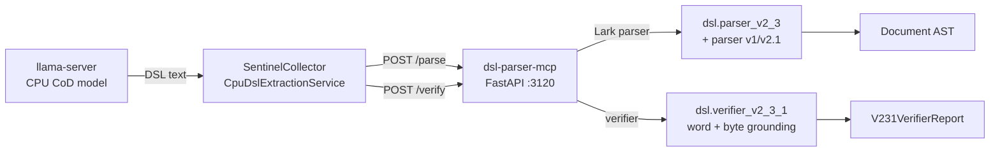

# dsl-parser-mcp

CPU sidecar that wraps the benchmark CoD DSL parser + v2.3.1 verifier behind a FastAPI HTTP surface so the production .NET SentinelCollector can ground extractions on the exact same parse + word/byte verifier the benchmark scorer uses.

## Overview

A small Python FastAPI process (port `3120`) running in its own container. It exposes four endpoints — `POST /parse`, `POST /parse_json`, `POST /verify`, `GET /health` — and is consumed by `SentinelCollector.Services.DslParserClient` (`SentinelCollector/src/Services/DslParserClient.cs`). `/parse` serves the CPU GBNF DSL path (`CpuDslExtractionService`, `Extraction__Backend=LlamaServerDsl`); `/parse_json` serves the additive GPU JSON-CoD role-flip path (plan gpu-json-cod-rollout-2026-06-09.md, retired; recover via tag gpu-cod-roleflip-2026-06-09) — both lower to the **same** `Document` AST so `/verify` and everything downstream are format-agnostic.

The parser/verifier source under `dsl/` originated as a verbatim copy of the benchmark tree `docs/benchmarks/cod-2026-05-17/dsl/` (retired from main 2026-06-11 — `dsl/` here is now the canonical copy; the original is recoverable via `git show dsl-poc-phase5-done:docs/benchmarks/cod-2026-05-17/dsl/<file>`). Re-implementing the Lark/LALR parser + punctuation-tolerant word verifier in C# would fork the grounding contract; the sidecar exists to avoid that fork.

## Architecture



`SentinelCollector` calls `/parse` with the raw DSL emitted by the CoD model, then calls `/verify` with the returned AST plus the source article text to obtain a per-block grounding verdict. The sidecar is stateless and CPU-only (no model, no GPU dependency).

## Features

- **Wraps the benchmark parser/verifier verbatim**: no port, no re-implementation drift between sidecar and benchmark scorer
- **Three DSL schema versions**: `v1` (§6 grammar), `v2.1` (no-offset probe), `v2.3` (word-grounding supplement, default)
- **v2.3.1 verifier**: punctuation-tolerant word matching with dash unification, HTML entity decoding, sub-word concatenation tolerance, plus byte-verbatim grounding
- **Strict parse errors as data**: `ParseError` returns HTTP 200 with `parse_errors[]` (line/column/symbol/message) so a malformed LLM emission is inspectable, not a 5xx
- **Boundary 4xx vs 5xx**: malformed `document_ast` on `/verify` returns 422; unexpected parser/verifier exceptions are logged with context and surface as 500 so the caller's retry/circuit-breaker engages
- **Tests gate the build**: `pytest -q /app/tests` runs inside `Containerfile`; failures fail the image build

## Configuration

This sidecar has no runtime environment variables — it is pure-Python and listens on a fixed port. All caller-side configuration lives in `SentinelCollector` (see `CpuCodOptions.DslParserEndpoint`, set to `http://dsl-parser-mcp:3120` in `compose.yaml`).

## API Endpoints

### REST API (Port 3120)

| Endpoint | Method | Description |
|----------|--------|-------------|
| `/parse` | POST | Parse GBNF DSL text into a `Document` AST; returns AST + any parse errors |
| `/parse_json` | POST | Lower a GPU JSON-CoD payload into the SAME `Document` AST; returns AST + salvage warnings |
| `/verify` | POST | Run the v2.3.1 verifier over a `Document` AST against the source article |
| `/health` | GET | Liveness check; 200 OK when parser + verifier modules imported cleanly |

#### `POST /parse`

Request (pydantic `ParseRequest`):

```json
{
  "dsl_text": "DSL: v2.3\nSOURCE: ...\nTIMESTAMP: ...\n\nENT ...",
  "input_text": "Source article body text",
  "schema": "v2.3"
}
```

- `dsl_text` (required): DSL document text emitted by the LLM
- `input_text` (default `""`): source article text — required for v2.x grounding-rate computation, optional for parse-only callers
- `schema` (default `"v2.3"`): one of `"v1"`, `"v2.1"`, `"v2.3"`

Response (pydantic `ParseResponse`):

```json
{
  "document_ast": { "dsl_version": "v2.3", "source": "...", "timestamp": "...", "ents": [...], "nums": [...], "evts": [...], "claims": [...], "notes": [...] },
  "parse_errors": []
}
```

Strict-parse failures land in `parse_errors[]` with `message`, `line`, `column`, `symbol`. The shape of `document_ast` mirrors `dataclasses.asdict(Document)` from `dsl/types.py` exactly.

#### `POST /parse_json`

Additive sibling of `/parse` for the GPU-JSON-CoD role-flip (plan gpu-json-cod-rollout-2026-06-09.md §2, retired; recover via tag gpu-cod-roleflip-2026-06-09). The GPU vLLM CoD stage emits a single bounded JSON object (`{article_type, entities[], numbers[], events[], claims[]}`, schema mirrors `/tmp/sentinel-remediation/json-cod-quality/json_schema.py`) instead of GBNF DSL text. This endpoint lowers that JSON into the **same** `Document` AST `/parse` produces (`json_cod.parse_json_cod`), so `/verify`, the .NET `IDslToMergedExtractionAdapter`, and every downstream consumer are format-agnostic and unchanged.

Request (pydantic `ParseJsonRequest`):

```json
{
  "json_text": "{\"article_type\":\"earnings_announcement\",\"entities\":[...],\"numbers\":[...],\"events\":[...],\"claims\":[...]}",
  "input_text": "Source article body text"
}
```

- `json_text` (required): the raw JSON-CoD object. May be a truncated prefix (loop-guard `max_tokens` cutoff) — complete objects are salvaged.
- `input_text` (default `""`): source article text, used to locate each verbatim copy slot's `[start,end)` `source_span`. Empty → every `source_span` is `None` (the verifier safe-degrades to its `expected in input_text` byte fallback).

Response is the same `ParseResponse` shape `/parse` returns (`document_ast` + `parse_errors`), so the .NET `DslParserClient` reuses its deserialization.

`parse_errors` semantics (HTTP 200, surface-as-data):
- Truncated payload salvaged: `{"reason": "json_truncated_salvaged", "recovered_objects": N}`
- Valid JSON dict without any CoD array keys (LLM refusal/garbage, e.g. `{}` or `{"error":"refused"}`): `{"reason": "json_no_cod_arrays"}` — distinguishable from a legitimately-empty article (all four arrays present but empty → `parse_errors: []`)
- Normal CoD document (all four arrays present): `parse_errors: []`

Non-200: non-JSON text (neither valid nor salvageable prefix) → 422; unexpected lowering crash → 500.

**Span location.** JSON-CoD emits verbatim copy slots (entity `name`, num `source_text`, event `trigger`) but no `[start,end)` offset. The lowering finds each slot's first verbatim occurrence in `input_text` and emits the half-open `(start, end)` tuple the verifier's `_check_byte` expects (`input_text[start:end] == slot`). Word-grounding parity is preserved by synthesizing the v2.3 `source_words` slot (`|`-delimited words) from the same copy text. `/parse` (GBNF) is untouched — both endpoints coexist.

#### `POST /verify`

Request (pydantic `VerifyRequest`):

```json
{
  "document_ast": { "...": "shape from /parse" },
  "input_text": "Source article body text"
}
```

Response (pydantic `VerifyResponse`):

```json
{
  "verifier_report": {
    "blocks": [
      {
        "block_kind": "NUM",
        "block_id": "...",
        "byte_checked": true,
        "byte_match": true,
        "word_checked": true,
        "word_match": true,
        "word_match_cased": true,
        "failures": [],
        "line": 7
      }
    ],
    "byte_verbatim_match_rate": 0.92,
    "word_verbatim_match_rate": 0.97,
    "word_verbatim_match_rate_cased": 0.94,
    "byte_denom": 41,
    "word_denom": 41
  },
  "version": "v2_3_1"
}
```

The `verifier_report` shape mirrors `dataclasses.asdict(V231VerifierReport)` from `dsl/verifier_v2_3_1.py`. Malformed `document_ast` → 422; unexpected verifier exception → 500.

#### `GET /health`

```json
{ "ok": true, "parser": "ready", "verifier": "v2_3_1" }
```

Returns 200 when parser + verifier modules imported cleanly at startup. If either import had failed the process would not have come up to serve this endpoint, so a 200 means the runtime is healthy.

## Project Structure

```
dsl-parser-mcp/
├── app.py                  # FastAPI app: /parse, /parse_json, /verify, /health
├── json_cod.py             # GPU JSON-CoD → Document AST lowering (additive; targets dsl/'s AST)
├── Containerfile           # python:3.11-slim, COPYs dsl/ + tests/ + app.py + json_cod.py
├── requirements.txt        # fastapi, uvicorn, lark, pydantic, httpx, pytest
├── dsl/                    # canonical parser/verifier source (originated from the retired benchmark tree)
│   ├── __init__.py
│   ├── parser.py           # v1 + v2 + v2.1 Lark parsers
│   ├── parser_v2_3.py      # v2.3 parser (word-grounding supplement)
│   ├── verifier.py         # v1/v2 verifier
│   ├── verifier_v2_3_1.py  # v2.3.1 punctuation-tolerant word + byte verifier
│   ├── types.py            # Document / ENT / NUM / EVT / CLAIM / NOTE / Slot dataclasses
│   ├── grammar*.lark       # Lark grammars per schema version
│   └── cli.py
└── tests/
    ├── test_parser.py            # v1 parser unit tests
    ├── test_parser_v2.py         # v2 parser unit tests
    ├── test_verifier.py          # v1/v2 verifier unit tests
    ├── test_verifier_v2_3_1.py   # v2.3.1 verifier unit tests
    ├── test_api.py               # FastAPI integration tests (/health, /parse, /verify)
    └── test_parse_json.py        # /parse_json + json_cod lowering, span-locator, salvage tests
```

Python dependencies (`requirements.txt`): `fastapi==0.115.6`, `uvicorn[standard]==0.32.1`, `lark==1.2.2`, `pydantic==2.9.2`, `httpx==0.27.2`, `pytest==8.3.3`. No native build deps — Lark + FastAPI are pure Python.

## Development

### Run locally

```sh
nerdctl run -p 3120:3120 dsl-parser-mcp:latest
curl http://localhost:3120/health
```

### Build Container

```sh
sudo nerdctl build -t dsl-parser-mcp:latest -f SentinelCollector/dsl-parser-mcp/Containerfile .
```

The build context must be the monorepo root because the `Containerfile` `COPY`s from `SentinelCollector/dsl-parser-mcp/`.

### Tests

`pytest -q /app/tests` runs inside the `Containerfile` after `pip install`. Build fails if any test fails. The integration tests in `tests/test_api.py` use Starlette's `TestClient` against the in-process FastAPI app and reuse fixtures from `test_verifier_v2_3_1.py` so the integration ground-truth matches the benchmark verifier unit tests.

## Deployment

```sh
cd deployment/ansible
ansible-playbook playbooks/deploy.yml --tags dsl-parser-mcp,build
```

Ansible runs `nerdctl build -t dsl-parser-mcp:latest -f SentinelCollector/dsl-parser-mcp/Containerfile .` from the monorepo root, then `compose up -d` picks up the rebuilt image. The compose stanza (`/opt/ai-inference/compose.yaml`) caps the container at 512 MB / 2 CPUs and ships a curl `/health` healthcheck (30 s interval, 5 s timeout, 15 s start period, 3 retries).

## Ports

| Port | Description |
|------|-------------|
| 3120 | REST API (host-mapped `3120:3120`) — `/parse`, `/verify`, `/health` |

Host-mapped (not internal-only) so the sidecar can be probed directly during dev / debugging. Production callers (sentinel-collector container) reach it as `http://dsl-parser-mcp:3120` over the compose network.

## Consumers

- `SentinelCollector/src/Services/DslParserClient.cs` — typed `HttpClient` (snake_case JSON, Polly retry + circuit breaker, OTEL `Activity` per call) wired in `SentinelCollector/src/DependencyInjection.cs`
- `SentinelCollector/src/Services/CpuDslExtractionService.cs` — CPU CoD extraction service that calls `/parse` then `/verify`; enabled by `Extraction__Backend=LlamaServerDsl`

The C# wire types (`DocumentAst`, `DslEnt`/`DslNum`/`DslEvt`/`DslClaim`/`DslNote`, `DslSlot`, `VerifierReport`) live in `SentinelCollector/src/Models/Dsl/DslAst.cs` and mirror the Python `dataclasses.asdict` shape via `JsonPropertyName` attributes. Unknown sidecar fields are ignored on deserialization, so a benign Python-side addition does not break the .NET parse.

## Known Follow-ups

- **`schema` pydantic field name shadow**: `ParseRequest.schema` triggers `pydantic` `UserWarning: Field name "schema" in "ParseRequest" shadows an attribute in parent "BaseModel"` at app import. Cosmetic only — the field works correctly and the C# client sends `"schema"` verbatim. Rename to e.g. `dsl_schema` (with `alias="schema"` for wire compat) when next touching the contract.

## See Also

- [`SentinelCollector/README.md`](../README.md) — parent service overview
- `dsl/` (this directory) — canonical parser/verifier source; originated from the benchmark tree `docs/benchmarks/cod-2026-05-17/dsl/` (retired to git history, tag `dsl-poc-phase5-done`)
- [`SentinelCollector/src/Services/DslParserClient.cs`](../src/Services/DslParserClient.cs) — .NET consumer of this sidecar
