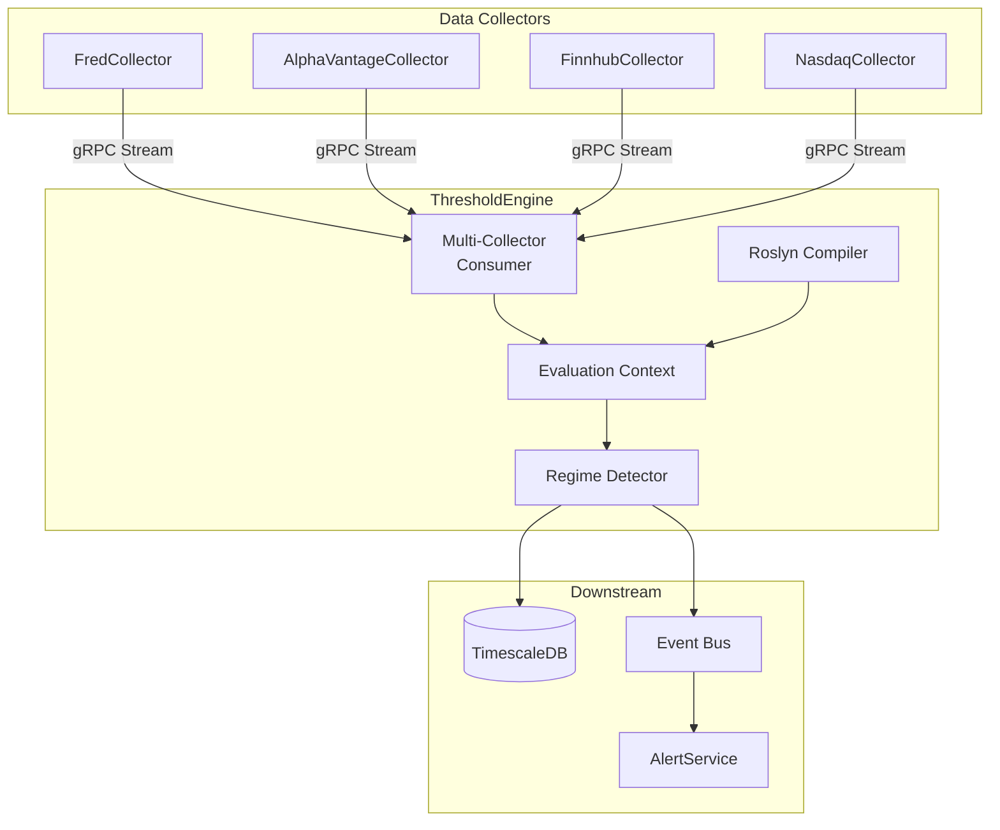

# ThresholdEngine

Pattern evaluation and regime detection service for ATLAS.

## Overview

ThresholdEngine is the "brain" of the ATLAS system. It evaluates configurable C# expressions against real-time economic and market data to detect regime transitions and generate allocation signals. It consumes observation events from multiple data collectors via gRPC streams and publishes threshold alerts when conditions are met.

**Scope**: Pattern evaluation only. Data collection is handled by collector services (FredCollector, etc.), and notifications are delivered by AlertService.

## Architecture



## Core Features

- **Roslyn Compilation**: C# expressions compiled at runtime from JSON configuration, allowing complex logic without recompilation.
- **Context API**: Rich DSL for financial analysis (`GetLatest`, `GetYoY`, `GetMA`, `GetSpread`, `IsSustained`).
- **Hot Reload**: Pattern configuration changes are applied immediately without service restart.
- **Regime Detection**: sophisticated state machine tracking six economic regimes (Crisis → Recession → LateCycle → Neutral → Recovery → Growth).
- **Signal Scoring**: Quantitative scoring (-2 to +2) with hysteresis and confidence intervals.
- **Multi-Source Data**: Unifies data from diverse sources (FRED, AlphaVantage, Finnhub, Nasdaq) into a single evaluation context.

## Pattern Configuration

Patterns are defined in JSON files located in `config/patterns/`. They contain embedded C# expressions that are compiled at runtime.

```json
{
  "patternId": "vix-deployment-l1",
  "name": "VIX Level 1 Deployment Trigger",
  "category": "Liquidity",
  "expression": "ctx.GetLatest(\"VIXCLS\") > 22m",
  "signalExpression": "var vix = ctx.GetLatest(\"VIXCLS\") ?? 0m; return (double)(vix - 20) / 10.0;",
  "applicableRegimes": ["Crisis", "Recession", "LateCycle"],
  "requiredSeries": ["VIXCLS"]
}
```

## Context API

The `ctx` object available in pattern expressions provides powerful time-series analysis methods:

```csharp
// Basic Retrieval
ctx.GetLatest("VIXCLS")           // Most recent value
ctx.GetValues("SP500", 30)        // Last 30 days of data

// Transformations
ctx.GetYoY("GDP")                 // Year-over-year % change
ctx.GetMoM("PAYEMS")              // Month-over-month % change
ctx.GetMA("UNRATE", 90)           // 90-day moving average
ctx.GetSpread("DGS10", "DGS2")    // Yield curve spread (10Y - 2Y)
ctx.GetLowest("UNRATE", 365)      // 12-month low
ctx.GetHighest("SP500", 365)      // 52-week high

// Logic
ctx.IsSustained("ICSA", v => v > 300000m, 30)  // Condition held true for 30 days
ctx.MacroScore                    // Current composite regime score
ctx.CurrentRegime                 // Current MacroRegime enum
```

## Configuration

Environment variables:

| Variable | Description | Default |
|----------|-------------|---------|
| `ConnectionStrings__AtlasDb` | PostgreSQL connection string | `Host=postgres;...` |
| `Collectors__FredCollector` | gRPC URL for FredCollector | `http://fred-collector:5001` |
| `Collectors__AlphaVantageCollector` | gRPC URL for AlphaVantage | `http://alphavantage-collector:5004` |
| `Collectors__FinnhubCollector` | gRPC URL for Finnhub | `http://finnhub-collector:5005` |
| `Collectors__NasdaqCollector` | gRPC URL for Nasdaq | `http://nasdaq-collector:5006` |

## Getting Started

**Note**: This service is designed to run as part of the larger ATLAS microservices architecture. It relies on shared infrastructure (TimescaleDB) and upstream collectors to function correctly.

### Development (Dev Containers)

The most robust way to develop is using the provided Dev Container, which includes the .NET SDK and tooling.

1. **Open in VS Code**: Open this folder and select "Reopen in Container".
2. **Start Infrastructure**: Ensure the shared infrastructure (PostgreSQL/TimescaleDB) and collectors are running:
   ```bash
   docker compose up -d postgres fred-collector
   ```
3. **Run Service**:
   ```bash
   cd src/ThresholdEngine.Service
   dotnet run
   ```

### Running with Docker (Standalone)

If you just want to run the service image without a dev environment:

```bash
docker compose up -d threshold-engine
```

### Running the Full Stack

To run the entire ATLAS system:

```bash
cd ../ansible
ansible-playbook playbooks/site.yml
```

## API Endpoints

### REST API (Port 5003)

| Endpoint | Method | Description |
|----------|--------|-------------|
| `/api/patterns` | GET | List all configured patterns and their current state |
| `/api/patterns/{id}` | GET | Get detailed configuration for a specific pattern |
| `/api/patterns/{id}/toggle` | PUT | Enable or disable a pattern at runtime |
| `/api/patterns/reload` | POST | Force reload of pattern configuration from disk (Hot Reload) |
| `/health` | GET | Liveness probe |

## Project Structure

```
ThresholdEngine/
├── src/
│   ├── ThresholdEngine.Core/           # Domain models, interfaces, enums
│   ├── ThresholdEngine.Application/    # Pattern evaluation, workers, services
│   ├── ThresholdEngine.Infrastructure/ # Data access, Roslyn compiler, gRPC clients
│   └── ThresholdEngine.Service/        # ASP.NET Core host, API endpoints
├── config/
│   └── patterns/                       # Pattern definitions by category
├── tests/
│   └── ThresholdEngine.UnitTests/      # xUnit test suite (>220 tests)
└── Containerfile                       # Multi-stage Docker build
```

## See Also

- [FredCollector](../FredCollector/README.md) - Federal Reserve Economic Data
- [AlertService](../AlertService/README.md) - Notification delivery
- [Events](../Events/README.md) - Shared gRPC client and contracts
