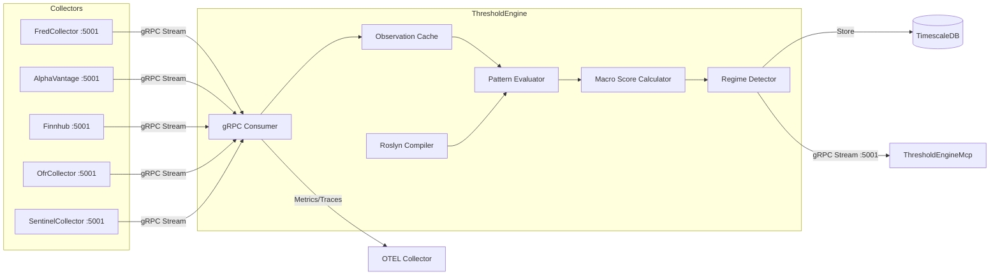

# ThresholdEngine

Pattern evaluation and regime detection service for ATLAS.

## Overview

ThresholdEngine evaluates configurable C# expressions against real-time economic data to detect regime transitions and generate macro signals. It consumes observation events from collectors via gRPC streaming, calculates weighted macro scores with freshness-aware decay, and publishes evaluation results to TimescaleDB. Downstream consumers (such as ThresholdEngineMcp) subscribe to evaluation events via the gRPC event stream.

## Architecture



Collectors push observation events over gRPC. ThresholdEngine caches observations, evaluates pattern expressions via Roslyn, computes weighted macro scores per category, and detects regime transitions. Results are persisted to TimescaleDB and streamed to subscribers on port 5001.

## Features

- **Roslyn Compilation**: C# expressions compiled at runtime with caching for pattern definitions
- **Context API DSL**: Time-series functions (GetLatest, GetYoY, GetMoM, GetMA, GetSpread, GetRatio, IsSustained)
- **Hot Reload**: File system watcher detects pattern changes and reloads automatically
- **Regime Detection**: Six-state machine (Crisis, Recession, LateCycle, Neutral, Recovery, Growth)
- **Weighted Scoring**: Pattern reliability weights with freshness decay and temporal multipliers
- **Multi-Collector Streaming**: Consumes events from 5 collectors via gRPC
- **gRPC Event Stream**: Publishes evaluation events for downstream subscribers (MCP, alerting)
- **On-Demand Evaluation**: REST API for manual pattern evaluation, contributions, and health checks

## Configuration

| Variable | Description | Default |
|----------|-------------|---------|
| `ConnectionStrings__AtlasDb` | PostgreSQL connection string | Required |
| `Collectors__Items__*__ServiceUrl` | gRPC URLs for collectors | See appsettings.json |
| `PatternConfig__Path` | Pattern config directory | `./config` (dev), `/app/config` (prod) |
| `PatternConfig__HotReload` | Enable file system watcher | `true` |
| `PatternConfig__WatchInterval` | File watcher polling interval (ms) | `1000` |
| `MacroScoring__CategoryWeights__*` | Category weights for macro score | See appsettings.json |
| `OpenTelemetry__OtlpEndpoint` | OpenTelemetry collector endpoint | `http://otel-collector:4317` |
| `OpenTelemetry__ServiceName` | Service name for telemetry | `thresholdengine-service` |

## API Endpoints

### REST API (Port 8080)

| Endpoint | Method | Description |
|----------|--------|-------------|
| `/api/patterns` | GET | List all pattern configurations |
| `/api/patterns/{patternId}` | GET | Get specific pattern configuration |
| `/api/patterns/{patternId}/toggle` | PUT | Enable or disable a pattern |
| `/api/patterns/reload` | POST | Trigger manual pattern reload |
| `/api/patterns/evaluate` | POST | Evaluate all enabled patterns on-demand |
| `/api/patterns/{patternId}/evaluate` | POST | Evaluate specific pattern on-demand |
| `/api/patterns/contributions` | GET | Get weighted pattern contribution breakdown |
| `/api/patterns/health` | GET | Get pattern data freshness and health status |
| `/api/patterns/backfill` | POST | Backfill regime score history from cached observations |

### gRPC Services (Port 5001)

| Service | Method | Description |
|---------|--------|-------------|
| `ObservationEventStream` | `SubscribeToEvents` | Stream evaluation events in real-time |
| `ObservationEventStream` | `GetEventsSince` | Get historical events from a timestamp |
| `ObservationEventStream` | `GetEventsBetween` | Get events within a time range |
| `ObservationEventStream` | `GetLatestEventTime` | Get timestamp of most recent event |
| `ObservationEventStream` | `GetHealth` | gRPC health check |

### Health Endpoints

| Endpoint | Description |
|----------|-------------|
| `/health` | Full health check with detailed status |
| `/health/ready` | Readiness probe (database, patterns, grpc, data) |
| `/health/live` | Liveness probe |

## Project Structure

```
ThresholdEngine/
├── src/
│   ├── Compilation/          # Roslyn expression compiler, cache
│   ├── Configuration/        # Pattern config loader, watcher
│   ├── Data/                 # DbContext, repositories, migrations
│   ├── Endpoints/            # REST API endpoints
│   ├── Entities/             # Domain models, PatternEvaluationContext
│   ├── Enums/                # MacroRegime, PatternCategory, TemporalType
│   ├── Events/               # Event bus infrastructure
│   ├── Grpc/                 # gRPC client consumers and server service
│   ├── HealthChecks/         # Database, pattern, gRPC, data health checks
│   ├── Interfaces/           # Service contracts
│   ├── Services/             # Pattern evaluation, macro scoring, regime detection
│   ├── Telemetry/            # OpenTelemetry activity source, metrics
│   └── Workers/              # Background event consumers, data warmup
├── config/
│   ├── patterns/             # Pattern definitions by category (74 files)
│   ├── regimes.json          # Regime threshold configuration
│   └── pattern-schema.json   # JSON schema for pattern validation
├── mcp/                      # MCP server for Claude Code integration
├── tests/                    # Unit and integration tests
└── .devcontainer/            # VS Code dev container
```

## Development

### Prerequisites

- VS Code with Dev Containers extension
- Access to shared infrastructure (PostgreSQL, observability stack)

### Getting Started

1. Open in VS Code: `code ThresholdEngine/`
2. Reopen in Container (Cmd/Ctrl+Shift+P -> "Dev Containers: Reopen in Container")
3. Build: `dotnet build`
4. Run: `dotnet run`

### Build Container

```bash
.devcontainer/build.sh
```

## Deployment

```bash
cd deployment/ansible
ansible-playbook playbooks/deploy.yml --tags thresholdengine
```

## Ports

| Port | Protocol | Description |
|------|----------|-------------|
| 8080 | HTTP | REST API, health checks (internal only) |
| 5001 | gRPC | Event stream for downstream subscribers (internal only) |

ThresholdEngine has no external host port mapping. Access via ThresholdEngineMcp (port 3104) for AI assistant integration.

## See Also

- [FredCollector](../FredCollector/README.md) - FRED economic data collector
- [AlphaVantageCollector](../AlphaVantageCollector/README.md) - Commodities, forex, crypto collector
- [FinnhubCollector](../FinnhubCollector/README.md) - Stock quotes, calendars, sentiment collector
- [OfrCollector](../OfrCollector/README.md) - Financial stability data collector
- [ThresholdEngine MCP](mcp/README.md) - MCP server for Claude Code integration
