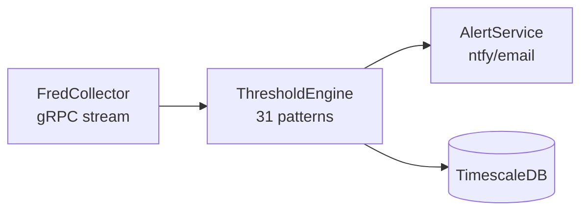

# ThresholdEngine

Pattern evaluation and regime detection service for ATLAS.

## Overview

ThresholdEngine evaluates configurable C# expressions against economic data to detect regime transitions and generate allocation signals. It consumes observation events from FredCollector via gRPC and publishes threshold alerts.

**Scope**: Pattern evaluation only. Data collection is handled by FredCollector, notifications by AlertService.

## Architecture



## Core Features

- **Roslyn Compilation**: C# expressions compiled at runtime from JSON config
- **Context API**: `GetLatest`, `GetYoY`, `GetMA`, `GetSpread`, `IsSustained`
- **Hot Reload**: Pattern changes without service restart
- **Regime Detection**: Six regimes (Crisis → Recession → LateCycle → Neutral → Recovery → Growth)
- **Signal Scoring**: -2 to +2 scale with context-dependent logic

## Pattern Configuration

Patterns are JSON files with embedded C# expressions:

```json
{
  "patternId": "vix-deployment-l1",
  "name": "VIX Level 1 Deployment Trigger",
  "category": "Liquidity",
  "expression": "ctx.GetLatest(\"VIXCLS\") > 22m",
  "signalExpression": "var vix = ctx.GetLatest(\"VIXCLS\") ?? 0m; ...",
  "applicableRegimes": ["Crisis", "Recession", "LateCycle"],
  "requiredSeries": ["VIXCLS"]
}
```

## Pattern Categories

| Category | Patterns | Purpose |
|----------|----------|---------|
| [growth](config/patterns/growth/) | 5 | Economic expansion signals |
| [liquidity](config/patterns/liquidity/) | 5 | VIX, credit spreads, Fed balance sheet |
| [nbfi](config/patterns/nbfi/) | 8 | Financial stress indicators |
| [recession](config/patterns/recession/) | 8 | Contraction warnings |
| [valuation](config/patterns/valuation/) | 5 | Market valuation levels |

## Project Structure

```
ThresholdEngine/
├── src/
│   ├── ThresholdEngine.Core/           # Domain models, interfaces
│   ├── ThresholdEngine.Application/    # Pattern evaluation, regime detection
│   ├── ThresholdEngine.Infrastructure/ # Roslyn compilation, data access
│   └── ThresholdEngine.Service/        # Worker service host
├── config/
│   └── patterns/                       # Pattern JSON files by category
├── tests/
│   └── ThresholdEngine.UnitTests/      # 153 tests
└── Containerfile                       # Production container
```

## Context API

Available in pattern expressions via `ctx`:

```csharp
ctx.GetLatest("VIXCLS")           // Most recent value
ctx.GetYoY("GDP")                 // Year-over-year % change
ctx.GetMoM("PAYEMS")              // Month-over-month % change
ctx.GetMA("UNRATE", 90)           // 90-day moving average
ctx.GetSpread("DGS10", "DGS2")    // Yield curve spread
ctx.GetLowest("UNRATE", 365)      // 12-month low
ctx.IsSustained("ICSA", v => v > 300000m, 30)  // Condition held N days
ctx.MacroScore                    // Current composite score
ctx.CurrentRegime                 // MacroRegime enum
```

## API Endpoints (port 5003)

| Endpoint | Method | Description |
|----------|--------|-------------|
| `/api/patterns` | GET | List all patterns |
| `/api/patterns/{id}` | GET | Get pattern details |
| `/api/patterns/{id}/toggle` | PUT | Enable/disable pattern |
| `/api/patterns/reload` | POST | Reload from config files |
| `/health` | GET | Health check |

## See Also

- [FredCollector](../FredCollector/) - Data collection service
- [FredCollectorClient](../FredCollectorClient/) - gRPC client library
- [AlertService](../AlertService/) - Notification delivery
- [gRPC Architecture](../docs/GRPC-ARCHITECTURE.md)
