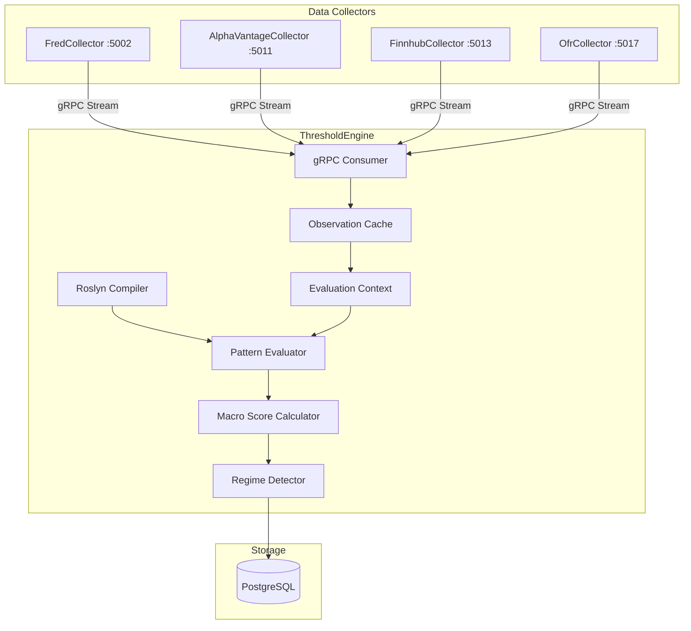

# ThresholdEngine

Pattern evaluation and regime detection service for ATLAS.

## Overview

ThresholdEngine evaluates configurable C# expressions against real-time economic data to detect regime transitions and generate signals. It consumes observation events from collectors via gRPC and publishes evaluation results to PostgreSQL.

**Scope**: Pattern evaluation, macro scoring, and regime detection. Data collection is handled by collector services.

## Architecture



## Technology Stack

- **.NET 9 / C# 13** - Flattened single-project structure
- **Roslyn** - Runtime C# expression compilation via Microsoft.CodeAnalysis.CSharp.Scripting
- **PostgreSQL** - Event persistence and pattern evaluation results
- **OpenTelemetry** - Traces, metrics, logs to observability stack
- **gRPC** - Event streaming from data collectors

## Key Features

- **Roslyn Compilation**: C# expressions compiled at runtime from JSON configuration with caching
- **Context API**: DSL for financial analysis (GetLatest, GetYoY, GetMoM, GetMA, GetSpread, GetRatio, GetLowest, GetHighest, IsSustained)
- **Hot Reload**: Pattern changes detected and reloaded automatically via file system watcher
- **Regime Detection**: State machine tracking six regimes (Crisis, Recession, LateCycle, Neutral, Recovery, Growth)
- **Macro Score Calculator**: Aggregates pattern signals into composite macro score
- **On-Demand Evaluation**: REST API endpoints for manual pattern evaluation

## Pattern Configuration

Patterns are defined in JSON files organized by category in `config/patterns/`:

```json
{
  "patternId": "vix-deployment-l1",
  "name": "VIX Level 1 Deployment Trigger",
  "description": "VIX >22 indicates elevated volatility, context-dependent signal",
  "category": "Liquidity",
  "expression": "ctx.GetLatest(\"VIXCLS\") > 22m",
  "signalExpression": "var vix = ctx.GetLatest(\"VIXCLS\") ?? 0m; var score = ctx.MacroScore; if (vix <= 22m) return 0m; if (score < -10m) return vix > 30m ? 2m : 1m; if (score > 10m) return vix > 30m ? -2m : -1m; return vix > 30m ? -1m : -0.5m;",
  "applicableRegimes": ["Crisis", "Recession", "LateCycle", "Neutral", "Recovery", "Growth"],
  "requiredSeries": ["VIXCLS"],
  "maxLookbackDays": 1,
  "enabled": true
}
```

**54 patterns** across 9 categories: OFR, Inflation, Liquidity, Valuation, Growth, NBFI, Recession, Commodity

## Context API

The `ctx` object provided to pattern expressions includes time-series analysis methods:

```csharp
// Basic Retrieval
ctx.GetLatest("VIXCLS")                         // Most recent value
ctx.GetHistorical("UNRATE", date)               // Value at specific date

// Transformations
ctx.GetYoY("GDP")                               // Year-over-year % change
ctx.GetMoM("PAYEMS")                            // Month-over-month % change
ctx.GetMA("UNRATE", 90)                         // 90-day moving average
ctx.GetSpread("DGS10", "DGS2")                  // Difference between two series
ctx.GetRatio("MORTGAGE30US", "DGS10")           // Ratio of two series
ctx.GetLowest("UNRATE", 365)                    // Lowest value over period
ctx.GetHighest("SP500", 365)                    // Highest value over period

// Logic
ctx.IsSustained("ICSA", v => v > 300000m, 30)   // Condition held for period

// Current State
ctx.MacroScore                                  // Current composite macro score
ctx.MacroScoreTrend                             // Macro score trend (7-day change)
ctx.CurrentRegime                               // Current MacroRegime enum
ctx.CurrentDate                                 // Evaluation timestamp
```

## Configuration

Environment variables:

| Variable | Description | Default |
|----------|-------------|---------|
| `ConnectionStrings__AtlasDb` | PostgreSQL connection string | Required |
| `FredCollector__GrpcUrl` | gRPC URL for FredCollector | `http://fred-collector:5002` |
| `AlphaVantageCollector__GrpcUrl` | gRPC URL for AlphaVantageCollector | `http://alphavantage-collector:5011` |
| `FinnhubCollector__GrpcUrl` | gRPC URL for FinnhubCollector | `http://finnhub-collector:5013` |
| `OfrCollector__GrpcUrl` | gRPC URL for OfrCollector | `http://ofr-collector:5017` |
| `PatternConfig__Path` | Pattern config directory | `./config` (dev), `/app/config` (prod) |
| `PatternConfig__HotReload` | Enable file system watcher | `true` |
| `PatternConfig__WatchInterval` | Watcher interval in milliseconds | `1000` |
| `OpenTelemetry__OtlpEndpoint` | OpenTelemetry collector endpoint | `http://otel-collector:4317` |
| `OpenTelemetry__ServiceName` | Service name for telemetry | `thresholdengine-service` |
| `OpenTelemetry__ServiceVersion` | Service version for telemetry | `1.0.0` |

## Getting Started

**Note**: This service runs as part of the ATLAS microservices architecture.

### Development

The project uses a flattened structure with a single .csproj file at `/home/james/ATLAS/ThresholdEngine/src/ThresholdEngine.csproj`.

1. **Build**:
   ```bash
   cd /home/james/ATLAS/ThresholdEngine/src
   dotnet build
   ```

2. **Run**:
   ```bash
   dotnet run
   ```
   Service listens on port 5002 (HTTP).

3. **Database Migrations**:
   Migrations are applied automatically on startup via `dbContext.Database.MigrateAsync()`.

### Running the Full Stack

Deploy all ATLAS services via Ansible:

```bash
cd /home/james/ATLAS/deployment/ansible
ansible-playbook playbooks/deploy.yml
```

## API Endpoints

### REST API (Port 5002)

| Endpoint | Method | Description |
|----------|--------|-------------|
| `/api/patterns` | GET | List all pattern configurations |
| `/api/patterns/{patternId}` | GET | Get specific pattern configuration |
| `/api/patterns/{patternId}/toggle` | PUT | Enable or disable a pattern |
| `/api/patterns/reload` | POST | Trigger manual pattern reload from disk |
| `/api/patterns/evaluate` | POST | Evaluate all enabled patterns on-demand |
| `/api/patterns/{patternId}/evaluate` | POST | Evaluate specific pattern on-demand |
| `/health` | GET | Health check with detailed status |
| `/health/ready` | GET | Readiness probe (database, patterns, grpc) |
| `/health/live` | GET | Liveness probe |
| `/swagger` | GET | OpenAPI documentation (dev environment only) |

## Project Structure

Flattened single-project structure:

```
ThresholdEngine/
├── src/
│   ├── ThresholdEngine.csproj          # Single project file
│   ├── Program.cs                      # Application entry point
│   ├── DependencyInjection.cs          # Service registration
│   ├── Compilation/                    # Roslyn expression compiler, cache
│   ├── Configuration/                  # Pattern config loader, watcher
│   ├── Data/                           # DbContext, repositories, migrations
│   ├── Endpoints/                      # REST API endpoints
│   ├── Entities/                       # Domain models, PatternEvaluationContext
│   ├── Enums/                          # MacroRegime, PatternCategory
│   ├── Events/                         # Event bus infrastructure
│   ├── Grpc/                           # gRPC client consumers
│   ├── HealthChecks/                   # Database, pattern, gRPC health checks
│   ├── Interfaces/                     # Abstractions
│   ├── Services/                       # Pattern evaluation, macro scoring, regime detection
│   ├── Telemetry/                      # OpenTelemetry activity source, metrics
│   └── Workers/                        # Background event consumers, data warmup
├── config/
│   ├── patterns/                       # Pattern definitions by category (54 files)
│   ├── regimes.json                    # Regime threshold configuration
│   └── pattern-schema.json             # JSON schema for pattern validation
├── tests/
│   └── ThresholdEngine.UnitTests/      # Unit test project
└── Containerfile                       # Multi-stage Docker build
```

## Workers

Background services running in the application:

- **MultiCollectorEventConsumerWorker**: Subscribes to observation events from all 4 collectors (FredCollector, AlphaVantageCollector, FinnhubCollector, OfrCollector) via gRPC
- **ObservationEventSubscriber**: Processes observation events from in-memory event bus, caches in ObservationCache
- **DataWarmupService**: Loads initial observations from database into cache on startup
- **EventProcessor**: Evaluates patterns when relevant observations are updated

## Regime Detection

Regime transitions are determined by macro score thresholds defined in `config/regimes.json`:

| Regime | Score Range | Description |
|--------|-------------|-------------|
| Crisis | score ≤ -20 | Severe economic stress, capital preservation priority |
| Recession | -20 < score ≤ -10 | Economic contraction, defensive positioning |
| LateCycle | -10 < score ≤ 0 | Late expansion phase, prepare for downturn |
| Neutral | 0 < score ≤ 10 | Balanced conditions, maintain allocation |
| Recovery | 10 < score ≤ 20 | Economic recovery, deploy cash aggressively |
| Growth | score > 20 | Strong expansion, maintain equity allocation |

Transitions require sustained conditions for 30 days with 7-day smoothing window and 0.8 confidence threshold.

## See Also

- [FredCollector](../FredCollector/README.md) - Economic data collector (FRED API)
- [AlphaVantageCollector](../AlphaVantageCollector/README.md) - Commodities, forex, crypto (Alpha Vantage API)
- [FinnhubCollector](../FinnhubCollector/README.md) - Stock quotes, calendars, sentiment (Finnhub API)
- [OfrCollector](../OfrCollector/README.md) - Financial stability data collector (OFR API)
- [ThresholdEngineMcp](../ThresholdEngineMcp/README.md) - MCP server for Claude Code integration
