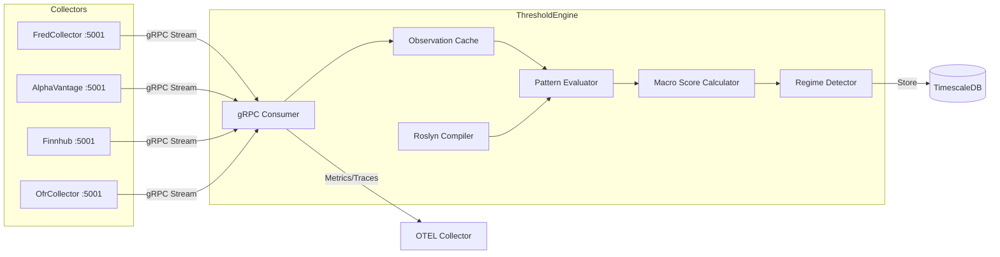

# ThresholdEngine

Pattern evaluation and regime detection service for ATLAS.

## Overview

ThresholdEngine evaluates configurable C# expressions against real-time economic data to detect regime transitions and generate macro signals. It consumes observation events from collectors via gRPC streaming, calculates weighted macro scores with freshness-aware decay, and publishes evaluation results to TimescaleDB.

## Architecture



## Features

- **Roslyn Compilation**: C# expressions compiled at runtime with caching for pattern definitions
- **Context API DSL**: Time-series functions (GetLatest, GetYoY, GetMoM, GetMA, GetSpread, GetRatio, IsSustained)
- **Hot Reload**: File system watcher detects pattern changes and reloads automatically
- **Regime Detection**: Six-state machine (Crisis, Recession, LateCycle, Neutral, Recovery, Growth)
- **Weighted Scoring**: Pattern reliability weights with freshness decay and temporal multipliers
- **Multi-Collector Streaming**: Consumes events from all 4 collectors via gRPC
- **On-Demand Evaluation**: REST API endpoints for manual pattern evaluation and health checks

## Configuration

| Variable | Description | Default |
|----------|-------------|---------|
| `ConnectionStrings__AtlasDb` | PostgreSQL connection string | Required |
| `Collectors__Items__*__ServiceUrl` | gRPC URLs for collectors | See appsettings.json |
| `PatternConfig__Path` | Pattern config directory | `./config` (dev), `/app/config` (prod) |
| `PatternConfig__HotReload` | Enable file system watcher | `true` |
| `OpenTelemetry__OtlpEndpoint` | OpenTelemetry collector endpoint | `http://otel-collector:4317` |
| `OpenTelemetry__ServiceName` | Service name for telemetry | `thresholdengine-service` |

## API Endpoints

### REST API (Port 8080)

| Endpoint | Method | Description |
|----------|--------|-------------|
| `/api/patterns` | GET | List all pattern configurations |
| `/api/patterns/{patternId}` | GET | Get specific pattern configuration |
| `/api/patterns/{patternId}/toggle` | PUT | Enable or disable a pattern |
| `/api/patterns/reload` | POST | Trigger manual pattern reload |
| `/api/patterns/evaluate` | POST | Evaluate all enabled patterns on-demand |
| `/api/patterns/{patternId}/evaluate` | POST | Evaluate specific pattern on-demand |
| `/api/patterns/contributions` | GET | Get weighted pattern contribution breakdown |
| `/api/patterns/health` | GET | Get pattern data freshness and health status |

### Health Endpoints

| Endpoint | Description |
|----------|-------------|
| `/health` | Full health check with detailed status |
| `/health/ready` | Readiness probe (database, patterns, grpc, data) |
| `/health/live` | Liveness probe |

## Project Structure

```
ThresholdEngine/
├── src/
│   ├── Compilation/          # Roslyn expression compiler, cache
│   ├── Configuration/        # Pattern config loader, watcher
│   ├── Data/                 # DbContext, repositories, migrations
│   ├── Endpoints/            # REST API endpoints
│   ├── Entities/             # Domain models, PatternEvaluationContext
│   ├── Enums/                # MacroRegime, PatternCategory, TemporalType
│   ├── Events/               # Event bus infrastructure
│   ├── Grpc/                 # gRPC client consumers
│   ├── HealthChecks/         # Database, pattern, gRPC health checks
│   ├── Services/             # Pattern evaluation, macro scoring, regime detection
│   ├── Telemetry/            # OpenTelemetry activity source, metrics
│   ├── Workers/              # Background event consumers, data warmup
│   └── Containerfile         # Multi-stage container build
├── config/
│   ├── patterns/             # Pattern definitions by category (58 files)
│   ├── regimes.json          # Regime threshold configuration
│   └── pattern-schema.json   # JSON schema for pattern validation
├── tests/                    # Unit tests
└── .devcontainer/            # VS Code dev container
```

## Development

### Prerequisites

- VS Code with Dev Containers extension
- Docker or nerdctl/containerd

### Getting Started

```bash
# Open in VS Code and select "Reopen in Container"
cd /workspace/ThresholdEngine/src
dotnet run
```

### Build Commands

```bash
# Compile and test
.devcontainer/compile.sh

# Build container image
.devcontainer/build.sh
```

## Deployment

```bash
ansible-playbook playbooks/deploy.yml --tags thresholdengine
```

## Ports

| Port | Type | Description |
|------|------|-------------|
| 8080 | HTTP (container) | REST API, health checks (internal only) |

Note: ThresholdEngine has no external port mapping. Access via ThresholdEngineMcp (port 3104) for AI assistant integration.

## See Also

- [FredCollector](../FredCollector/README.md) - FRED economic data collector
- [AlphaVantageCollector](../AlphaVantageCollector/README.md) - Commodities, forex, crypto collector
- [FinnhubCollector](../FinnhubCollector/README.md) - Stock quotes, calendars, sentiment collector
- [OfrCollector](../OfrCollector/README.md) - Financial stability data collector
- [ThresholdEngine MCP](mcp/README.md) - MCP server for Claude Code integration
