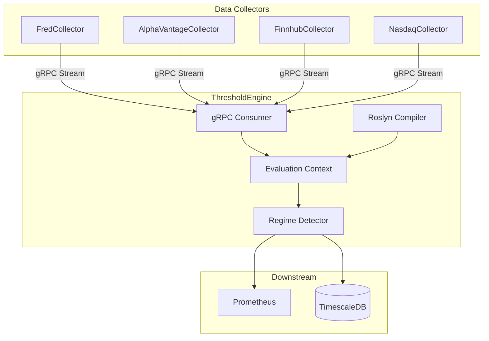

# ThresholdEngine

Pattern evaluation and regime detection service for ATLAS.

## Overview

ThresholdEngine evaluates configurable C# expressions against real-time economic data to detect regime transitions and generate signals. It consumes observation events from collectors via gRPC and publishes alerts when thresholds are crossed.

**Scope**: Pattern evaluation only. Data collection is handled by collector services, notifications by AlertService.

## Architecture



## Technology Stack

- **.NET 9 / C# 13** - Consistent with ATLAS platform
- **Roslyn** - Runtime C# expression compilation
- **TimescaleDB** - Event persistence with hypertables
- **OpenTelemetry** - Traces, metrics, logs to observability stack

## Key Features

- **Roslyn Compilation**: C# expressions compiled at runtime from JSON configuration
- **Context API**: DSL for financial analysis (`GetLatest`, `GetYoY`, `GetMA`, `GetSpread`)
- **Hot Reload**: Pattern changes applied immediately without restart
- **Regime Detection**: State machine tracking six regimes (Crisis → Recession → LateCycle → Neutral → Recovery → Growth)
- **Signal Scoring**: Quantitative scoring (-2 to +2) with hysteresis

## Pattern Configuration

Patterns are defined in JSON files in `config/patterns/`:

```json
{
  "patternId": "vix-deployment-l1",
  "name": "VIX Level 1 Deployment Trigger",
  "category": "Liquidity",
  "expression": "ctx.GetLatest(\"VIXCLS\") > 22m",
  "signalExpression": "var vix = ctx.GetLatest(\"VIXCLS\") ?? 0m; return (double)(vix - 20) / 10.0;",
  "applicableRegimes": ["Crisis", "Recession", "LateCycle"],
  "requiredSeries": ["VIXCLS"]
}
```

**40 patterns** across 6 categories: Recession, Liquidity, NBFI Stress, Growth, Valuation, Commodity

## Context API

The `ctx` object provides time-series analysis methods:

```csharp
// Basic Retrieval
ctx.GetLatest("VIXCLS")           // Most recent value
ctx.GetValues("SP500", 30)        // Last 30 days

// Transformations
ctx.GetYoY("GDP")                 // Year-over-year % change
ctx.GetMoM("PAYEMS")              // Month-over-month % change
ctx.GetMA("UNRATE", 90)           // 90-day moving average
ctx.GetSpread("DGS10", "DGS2")    // Yield curve spread
ctx.GetLowest("UNRATE", 365)      // 12-month low
ctx.GetHighest("SP500", 365)      // 52-week high

// Logic
ctx.IsSustained("ICSA", v => v > 300000m, 30)  // Condition held for 30 days
ctx.MacroScore                    // Current composite score
ctx.CurrentRegime                 // Current MacroRegime enum
```

## Configuration

Environment variables:

| Variable | Description | Default |
|----------|-------------|---------|
| `ConnectionStrings__AtlasDb` | PostgreSQL connection | Required |
| `FredCollector__ServiceUrl` | gRPC URL for FredCollector | `http://fredcollector-grpc:5001` |
| `PatternConfig__Path` | Pattern config directory | `./config` |
| `PatternConfig__HotReload` | Enable hot reload | `true` |

## Getting Started

**Note**: This service runs as part of the ATLAS microservices architecture.

### Development (Dev Containers)

1. **Open in VS Code**: Select "Reopen in Container"
2. **Start Infrastructure**:
   ```bash
   docker compose up -d postgres fred-collector
   ```
3. **Run Service**:
   ```bash
   cd src/ThresholdEngine.Service
   dotnet run
   ```

### Running the Full Stack

```bash
cd ~/ATLAS/deployment/ansible
ansible-playbook playbooks/site.yml
```

## API Endpoints

### REST API (Port 8080)

| Endpoint | Method | Description |
|----------|--------|-------------|
| `/api/patterns` | GET | List all patterns and current state |
| `/api/patterns/{id}` | GET | Get specific pattern configuration |
| `/api/patterns/{id}/toggle` | PUT | Enable/disable pattern |
| `/api/patterns/reload` | POST | Force reload from disk (hot reload) |
| `/health` | GET | Liveness probe |

## Project Structure

```
ThresholdEngine/
├── src/
│   ├── ThresholdEngine.Core/           # Domain models, interfaces
│   ├── ThresholdEngine.Application/    # Pattern evaluation, workers
│   ├── ThresholdEngine.Infrastructure/ # Roslyn compiler, data access
│   └── ThresholdEngine.Service/        # ASP.NET Core host
├── config/
│   └── patterns/                       # Pattern definitions by category
├── tests/
│   └── ThresholdEngine.UnitTests/      # 153 tests
└── Containerfile
```

## See Also

- [FredCollector](../FredCollector/README.md) - Primary data source
- [AlertService](../AlertService/README.md) - Notification delivery
- [ThresholdEngineMcp](../ThresholdEngineMcp/README.md) - MCP access for Claude
