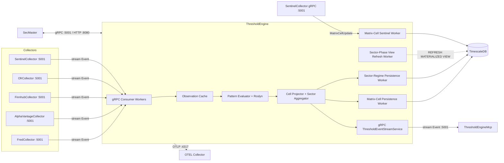

# ThresholdEngine

Pattern evaluation, sector projection, and matrix-cell persistence service for ATLAS.

## Overview

ThresholdEngine consumes observation events from collectors over gRPC, evaluates Roslyn-compiled C# pattern expressions, projects per-pattern signals onto the 11-sector ATLAS sector grid, and persists the resulting matrix cells, sector regimes, and sector-phase aggregates to TimescaleDB. It also bridges Sentinel-producer DSL extractions onto `matrix_cells` and exposes a REST consumption surface for downstream consumers (dashboard, reports, MCP). Threshold-crossing events are published in-process and streamed to subscribers (`ThresholdEngineMcp`, alerting) via the gRPC event stream.

## Architecture


```mermaid
flowchart LR
    subgraph Collectors
        FC[FredCollector :5001]
        AV[AlphaVantageCollector :5001]
        FH[FinnhubCollector :5001]
        OC[OfrCollector :5001]
        SC[SentinelCollector :5001]
    end

    subgraph ThresholdEngine
        GC[gRPC Consumer Workers]
        CACHE[Observation Cache]
        EVAL[Pattern Evaluator + Roslyn]
        PROJ[Cell Projector + Sector Aggregator]
        MWR[Matrix-Cell Persistence Worker]
        SRW[Sector-Regime Persistence Worker]
        SPRW[Sector-Phase View Refresh Worker]
        SMW[Matrix-Cell Sentinel Worker]
        GS[gRPC ThresholdEventStreamService]
    end

    FC & AV & FH & OC & SC -->|stream Event| GC
    GC --> CACHE --> EVAL --> PROJ
    PROJ --> MWR --> DB[(TimescaleDB)]
    PROJ --> SRW --> DB
    PROJ --> GS
    SPRW -. REFRESH MATERIALIZED VIEW .-> DB
    SENT[SentinelCollector gRPC :5001] -->|MatrixCellUpdate| SMW --> DB
    SM[SecMaster] <-->|gRPC :5001 / HTTP :8080| ThresholdEngine
    GS -->|stream Event :5001| MCP[ThresholdEngineMcp]
    ThresholdEngine -->|OTLP :4317| OTEL[OTEL Collector]
```

Collectors stream observation events into the in-memory observation cache. Patterns are evaluated via Roslyn-compiled expressions; each pattern's signal is projected onto its declared `sectorWeights` and aggregated into sector scores. Matrix cells and sector regimes are persisted asynchronously through bounded channels; the sector-phase materialised view is REFRESHed on a weekly cadence by a background worker. SecMaster is consulted for signal-identity dedup and versioned macro-observation mapping resolution. Threshold-crossing events are pushed onto an in-process bus and streamed to subscribers on port 5001.

## Features

- **Roslyn Compilation**: C# pattern expressions compiled at runtime with caching (`CompiledExpressionCache`).
- **Context API DSL**: Time-series helpers exposed to patterns (`GetLatest`, `GetYoY`, `GetMoM`, `GetMA`, `GetSpread`, `GetRatio`, `IsSustained`).
- **Hot Reload**: `PatternConfigurationWatcher`, `BurstWindowConfigurationWatcher`, and `SectorThresholdConfigurationWatcher` detect file changes and reload state in-process.
- **Sector Projection**: Per-pattern `sectorWeights` project signals onto the 11-sector ATLAS grid with explicit-zero sparsity.
- **Freshness Decay & Temporal Multipliers**: Pattern reliability factors with age-based decay and lead/lag multipliers.
- **Multi-Collector Streaming**: Subscribes to 5 collector gRPC streams concurrently (`MultiCollectorEventConsumerWorker`).
- **Matrix-Cell Persistence**: Background worker writes per-(pattern, sector, cycle) cells to TimescaleDB with bounded channel + batch flush (`MatrixCellPersistenceWorker`).
- **Sector-Regime Classification**: Per-cycle sector scores are classified into regime bands and persisted (`SectorRegimePersistenceWorker`).
- **Sector-Phase Aggregation**: `sector_phase_cells` materialised view refreshed on a scheduled cadence (`SectorPhaseViewRefreshWorker`) and on demand via REST.
- **Sentinel Matrix-Cell Bridge**: Subscribes to `SentinelCollector`'s `MatrixCellUpdate` gRPC stream and persists DSL-derived cells (`MatrixCellSentinelWorker`).
- **gRPC Event Stream**: Publishes threshold-crossing events and historical event playback to downstream subscribers (`ThresholdEventStreamService`).
- **Data Warmup**: On startup, pulls recent observations from each collector to seed the cache (`DataWarmupService`).
- **REST Surface**: Pattern CRUD, evaluation, matrix-cell queries, audit lookups, sector-regime/phase queries, macro-observation queries, and sector-threshold admin.

## Configuration

| Variable | Description | Default |
|----------|-------------|---------|
| `ConnectionStrings__AtlasDb` | PostgreSQL/TimescaleDB connection string. Required — there is no env-var fallback; the value is supplied directly in `compose.yaml`. | Required |
| `OpenTelemetry__OtlpEndpoint` (a.k.a. `OpenTelemetry:OtlpEndpoint`) | OTLP collector endpoint. | `http://otel-collector:4317` |
| `OpenTelemetry__ServiceName` | Service name for telemetry/resource attributes. | `thresholdengine-service` (deployed: `threshold-engine-service`) |
| `OpenTelemetry__ServiceVersion` | Service version for OTEL resource attributes. | `1.0.0` |
| `Kestrel__HttpPort` | Kestrel HTTP/1.1+HTTP/2 listen port (REST + health). | `8080` |
| `Kestrel__GrpcPort` | Kestrel HTTP/2-only listen port (gRPC). | `5001` |
| `PatternConfig__Path` (a.k.a. `PatternConfig:Path`) | Pattern config root directory (patterns + schema + burst/threshold JSONs). | `./config` (dev), `/app/config` (prod) |
| `PatternConfig__HotReload` | Enable file system watcher for pattern definitions. | `true` |
| `PatternConfig__WatchInterval` | File watcher polling interval (ms). | `1000` |
| `BurstWindow__ConfigFilePath` | Path to the burst-window JSON config (hot-reloaded by `BurstWindowConfigurationWatcher`). Malformed JSON at boot is fatal; missing file falls back to the 24h default per signal. | `./config/burst-windows.json` |
| `SectorThreshold__ConfigFilePath` | Path to the sector-threshold JSON config (hot-reloaded by `SectorThresholdConfigurationWatcher`). Boot fails fast if unset *and* the default path does not exist. | `./config/sector-thresholds.json` |
| `SectorThreshold__FailOnEmptyConfiguration` | If `true`, refuse to boot when the loaded sector-threshold config has zero rules. | `false` |
| `SecMaster__HttpBaseUrl` | HTTP base URL for SecMaster (versioned macro-observation mapping resolution). | `http://secmaster:8080` |
| `SECMASTER_GRPC_ENDPOINT` | gRPC endpoint for SecMaster (signal-identity dedup, registration). | `http://secmaster:5001` |
| `Collectors__Items__N__Name` / `__ServiceUrl` / `__Enabled` | Per-collector gRPC subscription config (indexed list, see `appsettings.json` and `compose.yaml`). | 5 collectors configured by default |
| `ASPNETCORE_ENVIRONMENT` | `Development` enables Swagger UI and detailed gRPC errors. | `Production` in compose |

## API Endpoints

REST handlers live in `src/Endpoints/`:

- **PatternEndpoints** (`/api/patterns`) — pattern read/toggle, manual reload, on-demand evaluation, freshness/health.
- **MatrixCellEndpoints** (`/api/matrix-cells`) — per-(pattern, sector) cell time series and per-sector evaluation-instant vector.
- **MatrixCellAuditEndpoints** (`/api/matrix-cells/audit`) — cell-to-source-document and source-document-to-cells audit dereferences.
- **SectorRegimePhaseEndpoints** (`/api/sector-regimes`, `/api/sector-phase-cells`) — sector-regime trajectory + latest, sector-phase derived view, on-demand REFRESH.
- **SectorThresholdAdminEndpoints** (`/admin/sector-thresholds`) — operator surface for the sector-threshold ruleset (snapshot, replace, reload).
- **MacroObservationEndpoints** (`/api/macro-observations`) — read access over `macro_observations` with versioned-mapping (as-of) resolution via SecMaster.

The gRPC `ThresholdEventStreamService` lives in `src/Grpc/Services/` and implements the `ObservationEventStream` contract defined in `Events/src/Events/Protos/observation_events.proto`.

### REST API (Port 8080)

| Endpoint | Method | Description |
|----------|--------|-------------|
| `/api/patterns` | GET | List all pattern configurations |
| `/api/patterns/{patternId}` | GET | Get specific pattern configuration |
| `/api/patterns/{patternId}/toggle` | PUT | Enable or disable a pattern (audit-logged) |
| `/api/patterns/reload` | POST | Clear compiled-expression cache, reload patterns from disk |
| `/api/patterns/evaluate` | POST | Evaluate all enabled patterns on-demand |
| `/api/patterns/{patternId}/evaluate` | POST | Evaluate a specific pattern on-demand |
| `/api/patterns/health` | GET | Pattern data freshness and health summary |
| `/api/matrix-cells` | GET | Cell time series for a single `(pattern_id, sector)` within an inclusive UTC window |
| `/api/matrix-cells/sector-vector` | GET | Per-pattern cells for a sector at a single evaluation instant |
| `/api/matrix-cells/audit/{id}` | GET | Audit lookup for a single `matrix_cells` row (cell → source DSL document) |
| `/api/matrix-cells/audit/by-article` | GET | Reverse audit lookup — every cell written from `source_document_ref` |
| `/api/matrix-cells/audit/by-created` | GET | Per-window audit slice over the ingest stamp (powers the per-day audit dashboard) |
| `/api/sector-regimes` | GET | Sector-regime trajectory within an inclusive UTC window |
| `/api/sector-regimes/latest` | GET | Most-recent persisted regime for a sector (204 if no history) |
| `/api/sector-phase-cells` | GET | Sector × phase derived-view rows (omit `phase` to get every phase) |
| `/api/sector-phase-cells/refresh` | POST | Force a synchronous REFRESH of the `sector_phase_cells` materialised view |
| `/admin/sector-thresholds` | GET | Current sector-threshold ruleset snapshot |
| `/admin/sector-thresholds` | PUT | Replace the sector-threshold ruleset (validate → atomic write → hot-reload) |
| `/admin/sector-thresholds/reload` | POST | Force reload from the on-disk file |
| `/api/macro-observations` | GET | Query `macro_observations` (signal-identity, source, sector, kind, time range, as-of mapping-version) |

OpenAPI JSON is always served at `/swagger/v1/swagger.json`. Interactive Swagger UI is enabled only when `ASPNETCORE_ENVIRONMENT=Development`.

### gRPC Services (Port 5001)

`ObservationEventStream` (proto: `Events/src/Events/Protos/observation_events.proto`):

| Method | Description |
|--------|-------------|
| `SubscribeToEvents` | Server-streamed real-time threshold/sector-crossing events |
| `GetEventsSince` | Server-streamed historical events from a starting timestamp |
| `GetEventsBetween` | Server-streamed historical events within a time range |
| `GetLatestEventTime` | Timestamp of the most recent persisted threshold event |
| `GetHealth` | gRPC health probe |

gRPC reflection is enabled.

### Health Endpoints

| Endpoint | Description |
|----------|-------------|
| `/health` | Full health check with per-check status and detail JSON |
| `/health/ready` | Readiness probe (tags: `db`, `patterns`, `grpc`, `data`) |
| `/health/live` | Liveness probe (always 200 if the process is up) |

## Project Structure

```
ThresholdEngine/
├── src/
│   ├── Compilation/          # Roslyn expression compiler, compiled-expression cache
│   ├── Configuration/        # Pattern/burst-window/sector-threshold loaders, watchers, writers
│   ├── Data/                 # DbContext, repositories, EF migrations, ObservationCache
│   ├── Endpoints/            # REST handlers (Pattern, MatrixCell, MatrixCellAudit, SectorRegimePhase, SectorThresholdAdmin, MacroObservation)
│   ├── Entities/             # PatternConfiguration, PatternEvaluationContext (+ Historical), PatternEvaluationResult, ProcessedEvent, ThresholdEvent, DedupedObservation, ValidationResult, ConfigurationAuditLog
│   ├── Enums/                # TemporalType
│   ├── Events/               # In-process event bus (ChannelEventBus)
│   ├── Grpc/                 # gRPC client (CollectorEventClient, SentinelMatrixCellClient) + server service (ThresholdEventStreamService)
│   ├── HealthChecks/         # Database, pattern, gRPC, pattern-data health checks
│   ├── Interfaces/           # Service contracts
│   ├── Services/             # Pattern evaluation, sector aggregation, regime classification, dedup/frequency clients
│   ├── Telemetry/            # OpenTelemetry ActivitySource + Meter
│   ├── Workers/              # Background workers: DataWarmup, MultiCollectorEventConsumer, ObservationEventSubscriber, MatrixCellPersistence, MatrixCellSentinel(+Host), SectorRegimePersistence, SectorPhaseViewRefresh
│   ├── Containerfile         # Service image (build context = ATLAS monorepo root)
│   └── appsettings.json
├── config/
│   ├── patterns/             # Pattern definitions grouped by theme directory (commodity, currency, growth, inflation, liquidity, nbfi, ofr, recession, valuation)
│   ├── pattern-schema.json   # JSON schema for pattern validation
│   ├── burst-windows.json    # Per-signal burst-dedup window overrides
│   └── sector-thresholds.json # Per-sector threshold rules
├── grafana-dashboards/       # Pattern data health dashboard JSON
├── mcp/                      # MCP server for Claude Code integration (see mcp/README.md)
├── tests/                    # Unit and integration tests
└── .devcontainer/            # Dev container, compile.sh, build.sh
```

## Development

### Prerequisites

- VS Code with Dev Containers extension
- `nerdctl` / containerd on the host (the build/compile scripts shell out to `sudo nerdctl compose`)
- Access to shared infrastructure (TimescaleDB, observability stack) for integration tests

### Getting Started

1. Open in VS Code: `code ThresholdEngine/`
2. Reopen in Container (Cmd/Ctrl+Shift+P → "Dev Containers: Reopen in Container")
3. Build: `dotnet build` (from `/workspace/ThresholdEngine/src`)
4. Run: `dotnet run --project src`

### Compile + Test

```bash
./.devcontainer/compile.sh                 # build src/ + mcp/, run unit tests
./.devcontainer/compile.sh --no-test       # build only
./.devcontainer/compile.sh --integration   # build + unit + integration tests (requires database)
```

### Build Container

```bash
./.devcontainer/build.sh            # build threshold-engine:latest from monorepo root
./.devcontainer/build.sh --no-cache # clean rebuild
```

The image is built from `ThresholdEngine/src/Containerfile` with the ATLAS repo root as build context (the Containerfile pulls in `Events/` and `MacroSubstrate/` project references).

## Deployment

```bash
cd deployment/ansible
ansible-playbook playbooks/deploy.yml --tags threshold-engine
```

Pattern + burst/threshold JSON changes that don't require an image rebuild can be pushed with the `patterns` tag (hot-reloaded by the watchers):

```bash
ansible-playbook playbooks/deploy.yml --tags patterns
```

Direct edits to `/opt/ai-inference/compose.yaml` are not permitted — the compose file is ansible-managed.

## Ports

| Port | Protocol | Description |
|------|----------|-------------|
| 8080 | HTTP | REST API, OpenAPI, health checks (container-internal) |
| 5001 | gRPC | `ObservationEventStream` for downstream subscribers (container-internal) |

ThresholdEngine has no external host port mapping. Operator/AI-assistant access is via `ThresholdEngineMcp` (host port `3104`).

## See Also

- [FredCollector](../FredCollector/README.md) — FRED economic data collector
- [AlphaVantageCollector](../AlphaVantageCollector/README.md) — Commodities, forex, crypto collector
- [FinnhubCollector](../FinnhubCollector/README.md) — Stock quotes, calendars, sentiment collector
- [OfrCollector](../OfrCollector/README.md) — Financial stability data collector
- [SecMaster](../SecMaster/README.md) — Signal-identity registry and mapping-version resolution
- [ThresholdEngineMcp](mcp/README.md) — MCP server for Claude Code integration
