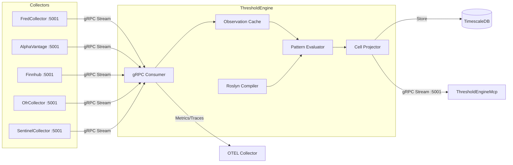

# ThresholdEngine

Pattern evaluation service for ATLAS.

## Overview

ThresholdEngine evaluates configurable C# expressions against real-time economic data and projects per-pattern signals onto the 11-sector ATLAS sector grid. It consumes observation events from collectors via gRPC streaming and publishes evaluation results to TimescaleDB. Downstream consumers (such as ThresholdEngineMcp) subscribe to evaluation events via the gRPC event stream.

## Architecture


```mermaid
flowchart LR
    subgraph Collectors
        FC[FredCollector :5001]
        AV[AlphaVantage :5001]
        FH[Finnhub :5001]
        OC[OfrCollector :5001]
        SC[SentinelCollector :5001]
    end

    subgraph ThresholdEngine
        GC[gRPC Consumer]
        CACHE[Observation Cache]
        EVAL[Pattern Evaluator]
        ROSLYN[Roslyn Compiler]
        PROJ[Cell Projector]
    end

    FC & AV & FH & OC & SC -->|gRPC Stream| GC
    GC --> CACHE
    CACHE --> EVAL
    ROSLYN --> EVAL
    EVAL --> PROJ
    PROJ -->|Store| DB[(TimescaleDB)]
    PROJ -->|gRPC Stream :5001| MCP[ThresholdEngineMcp]
    GC -->|Metrics/Traces| OTEL[OTEL Collector]
```

Collectors push observation events over gRPC. ThresholdEngine caches observations, evaluates pattern expressions via Roslyn, and projects each pattern's signal onto its declared `sectorWeights`. Results are persisted to TimescaleDB and streamed to subscribers on port 5001.

## Features

- **Roslyn Compilation**: C# expressions compiled at runtime with caching for pattern definitions
- **Context API DSL**: Time-series functions (GetLatest, GetYoY, GetMoM, GetMA, GetSpread, GetRatio, IsSustained)
- **Hot Reload**: File system watcher detects pattern changes and reloads automatically
- **Sector Projection**: Per-pattern `sectorWeights` project signals onto the 11-sector ATLAS grid with explicit-zero sparsity
- **Freshness Decay & Temporal Multipliers**: Pattern reliability weights with age-based decay and lead/lag multipliers
- **Multi-Collector Streaming**: Consumes events from 5 collectors via gRPC
- **gRPC Event Stream**: Publishes evaluation events for downstream subscribers (MCP, alerting)
- **On-Demand Evaluation**: REST API for manual pattern evaluation and health checks

## Configuration

| Variable | Description | Default |
|----------|-------------|---------|
| `ConnectionStrings__AtlasDb` | PostgreSQL connection string. Falls back to composing from `DB_HOST`/`DB_PORT`/`DB_USER`/`DB_PASSWORD`/`DB_NAME` when not set. | Required (or DB_* fallback) |
| `DB_HOST` | PostgreSQL host (used when `ConnectionStrings__AtlasDb` is not set) | `timescaledb` |
| `DB_PORT` | PostgreSQL port | `5432` |
| `DB_USER` | PostgreSQL user | `ai_inference` |
| `DB_PASSWORD` | PostgreSQL password | (from ansible-vault) |
| `DB_NAME` | PostgreSQL database name | `atlas_data` |
| `Collectors__Items__*__ServiceUrl` | gRPC URLs for collectors | See appsettings.json |
| `PatternConfig:Path` (a.k.a. `PatternConfig__Path`) | Pattern config directory | `./config` (dev), `/app/config` (prod) |
| `PatternConfig__HotReload` | Enable file system watcher | `true` |
| `PatternConfig__WatchInterval` | File watcher polling interval (ms) | `1000` |
| `BurstWindow:ConfigFilePath` (a.k.a. `BurstWindow__ConfigFilePath`) | Path to the burst-window JSON config (hot-reloaded by `BurstWindowConfigurationWatcher`). | `./config/burst-windows.json` |
| `SectorThreshold:ConfigFilePath` (a.k.a. `SectorThreshold__ConfigFilePath`) | Path to the sector-threshold JSON config (hot-reloaded by `SectorThresholdConfigurationWatcher`). Loud-fails at startup if unset *and* the default path is missing. | `./config/sector-thresholds.json` |
| `SectorThreshold:FailOnEmptyConfiguration` | If `true`, refuse to boot when the loaded sector-threshold config has zero rules. | `false` |
| `OpenTelemetry:OtlpEndpoint` (a.k.a. `OpenTelemetry__OtlpEndpoint`) | OTLP collector endpoint | `http://otel-collector:4317` |
| `OpenTelemetry:ServiceName` (a.k.a. `OpenTelemetry__ServiceName`) | Service name for telemetry | `thresholdengine-service` |
| `OpenTelemetry:ServiceVersion` (a.k.a. `OpenTelemetry__ServiceVersion`) | Service version for OTEL resource attributes | `1.0.0` |

## API Endpoints

REST surface lives in `src/Endpoints/`:

- **PatternEndpoints** (`/api/patterns`) — pattern CRUD, evaluation, freshness/health.
- **MatrixCellEndpoints** (`/api/matrix-cells`) — per-cell + per-sector projection vectors from the pattern × sector matrix.
- **SectorRegimePhaseEndpoints** (`/api/sector-regimes`, `/api/sector-phase-cells`) — sector-regime queries + on-demand refresh of the sector-phase materialised view.
- **SectorThresholdAdminEndpoints** (`/admin/sector-thresholds`) — operator surface for the sector-threshold configuration (read current snapshot, replace, reload from disk).
- **MacroObservationEndpoints** (`/api/macro-observations`) — read access over `macro_observations` with versioned-mapping (as-of) resolution via SecMaster.

gRPC surface lives in `src/Grpc/`.

### REST API (Port 8080)

| Endpoint | Method | Description |
|----------|--------|-------------|
| `/api/patterns` | GET | List all pattern configurations |
| `/api/patterns/{patternId}` | GET | Get specific pattern configuration |
| `/api/patterns/{patternId}/toggle` | PUT | Enable or disable a pattern |
| `/api/patterns/reload` | POST | Trigger manual pattern reload |
| `/api/patterns/evaluate` | POST | Evaluate all enabled patterns on-demand |
| `/api/patterns/{patternId}/evaluate` | POST | Evaluate specific pattern on-demand |
| `/api/patterns/health` | GET | Get pattern data freshness and health status |
| `/api/matrix-cells` | GET | Query the pattern × sector matrix cells |
| `/api/matrix-cells/sector-vector` | GET | Per-sector projection vector across all patterns |
| `/api/sector-regimes` | GET | Query sector regimes (latest snapshot per sector by default) |
| `/api/sector-regimes/latest` | GET | Latest regime per sector (convenience) |
| `/api/sector-phase-cells` | GET | Query the sector-phase materialised view |
| `/api/sector-phase-cells/refresh` | POST | Trigger refresh of the sector-phase materialised view |
| `/admin/sector-thresholds` | GET | Current sector-threshold snapshot in memory |
| `/admin/sector-thresholds` | PUT | Replace the current sector-threshold snapshot |
| `/admin/sector-thresholds/reload` | POST | Reload sector-threshold configuration from disk |
| `/api/macro-observations` | GET | Query `macro_observations` (filters: signal-identity, source, sector, kind, time range, as-of mapping-version) |

### gRPC Services (Port 5001)

| Service | Method | Description |
|---------|--------|-------------|
| `ObservationEventStream` | `SubscribeToEvents` | Stream evaluation events in real-time |
| `ObservationEventStream` | `GetEventsSince` | Get historical events from a timestamp |
| `ObservationEventStream` | `GetEventsBetween` | Get events within a time range |
| `ObservationEventStream` | `GetLatestEventTime` | Get timestamp of most recent event |
| `ObservationEventStream` | `GetHealth` | gRPC health check |

### Health Endpoints

| Endpoint | Description |
|----------|-------------|
| `/health` | Full health check with detailed status |
| `/health/ready` | Readiness probe (database, patterns, grpc, data) |
| `/health/live` | Liveness probe |

## Project Structure

```
ThresholdEngine/
├── src/
│   ├── Compilation/          # Roslyn expression compiler, cache
│   ├── Configuration/        # Pattern config loader, watcher
│   ├── Data/                 # DbContext, repositories, migrations (recent sweep: matrix cells, sector regimes, sector-phase view, source_collector + drop legacy category on processed/threshold events)
│   ├── Endpoints/            # REST API endpoints (Pattern, MatrixCell, SectorRegimePhase, SectorThresholdAdmin, MacroObservation)
│   ├── Entities/             # Domain models — PatternConfiguration, PatternEvaluationContext + Historical variant, PatternEvaluationResult, ProcessedEvent, ThresholdEvent, DedupedObservation, ValidationResult, ConfigurationAuditLog
│   ├── Enums/                # TemporalType
│   ├── Events/               # Event bus infrastructure
│   ├── Grpc/                 # gRPC client consumers and server service
│   ├── HealthChecks/         # Database, pattern, gRPC, data health checks
│   ├── Interfaces/           # Service contracts
│   ├── Services/             # Pattern evaluation, macro scoring, regime detection
│   ├── Telemetry/            # OpenTelemetry activity source, metrics
│   └── Workers/              # Background event consumers, data warmup
├── config/
│   ├── patterns/             # Pattern definitions grouped by theme directory
│   └── pattern-schema.json   # JSON schema for pattern validation
├── mcp/                      # MCP server for Claude Code integration
├── tests/                    # Unit and integration tests
└── .devcontainer/            # VS Code dev container
```

## Development

### Prerequisites

- VS Code with Dev Containers extension
- Access to shared infrastructure (PostgreSQL, observability stack)

### Getting Started

1. Open in VS Code: `code ThresholdEngine/`
2. Reopen in Container (Cmd/Ctrl+Shift+P -> "Dev Containers: Reopen in Container")
3. Build: `dotnet build`
4. Run: `dotnet run`

### Build Container

```bash
.devcontainer/build.sh
```

## Deployment

```bash
cd deployment/ansible
ansible-playbook playbooks/deploy.yml --tags thresholdengine
```

## Ports

| Port | Protocol | Description |
|------|----------|-------------|
| 8080 | HTTP | REST API, health checks (internal only) |
| 5001 | gRPC | Event stream for downstream subscribers (internal only) |

ThresholdEngine has no external host port mapping. Access via ThresholdEngineMcp (port 3104) for AI assistant integration.

## See Also

- [FredCollector](../FredCollector/README.md) - FRED economic data collector
- [AlphaVantageCollector](../AlphaVantageCollector/README.md) - Commodities, forex, crypto collector
- [FinnhubCollector](../FinnhubCollector/README.md) - Stock quotes, calendars, sentiment collector
- [OfrCollector](../OfrCollector/README.md) - Financial stability data collector
- [ThresholdEngine MCP](mcp/README.md) - MCP server for Claude Code integration
