# ThresholdEngine - Pattern Evaluation & Regime Detection

## Overview

ThresholdEngine evaluates configurable C# expressions against economic data to detect regime transitions, generate allocation signals, and identify deployment opportunities across the full economic cycle.

**Purpose**: Transform raw FRED data into actionable regime signals using compiled C# expressions  
**Architecture**: Event-driven microservice consuming ObservationCollectedEvent, publishing ThresholdCrossedEvent  
**Philosophy**: Full-cycle monitoring with symmetric signal detection (offensive + defensive)

## Core Capabilities

### 1. Pattern Evaluation with Native C#
- **Expression Compilation**: Roslyn-based compilation of C# lambda expressions from JSON configuration
- **Rich Context API**: `PatternEvaluationContext` provides data access helpers (GetLatest, GetYoY, GetMA, GetSpread, GetRatio)
- **No Custom Grammar**: Write actual C# code, not JSON DSL
- **Hot Reload**: Configuration changes without service restart
- **Type Safety**: Compile-time validation of expressions

### 2. Full-Cycle Regime Detection
- **Six Regime Classification**: Crisis → Recession → Late Cycle → Neutral → Recovery → Growth
- **Context-Dependent Signals**: Same indicator, different meaning by regime (VIX >30 in Crisis = buy opportunity, in Growth = warning)
- **Symmetric Pattern Detection**: Both offensive (growth acceleration) and defensive (recession warning) patterns
- **Transition Detection**: Identify inflection points between regimes

### 3. Multi-Pattern Aggregation
- **Category Scoring**: Aggregate patterns by category (Recession, Liquidity, Growth, Valuation)
- **Weighted Signals**: -2 to +2 scale matching ATLAS framework
- **Confidence Calculation**: Based on number of confirming indicators
- **Composite Rules**: Multi-indicator confirmation (e.g., "2 of 6 shadow banking triggers")

### 4. Allocation Signal Generation
- **Regime-Based Actions**: Translate regime transitions into allocation recommendations
- **VIX Deployment Logic**: Context-aware deployment sizing ($25K-$500K based on macro score)
- **Shadow Banking Escalation**: Automatic defensive positioning when NBFI stress confirmed
- **Recovery Deployment**: Aggressive cash deployment signals when recession → recovery

## Architecture

```mermaid
flowchart TD
    FC[FredCollector<br/>Data Collection] -->|ObservationCollectedEvent| TE[ThresholdEngine<br/>Pattern Evaluation]
    TE -->|Pattern triggers| PE[Pattern Evaluation<br/>Context API + Roslyn]
    PE -->|Triggered patterns| TE
    TE -->|ThresholdCrossedEvent| AS[AlertService<br/>Notifications]
    TE -->|RegimeTransitionEvent| AS
    AS -->|Email| EMAIL[📧 Email]
    AS -->|Push| NTFY[📱 ntfy.sh]
    
    DB[(TimescaleDB<br/>Observations)] -.->|Read data| PE
    
    style FC fill:#e1f5ff
    style TE fill:#d4edda
    style AS fill:#fff3cd
    style PE fill:#f8f9fa
    style DB fill:#e7e7e7
```



**Separation of Concerns:**
- **FredCollector**: Data collection only (publishes observation events)
- **ThresholdEngine**: Rule evaluation only (THIS SERVICE - consumes observations, publishes threshold events)
- **AlertService**: Notification delivery only (consumes threshold events)

See `../docs/ARCHITECTURE.md` for architectural decision record.

## Pattern Configuration Model

Patterns are defined in JSON with embedded C# expressions:

```json
{
  "patternId": "vix-deployment-context",
  "name": "VIX Deployment with Macro Context",
  "category": "Liquidity",
  "expression": "ctx.GetLatest(\"VIXCLS\") > 22m && ctx.MacroScore > -5m",
  "signal": "ctx.GetLatest(\"VIXCLS\") > 30m ? 2m : 1m",
  "applicableRegimes": ["Crisis", "Recession", "LateCycle"],
  "enabled": true
}
```

**Pattern Types:**
- **Threshold Crossing**: Simple comparisons (VIX > 22, ISM < 48)
- **Trend Detection**: Change over time (credit spreads widening 50bps in 30 days)
- **Ratio Patterns**: Cu/Au < 0.15, yield curve inversion
- **Multi-Indicator**: N of M conditions (shadow banking 2+ triggers)
- **Calculated Indicators**: Sahm Rule, Buffett Indicator, macro score

## Context API Reference

Available in all pattern expressions via `ctx` variable:

**Data Access:**
- `ctx.GetLatest(seriesId)` - Most recent observation
- `ctx.GetHistorical(seriesId, date)` - Value at specific date
- `ctx.GetYoY(seriesId)` - Year-over-year percentage change
- `ctx.GetMoM(seriesId)` - Month-over-month percentage change
- `ctx.GetMA(seriesId, days)` - Moving average
- `ctx.GetSpread(series1, series2)` - Difference between two series
- `ctx.GetRatio(numerator, denominator)` - Ratio of two series
- `ctx.IsSustained(seriesId, condition, days)` - Check if condition held for N days

**Macro Context:**
- `ctx.CurrentRegime` - MacroRegime enum (Crisis, Recession, etc.)
- `ctx.MacroScore` - Current composite macro score
- `ctx.MacroScoreTrend` - Rate of change in macro score
- `ctx.CurrentDate` - Evaluation timestamp

## Event Flow

**Subscribes To:**
- `ObservationCollectedEvent` - New FRED data available
  - Triggers pattern re-evaluation for affected series
  - Batch evaluation if multiple observations arrive

**Publishes:**
- `ThresholdCrossedEvent` - Pattern triggered
  - PatternId, Signal strength, Confidence, Metadata
  - Consumed by AlertService for notifications
  
- `RegimeTransitionEvent` - Macro regime changed
  - FromRegime, ToRegime, Confidence, TriggeringPatterns
  - Consumed by allocation recommendation engine

## Project Structure

```
ThresholdEngine/
├── src/
│   ├── ThresholdEngine.Core/          # Domain models, interfaces
│   │   ├── Entities/
│   │   │   ├── PatternConfiguration.cs
│   │   │   ├── PatternEvaluationContext.cs
│   │   │   ├── PatternEvaluationResult.cs
│   │   │   ├── ValidationResult.cs
│   │   │   ├── MacroContext.cs
│   │   │   └── RegimeTransition.cs
│   │   ├── Enums/
│   │   │   ├── MacroRegime.cs
│   │   │   └── SignalDirection.cs
│   │   └── Interfaces/
│   │       ├── IPatternEvaluationService.cs
│   │       ├── IExpressionCompiler.cs
│   │       ├── ICompiledExpressionCache.cs
│   │       └── IRegimeDetector.cs
│   │
│   ├── ThresholdEngine.Infrastructure/  # Data access, compilation
│   │   ├── Compilation/
│   │   │   ├── RoslynExpressionCompiler.cs
│   │   │   ├── RoslynScriptOptionsFactory.cs
│   │   │   ├── CompiledExpressionCache.cs
│   │   │   └── CompilationException.cs
│   │   ├── Configuration/
│   │   │   ├── PatternConfigLoader.cs
│   │   │   └── FileSystemWatcher integration
│   │   ├── Events/
│   │   │   └── ChannelEventBus.cs (in-process event bus)
│   │   ├── Data/
│   │   │   ├── ThresholdEngineDbContext.cs (service-specific)
│   │   │   ├── Repositories/
│   │   │   │   └── ThresholdEventRepository.cs
│   │   │   └── ObservationRepositoryAdapter.cs (reads from FredCollector's database)
│   │   └── Migrations/ (ThresholdEngineDbContext only)
│   │       └── 20250116000000_InitialCreate.cs
│   │
│   ├── ThresholdEngine.Application/    # Business logic
│   │   ├── Services/
│   │   │   ├── PatternEvaluationService.cs
│   │   │   ├── RegimeTransitionDetector.cs (E6)
│   │   │   └── MacroScoreCalculator.cs (E6)
│   │   └── Workers/
│   │       └── ObservationEventSubscriber.cs (subscribes to ObservationCollectedEvent)
│   │
│   ├── ThresholdEngine.Service/        # Worker service
│   │   ├── Program.cs
│   │   ├── appsettings.json
│   │   └── Containerfile
│   │
│   └── ThresholdEngine.Api/            # REST API (optional, Phase 2)
│       ├── Endpoints/
│       └── Program.cs
│
├── config/                             # Pattern configurations
│   ├── patterns/
│   │   ├── recession.json              # Recession warning patterns
│   │   ├── liquidity.json              # VIX, credit spreads
│   │   ├── growth.json                 # Growth acceleration
│   │   ├── valuation.json              # Market valuation signals
│   │   └── shadow-banking.json         # NBFI stress patterns
│   └── regimes.json                    # Regime transition rules
│
├── tests/
│   ├── ThresholdEngine.UnitTests/
│   └── ThresholdEngine.IntegrationTests/
│
├── docs/
│   ├── PATTERN-EXAMPLES.md             # Example pattern configurations
│   └── CONTEXT-API.md                  # PatternEvaluationContext documentation
│
├── progress.md                         # Epic tracking (CLAUDE.md format)
├── activeContext.md                    # Current focus (CLAUDE.md format)
├── systemPatterns.md                   # Architecture patterns (CLAUDE.md format)
├── projectbrief.md                     # Problem statement, business value
└── .cursorrules                        # AI assistant instructions
```

## Development Roadmap

### Phase 1: MVP (4-6 weeks)
- ✅ E1: Foundation (project structure, dependencies) - **Complete**
- ✅ E2: Pattern Configuration System (JSON loading, validation) - **Complete**
- ✅ E3: Expression Compilation (Roslyn integration) - **Complete**
- ✅ E4: Pattern Evaluation Engine (context API, execution) - **Complete**
- ✅ E5: Event Integration (subscribe/publish, persistence, observability) - **Complete**

### Phase 2: Full Cycle Monitoring (2-3 weeks)
- E6: Regime Transition Detection (macro score, regime changes)
- E7: Pattern Library (20+ initial patterns across all regimes)
- E8: Production Deployment (containers, monitoring)
- ✅ E9: Pattern Management API - **Complete**

### Phase 3: Advanced Features (Future)
- E10: Pattern Analytics (backtest results, signal quality)
- E11: Machine Learning Integration (correlation decay detection)

## Pattern Management API

ThresholdEngine exposes a REST API for dynamic pattern management:

**Endpoints (port 5002):**
- `GET /api/patterns` - List all patterns (including disabled)
- `GET /api/patterns/{patternId}` - Get specific pattern details
- `PUT /api/patterns/{patternId}/toggle` - Enable/disable a pattern
- `POST /api/patterns/reload` - Trigger manual reload from config files

**Hot Reload:**
- FileSystemWatcher monitors `config/patterns/` for JSON file changes
- Changes take effect immediately without service restart
- Audit log tracks all configuration changes

## Success Criteria

**MVP Complete When:**
- 10+ patterns configured and evaluating (recession, liquidity, growth)
- VIX deployment alerts working (>22, >30 with macro context)
- Shadow banking escalation automated (2+ of 6 triggers)
- Hot reload functional (change config, no restart)
- Integration tests passing (pattern evaluation, event flow)

**Production Ready When:**
- 20+ patterns covering all six regimes
- Regime transition detection operational
- 99.9% uptime over 30 days
- <100ms pattern evaluation latency
- Comprehensive observability (metrics, traces, logs)

## Dependencies

**Internal:**
- FredCollector: ObservationCollectedEvent publisher
- Shared TimescaleDB: ObservationRepository for data access

**External:**
- Microsoft.CodeAnalysis.CSharp.Scripting (Roslyn)
- System.Threading.Channels (event bus)
- OpenTelemetry (observability)

## Technical Constraints

- .NET 9, C# 13
- Linux containers (Ubuntu 24)
- Container-first development (VS Code Dev Containers)
- Same infrastructure as FredCollector (TimescaleDB, Loki, Grafana)
- Single tenant (James only)

## Security Considerations

Since patterns execute arbitrary C# code:

**Mitigation:**
- Restrict Roslyn ScriptOptions to safe assemblies only
- No file system access
- No network access
- No reflection
- Compile-time validation catches syntax errors
- Single-tenant system (trusted configurations only)

## Getting Started

See `projectbrief.md` for detailed problem statement and business value.

See `progress.md` for epic tracking and current status.

See `docs/PATTERN-EXAMPLES.md` for pattern configuration examples.

---

**Status**: Implementation Phase (56% Complete - 5/9 Epics)  
**Target MVP**: Q1 2026  
**Owner**: James (Head Architect)
