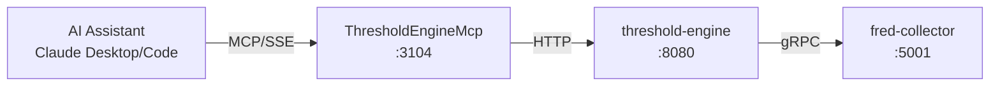

# ThresholdEngine MCP

MCP server providing Claude Desktop and Claude Code direct access to ATLAS pattern evaluation and regime detection.

## Overview

Exposes ThresholdEngine REST API as MCP tools, enabling AI assistants to evaluate economic and market patterns, detect regime changes, and access the macro score that drives ATLAS model deployment decisions.

## Architecture



Data flows from AI assistant requests through MCP to ThresholdEngine, which evaluates patterns using economic data from FredCollector.

## Features

- **Pattern Evaluation**: Evaluate all enabled patterns or specific patterns on-demand
- **Regime Detection**: Determine macro regime (Crisis/Recession/LateCycle/Neutral/Recovery/Growth)
- **Pattern Discovery**: List and inspect pattern configurations by category
- **Hot Reload**: Reload pattern configurations without service restart
- **Health Monitoring**: Service health and API schema access

### Signal Interpretation

| Signal | Meaning |
|--------|---------|
| -2.0 | Strongly bearish |
| -1.0 | Moderately bearish |
| 0.0 | Neutral |
| +1.0 | Moderately bullish |
| +2.0 | Strongly bullish |

### Regime Interpretation

| Regime | Score Range | Deployment Level |
|--------|-------------|------------------|
| Crisis | < -20 | L3 (Max defensiveness) |
| Recession | -20 to -10 | L2 |
| LateCycle | -10 to 0 | L1 |
| Neutral | 0 to +10 | L0 (Baseline) |
| Recovery | +10 to +20 | L0 |
| Growth | > +20 | L0 |

## Configuration

| Variable | Description | Default |
|----------|-------------|---------|
| `THRESHOLDENGINE_API_URL` | Backend service URL | `http://threshold-engine:8080` |
| `THRESHOLDENGINE_MCP_LOG_LEVEL` | Logging level | `Warning` |
| `THRESHOLDENGINE_MCP_TIMEOUT_SECONDS` | HTTP request timeout | `30` |

## MCP Tools

### Evaluation

| Tool | Description | Parameters |
|------|-------------|------------|
| `evaluate` | Evaluate ALL enabled patterns and return complete system state | None |
| `evaluate_pattern` | Evaluate a specific pattern on-demand | `pattern_id` (required) |

### Pattern Discovery

| Tool | Description | Parameters |
|------|-------------|------------|
| `list_patterns` | List all pattern configurations with filtering | `category`, `enabled_only` |
| `get_pattern` | Get detailed configuration for a specific pattern | `pattern_id` (required) |
| `categories` | List pattern categories with counts | None |

### Administrative

| Tool | Description | Parameters |
|------|-------------|------------|
| `reload` | Hot-reload pattern configurations from disk | None |
| `health` | Get ThresholdEngine service health status | None |
| `api_schema` | Get OpenAPI specification | `format`: "full" or "summary" |

## Project Structure

```
ThresholdEngine/mcp/
├── Client/
│   ├── IThresholdEngineClient.cs
│   ├── ThresholdEngineClient.cs
│   └── Models/
├── Tools/
│   └── ThresholdEngineTools.cs
├── Program.cs
├── ThresholdEngineMcp.csproj
└── Containerfile
```

## Development

### Prerequisites

- VS Code with Dev Containers extension
- Access to threshold-engine service

### Getting Started

1. Open in VS Code: `code ThresholdEngine/`
2. Reopen in Container (Cmd/Ctrl+Shift+P -> "Dev Containers: Reopen in Container")
3. Build: `ThresholdEngine/.devcontainer/compile.sh`

### Build Container

```bash
sudo nerdctl build -f ThresholdEngine/mcp/Containerfile -t thresholdengine-mcp:latest .
```

## Deployment

```bash
ansible-playbook playbooks/deploy.yml --tags thresholdengine-mcp
```

### Claude Desktop Integration

Add to `~/.config/Claude/claude_desktop_config.json` (Linux) or `~/Library/Application Support/Claude/claude_desktop_config.json` (macOS):

```json
{
  "mcpServers": {
    "threshold-engine": {
      "command": "uvx",
      "args": ["mcp-proxy", "http://mercury:3104/sse"]
    }
  }
}
```

Claude Desktop uses stdio transport, so `mcp-proxy` bridges stdio to SSE.

## Ports

| Port | Description |
|------|-------------|
| 8080 | REST API (internal) |
| 3104 | Host-mapped SSE endpoint |

SSE endpoint: `http://mercury:3104/sse`

## Usage Examples

**Morning briefing:**
```
User: "What's the ATLAS status?"
Claude calls: evaluate
Response: "ATLAS shows Late Cycle regime with macro score -4.4.
7 of 37 patterns firing: Recession (4), Liquidity (2), Commodity (1)"
```

**Deep dive on pattern:**
```
User: "Tell me about the Sahm Rule"
Claude calls: get_pattern("sahm-rule-official")
Response: "The Sahm Rule triggers when 3-month avg unemployment rises 0.5+ points.
Current: 0.28 (below trigger threshold)"
```

**Check specific pattern:**
```
User: "Is the yield curve inverted?"
Claude calls: evaluate_pattern("yield-curve-inversion")
Response: "Pattern triggered: signal -1.5, high confidence"
```

## See Also

- [ThresholdEngine](../README.md) - Backend service documentation
- [FredCollector MCP](../../FredCollector/mcp/README.md) - Economic data access
- [Model Context Protocol](https://modelcontextprotocol.io/) - MCP specification
