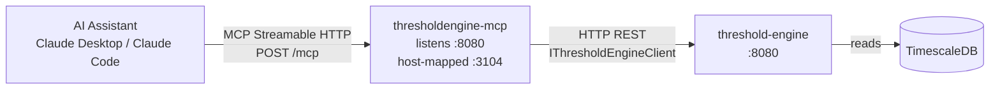

# ThresholdEngine MCP

MCP sidecar exposing ThresholdEngine's pattern-evaluation and read surfaces to AI assistants.

## Overview

Wraps a subset of the ThresholdEngine HTTP API as MCP tools so Claude Desktop and Claude Code can evaluate patterns and query the ATLAS read surfaces (`macro_observations`, `matrix_cells`, sector regimes, sector × phase cells) on demand. The sidecar holds no state; every tool call is a thin pass-through to the backend `threshold-engine` service.

## Architecture


```mermaid
flowchart LR
    AI[AI Assistant<br/>Claude Desktop / Claude Code] -->|MCP Streamable HTTP<br/>POST /mcp| MCP[thresholdengine-mcp<br/>listens :8080<br/>host-mapped :3104]
    MCP -->|HTTP REST<br/>IThresholdEngineClient| TE[threshold-engine<br/>:8080]
    TE -->|reads| DB[(TimescaleDB)]
```

Tool calls arrive over MCP Streamable HTTP at `/mcp`, are translated into REST calls against `THRESHOLDENGINE_API_URL`, and the upstream JSON body is returned to the caller verbatim (200) or wrapped in a structured error envelope (4xx / 5xx / non-JSON).

## Features

- **Pattern Evaluation**: Evaluate all enabled patterns or a single pattern on demand.
- **Pattern Discovery**: List and inspect pattern configurations.
- **Macro Observations Read**: Query `macro_observations` with signal/sector/time/kind/trust filters and versioned-mapping resolution.
- **Matrix Cells Read**: Query the `matrix_cells` time series for a (pattern, sector) and the sector vector at a specific cycle instant.
- **Sector Regime Reads**: Query the per-sector regime trajectory, the latest persisted regime, and the sector × phase derived view.
- **Hot Reload**: Trigger a pattern-config reload on the backend without a restart.
- **Health & Schema**: Surface backend health and OpenAPI spec (full or summary).

### Signal Interpretation

| Signal | Meaning              |
|--------|----------------------|
| -2.0   | Strongly bearish     |
| -1.0   | Moderately bearish   |
|  0.0   | Neutral              |
| +1.0   | Moderately bullish   |
| +2.0   | Strongly bullish     |

## Configuration

Environment variables read by `Program.cs`:

| Variable                              | Description                         | Default                          |
|---------------------------------------|-------------------------------------|----------------------------------|
| `THRESHOLDENGINE_API_URL`             | Backend ThresholdEngine base URL    | `http://threshold-engine:8080`   |
| `THRESHOLDENGINE_MCP_TIMEOUT_SECONDS` | HTTP client timeout (seconds)       | `30`                             |
| `ASPNETCORE_URLS`                     | Kestrel listen URL                  | `http://+:8080`                  |

Logging is hard-wired to Serilog `MinimumLevel.Warning` with the compact JSON formatter in `Program.cs`; the `THRESHOLDENGINE_MCP_LOG_LEVEL` env var listed in the deployed compose is currently not read by the application.

## MCP Tools

All tools are surfaced via MCP Streamable HTTP on `/mcp`. The transport is registered with `AddMcpServer().WithHttpTransport()` and mapped via `app.MapMcp("/mcp")` in `Program.cs`.

### Evaluation

| Tool                | Description                                                                 | Parameters                                                                                         |
|---------------------|-----------------------------------------------------------------------------|----------------------------------------------------------------------------------------------------|
| `evaluate`          | Evaluate ALL enabled patterns; returns triggered patterns + per-pattern signals | None                                                                                           |
| `evaluate_pattern`  | Evaluate a specific pattern on demand                                       | `pattern_id` (required)                                                                            |

### Pattern Discovery

| Tool            | Description                                                                 | Parameters                                                                  |
|-----------------|-----------------------------------------------------------------------------|-----------------------------------------------------------------------------|
| `list_patterns` | List pattern configurations                                                 | `enabled_only` (bool, default `true`)                                       |
| `get_pattern`   | Get detailed configuration for a specific pattern                           | `pattern_id` (required)                                                     |

### Read Surfaces

| Tool                          | Description                                                                                                                                                            | Parameters                                                                                                                                                                                                                       |
|-------------------------------|------------------------------------------------------------------------------------------------------------------------------------------------------------------------|----------------------------------------------------------------------------------------------------------------------------------------------------------------------------------------------------------------------------------|
| `get_macro_observations`      | Query `macro_observations` with optional signal/sector/time/kind/trust filters. Qualitative rows are returned with trust visible; trust gating is TE-policy, not a read concern. | `signal_identity_id`, `source_collector`, `sector`, `from`, `to`, `kind` (`numeric`\|`qualitative`), `min_trust` (`[0,1]`), `mapping_version_label`, `as_of`, `limit` (default 200, ceiling 1000). All optional. |
| `get_matrix_cells`            | Query `matrix_cells` time series for a single (pattern, sector) cell within a UTC window. Each row carries all multiplicative factors so callers can audit without joining. | `pattern_id` (required), `sector` (required, DB form), `from`, `to` (defaults: 90d window), `limit` (default 200, ceiling 1000)                                                                                  |
| `get_matrix_sector_vector`    | Query the matrix sector vector at a specific cycle instant — one cell per contributing pattern at that `evaluated_at`. Requires an exact cycle stamp (no as-of resolution). | `sector` (required, DB form), `at` (required, ISO-8601 UTC)                                                                                                                                                      |
| `get_sector_regimes`          | Query the per-sector regime trajectory within a UTC window. Carries the regime code, the driving score, and contributing-pattern count.                                | `sector` (required, DB form), `from`, `to` (defaults: 365d window), `limit` (default 200, ceiling 1000)                                                                                                          |
| `get_sector_regime_latest`    | Latest persisted regime for a sector. Returns `{ok:true, found:false}` when the sector has no history yet (distinguishable from a 4xx).                                | `sector` (required, DB form)                                                                                                                                                                                     |
| `get_sector_phase_cells`      | Query the sector × phase derived view — aggregate of every matrix cell whose cycle fell inside a window when the sector was in the named phase.                        | `sector` (required, DB form), `phase` (optional; 32-char code from active `SectorRegimeTaxonomy`)                                                                                                                |

Sector codes accepted (DB form): `ENERGY`, `MATERIALS`, `INDUSTRIALS`, `CONS_DISC`, `CONS_STAPLES`, `HEALTHCARE`, `FINANCIALS`, `INFOTECH`, `COMM_SVC`, `UTILITIES`, `REAL_ESTATE`.

### Administrative

| Tool         | Description                                                              | Parameters                                       |
|--------------|--------------------------------------------------------------------------|--------------------------------------------------|
| `reload`     | Hot-reload pattern configurations on the backend (marked `Destructive`)  | None                                             |
| `health`     | Backend service health status                                            | None                                             |
| `api_schema` | Backend OpenAPI specification                                            | `format`: `summary` (default) or `full`          |

### Response Envelope

For the read-surface tools (`get_macro_observations`, `get_matrix_*`, `get_sector_*`):

- **2xx**: upstream JSON body returned verbatim (no re-serialisation).
- **4xx / 5xx with JSON body**: wrapped as `{ok:false, http_status, problem}`.
- **Non-JSON body** (e.g. nginx 502 HTML): wrapped as `{ok:false, http_status, content_type, error:"non_json_response"}`.
- **Malformed JSON** (Content-Type claims JSON but body unparseable): wrapped as `{ok:false, error:"malformed_json_response"}`.
- **Transport timeout / failure**: `{success:false, error:"timeout"|"transport_failure", detail:…}`.
- Response-body buffering is capped at 10 MB to prevent OOM from runaway upstream payloads.

## Project Structure

```
ThresholdEngine/mcp/
├── Client/
│   ├── IThresholdEngineClient.cs   # client interface + HTTP-result records
│   ├── ThresholdEngineClient.cs    # HttpClient-backed implementation
│   └── Models/
│       └── ClientModels.cs
├── Tools/
│   └── ThresholdEngineTools.cs     # [McpServerToolType] – all MCP tools
├── Program.cs                      # Kestrel + Serilog + MCP HTTP transport
├── ThresholdEngineMcp.csproj       # ProjectReference: ../src/ThresholdEngine.csproj
└── Containerfile
```

The sidecar takes a `ProjectReference` on the parent `ThresholdEngine` project to share DTOs (`PatternDto`, `EvaluationResultDto`, …) and the `ThresholdEngineMeter` (used by the read-surface tools to record `mcp_tool_error` counters by tool + reason).

## Development

### Prerequisites
- VS Code with Dev Containers extension
- Access to a running `threshold-engine` backend (the sidecar will not serve tools usefully without it)

### Getting Started

1. Open in VS Code: `code ThresholdEngine/`
2. Reopen in Container (Cmd/Ctrl+Shift+P → "Dev Containers: Reopen in Container")
3. Build: `ThresholdEngine/.devcontainer/compile.sh`

### Build Container

```bash
ThresholdEngine/.devcontainer/build.sh
```

(Image tag: `thresholdengine-mcp:latest`, built from the monorepo root with `ThresholdEngine/mcp/Containerfile`.)

## Deployment

```bash
ansible-playbook playbooks/deploy.yml --tags thresholdengine-mcp
```

The compose entry sets `THRESHOLDENGINE_API_URL=http://threshold-engine:8080`, depends on `threshold-engine` becoming healthy, and limits the container to 256 MB / 0.5 CPU.

### Claude Desktop Integration

The server uses MCP Streamable HTTP (not SSE). Claude Desktop speaks stdio, so bridge with `mcp-proxy`:

Edit `~/.config/Claude/claude_desktop_config.json` (Linux) or `~/Library/Application Support/Claude/claude_desktop_config.json` (macOS):

```json
{
  "mcpServers": {
    "threshold-engine": {
      "command": "uvx",
      "args": ["mcp-proxy", "http://mercury:3104/mcp"]
    }
  }
}
```

## Ports

| Port | Description                                                              |
|------|--------------------------------------------------------------------------|
| 8080 | MCP + `/health` (container internal; Kestrel `ASPNETCORE_URLS`)          |
| 3104 | Host-mapped passthrough of container `:8080` (compose `ports: 3104:8080`)|

Endpoints:
- MCP Streamable HTTP: `http://mercury:3104/mcp`
- Health probe (used by container healthcheck): `http://mercury:3104/health`

## Usage Examples

**Morning briefing:**
```
User: "What's the ATLAS pattern state?"
Claude calls: evaluate
Response: "{ summary: { patternsEvaluated: 37, patternsTriggered: 7 }, triggeredPatterns: [...] }"
```

**Deep dive on a pattern:**
```
User: "Tell me about the Sahm Rule."
Claude calls: get_pattern("sahm-rule-official")
```

**Check a specific pattern:**
```
User: "Is the yield curve inverted?"
Claude calls: evaluate_pattern("yield-curve-inversion")
```

**Read the latest persisted regime for Financials:**
```
Claude calls: get_sector_regime_latest("FINANCIALS")
```

## See Also

- [ThresholdEngine](../README.md) — Backend service documentation
- [FredCollector MCP](../../FredCollector/mcp/README.md) — Economic-data MCP sidecar
- [Model Context Protocol](https://modelcontextprotocol.io/) — MCP specification
