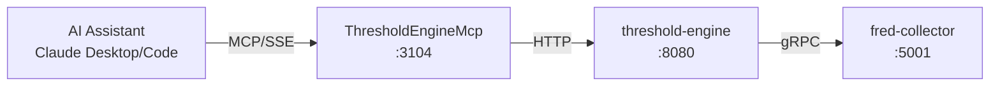

# ThresholdEngine MCP Server

MCP server providing Claude Desktop and Claude Code direct access to ATLAS pattern evaluation and regime detection.

## Overview

Exposes ThresholdEngine REST API as MCP tools, enabling AI assistants to evaluate economic and market patterns, detect regime changes, and access the macro score that drives ATLAS model deployment decisions.

## Architecture



## MCP Tools

### Evaluation Tools

| Tool Name | Description | Key Parameters |
|-----------|-------------|----------------|
| `evaluate` | Evaluate ALL enabled patterns and return complete system state | None |
| `evaluate_pattern` | Evaluate a specific pattern on-demand | `pattern_id` (required): Pattern ID |

### Pattern Discovery Tools

| Tool Name | Description | Key Parameters |
|-----------|-------------|----------------|
| `list_patterns` | List all pattern configurations with filtering | `category`, `enabled_only` |
| `get_pattern` | Get detailed configuration for a specific pattern | `pattern_id` (required) |
| `categories` | List pattern categories with counts | None |

### Administrative Tools

| Tool Name | Description | Key Parameters |
|-----------|-------------|----------------|
| `reload` | Hot-reload pattern configurations from disk | None |

### Diagnostics Tools

| Tool Name | Description | Key Parameters |
|-----------|-------------|----------------|
| `health` | Get ThresholdEngine service health status | None |
| `api_schema` | Get OpenAPI specification for ThresholdEngine API | `format`: "full" or "summary" |

## Signal Interpretation

| Signal | Meaning |
|--------|---------|
| -2.0 | Strongly bearish |
| -1.0 | Moderately bearish |
| 0.0 | Neutral |
| +1.0 | Moderately bullish |
| +2.0 | Strongly bullish |

## Regime Interpretation

| Regime | Score Range | Deployment Level |
|--------|-------------|------------------|
| Crisis | < -20 | L3 (Max defensiveness) |
| Recession | -20 to -10 | L2 |
| LateCycle | -10 to 0 | L1 |
| Neutral | 0 to +10 | L0 (Baseline) |
| Recovery | +10 to +20 | L0 |
| Growth | > +20 | L0 |

## Configuration

### Environment Variables

| Variable | Default | Description |
|----------|---------|-------------|
| `THRESHOLDENGINE_API_URL` | `http://threshold-engine:8080` | Backend service URL |
| `THRESHOLDENGINE_MCP_LOG_LEVEL` | `Warning` | Logging level |
| `THRESHOLDENGINE_MCP_TIMEOUT_SECONDS` | `30` | HTTP request timeout |

### Port Mapping

- Internal: 8080
- External (host): 3104
- SSE endpoint: `http://mercury:3104/sse`

## Development

### Build
```bash
.devcontainer/compile.sh
```

### Build Container
```bash
.devcontainer/build.sh
```

## Deployment

```bash
ansible-playbook playbooks/deploy.yml --tags threshold-engine-mcp
```

## Claude Desktop Integration

Add to `~/.config/Claude/claude_desktop_config.json` (Linux) or `~/Library/Application Support/Claude/claude_desktop_config.json` (macOS):

```json
{
  "mcpServers": {
    "threshold-engine": {
      "command": "uvx",
      "args": ["mcp-proxy", "http://mercury:3104/sse"]
    }
  }
}
```

Claude Desktop uses stdio transport, so `mcp-proxy` bridges stdio to SSE.

## Usage Examples

**Morning briefing:**
```
User: "What's the ATLAS status?"
Claude calls: evaluate
Response: "ATLAS shows Late Cycle regime with macro score -4.4.
7 of 37 patterns firing: Recession (4), Liquidity (2), Commodity (1)"
```

**Deep dive on pattern:**
```
User: "Tell me about the Sahm Rule"
Claude calls: get_pattern("sahm-rule-official")
Response: "The Sahm Rule triggers when 3-month avg unemployment rises 0.5+ points.
Current: 0.28 (below trigger threshold)"
```

**Check specific pattern:**
```
User: "Is the yield curve inverted?"
Claude calls: evaluate_pattern("yield-curve-inversion")
Response: "Pattern triggered: signal -1.5, high confidence"
```

## See Also

- [ThresholdEngine](../ThresholdEngine/README.md) - Backend service documentation
- [FredCollectorMcp](../FredCollectorMcp/README.md) - Economic data access
