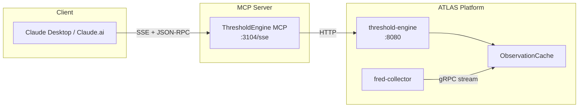

# ThresholdEngine MCP Server

MCP server providing Claude direct access to ATLAS pattern evaluation and regime detection.

## Overview

Wraps the ThresholdEngine REST API, providing:
- **Pattern Signals**: Pre-calculated indicator signals (-2 to +2)
- **Regime Detection**: Current economic regime classification
- **Macro Score**: Aggregated score across all indicators
- **Real-time Evaluation**: On-demand pattern assessment
- **Self-Documentation**: Pattern definitions, API schema

## Architecture



## Technology Stack

- **.NET 9 / C# 13** - Consistent with ATLAS platform
- **MCP Transport**: SSE (Server-Sent Events over HTTP)
- **HTTP Client**: `HttpClient`

---

## MCP Tools (8 Tools)

### Evaluation Tools

#### `evaluate`
Evaluate ALL enabled patterns and return complete system state.

**Parameters:** None

**Returns:**
```json
{
  "regime": "LateCycle",
  "macroScore": -4.4,
  "summary": {
    "patternsEvaluated": 37,
    "patternsTriggered": 7,
    "byCategory": [
      { "category": "Recession", "triggered": 4, "total": 11, "avgSignal": -1.25 }
    ]
  },
  "triggeredPatterns": [
    { "patternId": "yield-curve-inversion", "category": "Recession", "signal": -1.5, "confidence": 1.0 }
  ],
  "evaluatedAt": "2025-11-26T12:00:00Z",
  "durationMs": 45
}
```

**Wraps:** `POST http://threshold-engine:8080/api/patterns/evaluate`

---

#### `evaluate_pattern`
Evaluate a specific pattern on-demand.

**Parameters:**
| Name | Type | Required | Description |
|------|------|----------|-------------|
| `pattern_id` | string | Yes | Pattern ID (e.g., "sahm-rule-official") |

**Returns:**
```json
{
  "patternId": "sahm-rule-official",
  "category": "Recession",
  "triggered": false,
  "signal": 0.0,
  "confidence": 1.0,
  "evaluatedAt": "2025-11-26T12:00:00Z"
}
```

**Wraps:** `POST http://threshold-engine:8080/api/patterns/{id}/evaluate`

---

### Pattern Discovery Tools

#### `list_patterns`
List all pattern configurations with filtering.

**Parameters:**
| Name | Type | Required | Description |
|------|------|----------|-------------|
| `category` | string | No | Filter by category |
| `enabled_only` | boolean | No | Only enabled patterns (default: true) |

**Returns:**
```json
{
  "patterns": [
    {
      "patternId": "sahm-rule-official",
      "name": "Real-time Sahm Rule Recession Indicator",
      "category": "Recession",
      "enabled": true,
      "requiredSeries": ["SAHMCURRENT"]
    }
  ],
  "count": 37,
  "enabledCount": 35
}
```

**Wraps:** `GET http://threshold-engine:8080/api/patterns`

---

#### `get_pattern`
Get detailed configuration for a specific pattern.

**Parameters:**
| Name | Type | Required | Description |
|------|------|----------|-------------|
| `pattern_id` | string | Yes | Pattern ID |

**Returns:**
```json
{
  "patternId": "cu-au-ratio",
  "name": "Copper/Gold Ratio (Dr. Copper)",
  "category": "Commodity",
  "description": "Copper/Gold ratio signals growth expectations",
  "enabled": true,
  "requiredSeries": ["PCOPPUSDM", "GOLDAMGBD228NLBM"],
  "expression": "var cu = ctx.GetLatest(\"PCOPPUSDM\"); ..."
}
```

**Wraps:** `GET http://threshold-engine:8080/api/patterns/{id}`

---

#### `categories`
List pattern categories with counts.

**Parameters:** None

**Returns:**
```json
{
  "categories": [
    { "name": "Recession", "patternCount": 11, "enabledCount": 11, "patterns": ["sahm-rule-official", "..."] }
  ],
  "totalPatterns": 37,
  "totalEnabled": 35
}
```

**Wraps:** Aggregation from patterns

---

### Administrative Tools

#### `reload`
Hot-reload pattern configurations from disk.

**Parameters:** None

**Returns:**
```json
{
  "patternCount": 37,
  "reloadedAt": "2025-11-26T12:00:00Z",
  "message": "Successfully reloaded 37 patterns"
}
```

**Wraps:** `POST http://threshold-engine:8080/api/patterns/reload`

---

### Discovery & Diagnostics Tools

#### `health`
Get ThresholdEngine service health status.

**Parameters:** None

**Returns:**
```json
{
  "status": "healthy",
  "timestamp": "2025-11-26T12:00:00Z",
  "checks": [
    { "name": "database", "status": "healthy" }
  ]
}
```

**Wraps:** `GET http://threshold-engine:8080/health`

---

#### `api_schema`
Get the OpenAPI specification for ThresholdEngine API.

**Parameters:**
| Name | Type | Required | Description |
|------|------|----------|-------------|
| `format` | string | No | "full" or "summary" (default) |

**Returns (summary):**
```json
{
  "title": "ThresholdEngine API",
  "version": "1.0.0",
  "endpoints": [
    { "path": "/api/patterns", "method": "GET", "summary": "List all patterns" },
    { "path": "/api/patterns/evaluate", "method": "POST", "summary": "Evaluate all patterns" }
  ]
}
```

**Wraps:** `GET http://threshold-engine:8080/swagger/v1/swagger.json`

---

## Configuration

### Environment Variables

```bash
THRESHOLDENGINE_API_URL=http://threshold-engine:8080
THRESHOLDENGINE_MCP_LOG_LEVEL=Warning
THRESHOLDENGINE_MCP_TIMEOUT_SECONDS=30
```

### Claude Desktop Configuration

```json
{
  "mcpServers": {
    "threshold-engine": {
      "command": "uvx",
      "args": ["mcp-proxy", "http://mercury:3104/sse"]
    }
  }
}
```

Claude Desktop doesn't natively support SSE transport, so `mcp-proxy` bridges stdio↔SSE.

---

## Usage Examples

### Morning Briefing
```
User: "What's the ATLAS status?"

Claude calls: evaluate

Response: "ATLAS shows Late Cycle regime with macro score -4.4.

7 of 37 patterns firing:
- Recession (4): yield curve inverted (-1.5), consumer sentiment weak (-1.0)
- Liquidity (2): M2 growth tight (-1.0), real rates restrictive (-1.0)
- Commodity (1): Cu/Au ratio bearish (-1.0)"
```

### Deep Dive on Pattern
```
User: "Tell me about the Sahm Rule"

Claude calls: get_pattern("sahm-rule-official")

Response: "The Sahm Rule (SAHMCURRENT) triggers when the 3-month average
unemployment rate rises 0.5+ points above its 12-month low.

Current: 0.28 (below 0.5 trigger threshold)
Required series: SAHMCURRENT (monthly, FRED-maintained)"
```

---

## Signal Interpretation

| Signal | Meaning |
|--------|---------|
| -2.0 | Strongly bearish |
| -1.0 | Moderately bearish |
| 0.0 | Neutral |
| +1.0 | Moderately bullish |
| +2.0 | Strongly bullish |

## Regime Interpretation

| Regime | Score Range |
|--------|-------------|
| Crisis | < -20 |
| Recession | -20 to -10 |
| LateCycle | -10 to 0 |
| Neutral | 0 to +10 |
| Recovery | +10 to +20 |
| Growth | > +20 |

---

## API Reference

See `/swagger/v1/swagger.json` on running service, or use `api_schema` tool.
