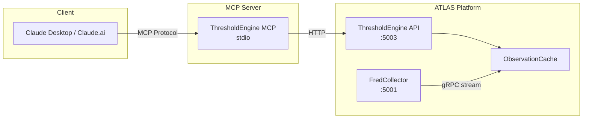

# ThresholdEngine MCP Server

MCP server providing Claude direct access to ATLAS pattern evaluation and regime detection.

## Overview

Wraps the ThresholdEngine REST API, providing:
- **Pattern Signals**: Pre-calculated indicator signals (-2 to +2)
- **Regime Detection**: Current economic regime classification
- **Macro Score**: Aggregated score across all indicators
- **Real-time Evaluation**: On-demand pattern assessment
- **Self-Documentation**: Pattern definitions, thresholds, API schema

## Architecture



## Technology Stack

- **.NET 9 / C# 13** - Consistent with ATLAS platform
- **MCP Transport**: stdio (stdin/stdout JSON-RPC)
- **HTTP Client**: `HttpClient` with Polly resilience

---

## MCP Tools (9 Tools)

### Evaluation Tools

#### `threshold_evaluate` ⭐ Primary Tool
Evaluate ALL enabled patterns and return complete system state.

**Parameters:** None

**Returns:**
```json
{
  "regime": "LateCycle",
  "macroScore": -4.4,
  "summary": {
    "patternsEvaluated": 37,
    "patternsTriggered": 7,
    "byCategory": {
      "Recession": { "triggered": 4, "total": 11, "avgSignal": -1.25 },
      "Liquidity": { "triggered": 2, "total": 7, "avgSignal": -1.0 },
      "Commodity": { "triggered": 1, "total": 1, "avgSignal": -1.0 }
    }
  },
  "triggeredPatterns": [
    {
      "patternId": "yield-curve-inversion",
      "name": "Yield Curve Inversion (10Y - 2Y)",
      "category": "Recession",
      "signal": -1.5,
      "confidence": 1.0,
      "description": "Yield curve inverted for 892 days"
    }
  ],
  "evaluatedAt": "2025-11-26T12:00:00Z",
  "durationMs": 45
}
```

**Wraps:** `POST http://mercury:5003/api/patterns/evaluate`

---

#### `threshold_evaluate_pattern`
Evaluate a specific pattern on-demand with detailed context.

**Parameters:**
| Name | Type | Required | Description |
|------|------|----------|-------------|
| `pattern_id` | string | Yes | Pattern ID (e.g., "sahm-rule-official") |

**Returns:**
```json
{
  "patternId": "sahm-rule-official",
  "name": "Real-time Sahm Rule Recession Indicator",
  "category": "Recession",
  "triggered": false,
  "signal": 0.0,
  "confidence": 1.0,
  "currentValues": {
    "SAHMCURRENT": 0.28
  },
  "thresholds": {
    "trigger": 0.5,
    "warning": 0.3,
    "current": 0.28
  },
  "interpretation": "SAHMCURRENT at 0.28, below 0.5 trigger threshold. Would need unemployment to rise ~0.22 points to trigger.",
  "evaluatedAt": "2025-11-26T12:00:00Z"
}
```

**Wraps:** `POST http://mercury:5003/api/patterns/{id}/evaluate`

---

### Pattern Discovery Tools

#### `threshold_list_patterns`
List all pattern configurations with filtering.

**Parameters:**
| Name | Type | Required | Description |
|------|------|----------|-------------|
| `category` | string | No | Filter by category |
| `enabled_only` | boolean | No | Only enabled patterns (default: true) |
| `triggered_only` | boolean | No | Only currently triggered patterns |

**Returns:**
```json
{
  "patterns": [
    {
      "patternId": "sahm-rule-official",
      "name": "Real-time Sahm Rule Recession Indicator",
      "category": "Recession",
      "enabled": true,
      "requiredSeries": ["SAHMCURRENT"],
      "signalRange": "-2 to 0",
      "description": "100% accuracy predicting recessions since 1970"
    }
  ],
  "count": 37,
  "enabledCount": 35,
  "triggeredCount": 7
}
```

**Wraps:** `GET http://mercury:5003/api/patterns`

---

#### `threshold_get_pattern`
Get detailed configuration and interpretation guide for a pattern.

**Parameters:**
| Name | Type | Required | Description |
|------|------|----------|-------------|
| `pattern_id` | string | Yes | Pattern ID |

**Returns:**
```json
{
  "patternId": "cu-au-ratio",
  "name": "Copper/Gold Ratio (Dr. Copper)",
  "category": "Commodity",
  "description": "Copper/Gold ratio signals economic growth expectations. Copper demand rises with industrial activity; gold rises with fear.",
  "expression": "var cu = ctx.GetLatest(\"PCOPPUSDM\"); ...",
  "enabled": true,
  "requiredSeries": ["PCOPPUSDM", "GOLDAMGBD228NLBM"],
  "thresholds": {
    "strongBear": { "condition": "< 0.15", "signal": -2, "meaning": "Severe growth concerns" },
    "bear": { "condition": "0.15 - 0.18", "signal": -1, "meaning": "Growth slowing" },
    "neutral": { "condition": "0.18 - 0.22", "signal": 0, "meaning": "Normal conditions" },
    "bull": { "condition": "> 0.22", "signal": +1, "meaning": "Growth accelerating" }
  },
  "historicalContext": "Ratio dropped below 0.15 in 2008, 2020. Currently useful leading indicator.",
  "updateFrequency": "Daily (copper monthly, gold daily)"
}
```

**Wraps:** `GET http://mercury:5003/api/patterns/{id}` + enrichment

---

#### `threshold_categories`
List pattern categories with weights and descriptions.

**Parameters:** None

**Returns:**
```json
{
  "categories": [
    {
      "name": "Recession",
      "weight": 0.35,
      "patternCount": 11,
      "triggeredCount": 4,
      "avgSignal": -1.25,
      "description": "Employment, sentiment, yield curve indicators",
      "patterns": ["sahm-rule-official", "yield-curve-inversion", "consumer-confidence-collapse", "..."]
    },
    {
      "name": "Liquidity",
      "weight": 0.25,
      "patternCount": 7,
      "triggeredCount": 2,
      "avgSignal": -1.0,
      "description": "Credit spreads, Fed policy, money supply",
      "patterns": ["hy-spread-blowout", "m2-growth-rate", "real-rates", "..."]
    }
  ],
  "totalWeight": 1.0,
  "scoringMethod": "Weighted average of category signals"
}
```

**Wraps:** Aggregation from patterns

---

### Regime & History Tools

#### `threshold_regime_history`
Get regime transition history.

**Parameters:**
| Name | Type | Required | Description |
|------|------|----------|-------------|
| `days` | integer | No | Lookback period (default: 90) |

**Returns:**
```json
{
  "currentRegime": "LateCycle",
  "currentScore": -4.4,
  "daysinCurrentRegime": 45,
  "history": [
    {
      "regime": "LateCycle",
      "enteredAt": "2025-10-12T00:00:00Z",
      "score": -4.4,
      "trigger": "Consumer confidence dropped below 70"
    },
    {
      "regime": "Neutral",
      "enteredAt": "2025-08-15T00:00:00Z",
      "exitedAt": "2025-10-12T00:00:00Z",
      "score": -0.5,
      "daysInRegime": 58
    }
  ],
  "regimeDefinitions": {
    "Crisis": "< -20",
    "Recession": "-20 to -10",
    "LateCycle": "-10 to 0",
    "Neutral": "0 to +10",
    "Recovery": "+10 to +20",
    "Growth": "> +20"
  }
}
```

**Wraps:** Needs new endpoint or aggregation from audit log

---

### Administrative Tools

#### `threshold_reload`
Hot-reload pattern configurations from disk.

**Parameters:** None

**Returns:**
```json
{
  "patternCount": 37,
  "reloadedAt": "2025-11-26T12:00:00Z",
  "changes": {
    "added": ["new-pattern-id"],
    "modified": ["cu-au-ratio"],
    "removed": []
  },
  "message": "Successfully reloaded 37 patterns"
}
```

**Wraps:** `POST http://mercury:5003/api/patterns/reload`

---

### Discovery & Diagnostics Tools

#### `threshold_health`
Get ThresholdEngine service health and evaluation status.

**Parameters:** None

**Returns:**
```json
{
  "status": "healthy",
  "database": "connected",
  "grpcStream": "connected",
  "observationCache": {
    "seriesCount": 39,
    "oldestData": "2025-11-25T18:00:00Z",
    "cacheHitRate": 0.94
  },
  "lastEvaluation": {
    "timestamp": "2025-11-26T11:55:00Z",
    "durationMs": 45,
    "patternsEvaluated": 37,
    "errors": 0
  },
  "uptime": "14d 6h 32m",
  "version": "1.0.0"
}
```

**Wraps:** `GET http://mercury:5003/health` + metrics

---

#### `threshold_api_schema`
Get the OpenAPI specification for ThresholdEngine API.

**Parameters:**
| Name | Type | Required | Description |
|------|------|----------|-------------|
| `format` | string | No | "full" (complete spec) or "summary" (endpoints only, default) |

**Returns (summary):**
```json
{
  "title": "ThresholdEngine API",
  "version": "1.0.0",
  "endpoints": [
    { "path": "/api/patterns", "method": "GET", "summary": "List all patterns" },
    { "path": "/api/patterns/{id}", "method": "GET", "summary": "Get pattern config" },
    { "path": "/api/patterns/evaluate", "method": "POST", "summary": "Evaluate all patterns" },
    { "path": "/api/patterns/{id}/evaluate", "method": "POST", "summary": "Evaluate single pattern" },
    { "path": "/api/patterns/reload", "method": "POST", "summary": "Reload configs" }
  ]
}
```

**Wraps:** `GET http://mercury:5003/swagger/v1/swagger.json`

---

## Signal Interpretation

| Signal | Meaning | Typical Action |
|--------|---------|----------------|
| -2.0 | Strongly bearish | Increase defensive allocation |
| -1.5 | Moderately-strongly bearish | Consider defensive moves |
| -1.0 | Moderately bearish | Monitor closely |
| -0.5 | Slightly bearish | Awareness |
| 0.0 | Neutral | No action |
| +0.5 | Slightly bullish | Awareness |
| +1.0 | Moderately bullish | Consider risk-on |
| +1.5 | Moderately-strongly bullish | Deploy capital |
| +2.0 | Strongly bullish | Full deployment |

## Regime Interpretation

| Regime | Score Range | Typical Allocation | Market Conditions |
|--------|-------------|-------------------|-------------------|
| Crisis | < -20 | 80%+ defensive | Financial system stress, flight to safety |
| Recession | -20 to -10 | 70-80% defensive | Economic contraction confirmed |
| **LateCycle** | -10 to 0 | 60-70% defensive | Warning signs accumulating (CURRENT) |
| Neutral | 0 to +10 | 50-60% defensive | Mixed signals, no clear trend |
| Recovery | +10 to +20 | 40-50% defensive | Early expansion indicators |
| Growth | > +20 | 30-40% defensive | Broad economic expansion |

---

## Configuration

### Environment Variables

```bash
THRESHOLDENGINE_API_URL=http://mercury:5003
THRESHOLDENGINE_MCP_LOG_LEVEL=Information
THRESHOLDENGINE_MCP_TIMEOUT_SECONDS=30
```

### Claude Desktop Configuration

```json
{
  "mcpServers": {
    "threshold-engine": {
      "command": "dotnet",
      "args": ["run", "--project", "/path/to/ThresholdEngineMcp"],
      "env": {
        "THRESHOLDENGINE_API_URL": "http://mercury:5003"
      }
    }
  }
}
```

---

## Usage Examples

### Morning Briefing
```
User: "What's the ATLAS status?"

Claude calls: threshold_evaluate

Response: "ATLAS shows Late Cycle regime with macro score -4.4.

7 of 37 patterns firing:
• Recession (4): yield curve inverted (-1.5), consumer sentiment weak (-1.0), 
  freight recession (-2.0), claims elevated (-0.5)
• Liquidity (2): M2 growth tight (-1.0), real rates restrictive (-1.0)
• Commodity (1): Cu/Au ratio bearish (-1.0)

Current 64% defensive allocation is appropriate for conditions."
```

### Deep Dive on Specific Pattern
```
User: "Tell me about the Sahm Rule"

Claude calls: threshold_get_pattern("sahm-rule-official")

Response: "The Sahm Rule (SAHMCURRENT) triggers when the 3-month average 
unemployment rate rises 0.5+ points above its 12-month low.

Thresholds:
• 0.3: Warning level
• 0.5: Official trigger (100% accuracy since 1970)
• 1.0+: Deep recession confirmed

Current: 0.28 (below warning)
Required series: SAHMCURRENT (monthly, FRED-maintained)"
```

### Understand Pattern Categories
```
User: "What drives the recession score?"

Claude calls: threshold_categories

Response: "Recession category (35% weight) has 11 patterns, 4 currently firing:

Firing:
• yield-curve-inversion: -1.5 (inverted 892 days)
• consumer-confidence-collapse: -1.0 (sentiment at 68)
• freight-recession: -2.0 (40+ months decline)
• initial-claims-spike: -0.5 (claims at 220K)

Not Firing:
• sahm-rule-official: 0.0 (0.28, threshold 0.5)
• recession-probability: 0.0 (8%, threshold 20%)
• yield-curve-steepening: 0.0 (still inverted)
..."
```

### Check Recent Regime Changes
```
User: "When did we enter Late Cycle?"

Claude calls: threshold_regime_history(days=90)

Response: "Entered Late Cycle 45 days ago (Oct 12) when consumer confidence 
dropped below 70. Before that, we were Neutral for 58 days (Aug 15 - Oct 12).

The macro score has deteriorated from -0.5 to -4.4 over this period."
```

---

## MCP Resources

Static resources for context:

| Resource URI | Description |
|--------------|-------------|
| `threshold://patterns/all` | Complete pattern inventory with configs |
| `threshold://categories` | Category weights and definitions |
| `threshold://regime/current` | Current regime with interpretation |
| `threshold://signals/interpretation` | Signal scale explanation |

---

## Pattern Categories Reference

| Category | Patterns | Weight | Focus |
|----------|----------|--------|-------|
| Recession | 11 | 35% | Employment, sentiment, yield curve |
| Liquidity | 7 | 25% | Credit spreads, Fed, money supply |
| Growth | 5 | 20% | GDP, production, housing |
| NBFI | 8 | 10% | Shadow banking, stress indices |
| Commodity | 3 | 5% | Cu/Au ratio, oil, Baltic |
| Valuation | 5 | 5% | CAPE, Buffett, forward P/E |

---

## API Reference

See `/swagger/v1/swagger.json` on running service, or use `threshold_api_schema` tool.
