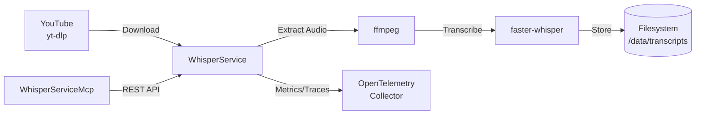

# WhisperService

Video transcription service using faster-whisper for speech-to-text conversion.

## Overview

WhisperService downloads videos from YouTube and other platforms using yt-dlp, extracts audio, and transcribes it using faster-whisper. It provides an async job queue with status tracking, persists transcripts to disk, and exposes metrics/traces via OpenTelemetry.

## Architecture



## Features

- **Async Job Queue**: Submit videos for transcription and poll for completion
- **Batch Backfill**: Submit multiple videos at once for batch processing
- **Auto Language Detection**: Detects spoken language or accepts explicit language code
- **Transcript Persistence**: Saves completed transcripts to JSON files with metadata
- **Video Cleanup**: Automatically removes video/audio files after transcription
- **Job TTL**: Cleans up old completed/failed jobs after 24 hours
- **OpenTelemetry**: Full observability with metrics, traces, and structured logs

## Configuration

| Variable | Description | Default |
|----------|-------------|---------|
| `WHISPER_MODEL` | Whisper model size | `large-v3` |
| `WHISPER_DEVICE` | Compute device | `cpu` |
| `WHISPER_COMPUTE_TYPE` | Quantization type | `int8` |
| `WHISPER_NUM_WORKERS` | Concurrent transcription threads | `8` |
| `WHISPER_BEAM_SIZE` | Beam search size | `5` |
| `WHISPER_DATA_DIR` | Video download directory | `/data/videos` |
| `WHISPER_MODEL_DIR` | Model cache directory | `/data/models` |
| `WHISPER_TRANSCRIPT_DIR` | Transcript output directory | `/data/transcripts` |
| `WHISPER_KEEP_VIDEOS` | Keep videos after transcription | `false` |
| `WHISPER_PORT` | HTTP port | `8090` |
| `WHISPER_LOG_LEVEL` | Log level | `WARNING` |
| `WHISPER_OTEL_ENDPOINT` | OTLP collector endpoint | `http://otel-collector:4317` |
| `WHISPER_OTEL_ENABLED` | Enable OpenTelemetry | `true` |

## API Endpoints

### REST API (Port 8090)

| Endpoint | Method | Description |
|----------|--------|-------------|
| `/transcribe` | POST | Submit video URL for transcription |
| `/backfill` | POST | Submit multiple URLs for batch transcription |
| `/status/{job_id}` | GET | Get job status and progress |
| `/transcript/{job_id}` | GET | Get completed transcript |
| `/health` | GET | Health check with queue depth and model status |

### Request/Response Examples

**Submit Transcription**
```json
POST /transcribe
{
  "url": "https://www.youtube.com/watch?v=...",
  "language": "en",
  "priority": 5
}

Response:
{
  "job_id": "abc12345",
  "status": "queued",
  "message": "Queued at position 1"
}
```

**Get Transcript**
```json
GET /transcript/abc12345

Response:
{
  "job_id": "abc12345",
  "url": "https://...",
  "title": "Video Title",
  "duration_seconds": 300.5,
  "language": "en",
  "transcript": "Full transcription text...",
  "segments": [{"start": 0.0, "end": 2.5, "text": "..."}],
  "completed_at": "2025-01-01T12:00:00Z"
}
```

## Project Structure

```
WhisperService/
├── src/
│   ├── main.py           # FastAPI app, job queue, endpoints
│   ├── config.py         # Pydantic settings with WHISPER_ prefix
│   ├── models.py         # Request/response models, job status enum
│   ├── transcriber.py    # faster-whisper integration
│   └── downloader.py     # yt-dlp video download, ffmpeg audio extraction
├── config/
│   └── whisper.yaml      # Default configuration
├── requirements.txt      # Python dependencies
└── .devcontainer/        # Dev container configuration
    ├── Containerfile     # Container image build
    ├── build.sh          # Build script
    └── compose.dev.yaml  # Development compose
```

## Development

### Prerequisites

- Python 3.12+
- ffmpeg
- yt-dlp

### Using Dev Container

```bash
# Open in VS Code and select "Reopen in Container"
cd /workspace
python -m uvicorn src.main:app --reload --host 0.0.0.0 --port 8090
```

### Build Container Image

```bash
.devcontainer/build.sh
```

## Deployment

```bash
ansible-playbook playbooks/deploy.yml --tags whisper-service
```

## Ports

| Port | Type | Description |
|------|------|-------------|
| 8090 | HTTP (container) | REST API, health checks |

## See Also

- [WhisperServiceMcp](../WhisperServiceMcp/README.md) - MCP server for AI assistant integration
- [docs/ARCHITECTURE.md](../docs/ARCHITECTURE.md) - System architecture
