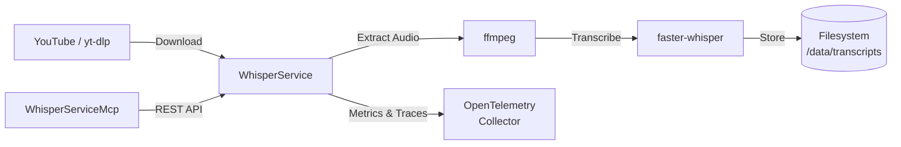

# WhisperService

Video transcription service using faster-whisper for speech-to-text conversion.

## Overview

WhisperService downloads videos from YouTube and other platforms using yt-dlp, extracts audio via ffmpeg, and transcribes it using faster-whisper. It provides an async job queue with status tracking, persists transcripts as JSON to disk, and exports metrics and traces via OpenTelemetry. The companion WhisperServiceMcp exposes this service to AI assistants.

## Architecture



Videos are downloaded with yt-dlp, converted to 16kHz MP3 by ffmpeg, then transcribed by faster-whisper. Completed transcripts are persisted as JSON files and video/audio files are cleaned up automatically.

## Features

- **Async Job Queue**: Submit videos for transcription and poll for completion
- **Batch Backfill**: Submit multiple URLs at once for batch processing
- **Auto Language Detection**: Detects spoken language or accepts an explicit language code
- **Transcript Persistence**: Saves completed transcripts to JSON with full metadata
- **Video Cleanup**: Automatically removes video/audio files after transcription
- **Job TTL**: Cleans up old completed/failed jobs after 24 hours
- **OpenTelemetry**: Full observability with metrics, traces, and structured logging
- **Retry with Backoff**: Downloads retry up to 3 times with exponential backoff

## Configuration

| Variable | Description | Default |
|----------|-------------|---------|
| `WHISPER_MODEL` | Whisper model size (tiny, base, small, medium, large-v3) | `large-v3` |
| `WHISPER_DEVICE` | Compute device (`cpu` or `cuda`) | `cpu` |
| `WHISPER_COMPUTE_TYPE` | Quantization type (`int8`, `float16`, `float32`) | `int8` |
| `WHISPER_NUM_WORKERS` | Concurrent transcription threads | `8` |
| `WHISPER_BEAM_SIZE` | Beam search size | `5` |
| `WHISPER_DATA_DIR` | Video download directory | `/data/videos` |
| `WHISPER_MODEL_DIR` | Model cache directory | `/data/models` |
| `WHISPER_TRANSCRIPT_DIR` | Transcript output directory | `/data/transcripts` |
| `WHISPER_KEEP_VIDEOS` | Keep videos after transcription | `false` |
| `WHISPER_PORT` | HTTP port | `8090` |
| `WHISPER_LOG_LEVEL` | Log level | `WARNING` |
| `WHISPER_OTEL_ENDPOINT` | OTLP collector endpoint | `http://otel-collector:4317` |
| `WHISPER_OTEL_ENABLED` | Enable OpenTelemetry | `true` |

## API Endpoints

### REST API (Port 8090)

| Endpoint | Method | Description |
|----------|--------|-------------|
| `/transcribe` | POST | Submit a video URL for transcription |
| `/backfill` | POST | Submit multiple URLs for batch transcription |
| `/status/{job_id}` | GET | Get job status, progress, and ETA |
| `/transcript/{job_id}` | GET | Get completed transcript with segments |
| `/health` | GET | Health check with queue depth and model status |

## Project Structure

```
WhisperService/
├── src/
│   ├── main.py           # FastAPI app, job queue, endpoints, telemetry
│   ├── config.py          # Pydantic settings with WHISPER_ prefix
│   ├── models.py          # Request/response models, job status enum
│   ├── transcriber.py     # faster-whisper integration (thread pool)
│   └── downloader.py      # yt-dlp download, ffmpeg audio extraction
├── config/
│   └── whisper.yaml       # Default configuration reference
├── requirements.txt       # Python dependencies
└── .devcontainer/
    ├── Containerfile      # Container image (python:3.12-slim)
    ├── build.sh           # Build script
    ├── compose.dev.yaml   # Development compose
    └── devcontainer.json  # VS Code dev container config
```

## Development

### Prerequisites

- VS Code with Dev Containers extension
- Access to shared infrastructure (observability stack)

### Getting Started

1. Open in VS Code: `code WhisperService/`
2. Reopen in Container (Cmd/Ctrl+Shift+P -> "Dev Containers: Reopen in Container")
3. Run: `python -m uvicorn src.main:app --reload --host 0.0.0.0 --port 8090`

### Build Container Image

```bash
.devcontainer/build.sh
```

## Deployment

```bash
ansible-playbook playbooks/deploy.yml --tags whisper-service
```

## Ports

| Port | Type | Description |
|------|------|-------------|
| 8090 | HTTP (container + host) | REST API, health checks |

## See Also

- [WhisperServiceMcp](../WhisperServiceMcp/README.md) - MCP server for AI assistant integration
- [docs/ARCHITECTURE.md](../docs/ARCHITECTURE.md) - System architecture
