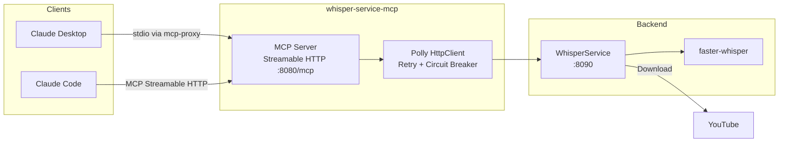

# whisper-service-mcp

MCP server providing Claude Desktop and Claude Code direct access to video transcription via WhisperService.

## Overview

`whisper-service-mcp` exposes the WhisperService REST API as MCP tools so AI assistants can submit YouTube videos for transcription, poll job status, and retrieve completed transcripts with timestamped segments. It is a thin C#/.NET 10 proxy: tool calls are forwarded over HTTP to the Python WhisperService backend through a Polly-wrapped `HttpClient`.

## Architecture



Clients invoke MCP tools over Streamable HTTP at `/mcp`. The server resolves each tool call into one REST call against WhisperService, wrapped in Polly retry + circuit breaker.

## Features

- **Async Transcription**: `transcribe` returns a `job_id` immediately; poll `get_status`, then call `get_transcript` when complete
- **Batch Submission**: `backfill` accepts a comma-separated URL list and enqueues all jobs in one call
- **Timestamped Segments**: `get_transcript` optionally returns per-segment `start`/`end`/`text`
- **Polly Resilience**: 3 retries with exponential backoff (`2^n` seconds) plus circuit breaker (5 failures → 30 s break)
- **Stateless MCP**: `WithHttpTransport(Stateless = true)` — no per-session server state

## Configuration

| Variable | Description | Default |
|----------|-------------|---------|
| `WHISPER_API_URL` | WhisperService backend base URL | `http://whisper-service:8090` |
| `WHISPER_MCP_TIMEOUT_SECONDS` | `HttpClient` request timeout, seconds | `300` |
| `ASPNETCORE_URLS` | Kestrel listen address | `http://+:8080` |

Note: `WHISPER_MCP_LOG_LEVEL` is exported by the container image and `compose.yaml` but is currently inert — `Program.cs` hardcodes `MinimumLevel.Warning()`. Treat the log level as fixed until the code reads the env var.

## API Endpoints

The public surface is the MCP tool set, served over Streamable HTTP at `POST /mcp` on port 8080 (host-mapped to 3108). A `GET /health` liveness endpoint is also exposed.

### MCP Tools

| Tool | Description | Parameters |
|------|-------------|------------|
| `health` | Backend health: status, worker count, queue depth, model-loaded flag, uptime | none |
| `transcribe` | Submit one YouTube URL, returns `job_id` (async) | `url`, `language?`, `priority=5` |
| `backfill` | Submit a comma-separated list of YouTube URLs in one batch | `urls`, `priority=5` |
| `get_status` | Poll job status, progress (%), ETA, error | `job_id` |
| `get_transcript` | Fetch the completed transcript; optionally include segments | `job_id`, `include_segments=false` |

`priority` is recorded by the backend but is not used for queue ordering.

## Project Structure

```
WhisperService/mcp/
├── Client/
│   ├── IWhisperServiceClient.cs
│   ├── WhisperServiceClient.cs
│   └── Models/
│       └── ClientModels.cs       # Request/response DTOs, JobStatus constants
├── Tools/
│   └── WhisperTools.cs           # 5 MCP tool definitions
├── Program.cs                    # Startup, Serilog, MCP map, /health
├── DependencyInjection.cs        # HttpClient + Polly retry + circuit breaker
├── WhisperServiceMcp.csproj
└── Containerfile                 # Multi-stage .NET 10 build, non-root user
```

The parent [WhisperService/](../README.md) is a Python service; this MCP child is C#/.NET 10 and is built independently. Source files live directly under `mcp/` (no nested `src/`), matching the sibling pattern used by `FredCollector/mcp/`, `ThresholdEngine/mcp/`, `FinnhubCollector/mcp/`, `OfrCollector/mcp/`, and `SecMaster/mcp/`.

### Build Container

```bash
sudo nerdctl build -f WhisperService/mcp/Containerfile -t whisper-service-mcp:latest .
```

The build context must be the monorepo root because the Containerfile `COPY`s `WhisperService/mcp/`.

## Deployment

```bash
ansible-playbook playbooks/deploy.yml --tags whisper-service-mcp
```

The container runs as a non-root user (uid 1001) with a 256 MB memory / 0.5 CPU limit and depends on `whisper-service` being healthy.

## Ports

| Port | Protocol | Description |
|------|----------|-------------|
| 8080 | HTTP | MCP Streamable HTTP at `/mcp`, plus `/health` (container-internal) |
| 3108 | HTTP | Host-mapped to container `8080` (see `compose.yaml`) |

## Claude Desktop Integration

Add to `~/.config/Claude/claude_desktop_config.json`:

```json
{
  "mcpServers": {
    "whisper": {
      "command": "uvx",
      "args": ["mcp-proxy", "http://mercury:3108/mcp"]
    }
  }
}
```

Claude Desktop speaks stdio; `mcp-proxy` bridges stdio to the Streamable HTTP endpoint.

## See Also

- [WhisperService](../README.md) — Python backend (faster-whisper)
- [Model Context Protocol](https://modelcontextprotocol.io/) — MCP specification
- [docs/ARCHITECTURE.md](../../docs/ARCHITECTURE.md) — System design
