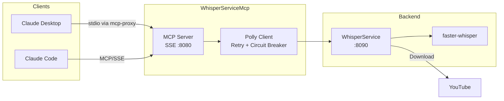

# WhisperServiceMcp

MCP server providing Claude Desktop and Claude Code direct access to video transcription via WhisperService.

## Overview

WhisperServiceMcp exposes the WhisperService REST API as MCP tools, enabling AI assistants to transcribe YouTube videos using faster-whisper. It acts as a thin proxy layer: submit videos for transcription, track job progress, and retrieve completed transcripts with timestamped segments. The service communicates with WhisperService over HTTP and exposes tools via SSE transport for MCP clients.

## Architecture



AI assistants connect via MCP over SSE transport. The MCP server proxies requests through a Polly-resilient HTTP client to WhisperService, which handles video download and transcription.

## Features

- **Async Transcription**: Submit videos and poll for completion with job IDs
- **Sync Transcription**: Submit and wait for completion in a single tool call (configurable timeout)
- **Batch Processing**: Submit multiple URLs for bulk transcription via backfill
- **Timestamped Segments**: Retrieve transcripts with per-segment start/end timestamps
- **Polly Resilience**: Exponential backoff retry (3 attempts) and circuit breaker (5 failures, 30s break)
- **SSE Keepalive**: Periodic keepalive comments prevent mcp-proxy connection timeouts

## Configuration

| Variable | Description | Default |
|----------|-------------|---------|
| `WHISPER_API_URL` | WhisperService backend URL | `http://whisper-service:8090` |
| `WHISPER_MCP_TIMEOUT_SECONDS` | HTTP client request timeout (seconds) | `300` |
| `WHISPER_MCP_LOG_LEVEL` | Serilog minimum log level | `Warning` |
| `ASPNETCORE_URLS` | Listen address | `http://+:8080` |

## API (MCP Tools)

| Tool | Description | Key Parameters |
|------|-------------|----------------|
| `health` | Service health, queue depth, model status | None |
| `transcribe` | Submit video URL, returns job ID | `url`, `language`, `priority` |
| `transcribe_and_wait` | Submit and wait for full transcript | `url`, `language`, `timeout_seconds` |
| `get_status` | Get job transcription progress | `job_id` |
| `get_transcript` | Get completed transcript text | `job_id`, `include_segments` |
| `backfill` | Batch submit multiple URLs | `urls` (comma-separated), `priority` |

## Project Structure

```
WhisperServiceMcp/
├── src/
│   ├── Program.cs                # MCP server startup, Serilog, health endpoint
│   ├── DependencyInjection.cs    # HttpClient with Polly retry + circuit breaker
│   ├── SseKeepaliveMiddleware.cs # SSE keepalive to prevent connection timeouts
│   ├── Tools/
│   │   └── WhisperTools.cs       # MCP tool definitions (6 tools)
│   ├── Client/
│   │   ├── IWhisperServiceClient.cs
│   │   ├── WhisperServiceClient.cs
│   │   └── Models/
│   │       └── ClientModels.cs   # Request/response DTOs
│   └── Containerfile             # Multi-stage .NET 10 build
└── .devcontainer/
    ├── devcontainer.json
    └── compile.sh
```

## Development

### Prerequisites

- VS Code with Dev Containers extension
- Access to shared infrastructure (WhisperService must be running)

### Getting Started

1. Open in VS Code: `code WhisperServiceMcp/`
2. Reopen in Container (Cmd/Ctrl+Shift+P -> "Dev Containers: Reopen in Container")
3. Build: `.devcontainer/compile.sh`

## Deployment

```bash
ansible-playbook playbooks/deploy.yml --tags whisper-mcp
```

## Ports

| Port | Protocol | Description |
|------|----------|-------------|
| 8080 | HTTP | MCP server, SSE transport (internal) |
| 3108 | HTTP | Host-mapped MCP endpoint |

## Claude Desktop Integration

Add to `~/.config/Claude/claude_desktop_config.json`:

```json
{
  "mcpServers": {
    "whisper": {
      "command": "uvx",
      "args": ["mcp-proxy", "http://mercury:3108/sse"]
    }
  }
}
```

Claude Desktop uses stdio transport; `mcp-proxy` bridges stdio to SSE.

## See Also

- [WhisperService](../WhisperService/README.md) - Backend transcription service (faster-whisper)
- [Model Context Protocol](https://modelcontextprotocol.io/) - MCP specification
- [docs/ARCHITECTURE.md](../docs/ARCHITECTURE.md) - System design
