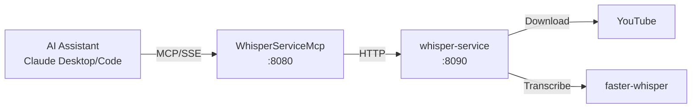

# WhisperService MCP Server

MCP server providing Claude Desktop and Claude Code direct access to video transcription via WhisperService.

## Overview

Exposes WhisperService REST API as MCP tools, enabling AI assistants to transcribe YouTube videos using faster-whisper. Submit videos for transcription, track job progress, and retrieve completed transcripts with timestamped segments.

## Architecture



## MCP Tools

| Tool Name | Description | Key Parameters |
|-----------|-------------|----------------|
| `health` | Get WhisperService health status including queue depth and model status | None |
| `transcribe` | Submit a YouTube video URL for transcription | `url` (required), `language`, `priority` |
| `backfill` | Submit multiple YouTube URLs for batch transcription | `urls` (comma-separated), `priority` |
| `get_status` | Get the status of a transcription job | `job_id` (required) |
| `get_transcript` | Get the completed transcript for a job | `job_id` (required), `include_segments` |
| `transcribe_and_wait` | Submit and wait for completion, returns full transcript | `url`, `language`, `timeout_seconds` |

### Tool Details

**transcribe**
- Submits a single video and returns a job ID immediately
- Use `get_status` to poll for completion

**transcribe_and_wait**
- Convenience tool that submits and polls until complete
- Default timeout: 300 seconds (5 minutes)
- Returns full transcript on completion

**get_transcript**
- Only works for completed jobs
- Set `include_segments=true` for timestamped transcript segments

## Configuration

### Environment Variables

| Variable | Default | Description |
|----------|---------|-------------|
| `WHISPER_API_URL` | `http://whisper-service:8090` | Backend service URL |
| `WHISPER_MCP_TIMEOUT_SECONDS` | `300` | HTTP request timeout |
| `WHISPER_MCP_LOG_LEVEL` | `Warning` | Logging level |

### Port Mapping

- Internal: 8080
- Transport: HTTP with SSE

## Project Structure

```
WhisperServiceMcp/
├── src/
│   ├── Program.cs              # MCP server startup
│   ├── DependencyInjection.cs  # HttpClient with Polly retry/circuit breaker
│   ├── Tools/
│   │   └── WhisperTools.cs     # MCP tool definitions
│   └── Client/
│       ├── IWhisperServiceClient.cs
│       ├── WhisperServiceClient.cs
│       └── Models/
│           └── ClientModels.cs  # Request/response DTOs
├── .devcontainer/
│   ├── devcontainer.json
│   └── compile.sh
└── README.md
```

## Development

### Prerequisites

- .NET 9.0 SDK

### Build

```bash
.devcontainer/compile.sh
```

### Build Container

```bash
# From ATLAS root
sudo nerdctl build -f WhisperServiceMcp/src/Containerfile -t whisper-service-mcp:latest .
```

## Deployment

```bash
ansible-playbook playbooks/deploy.yml --tags whisper-mcp
```

## Claude Desktop Integration

Add to `~/.config/Claude/claude_desktop_config.json` (Linux) or `~/Library/Application Support/Claude/claude_desktop_config.json` (macOS):

```json
{
  "mcpServers": {
    "whisper": {
      "command": "uvx",
      "args": ["mcp-proxy", "http://mercury:PORT/sse"]
    }
  }
}
```

Claude Desktop uses stdio transport, so `mcp-proxy` bridges stdio to SSE.

## Usage Examples

**Transcribe a video:**
```
User: "Transcribe this video: https://youtube.com/watch?v=..."
Claude calls: transcribe_and_wait(url="https://youtube.com/watch?v=...")
Response: "Transcription complete. Title: 'Video Title'. Duration: 5m 30s.
Transcript: 'Hello and welcome to...'"
```

**Check transcription status:**
```
User: "What's the status of job abc123?"
Claude calls: get_status(job_id="abc123")
Response: "Job abc123 is 45% complete, currently transcribing. ETA: 60 seconds."
```

**Batch transcription:**
```
User: "Transcribe these videos: url1, url2, url3"
Claude calls: backfill(urls="url1,url2,url3")
Response: "Queued 3 videos for transcription. Job IDs: abc1, abc2, abc3"
```

## See Also

- [WhisperService](../WhisperService/README.md) - Backend transcription service
- [Model Context Protocol](https://modelcontextprotocol.io/) - MCP documentation
