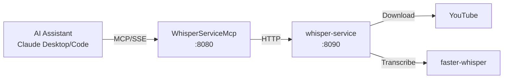

# WhisperServiceMcp

MCP server providing Claude Desktop and Claude Code direct access to video transcription via WhisperService.

## Overview

Exposes WhisperService REST API as MCP tools, enabling AI assistants to transcribe YouTube videos using faster-whisper. Submit videos for transcription, track job progress, and retrieve completed transcripts with timestamped segments.

## Architecture



AI assistants connect via MCP (SSE transport). The MCP server proxies requests to WhisperService, which downloads videos and transcribes using faster-whisper.

## Features

- **Async Transcription**: Submit videos and poll for completion with job IDs
- **Sync Transcription**: Convenience tool that waits for completion and returns full transcript
- **Batch Processing**: Submit multiple URLs for bulk transcription
- **Timestamped Segments**: Retrieve transcripts with per-segment timestamps
- **Polly Resilience**: Retry and circuit breaker policies for backend communication

## Configuration

| Variable | Description | Default |
|----------|-------------|---------|
| `WHISPER_API_URL` | Backend service URL | `http://whisper-service:8090` |
| `WHISPER_MCP_TIMEOUT_SECONDS` | HTTP request timeout | `300` |
| `WHISPER_MCP_LOG_LEVEL` | Logging level | `Warning` |

## API (MCP Tools)

| Tool | Description | Key Parameters |
|------|-------------|----------------|
| `health` | Service health, queue depth, model status | None |
| `transcribe` | Submit video URL, returns job ID | `url`, `language`, `priority` |
| `transcribe_and_wait` | Submit and wait for completion | `url`, `language`, `timeout_seconds` |
| `get_status` | Get job transcription progress | `job_id` |
| `get_transcript` | Get completed transcript | `job_id`, `include_segments` |
| `backfill` | Batch submit multiple URLs | `urls` (comma-separated), `priority` |

## Project Structure

```
WhisperServiceMcp/
├── src/
│   ├── Program.cs              # MCP server startup
│   ├── DependencyInjection.cs  # HttpClient with Polly
│   ├── Tools/
│   │   └── WhisperTools.cs     # MCP tool definitions
│   └── Client/
│       ├── WhisperServiceClient.cs
│       └── Models/
└── .devcontainer/
    ├── devcontainer.json
    └── compile.sh
```

## Development

### Prerequisites

- VS Code with Dev Containers extension
- Access to shared infrastructure

### Getting Started

1. Open in VS Code: `code WhisperServiceMcp/`
2. Reopen in Container (Cmd/Ctrl+Shift+P -> "Dev Containers: Reopen in Container")
3. Build: `.devcontainer/compile.sh`

### Build Container

```bash
.devcontainer/build.sh
```

## Deployment

```bash
ansible-playbook playbooks/deploy.yml --tags whisper-mcp
```

## Ports

| Port | Description |
|------|-------------|
| 8080 | MCP server (internal, SSE transport) |

## Claude Desktop Integration

Add to `~/.config/Claude/claude_desktop_config.json`:

```json
{
  "mcpServers": {
    "whisper": {
      "command": "uvx",
      "args": ["mcp-proxy", "http://mercury:PORT/sse"]
    }
  }
}
```

Claude Desktop uses stdio transport; `mcp-proxy` bridges stdio to SSE.

## See Also

- [WhisperService](../WhisperService/README.md) - Backend transcription service
- [Model Context Protocol](https://modelcontextprotocol.io/) - MCP documentation
