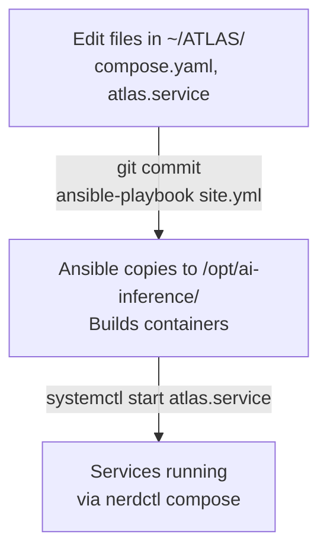

# ATLAS Ansible Automation

**Ansible is the source of truth for ATLAS infrastructure deployments.**

This directory contains the **HOW** (deployment automation), while `../infrastructure/` contains the **WHAT** (service definitions, configs).

## Philosophy

- **Infrastructure-as-code**: All deployments automated and version-controlled
- **Idempotent**: Running playbooks multiple times produces the same result
- **Declarative**: Define desired state, ansible figures out how to achieve it
- **Single source of truth**: Edit in `~/ATLAS/`, deploy with ansible, never edit `/opt/ai-inference/` directly

## Structure

```
ansible/
├── ansible.cfg           # Ansible configuration
├── inventory/
│   └── hosts.yml        # local connection
├── group_vars/
│   └── all.yml          # Common variables (currently not loaded - needs fix)
├── playbooks/
│   ├── site.yml         # Deploy everything
│   ├── deploy.yml       # Full infrastructure deployment
│   └── zfs-*.yml        # ZFS snapshot management
└── README.md            # This file
```

## Quick Start

### Deploy Full Infrastructure Stack

```bash
cd ~/ATLAS/ansible
ansible-playbook playbooks/site.yml
```

**This is the primary command** - deploys everything:
- Creates `/opt/ai-inference/` directory structure
- Deploys `compose.yaml` from `../infrastructure/`
- Builds all containers (OllamaMcp, FredCollector, FredCollectorMcp, ThresholdEngine, ThresholdEngineMcp, AlertService)
- Deploys and enables `atlas.service` for auto-start
- Starts/restarts infrastructure stack

### Dry Run (Check Mode)

```bash
ansible-playbook playbooks/site.yml --check --diff
```

Shows what would change without making changes.

### Test Connection

```bash
ansible yourserver -m ping
```

## Current Deployment

**Host**: local connection
**Runtime**: nerdctl + containerd
**Deployment base**: `/opt/ai-inference`

## Playbooks

### `site.yml` (Primary)

**Main deployment playbook** - Imports and orchestrates other playbooks.

```bash
ansible-playbook playbooks/site.yml
```

### `infrastructure.yml`

**Full infrastructure deployment** - Imported by `site.yml`.

**What it deploys:**
1. Creates deployment directories (`/opt/ai-inference/models`, `/logs`, `/timeseries`, etc.)
2. Deploys `compose.yaml` → `/opt/ai-inference/compose.yaml`
3. Builds containers:
   - `ollama-mcp:latest` - Ollama MCP server (port 3100)
   - `fred-collector:latest`, `fred-api:latest` - FRED data collection
   - `fredcollector-mcp:latest` - FredCollector MCP server (port 3103)
   - `threshold-engine:latest` - Pattern evaluation service
   - `thresholdengine-mcp:latest` - ThresholdEngine MCP server (port 3104)
   - `alert-service:latest` - Notification service
4. Deploys `atlas.service` → `/opt/ai-inference/atlas.service`
5. Creates systemd symlink in `/etc/systemd/system/`
6. Enables and starts `atlas.service`
7. Displays deployment summary and service status

**When to run:**
- Initial setup
- After git pull (infrastructure changes)
- After MCP server code changes
- After editing `compose.yaml` or other configs

### `ollama-mcp.yml` (DEPRECATED)

**⚠️ Legacy playbook for Python MCP server** - No longer used.

Current C# MCP server deployment is handled by `infrastructure.yml`.

## Deployment Flow



## Common Workflows

### Deploy after infrastructure changes

```bash
# 1. Edit compose.yaml or configs in ~/ATLAS/infrastructure/
vim ~/ATLAS/infrastructure/compose.yaml

# 2. Deploy changes
cd ~/ATLAS/ansible
ansible-playbook playbooks/site.yml

# 3. Verify
sudo systemctl status atlas.service
cd /opt/ai-inference && sudo nerdctl compose ps
```

### Deploy after MCP code changes

```bash
# 1. Edit MCP server code
vim ~/ATLAS/OllamaMCP/Program.cs

# 2. Deploy (rebuilds container)
cd ~/ATLAS/ansible
ansible-playbook playbooks/site.yml

# 3. Verify
sudo nerdctl logs ollama-mcp
sudo nerdctl logs fredcollector-mcp
sudo nerdctl logs thresholdengine-mcp
```

## ZFS Snapshots

Pre-deployment snapshots are automatically created. To rollback:

```bash
ansible-playbook playbooks/zfs-rollback.yml -e snapshot_tag=<tag>
```

## Future Enhancements

- [ ] Add tags for selective deployment (mcp, compose, systemd)

## Migration from Bash Scripts

Replace imperative bash scripts with idempotent Ansible:

**Before**: `deploy_mcp_server.sh`
**After**: `ansible-playbook playbooks/ollama-mcp.yml`

Benefits:
- Runs from ATLAS repo (not from /tmp)
- Idempotent (safe to re-run)
- Checks state before making changes
- Better error handling
- Can target multiple hosts

## Testing

Template validation is performed automatically during deployment. Run with `--check` mode for dry runs:

```bash
ansible-playbook playbooks/site.yml --check --diff
```

## Container Runtime

Uses nerdctl (not docker) for Apache 2.0 licensing and containerd integration.

All compose files use `compose.yaml` (not `docker-compose.yml`) for runtime-agnostic naming.
