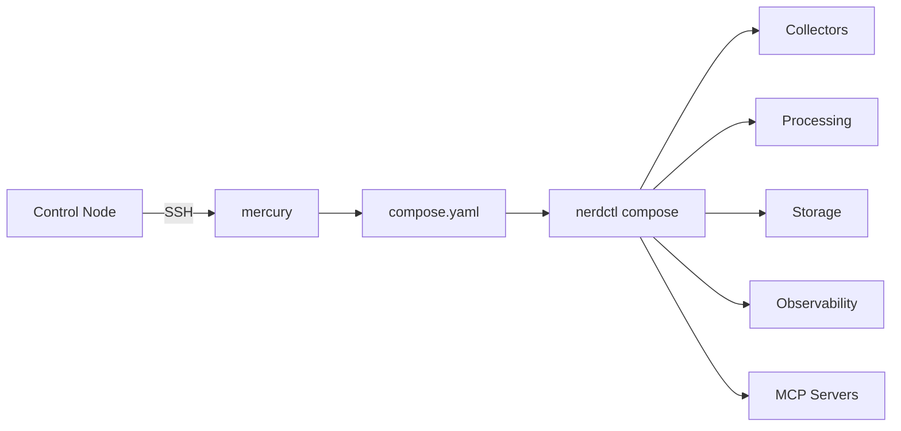

# ATLAS Deployment

Ansible-based deployment for ATLAS infrastructure and services.

## Overview

This directory contains everything needed to deploy ATLAS to the target host:

- **artifacts/** - Compose templates, configs, systemd units
- **ansible/** - Playbooks, inventory, and encrypted secrets

Ansible renders compose.yaml from Jinja2 template with secrets, builds container images, and manages systemd service.

## Architecture



## Prerequisites

### Control Node (Laptop)

```bash
# Ansible installed
ansible --version

# SSH access to target
ssh mercury

# Vault password (for encrypted secrets)
# Store in ~/.ansible-vault-password or provide with --ask-vault-pass
```

### Target Host (mercury)

- nerdctl + containerd
- ZFS (optional, for snapshots)
- systemd

## Quick Start

### Full Deployment

```bash
cd ~/ATLAS/deployment/ansible
ansible-playbook playbooks/deploy.yml
```

This deploys everything:
- Creates `/opt/ai-inference/` directory structure
- Renders `compose.yaml` from Jinja2 template with secrets
- Builds all container images
- Enables `atlas.service` for auto-start
- Creates ZFS pre-deployment snapshot (optional)

### Dry Run (Check Mode)

```bash
ansible-playbook playbooks/deploy.yml --check --diff
```

### Skip ZFS Snapshot

```bash
ansible-playbook playbooks/deploy.yml -e create_snapshot=false
```

## Playbooks

| Playbook | Description |
|----------|-------------|
| `deploy.yml` | Main deployment (builds, configs, systemd) |
| `site.yml` | Alias for deploy.yml |
| `smoke-test.yml` | Post-deployment verification |
| `zfs-snapshot.yml` | Create ZFS snapshots manually |
| `zfs-rollback.yml` | Rollback to previous snapshot |
| `zfs-cleanup.yml` | Remove old snapshots (keep last N) |

## Tags

Deploy specific services using tags:

| Tag | Service(s) Built |
|-----|------------------|
| `fred-collector` | FredCollector |
| `threshold-engine` | ThresholdEngine |
| `alert-service` | AlertService |
| `finnhub-collector` | FinnhubCollector |
| `finnhub-mcp` | FinnhubMcp |
| `ofr-collector` | OfrCollector |
| `ofr-mcp` | OfrCollectorMcp |
| `secmaster` | SecMaster |
| `secmaster-mcp` | SecMasterMcp |
| `alphavantage-collector` | AlphaVantageCollector |
| `nasdaq-collector` | NasdaqCollector |
| `calendar-service` | CalendarService |
| `fredcollector-mcp` | FredCollectorMcp |
| `thresholdengine-mcp` | ThresholdEngineMcp |
| `ollama-mcp` | OllamaMcp |
| `build` | All services |
| `monitoring` | Monitoring configs only |
| `snapshot` | ZFS snapshot tasks only |

### Examples

```bash
# Rebuild single collector
ansible-playbook playbooks/deploy.yml --tags fred-collector

# Rebuild multiple services
ansible-playbook playbooks/deploy.yml --tags ofr-collector,ofr-mcp

# Rebuild everything
ansible-playbook playbooks/deploy.yml --tags build

# Update monitoring configs only
ansible-playbook playbooks/deploy.yml --tags monitoring
```

## Smoke Tests

Post-deployment verification validates all services are healthy.

```bash
# Full smoke test
ansible-playbook playbooks/smoke-test.yml

# Health checks only (skip log analysis)
ansible-playbook playbooks/smoke-test.yml --tags health

# Skip log checks
ansible-playbook playbooks/smoke-test.yml -e check_logs=false
```

### What It Checks

| Check | Description |
|-------|-------------|
| Container status | All containers running via `nerdctl compose ps` |
| Health endpoints | `/health` and `/api/health` for all services |
| MCP health | Health endpoints for all MCP servers |
| Database | TimescaleDB connectivity |
| Logs (Loki) | Recent errors in last 5 minutes |

### Output

```
===========================================
ATLAS Smoke Test Results
===========================================
Containers:      PASS
Health checks:   PASS
Database:        PASS
Logs (5m):       PASS
-------------------------------------------
Overall:         PASS
===========================================
```

Exits non-zero if any critical check fails.

## Configuration

### Inventory

Located in `ansible/inventory/hosts`:

```ini
[ai_infrastructure]
mercury ansible_host=mercury ansible_user=james
```

### Variables

Key variables in `ansible/group_vars/all.yml`:

| Variable | Default | Description |
|----------|---------|-------------|
| `deployment_base` | `/opt/ai-inference` | Deployment directory |
| `atlas_repo_path` | `~/ATLAS` | Monorepo path |
| `logs_path` | `/sata-bulk/logs` | Log storage |
| `timeseries_path` | `/nvme-fast/timeseries` | Database storage |
| `dashboard_path` | `/nvme-fast/dashboard` | Grafana dashboards |
| `models_path` | `/sata-bulk/models` | Ollama models |

### Secrets

Encrypted in `ansible/group_vars/vault.yml` (Ansible Vault):

```bash
# View secrets
ansible-vault view ansible/group_vars/vault.yml

# Edit secrets
ansible-vault edit ansible/group_vars/vault.yml
```

See `ansible/VAULT.md` for details.

Key secrets:
- `atlas_db_password` - Database password
- `fred_api_key` - FRED API key
- `alphavantage_api_key` - AlphaVantage API key
- `finnhub_api_key` - Finnhub API key
- `nasdaq_api_key` - Nasdaq Data Link API key
- `smtp_*` - Email alert credentials
- `ntfy_*` - Push notification credentials

## Service Management

### Systemd

```bash
# Status
sudo systemctl status atlas.service

# Restart all services
sudo systemctl restart atlas.service

# Follow logs
sudo journalctl -u atlas.service -f
```

### Container Management

```bash
cd /opt/ai-inference

# List containers
sudo nerdctl compose ps

# Follow logs (specific service)
sudo nerdctl compose logs -f fred-collector

# Follow logs (all)
sudo nerdctl compose logs -f

# Restart single service
sudo nerdctl compose restart fred-collector
```

### Database Access

```bash
sudo nerdctl exec -it timescaledb psql -U atlas -d atlas_data
```

## ZFS Snapshots

Pre-deployment snapshots are automatically created for safe rollback.

### Automatic Snapshots

Enabled by default in `deploy.yml`. Snapshot tag format: `pre-deploy-YYYYMMDDTHHMMSS`

### Manual Snapshot

```bash
ansible-playbook playbooks/zfs-snapshot.yml -e snapshot_tag=before-migration
```

### Rollback

```bash
# Rollback to specific snapshot
ansible-playbook playbooks/zfs-rollback.yml -e snapshot_tag=pre-deploy-20251216T120000

# Rollback using tag from /opt/ai-inference/last-snapshot.txt
cat /opt/ai-inference/last-snapshot.txt
ansible-playbook playbooks/zfs-rollback.yml -e snapshot_tag=<tag>
```

### Cleanup

```bash
# Automatic cleanup (keep last 3 snapshots)
ansible-playbook playbooks/zfs-cleanup.yml -e cleanup_mode=auto -e keep_snapshots=3

# Manual cleanup (delete specific snapshot)
ansible-playbook playbooks/zfs-cleanup.yml -e cleanup_mode=manual -e snapshot_tag=pre-deploy-20251201T100000
```

## Monitoring URLs

- **Grafana**: http://mercury:3000
- **Prometheus**: http://mercury:9090
- **Alertmanager**: http://mercury:9093

## Common Workflows

### Deploy after code changes

```bash
# Make code changes
vim ~/ATLAS/FredCollector/src/CollectionService.cs

# Rebuild and deploy
cd ~/ATLAS/deployment/ansible
ansible-playbook playbooks/deploy.yml --tags fred-collector

# Verify
sudo systemctl status atlas.service
sudo nerdctl compose logs -f fred-collector
```

### Update compose template

```bash
# Edit template
vim ~/ATLAS/deployment/artifacts/compose.yaml.j2

# Deploy
cd ~/ATLAS/deployment/ansible
ansible-playbook playbooks/deploy.yml

# Verify
cat /opt/ai-inference/compose.yaml
sudo systemctl restart atlas.service
```

### Update monitoring configs

```bash
# Edit Prometheus rules
vim ~/ATLAS/deployment/artifacts/monitoring/prometheus.yml

# Deploy
cd ~/ATLAS/deployment/ansible
ansible-playbook playbooks/deploy.yml --tags monitoring

# Verify
sudo nerdctl compose restart prometheus
```

## HARD STOP

NEVER edit `/opt/ai-inference/compose.yaml` directly. This file is Ansible-managed.

Always edit `~/ATLAS/deployment/artifacts/compose.yaml.j2` and redeploy via Ansible.

Direct edits will be overwritten on next deployment.
