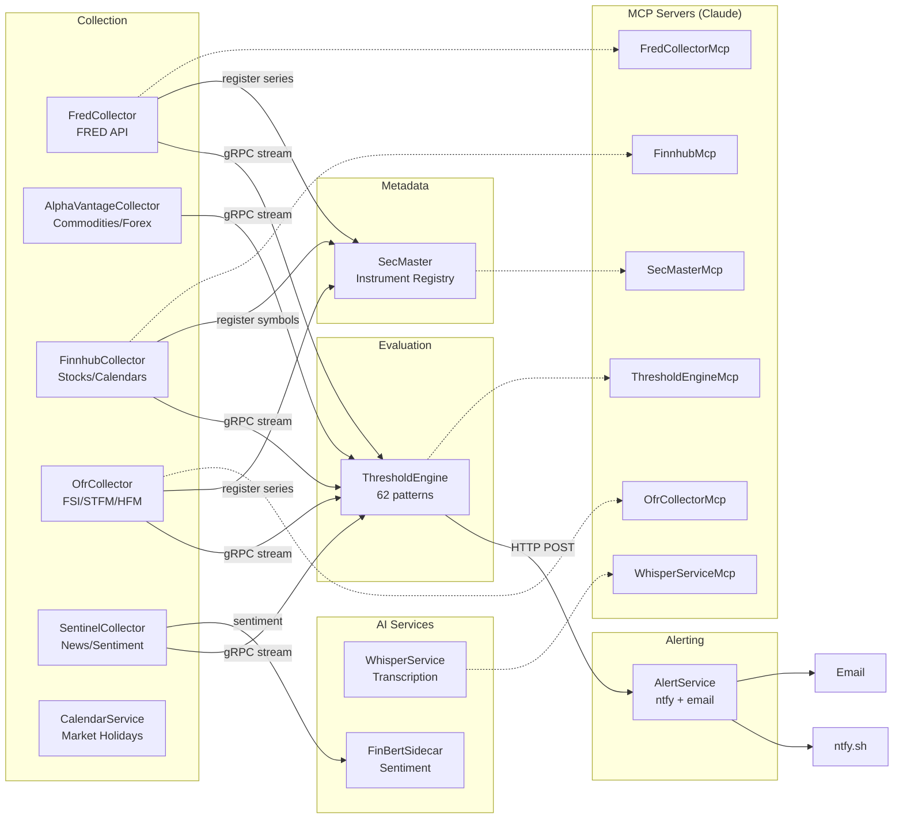
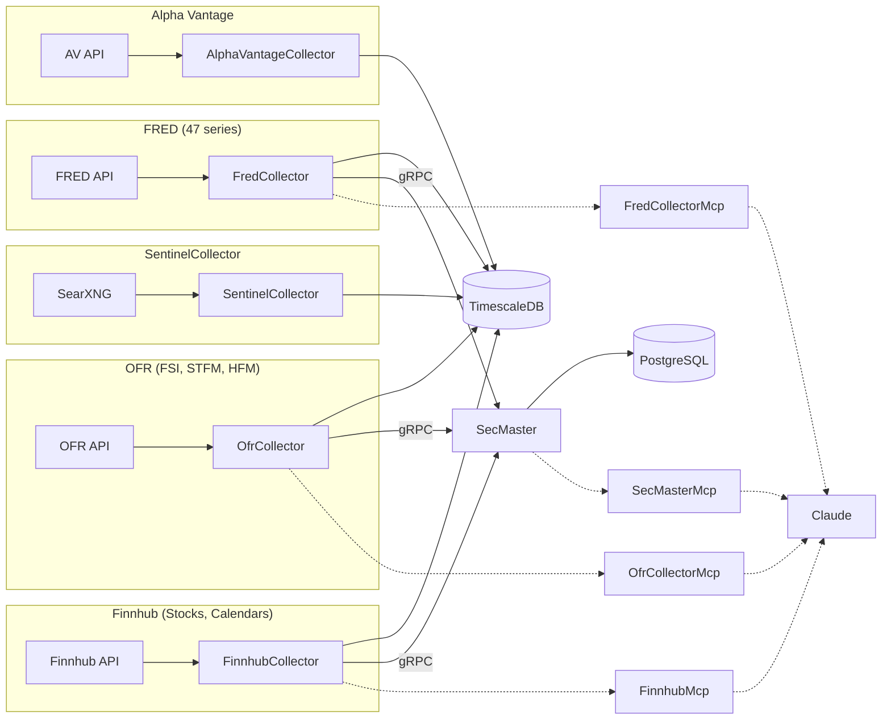
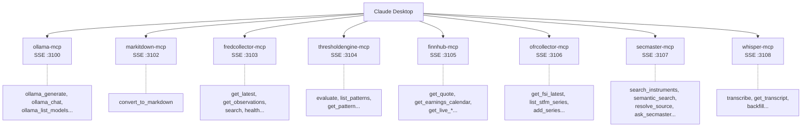

# ATLAS Architecture

## Overview

ATLAS (Automated Threshold Logic and Alert System) is an event-driven platform for financial data collection, pattern evaluation, and regime detection. It ingests data from multiple sources, evaluates 62 configurable patterns, and delivers alerts when economic conditions change.

## Services

### Data Collectors

| Service | Port (Internal) | Data Source | Key Data |
|---------|-----------------|-------------|----------|
| FredCollector | 8080, 5001 | Federal Reserve | 47 economic series |
| AlphaVantageCollector | 8080, 5001 | Alpha Vantage | Commodities, forex |
| FinnhubCollector | 8080, 5001 | Finnhub | Stock quotes, earnings, sentiment |
| OfrCollector | 8080 | OFR.gov | Financial Stress Index, repo rates |
| SentinelCollector | 8080 | SearXNG | News aggregation, sentiment analysis |
| CalendarService | 8080 | Nager.Date, Finnhub | Market holidays, economic events |

Note: All collectors expose 8080 (REST) and 5001 (gRPC) internally. No host port mapping.

### Processing & Alerting

| Service | Port | Responsibility |
|---------|------|----------------|
| ThresholdEngine | 8080 (internal) | Pattern evaluation, regime detection, macro scoring |
| AlertService | 8080 (internal) | Notification routing (ntfy, email) |
| SecMaster | 8080 (internal) | Instrument metadata registry, series search |

### AI Services

| Service | Port | Purpose |
|---------|------|---------|
| WhisperService | 8090 (host) | YouTube transcription via Whisper |
| FinBertSidecar | 8080 (internal) | Financial sentiment analysis |
| Ollama GPU | 11434 (host) | LLM inference (GPU) |
| Ollama CPU | 11435 (host) | LLM inference (CPU fallback) |

### MCP Servers

| Service | Port (Host) | Purpose |
|---------|-------------|---------|
| OllamaMcp | 3100 | Local LLM inference |
| markitdownMcp | 3102 | Document conversion |
| FredCollectorMcp | 3103 | FRED data query and admin |
| ThresholdEngineMcp | 3104 | Pattern evaluation and regime status |
| FinnhubMcp | 3105 | Market data, calendars, live quotes |
| OfrCollectorMcp | 3106 | FSI, funding markets, hedge fund data |
| SecMasterMcp | 3107 | Instrument search, metadata query |
| WhisperServiceMcp | 3108 | YouTube transcription |

### Infrastructure

| Service | Port | Purpose |
|---------|------|---------|
| TimescaleDB | 5432 | Time-series database |
| Prometheus | 9090 | Metrics storage |
| Grafana | 3000 | Dashboards |
| Loki | 3100 | Log aggregation |
| Tempo | 3200 | Distributed tracing |
| otel-collector | (internal) | OpenTelemetry pipeline |

## Design Principles

### Single Responsibility
- **Collectors**: Data ingestion only. No threshold logic.
- **ThresholdEngine**: Pattern evaluation only. No data collection.
- **AlertService**: Notification delivery only. No business logic.
- **MCP Servers**: API translation only. No data storage.

### Event-Driven Communication
- Collectors → ThresholdEngine: gRPC server streaming
- ThresholdEngine → AlertService: HTTP POST to `/alerts`
- All events share the `ObservationCollectedEvent` contract

### Configuration Over Code
- 62 patterns defined in JSON with C# expressions
- Hot reload via file watcher (no restart needed)
- Admin APIs for runtime series management

## Event Flow

## Pattern Categories

| Category | Count | Purpose | Key Patterns |
|----------|-------|---------|--------------|
| Recession | 13 | Contraction warnings | Sahm Rule, yield curve, claims |
| Growth | 8 | Expansion signals | GDP, employment, ISM |
| Liquidity | 8 | Market stress | VIX spikes, credit spreads, TED |
| NBFI | 8 | Shadow banking | HY spreads, repo stress, leverage |
| Inflation | 8 | Price pressures | CPI, breakevens, commodity prices |
| OFR | 7 | Financial stability | FSI components, STFM, HFM |
| Valuation | 6 | Market levels | Buffett indicator, CAPE |
| Currency | 3 | Risk sentiment | DXY, EM FX, carry trades |
| Commodity | 1 | Real assets | Copper/Gold ratio |

**Total: 62 patterns** across 9 categories

## Regime Detection

ThresholdEngine maintains a regime state based on macro score:

| Regime | Macro Score | Meaning |
|--------|-------------|---------|
| Expansion | < 30 | Normal growth conditions |
| Caution | 30-50 | Elevated risk signals |
| Warning | 50-70 | Multiple stress indicators |
| Crisis | > 70 | Systemic stress detected |

Regime transitions trigger alerts via AlertService.

## Data Flow by Source

**SecMaster Purpose**: Centralized instrument metadata, search across sources, series discovery

## MCP Integration

MCP (Model Context Protocol) servers expose ATLAS data to Claude:

## Why This Architecture?

### Composability
New data sources integrate by implementing the gRPC contract. OfrCollector was added without modifying ThresholdEngine.

### Observability
Full OpenTelemetry stack: traces (Tempo), metrics (Prometheus), logs (Loki), all visualized in Grafana.

### Flexibility
Change a threshold? Edit JSON, patterns hot-reload. Add a series? Use the admin API.

### AI-Native
MCP servers let Claude directly query financial data and evaluate patterns.

## See Also

- [FredCollector](../FredCollector/README.md) - FRED data collection
- [AlphaVantageCollector](../AlphaVantageCollector/README.md) - Commodities data
- [FinnhubCollector](../FinnhubCollector/README.md) - Market data
- [OfrCollector](../OfrCollector/README.md) - OFR financial stress data
- [SentinelCollector](../SentinelCollector/README.md) - News aggregation
- [ThresholdEngine](../ThresholdEngine/README.md) - Pattern evaluation
- [SecMaster](../SecMaster/README.md) - Instrument metadata
- [AlertService](../AlertService/README.md) - Notifications
- [WhisperService](../WhisperService/README.md) - Transcription
- [Deployment](../deployment/README.md) - Infrastructure setup
