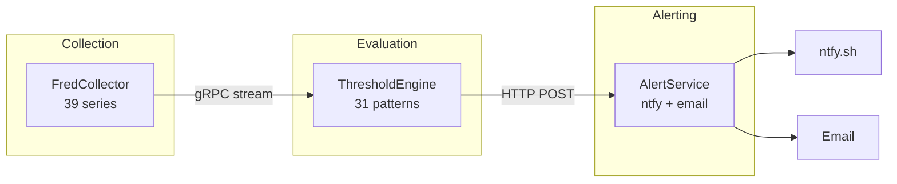
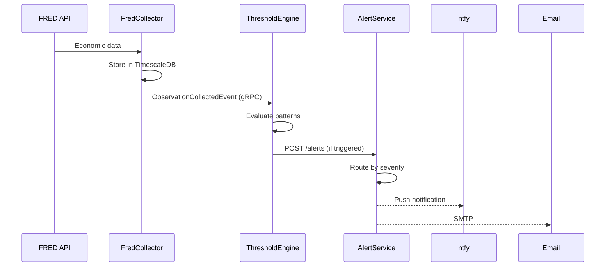

# ATLAS Architecture

## Overview

ATLAS uses event-driven microservices with clear separation between data collection, pattern evaluation, and alerting.



## Services

| Service | Port | Responsibility |
|---------|------|----------------|
| FredCollector | 5001 (gRPC), 5000 (REST) | Collect FRED data, publish observation events |
| ThresholdEngine | 5003 | Evaluate patterns, detect regime transitions |
| AlertService | 8081 | Deliver notifications (ntfy, email) |

## Design Principles

### Single Responsibility
- **FredCollector**: Data collection only. No threshold evaluation.
- **ThresholdEngine**: Pattern evaluation only. No data collection or alerting.
- **AlertService**: Notification delivery only. No business logic.

### Event-Driven Communication
- FredCollector → ThresholdEngine: gRPC server streaming
- ThresholdEngine → AlertService: HTTP POST to `/alerts` endpoint

### Configuration Over Code
- Patterns defined in JSON with C# expressions
- Hot reload without service restart
- No code changes to add/modify patterns

## Event Flow



## Event Contracts

Events are defined in `Events/src/Events/`:

### ObservationCollectedEvent
Published by FredCollector when data is collected.

```csharp
public record ObservationCollectedEvent : IEvent
{
    public required string SeriesId { get; init; }
    public required DateOnly Date { get; init; }
    public required decimal? Value { get; init; }
    public required DateTime CollectedAt { get; init; }
}
```

### ThresholdCrossedEvent
Published by ThresholdEngine when a pattern triggers.

```csharp
public record ThresholdCrossedEvent : IEvent
{
    public required string PatternId { get; init; }
    public required string Category { get; init; }
    public required decimal Signal { get; init; }      // -2 to +2
    public required decimal Confidence { get; init; }  // 0 to 1
    public required DateTime EvaluatedAt { get; init; }
}
```

## Pattern Categories

| Category | Patterns | Purpose |
|----------|----------|---------|
| recession | 8 | Contraction warnings (Sahm Rule, claims, yield curve) |
| liquidity | 5 | VIX deployment, credit spreads, Fed balance sheet |
| growth | 5 | Economic expansion signals |
| nbfi | 8 | Financial stress indicators |
| valuation | 5 | Market valuation levels |

## Infrastructure

All services deployed via `infrastructure/compose.yaml`:

| Category | Services |
|----------|----------|
| Core | fred-collector, fred-api, threshold-engine, alert-service |
| Data | timescaledb |
| Observability | prometheus, alertmanager, grafana, loki, tempo, otel-collector |
| AI | ollama-gpu, ollama-cpu |

## Why This Architecture?

### Composability
Patterns can combine data from multiple sources. Adding a new collector (RSS, prices) requires zero changes to ThresholdEngine.

### Testability
Each service can be tested in isolation with mock events.

### Flexibility
Change threshold from 400K to 450K? Edit JSON config, no code deploy.

### Scalability
Services can be scaled independently based on load.

## See Also

- [FredCollector](../FredCollector/) - Data collection
- [ThresholdEngine](../ThresholdEngine/) - Pattern evaluation
- [AlertService](../AlertService/) - Notifications
- [gRPC Architecture](GRPC-ARCHITECTURE.md) - Event streaming details
