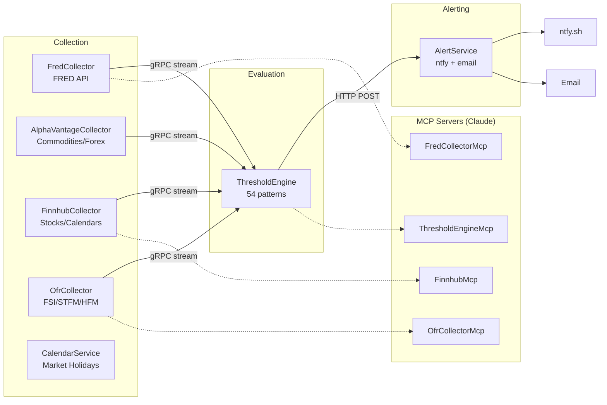
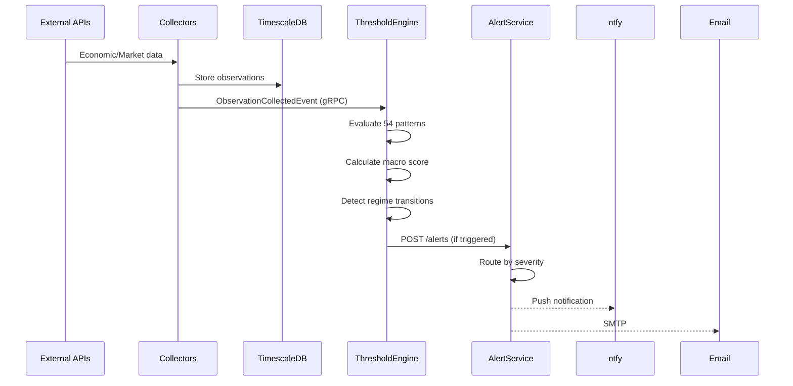

# ATLAS Architecture

## Overview

ATLAS (Automated Threshold Logic and Alert System) is an event-driven platform for financial data collection, pattern evaluation, and regime detection. It ingests data from multiple sources, evaluates 54 configurable patterns, and delivers alerts when economic conditions change.



## Services

### Data Collectors

| Service | Ports | Data Source | Key Data |
|---------|-------|-------------|----------|
| FredCollector | 5001 (HTTP), 5002 (gRPC) | Federal Reserve | 200+ economic series |
| AlphaVantageCollector | 5010 (HTTP), 5011 (gRPC) | Alpha Vantage | Commodities, forex, crypto |
| FinnhubCollector | 5012 (HTTP), 5013 (gRPC) | Finnhub | Stock quotes, earnings, sentiment |
| OfrCollector | 5016 (HTTP), 5017 (gRPC) | OFR.gov | Financial Stress Index, repo rates |
| CalendarService | 5015 | Nager.Date, Finnhub | Market holidays, economic events |

### Processing & Alerting

| Service | Port | Responsibility |
|---------|------|----------------|
| ThresholdEngine | 5003 | Pattern evaluation, regime detection, macro scoring |
| AlertService | 8081 | Notification routing (ntfy, email) |

### MCP Servers

| Service | Port | Tools | Purpose |
|---------|------|-------|---------|
| FredCollectorMcp | 3103 | 7 | FRED data query and admin |
| ThresholdEngineMcp | 3104 | 8 | Pattern evaluation and regime status |
| FinnhubMcp | 3105 | 26 | Market data, calendars, live quotes |
| OfrCollectorMcp | 3106 | 26 | FSI, funding markets, hedge fund data |

### Infrastructure

| Service | Port | Purpose |
|---------|------|---------|
| TimescaleDB | 5432 | Time-series database |
| Prometheus | 9090 | Metrics storage |
| Grafana | 3000 | Dashboards |
| Loki | 3101 | Log aggregation |
| Tempo | 3200 | Distributed tracing |
| Ollama (GPU) | 11434 | LLM inference |

## Design Principles

### Single Responsibility
- **Collectors**: Data ingestion only. No threshold logic.
- **ThresholdEngine**: Pattern evaluation only. No data collection.
- **AlertService**: Notification delivery only. No business logic.
- **MCP Servers**: API translation only. No data storage.

### Event-Driven Communication
- Collectors → ThresholdEngine: gRPC server streaming
- ThresholdEngine → AlertService: HTTP POST to `/alerts`
- All events share the `ObservationCollectedEvent` contract

### Configuration Over Code
- 54 patterns defined in YAML with C# expressions
- Hot reload via file watcher (no restart needed)
- Admin APIs for runtime series management

## Event Flow



## Pattern Categories

| Category | Count | Purpose | Key Patterns |
|----------|-------|---------|--------------|
| Recession | 10 | Contraction warnings | Sahm Rule, yield curve, claims |
| Liquidity | 8 | Market stress | VIX spikes, credit spreads, TED |
| Growth | 6 | Expansion signals | GDP, employment, ISM |
| NBFI | 8 | Shadow banking | OFR FSI, repo stress, hedge fund leverage |
| Valuation | 7 | Market levels | Buffett indicator, CAPE, margin debt |
| Inflation | 7 | Price pressures | CPI, breakevens, commodity prices |
| Commodity | 5 | Real assets | Gold, oil, copper signals |
| OFR | 3 | Financial stress | FSI thresholds |

**Total: 54 patterns** across 8 categories

## Regime Detection

ThresholdEngine maintains a regime state based on macro score:

| Regime | Macro Score | Meaning |
|--------|-------------|---------|
| Expansion | < 30 | Normal growth conditions |
| Caution | 30-50 | Elevated risk signals |
| Warning | 50-70 | Multiple stress indicators |
| Crisis | > 70 | Systemic stress detected |

Regime transitions trigger alerts via AlertService.

## Data Flow by Source

### FRED (200+ series)
```
FRED API → FredCollector → TimescaleDB → ThresholdEngine
                                      → FredCollectorMcp → Claude
```

### OFR (FSI, STFM, HFM)
```
OFR API → OfrCollector → TimescaleDB → ThresholdEngine
                                    → OfrCollectorMcp → Claude
```

### Finnhub (Stocks, Calendars)
```
Finnhub API → FinnhubCollector → TimescaleDB → ThresholdEngine
                                            → FinnhubMcp → Claude
```

## MCP Integration

MCP (Model Context Protocol) servers expose ATLAS data to Claude:

```
Claude Desktop
    ├── fredcollector-mcp (SSE :3103)
    │   └── get_latest, get_observations, search, health...
    ├── thresholdengine-mcp (SSE :3104)
    │   └── evaluate, list_patterns, get_pattern...
    ├── finnhub-mcp (SSE :3105)
    │   └── get_quote, get_earnings_calendar, get_live_*...
    └── ofrcollector-mcp (SSE :3106)
        └── get_fsi_latest, list_stfm_series, add_series...
```

## Why This Architecture?

### Composability
New data sources integrate by implementing the gRPC contract. OfrCollector was added without modifying ThresholdEngine.

### Observability
Full OpenTelemetry stack: traces (Tempo), metrics (Prometheus), logs (Loki), all visualized in Grafana.

### Flexibility
Change a threshold? Edit YAML, patterns hot-reload. Add a series? Use the admin API.

### AI-Native
MCP servers let Claude directly query financial data and evaluate patterns.

## See Also

- [FredCollector](../FredCollector/README.md) - FRED data collection
- [OfrCollector](../OfrCollector/README.md) - OFR financial stress data
- [FinnhubCollector](../FinnhubCollector/README.md) - Market data
- [ThresholdEngine](../ThresholdEngine/README.md) - Pattern evaluation
- [AlertService](../AlertService/README.md) - Notifications
- [Deployment](../deployment/README.md) - Infrastructure setup
