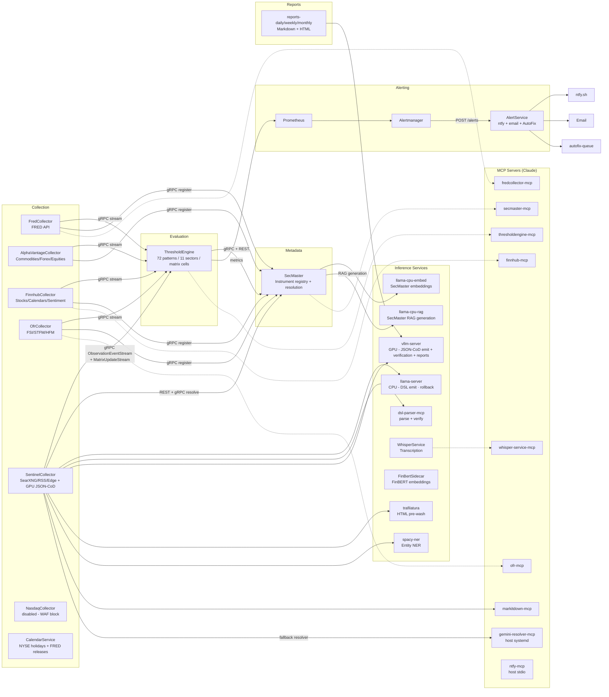
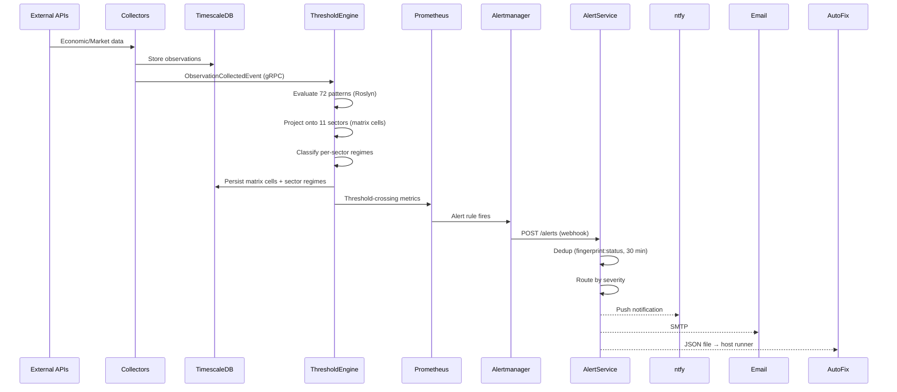
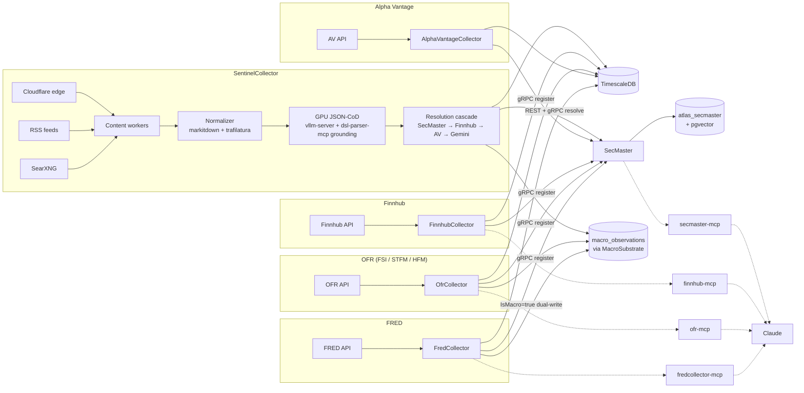
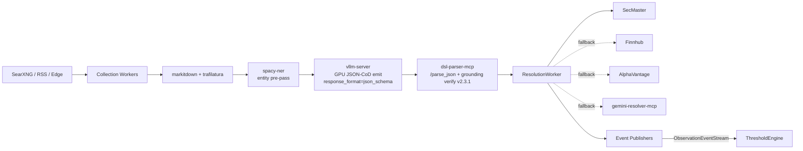
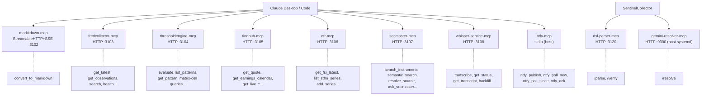

# ATLAS Architecture

## Overview

ATLAS (Automated Threshold Logic and Alert System) is an event-driven platform for financial data collection, pattern evaluation, and per-sector regime detection. Collectors ingest from multiple sources, stream observation events to ThresholdEngine over gRPC, where 72 configurable patterns (71 enabled, 1 disabled) are evaluated by a Roslyn-compiled expression engine, projected onto the 11-sector ATLAS grid, persisted as matrix cells, and classified into per-sector regimes. SentinelCollector adds unstructured-content extraction via a GPU vLLM JSON Chain-of-Density (CoD) pipeline (Qwen2.5-32B-AWQ, `Extraction__Backend=VllmJson`) that grounds against a sidecar parser/verifier (the CPU `llama-server` DSL/GBNF pipeline is the rollback path). Threshold-crossing events surface to Prometheus, which routes via Alertmanager into AlertService for ntfy/email/AutoFix delivery.

```mermaid
flowchart LR
    subgraph Collection
        FC[FredCollector<br/>FRED API]
        AV[AlphaVantageCollector<br/>Commodities/Forex/Equities]
        FH[FinnhubCollector<br/>Stocks/Calendars/Sentiment]
        OFR[OfrCollector<br/>FSI/STFM/HFM]
        SC[SentinelCollector<br/>SearXNG/RSS/Edge + GPU JSON-CoD]
        ND[NasdaqCollector<br/>disabled - WAF block]
        CS[CalendarService<br/>NYSE holidays + FRED releases]
    end

    subgraph Metadata
        SM[SecMaster<br/>Instrument registry + resolution]
    end

    subgraph Evaluation
        TE[ThresholdEngine<br/>72 patterns / 11 sectors / matrix cells]
    end

    subgraph Alerting
        PR[Prometheus]
        AM[Alertmanager]
        AS[AlertService<br/>ntfy + email + AutoFix]
    end

    subgraph AI["Inference Services"]
        VLLM[vllm-server<br/>GPU - JSON-CoD emit + verification + reports]
        DSL[dsl-parser-mcp<br/>parse + verify]
        LS[llama-server<br/>CPU - DSL emit · rollback]
        LCR[llama-cpu-rag<br/>SecMaster RAG generation]
        OE[llama-cpu-embed<br/>SecMaster embeddings]
        WS[WhisperService<br/>Transcription]
        FB[FinBertSidecar<br/>FinBERT embeddings]
        TRF[trafilatura<br/>HTML pre-wash]
        SPACY[spacy-ner<br/>Entity NER]
    end

    subgraph Reports
        RP[reports-daily/weekly/monthly<br/>Markdown + HTML]
    end

    subgraph MCP["MCP Servers (Claude)"]
        FM[fredcollector-mcp]
        TM[thresholdengine-mcp]
        FHM[finnhub-mcp]
        OM[ofr-mcp]
        SMM[secmaster-mcp]
        WSM[whisper-service-mcp]
        MM[markitdown-mcp]
        GRM[gemini-resolver-mcp<br/>host systemd]
        NTM[ntfy-mcp<br/>host stdio]
    end

    FC -->|gRPC stream| TE
    AV -->|gRPC stream| TE
    FH -->|gRPC stream| TE
    OFR -->|gRPC stream| TE
    SC -->|gRPC ObservationEventStream<br/>+ MatrixUpdateStream| TE
    FC -->|gRPC register| SM
    FH -->|gRPC register| SM
    OFR -->|gRPC register| SM
    AV -->|gRPC register| SM
    SC -->|REST + gRPC resolve| SM
    SC --> LS
    SC --> DSL
    SC --> VLLM
    SC --> TRF
    SC --> SPACY
    SC --> MM
    SC -->|fallback resolver| GRM
    SM --> OE
    SM -->|RAG generation| LCR
    TE -->|gRPC + REST| SM
    TE -->|metrics| PR
    PR --> AM
    AM -->|POST /alerts| AS
    AS --> N[ntfy.sh]
    AS --> E[Email]
    AS --> AF[autofix-queue]
    RP --> VLLM

    FC -.-> FM
    TE -.-> TM
    FH -.-> FHM
    OFR -.-> OM
    SM -.-> SMM
    WS -.-> WSM
```

## Services

### Data Collectors

| Service | Ports (internal) | Data Source | Key Data |
|---------|------------------|-------------|----------|
| FredCollector | 8080 / 5001 | Federal Reserve | Economic series (UNRATE, CPIAUCSL, GDP, etc.); optional MacroSubstrate dual-write |
| AlphaVantageCollector | 8080 / 5001 | Alpha Vantage | Commodities, forex, equities (OHLCV), crypto, economic indicators |
| FinnhubCollector | 8080 / 5001 | Finnhub | Stock quotes, candles, sentiment, analyst ratings, earnings/IPO calendars |
| OfrCollector | 8080 / 5001 | OFR.gov | Financial Stress Index, STFM (short-term funding), HFM (hedge fund monitor) |
| SentinelCollector | 8080 / 5001 / 5091 (host) | SearXNG / RSS / Cloudflare edge | News + filings + sentiment; GPU vLLM JSON-CoD extraction → matrix cells |
| NasdaqCollector | 8080 / 5001 (disabled) | Nasdaq Data Link | LBMA gold (compose entry commented out — datacenter IP blocked by WAF) |
| CalendarService | 8080 | Nager.Date + FRED | NYSE trading days/holidays + FRED economic release schedule |

All `5001` ports speak gRPC `ObservationEventStream` (proto: `Events/src/Events/Protos/observation_events.proto`). SentinelCollector additionally exposes `MatrixUpdateStream` on `5001` and host-maps container `8080` to host `5091` for the browser-based review UI + digest pages.

### Processing & Alerting

| Service | Ports | Responsibility |
|---------|-------|----------------|
| ThresholdEngine | 8080 / 5001 (internal) | Roslyn pattern evaluation, 11-sector projection, matrix-cell persistence, per-sector regime classification, threshold-crossing event stream |
| AlertService | 8080 (internal) | Webhook sink for Alertmanager; severity routing → ntfy / email / AutoFix; fingerprint+status dedup (30 min window) |
| SecMaster | 8080 / 5001 (internal) | Instrument registry, context-aware source resolution, hybrid search (SQL + fuzzy + vector + RAG), OpenFIGI/EDGAR enrichment, ATLAS sector / NAICS classification |

### Substrate & Reports

| Component | Type | Purpose |
|-----------|------|---------|
| MacroSubstrate | Library (no listener) | Shared EF writer for `atlas_data.macro_observations`; consumed by FredCollector, OfrCollector, SentinelCollector via DI. `migrate-macro-substrate` is a one-shot console host that owns schema deployment. |
| Reports.DailyHost / WeeklyHost / MonthlyHost | Containers (internal :8080, scheduled) | Daily 02:00 UTC / Mon 02:00 UTC / 1st-of-month 02:00 UTC Markdown + HTML reports from MacroSubstrate; news summaries via vLLM. |
| Events | Library | Shared gRPC protos (`observation_events.proto`) + `Events.Client` DTOs (incl. `AtlasSectorCode` enum). |
| LlmBenchmark | xUnit harness (no listener) | Sentinel extraction-quality benchmarks (CoVe / CoD / epistemic markers) against a pinned golden dataset. |

### AI / Inference Services

| Service | Port | Purpose |
|---------|------|---------|
| WhisperService | 8090 (host + container) | YouTube transcription via faster-whisper (Python FastAPI) |
| FinBertSidecar | 8080 (internal) | FinBERT 768-dim L2-normalized embeddings (CPU) |
| vllm-server | 8000 (host) | GPU inference (Qwen2.5-32B-Instruct-AWQ) — Sentinel JSON-CoD extraction (live, `Extraction__Backend=VllmJson`), news-signal classification, Reports news summarisation |
| llama-server | 11437 → 8080 (host) | CPU llama.cpp serving qwen3:30b-a3b — Sentinel CPU DSL/GBNF CoD emission (rollback path; `Extraction__Backend=LlamaServerDsl`) |
| llama-cpu-rag | 11438 → 8080 (host) | CPU llama.cpp serving qwen2.5:7b — SecMaster RAG-tier generation (replaced ollama-cpu-gen 2026-06-11, ~30× decode gap; not a Sentinel extraction dependency) |
| llama-cpu-embed | 11439 → 8080 (host) | CPU llama.cpp serving bge-m3 — SecMaster semantic-search embeddings (replaced ollama-cpu-embed 2026-06-11; last ollama container retired — all CPU inference is llama.cpp, GPU is vLLM) |
| trafilatura | 3109 (host) | HTML pre-wash for SentinelCollector content normalisation |
| spacy-ner | internal only | spaCy NER sidecar — entity pre-pass for SentinelCollector V2 pipeline |
| dsl-parser-mcp | 3120 (host) | FastAPI sidecar — Lark parser + v2.3.1 verifier; `/parse_json` lifts the GPU JSON-CoD document and `/parse` the CPU DSL document to the same `DocumentAst` (consumed by SentinelCollector) |

> **Inference topology** (post GPU-CoD role-flip, `gpu-cod-roleflip-2026-06-09`): GPU `vllm-server` = JSON-CoD extraction emission (live) + news-signal classification / sector tagging + report summarisation (Qwen2.5-32B-AWQ, largest model that fits 32GB VRAM on RTX 5090). CPU = embeddings + SecMaster RAG + the DSL/GBNF CoD rollback path. (The prior "CoD never touches GPU" split was reversed by the role-flip — CoD emission now runs on the GPU. The GPU claim verifier (CoVe `SemanticVerifier`) was removed as dead code in PR #647: ~93% of GPU calls, output computed-and-discarded since its matrix consumer was retired by WS3-A3.)

### MCP Servers

MCP servers are consolidated under their parent service directories where applicable:

- `FredCollector/mcp/` → `fredcollector-mcp`
- `ThresholdEngine/mcp/` → `thresholdengine-mcp`
- `FinnhubCollector/mcp/` → `finnhub-mcp`
- `OfrCollector/mcp/` → `ofr-mcp`
- `SecMaster/mcp/` → `secmaster-mcp`
- `WhisperService/mcp/` → `whisper-service-mcp` (C# MCP child of the Python WhisperService)

Three MCP-style sidecars live outside any parent service:

- `SentinelCollector/dsl-parser-mcp/` → `dsl-parser-mcp` (FastAPI sidecar — not stdio MCP)
- `gemini-resolver-mcp/` → host `systemd` unit, FastAPI on `:9300` (HTTP, not stdio MCP — name kept for symmetry with `ntfy-mcp`)
- `ntfy-mcp/` → host stdio MCP, ntfy publish/poll for the Sentinel v2 supervisor
- `markitdownMCP/` → upstream `mcp/markitdown:latest` container image (no source in this directory)

| Server | Port (Host) | Transport | Purpose |
|--------|-------------|-----------|---------|
| markitdown-mcp | 3102 | StreamableHTTP `/mcp/` + SSE `/sse` | Document conversion (PDF/Office/HTML → Markdown) |
| fredcollector-mcp | 3103 | Streamable HTTP | FRED data query + admin |
| thresholdengine-mcp | 3104 | Streamable HTTP | Pattern evaluation, sector-regime status, matrix-cell queries |
| finnhub-mcp | 3105 | Streamable HTTP | Market data, calendars, live quotes |
| ofr-mcp | 3106 | Streamable HTTP | FSI, funding markets, hedge fund data |
| secmaster-mcp | 3107 | Streamable HTTP | Instrument search, metadata query, semantic search |
| whisper-service-mcp | 3108 | Streamable HTTP | YouTube transcription proxy |
| dsl-parser-mcp | 3120 | FastAPI HTTP | DSL parse + v2.3.1 grounding verifier |
| gemini-resolver-mcp | 9300 (host systemd) | FastAPI HTTP | Sentinel Phase 4.2 Gemini-grounded fallback resolver |
| ntfy-mcp | n/a (stdio) | MCP stdio | ntfy publish/poll for supervisor ↔ user channel |

### Infrastructure

| Service | Port | Access | Purpose |
|---------|------|--------|---------|
| TimescaleDB | 5432 | Host | Time-series database (PostgreSQL + hypertables + pgvector) |
| Prometheus | 9090 | Internal | Metrics storage (Grafana proxy) |
| Alertmanager | 9093 | Internal | Alert routing — webhooks AlertService at `http://alert-service:8080/alerts` |
| Grafana | 3000 | Host | Dashboards |
| Loki | 3100 | Internal | Log aggregation (Grafana proxy) |
| Tempo | 3200 | Internal | Distributed tracing (Grafana proxy) |
| otel-collector | 4317 | Internal | OpenTelemetry pipeline (OTLP/gRPC) |

## Design Principles

### Single Responsibility

- **Collectors**: Data ingestion only. No threshold logic.
- **ThresholdEngine**: Pattern evaluation, sector projection, regime classification. No data collection.
- **AlertService**: Notification delivery only. No business logic.
- **MCP Servers**: API translation only. No data storage.

### Event-Driven Communication

- Collectors → ThresholdEngine: gRPC server-streamed `ObservationEventStream`
- SentinelCollector → ThresholdEngine: `ObservationEventStream` + `MatrixUpdateStream` (Phase 5.5 DSL matrix-cell enrichments)
- ThresholdEngine → Prometheus → Alertmanager → AlertService: metric-derived alert routing
- ThresholdEngine → downstream subscribers: gRPC `ObservationEventStream` (threshold-crossing events, replay, time-range)
- AlertService → ntfy / SMTP / AutoFix queue file

### Configuration Over Code

- 72 patterns defined in JSON with C# expressions, compiled by Roslyn at runtime
- Hot reload via `PatternConfigurationWatcher`, `BurstWindowConfigurationWatcher`, `SectorThresholdConfigurationWatcher`
- Admin APIs for runtime series management on each collector
- Prompts host-mounted (`/prompts`) — edits hot-reload without container rebuild

## Event Flow

```mermaid
sequenceDiagram
    participant APIs as External APIs
    participant COL as Collectors
    participant DB as TimescaleDB
    participant TE as ThresholdEngine
    participant PR as Prometheus
    participant AM as Alertmanager
    participant AS as AlertService

    APIs->>COL: Economic/Market data
    COL->>DB: Store observations
    COL->>TE: ObservationCollectedEvent (gRPC)
    TE->>TE: Evaluate 72 patterns (Roslyn)
    TE->>TE: Project onto 11 sectors (matrix cells)
    TE->>TE: Classify per-sector regimes
    TE->>DB: Persist matrix cells + sector regimes
    TE->>PR: Threshold-crossing metrics
    PR->>AM: Alert rule fires
    AM->>AS: POST /alerts (webhook)
    AS->>AS: Dedup (fingerprint:status, 30 min)
    AS->>AS: Route by severity
    AS-->>ntfy: Push notification
    AS-->>Email: SMTP
    AS-->>AutoFix: JSON file → host runner
```

## Pattern Categories

Counts derive from `ThresholdEngine/config/patterns/<category>/*.json` (one pattern per file). The `enabled` column is the subset with `"enabled": true`; the remainder are kept in-tree but turned off.

| Category | Total | Enabled | Purpose | Representative Patterns |
|----------|-------|---------|---------|-------------------------|
| Recession | 22 | 21 | Contraction warnings | Sahm Rule, yield-curve inversion / steepening, initial + continuing claims, Beveridge curve, Challenger layoffs, JOLTS (Baltic-freight disabled) |
| Growth | 11 | 11 | Expansion signals | GDP acceleration, industrial production, durable goods, equipment/residential investment, retail sales, housing starts, global PMI |
| Liquidity | 9 | 9 | Market stress | VIX level, credit-spread widening, Fed liquidity contraction, fed funds rate, real rates / TIPS, M2 growth, DXY risk-off |
| NBFI | 8 | 8 | Shadow-banking stress | CCC-BB divergence, repo stress (standing + reverse), Chicago NFCI, St. Louis stress index, commercial-paper stress, financial-insider breadth |
| OFR | 7 | 7 | Financial stability | FSI (top-level + credit / volatility / funding / EM components), STFM repo stress, HFM leverage |
| Inflation | 6 | 6 | Price pressures | CPI YoY level, core CPI stickiness, PCE level + acceleration, inflation expectations, Truflation divergence |
| Currency | 5 | 5 | Risk sentiment | DXY dollar index, EUR/USD dollar strength, EM currency weakness, JPY carry unwind, ECB policy rate |
| Commodity | 3 | 3 | Real assets | Copper/Gold ratio, oil price, natgas price |
| Valuation | 1 | 1 | Market levels | Buffett indicator |

**Total: 72 patterns (71 enabled, 1 disabled) across 9 categories.**

## Sector Projection & Per-Sector Regime Classification

Every pattern declares a weight per ATLAS sector (`SectorWeights` dictionary). `CellProjector` projects each pattern signal onto the 11-sector matrix column; `SectorAggregator` sums weighted contributions per sector per cycle.

**The 11 ATLAS sectors** (DB form, from `Events.Client/AtlasSectorCode.cs`): `ENERGY`, `MATERIALS`, `INDUSTRIALS`, `CONS_DISC`, `CONS_STAPLES`, `HEALTHCARE`, `FINANCIALS`, `INFOTECH`, `COMM_SVC`, `UTILITIES`, `REAL_ESTATE`. The D5 sparsity policy requires every pattern to declare an explicit numeric weight (zero or non-zero) for all 11 sectors — partial maps are rejected by `PatternConfigurationLoader`.

`SectorRegimeClassifier` resolves each sector's aggregated score against the default `SectorRegimeTaxonomy` — five contiguous, half-open, range-covering bands across the cell-value clamp range `[-3, +3]`:

| Regime Code | Score Band | Meaning |
|-------------|------------|---------|
| `severe_contraction` | `[-3, -1.5)` | Saturated downside |
| `contraction` | `[-1.5, -0.5)` | Meaningful negative tilt |
| `neutral` | `[-0.5, +0.5)` | Within noise |
| `expansion` | `[+0.5, +1.5)` | Meaningful positive tilt |
| `overheating` | `[+1.5, +3]` | Saturated upside |

Boundary rule: half-open lower-inclusive on every band except the topmost (closed on both sides so a clamp-saturating value lands in-band). The taxonomy is configurable but every band must be contiguous and gap-free — the constructor fails loud on broken invariants at config-time, not at classify-time.

Per-sector regime trajectories and the derived `sector_phase_cells` materialised view are exposed under `/api/sector-regimes` and `/api/sector-phase-cells` on ThresholdEngine.

## Data Flow by Source

```mermaid
flowchart LR
    subgraph FRED["FRED"]
        FA[FRED API] --> FC[FredCollector]
    end

    subgraph AV["Alpha Vantage"]
        AVA[AV API] --> AVC[AlphaVantageCollector]
    end

    subgraph OFR["OFR (FSI / STFM / HFM)"]
        OA[OFR API] --> OC[OfrCollector]
    end

    subgraph Finnhub["Finnhub"]
        FHA[Finnhub API] --> FHC[FinnhubCollector]
    end

    subgraph Sentinel["SentinelCollector"]
        SX[SearXNG]
        RSS[RSS feeds]
        EW[Cloudflare edge]
        SX & RSS & EW --> SCNT[Content workers]
        SCNT --> NZ[Normalizer<br/>markitdown + trafilatura]
        NZ --> CODX[GPU JSON-CoD<br/>vllm-server + dsl-parser-mcp grounding]
        CODX --> RES[Resolution cascade<br/>SecMaster → Finnhub → AV → Gemini]
    end

    FC --> DB[(TimescaleDB)]
    AVC --> DB
    OC --> DB
    FHC --> DB
    RES --> DB

    FC -->|gRPC register| SM[SecMaster]
    OC -->|gRPC register| SM
    FHC -->|gRPC register| SM
    AVC -->|gRPC register| SM
    RES -->|REST + gRPC resolve| SM
    SM --> PG[(atlas_secmaster<br/>+ pgvector)]

    FC -->|IsMacro=true dual-write| MS[(macro_observations<br/>via MacroSubstrate)]
    OC --> MS
    RES --> MS

    FC -.-> FM[fredcollector-mcp]
    OC -.-> OM[ofr-mcp]
    FHC -.-> FHM[finnhub-mcp]
    SM -.-> SMM[secmaster-mcp]

    FM -.-> C[Claude]
    OM -.-> C
    FHM -.-> C
    SMM -.-> C
```

**SecMaster Purpose**: Centralised instrument metadata, context-aware source resolution (frequency / latency / collector priority), hybrid search (SQL + fuzzy + vector + RAG), embedding backfill, OpenFIGI + EDGAR enrichment.

**MacroSubstrate Purpose**: Shared `macro_observations` hypertable owned by no single collector. Collectors take `IMacroObservationWriter` via DI and dual-write when their per-series `IsMacro` flag is `true`. Versioned as-of reads resolve the active mapping label via `atlas_secmaster.mapping_versions`.

## SentinelCollector: GPU vLLM JSON-CoD Extraction Pipeline

```mermaid
flowchart LR
    SRC[SearXNG / RSS / Edge] --> CW[Collection Workers]
    CW --> NZ[markitdown + trafilatura]
    NZ --> SPACY[spacy-ner<br/>entity pre-pass]
    SPACY --> VLLM[vllm-server<br/>GPU JSON-CoD emit<br/>response_format=json_schema]
    VLLM --> DSL[dsl-parser-mcp<br/>/parse_json + grounding verify v2.3.1]
    DSL --> RES[ResolutionWorker]
    RES --> SM[SecMaster]
    RES -.fallback.-> FH[Finnhub]
    RES -.fallback.-> AV[AlphaVantage]
    RES -.fallback.-> GEM[gemini-resolver-mcp]
    RES --> PUB[Event Publishers]
    PUB -->|ObservationEventStream| TE[ThresholdEngine]
```

Production extraction backend is `Extraction__Backend=VllmJson` (set in compose). The GPU `vllm-server` (Qwen2.5-32B-AWQ) emits a JSON-schema-constrained CoD document; the `dsl-parser-mcp` sidecar's `/parse_json` lifts it to the same `DocumentAst` as the CPU DSL path and verifies grounding word-by-word against the source article (v2.3.1 punctuation-tolerant + byte-verbatim). Resolution walks SecMaster → Finnhub → AlphaVantage → Gemini-grounded fallback. (The per-article SemanticVerifier subsystem — discrete entity-resolution / sector-tag / claim-verify stage — was removed in #647; its matrix-cell bridge was already retired in WS3-A3 and the live matrix feed is classifier-fed.)

The CPU `llama-server` DSL/GBNF pipeline (`Extraction__Backend=LlamaServerDsl`) is the rollback path. Legacy Ollama / llama.cpp / vLLM extraction backends remain in `ExtractionOptions` and still drive shadow runs; the production `IMergedExtractionService` binding routes to the `VllmJson` GPU JSON-CoD path.

## MCP Integration

MCP (Model Context Protocol) servers expose ATLAS data and capabilities to Claude:

```mermaid
flowchart TB
    CD[Claude Desktop / Code] --> MM["markitdown-mcp<br/>StreamableHTTP+SSE :3102"]
    CD --> FM["fredcollector-mcp<br/>HTTP :3103"]
    CD --> TM["thresholdengine-mcp<br/>HTTP :3104"]
    CD --> FHM["finnhub-mcp<br/>HTTP :3105"]
    CD --> OFM["ofr-mcp<br/>HTTP :3106"]
    CD --> SMM["secmaster-mcp<br/>HTTP :3107"]
    CD --> WSM["whisper-service-mcp<br/>HTTP :3108"]
    CD --> NTM["ntfy-mcp<br/>stdio (host)"]

    SC[SentinelCollector] --> DSL["dsl-parser-mcp<br/>HTTP :3120"]
    SC --> GRM["gemini-resolver-mcp<br/>HTTP :9300 (host systemd)"]

    MM -.- MT["convert_to_markdown"]
    FM -.- FT["get_latest, get_observations,<br/>search, health..."]
    TM -.- TT["evaluate, list_patterns,<br/>get_pattern, matrix-cell queries..."]
    FHM -.- FHT["get_quote, get_earnings_calendar,<br/>get_live_*..."]
    OFM -.- OFT["get_fsi_latest, list_stfm_series,<br/>add_series..."]
    SMM -.- ST["search_instruments, semantic_search,<br/>resolve_source, ask_secmaster..."]
    WSM -.- WT["transcribe, get_status,<br/>get_transcript, backfill..."]
    NTM -.- NTT["ntfy_publish, ntfy_poll_new,<br/>ntfy_poll_since, ntfy_ack"]
    DSL -.- DT["/parse, /verify"]
    GRM -.- GT["/resolve"]
```

## Why This Architecture?

### Composability
New data sources integrate by implementing the gRPC contract from `Events/`. OfrCollector and SentinelCollector were added without modifying ThresholdEngine.

### Observability
Full OpenTelemetry stack: traces (Tempo), metrics (Prometheus), logs (Loki), all visualised in Grafana via OTLP/gRPC.

### Flexibility
Change a threshold? Edit JSON, patterns hot-reload. Add a series? Use the admin API. Edit a prompt? Edit the host-mounted file under `/opt/ai-inference/prompts/` and the prompt provider picks it up.

### AI-Native
MCP servers let Claude directly query financial data and evaluate patterns. After the GPU-CoD role-flip the GPU `vllm-server` (Qwen2.5-32B-AWQ) runs the JSON-CoD structured extraction emission and the news-signal classifier, while the CPU handles embeddings + SecMaster RAG; the CPU `llama-server` DSL/GBNF pipeline is retained as the rollback path (LLM-strength layering principle).

## See Also

- [FredCollector](../FredCollector/README.md) — FRED economic data collection
- [AlphaVantageCollector](../AlphaVantageCollector/README.md) — Commodities, forex, equities, crypto
- [FinnhubCollector](../FinnhubCollector/README.md) — Market data, calendars, sentiment
- [OfrCollector](../OfrCollector/README.md) — OFR financial stress data
- [NasdaqCollector](../NasdaqCollector/README.md) — Nasdaq Data Link (disabled — WAF block)
- [SentinelCollector](../SentinelCollector/README.md) — News aggregation + GPU vLLM JSON-CoD extraction
- [SentinelCollector/dsl-parser-mcp](../SentinelCollector/dsl-parser-mcp/README.md) — DSL parser + verifier sidecar
- [CalendarService](../CalendarService/README.md) — NYSE holidays + FRED release schedule
- [ThresholdEngine](../ThresholdEngine/README.md) — Pattern evaluation, sector projection, regime classification
- [ThresholdEngine/mcp](../ThresholdEngine/mcp/README.md) — MCP for pattern + matrix-cell queries
- [SecMaster](../SecMaster/README.md) — Instrument metadata + resolution
- [SecMaster/mcp](../SecMaster/mcp/README.md) — MCP for instrument search
- [AlertService](../AlertService/README.md) — Notification routing
- [WhisperService](../WhisperService/README.md) — YouTube transcription
- [WhisperService/mcp](../WhisperService/mcp/README.md) — MCP for transcription
- [FinBertSidecar](../FinBertSidecar/README.md) — FinBERT embeddings
- [MacroSubstrate](../MacroSubstrate/README.md) — Shared macro-observations hypertable
- [Events](../Events/README.md) — Shared gRPC contracts
- [Reports](../Reports/README.md) — Daily/weekly/monthly report generation
- [LlmBenchmark](../LlmBenchmark/README.md) — Sentinel extraction-quality benchmarks
- [gemini-resolver-mcp](../gemini-resolver-mcp/README.md) — Gemini-grounded fallback resolver
- [ntfy-mcp](../ntfy-mcp/README.md) — ntfy publish/poll MCP for supervisor channel
- [markitdownMCP](../markitdownMCP/README.md) — Document → Markdown conversion (upstream image)
- [Deployment](../deployment/README.md) — Infrastructure setup
