# ATLAS Architecture Decision Record

## Microservices Separation of Concerns

**Decision Date**: 2025-11-14
**Status**: ✅ Implemented (Phase 2)
**Last Updated**: 2025-11-21
**Deciders**: James (Head Architect)

---

## Context & Problem Statement

During development of the ATLAS system, Epic 4 (Threshold Alerting System) was initially planned as part of the FredCollector service. This created a violation of the Single Responsibility Principle and would have resulted in tight coupling between data collection and threshold evaluation.

**Original (Incorrect) Architecture**:


*❌ Too many responsibilities in single service*

**Problems with monolithic approach**:

1. **Cannot compose thresholds across multiple data sources** - A threshold that requires FRED data + RSS sentiment + real-time prices would be impossible to implement
2. **Tight coupling** - Adding new collectors (RSS, prices, VIX) would require modifying threshold logic
3. **Violates single responsibility** - FredCollector should only collect FRED data
4. **Poor scalability** - Each collector would need its own threshold engine
5. **Code duplication** - Threshold logic would be replicated across services

## Decision

**Adopt event-driven microservices architecture** with clear separation between data collection, threshold evaluation, and alerting.

### Architecture: Three-Layer Separation


**Legend**: 🟢 Implemented | 🔴 Not Implemented | ⚪ Future Phase

### Component Responsibilities

#### Data Collectors (Publishers Only)

**What they DO**:

- Poll external data sources on schedule
- Transform data to canonical format
- Persist observations to TimescaleDB
- Publish `ObservationCollectedEvent` to event bus
- Handle rate limiting and retries for their specific source

**What they DON'T DO**:

- ❌ Evaluate thresholds
- ❌ Calculate indicators
- ❌ Send alerts
- ❌ Know about other data sources

**Example Collectors**:

- `FredCollector` - ALL FRED economic data (Epics 1-3, 6-7)
  - Recession Indicators (E3) ✅
  - Liquidity Indicators (E6): VIX, DXY, credit spreads, commodities
  - Growth Indicators (E7): GDP, industrial production, consumption
- `RssCollector` - Financial news and sentiment (Future Phase 2)
- `AlternativeDataCollector` - Truflation, Indeed, Mastercard (Future Phase 2)

#### ThresholdEngine (Evaluator Only)

**What it DOES**:

- Subscribe to observation events from ALL collectors
- Load threshold rules from configuration (JSON/YAML)
- Evaluate simple thresholds (value > threshold)
- Evaluate composite thresholds (multiple conditions with AND/OR logic)
- Calculate derived indicators (Sahm Rule, Cu/Au ratio, yield curves)
- Implement cooldown periods (don't re-alert for 24h)
- Publish `ThresholdBreachEvent` when rules fire

**What it DOESN'T DO**:

- ❌ Collect data
- ❌ Send alerts
- ❌ Persist observations
- ❌ Know about email/SMS/push notification services

**Pattern Configuration (Actual Format)**:

Patterns are stored as individual JSON files in `ThresholdEngine/config/patterns/{category}/`:

```json
{
  "patternId": "sahm-rule",
  "name": "Sahm Rule Recession Indicator",
  "description": "Triggers when 3-month MA unemployment rises ≥0.5pp above 12-month low",
  "category": "Recession",
  "expression": "var current = ctx.GetMA(\"UNRATE\", 90); var low12mo = ctx.GetLowest(\"UNRATE\", 365); return (current - low12mo) >= 0.5m;",
  "signalExpression": "var current = ctx.GetMA(\"UNRATE\", 90) ?? 0m; var low12mo = ctx.GetLowest(\"UNRATE\", 365) ?? 0m; var diff = current - low12mo; return diff >= 0.5m ? -2m : 0m;",
  "applicableRegimes": ["LateCycle", "Recession"],
  "requiredSeries": ["UNRATE"],
  "maxLookbackDays": 365,
  "enabled": true
}
```

**Pattern Categories** (24 patterns total):
- `recession/` - Sahm Rule, Initial Claims Spike, Consumer Confidence, Freight, ISM Contraction
- `liquidity/` - VIX Deployment L1/L2, DXY Risk-Off, Fed Liquidity, Credit Spreads
- `growth/` - ISM Expansion, Retail Sales, GDP Acceleration, Housing, Industrial Production
- `valuation/` - Equity Risk Premium, CAPE, Buffett Indicator, Forward PE
- `nbfi/` - Standing Repo Stress

**Expression Context API** (`ctx`):
- `ctx.GetLatest(seriesId)` - Latest observation value
- `ctx.GetMA(seriesId, days)` - Moving average over period
- `ctx.GetLowest(seriesId, days)` - Lowest value in period
- `ctx.GetHighest(seriesId, days)` - Highest value in period
- `ctx.GetPercentChange(seriesId, days)` - Percent change over period

#### AlertService (Deliverer Only)

**What it DOES**:

- Subscribe to `ThresholdBreachEvent` from ThresholdEngine
- Send email alerts via SMTP (MailKit)
- Send push notifications via ntfy.sh
- Record alert history in database
- Format messages with context and recent trends

**What it DOESN'T DO**:

- ❌ Evaluate thresholds
- ❌ Collect data
- ❌ Know about business rules

### Event Schema

Events are defined in `Events/src/Events/` and shared across services.

#### ObservationCollectedEvent

Published by FredCollector when data is collected from FRED API.

```csharp
public record ObservationCollectedEvent : IEvent
{
    public required string SeriesId { get; init; }      // "ICSA", "UNRATE", "VIXCLS"
    public required DateOnly Date { get; init; }        // Observation date
    public required decimal? Value { get; init; }       // Numeric value or null
    public required DateTime CollectedAt { get; init; } // When collected
}
```

#### ThresholdCrossedEvent

Published by ThresholdEngine when a pattern triggers.

```csharp
public record ThresholdCrossedEvent : IEvent
{
    public required string PatternId { get; init; }     // "sahm-rule"
    public required string PatternName { get; init; }   // "Sahm Rule Recession Indicator"
    public required string Category { get; init; }      // "Recession"
    public required decimal Signal { get; init; }       // -2 to +2 signal strength
    public required decimal Confidence { get; init; }   // 0-1 confidence score
    public required decimal CurrentValue { get; init; } // Current calculated value
    public required decimal Threshold { get; init; }    // Threshold that was crossed
    public Dictionary<string, object>? Metadata { get; init; }
    public required DateTime EvaluatedAt { get; init; }
}
```

#### RegimeTransitionEvent

Published by ThresholdEngine when market regime changes.

```csharp
public record RegimeTransitionEvent : IEvent
{
    public required string FromRegime { get; init; }    // "Expansion", "LateCycle"
    public required string ToRegime { get; init; }      // "Recession", "Recovery"
    public required decimal MacroScore { get; init; }   // Aggregate macro score
    public required decimal Confidence { get; init; }   // 0-1 transition confidence
    public required List<string> TriggeringPatterns { get; init; }
    public required string RecommendedAction { get; init; }
    public required DateTime DetectedAt { get; init; }
}
```

---

## Consequences

### Benefits ✅

1. **Composability**: Thresholds combining FRED + RSS + Prices become trivial

   ```json
   {
     "conditions": [
       { "source": "fred:ICSA", "operator": ">", "value": 400000 },
       { "source": "rss:sentiment", "operator": "<", "value": -0.3 },
       { "source": "price:SPX", "operator": "<", "value": 4500 }
     ],
     "logic": "ALL"
   }
   ```

2. **Scalability**: Add new collectors without touching threshold logic

   - Want crypto prices? Add `CryptoCollector`, thresholds just work
   - Want weather data? Add `WeatherCollector`, thresholds just work

3. **Testability**: Mock event streams to test ThresholdEngine in isolation

   ```csharp
   var mockEvents = new[] {
       new ObservationCollectedEvent { Source = "fred", Metric = "ICSA", Value = 425000 }
   };
   var breaches = await engine.EvaluateAsync(mockEvents);
   Assert.Single(breaches);
   ```

4. **Reusability**: RSS feed useful for both sentiment analysis AND news aggregation

   - ThresholdEngine uses sentiment values
   - NewsAggregator uses full article text
   - Same collector, multiple consumers

5. **Decoupling**: FredCollector has zero knowledge of what thresholds exist

   - Change threshold from 400K to 450K? Edit config file, no code deploy needed
   - Add new composite threshold? Edit config file, no code deploy needed

6. **Configuration-driven**: Add new thresholds without code changes
   - Business users can define thresholds (with validation)
   - Version control threshold rules like code

### Trade-offs ⚖️

1. **Complexity**: Three services instead of one

   - **Mitigation**: Start with in-process channels, extract to message queue later
   - **MVP**: All three services can live in same deployment container

2. **Debugging**: Distributed tracing needed

   - **Mitigation**: OpenTelemetry instrumentation (already planned in Epic 10)
   - Trace ID flows through all events for correlation

3. **Latency**: Event propagation adds ~10-100ms

   - **Mitigation**: Acceptable for non-HFT use case (scheduled collection)
   - Most thresholds evaluated on daily/weekly/monthly schedule

4. **Event ordering**: Race conditions if multiple collectors publish simultaneously
   - **Mitigation**: Timestamp-based evaluation in ThresholdEngine
   - Composite thresholds use "all conditions met within window" logic

---

## Implementation Strategy

### Phase 1: MVP ✅ COMPLETE

**Status**: Complete as of Q4 2024

Original plan was to deploy as BackgroundServices in same container. This phase was completed and then immediately evolved to Phase 2.

### Phase 2: Distributed ✅ CURRENT STATE

**Services**: Deployed as separate containers


**Event Communication**:
- **Inter-service**: gRPC streaming (`events.proto`)
  - `SubscribeToEvents()` - Real-time event subscription
  - `GetEventsSince()` - Historical backfill
- **Intra-service**: `System.Threading.Channels` (in-process)

**Infrastructure** (16 services in compose.yaml):
- Core: fred-collector, fred-api, thresholdengine
- Data: timescaledb, prometheus, grafana, loki, tempo, otel-collector
- AI: ollama-gpu, ollama-cpu, mcp-server, markitdown-mcp

### Phase 3: Multi-Source (Future)

**Add collectors**:

```mermaid
flowchart LR
    subgraph collectors["Data Collectors"]
        FC[FredCollector ✅]
        RSS[RssCollector]
        PRICE[PriceCollector]
    end

    subgraph eval["Evaluation"]
        TE[ThresholdEngine ✅]
    end

    subgraph alert["Alerting"]
        AS[AlertService]
    end

    FC --> TE
    RSS -.-> TE
    PRICE -.-> TE
    TE --> AS

    style FC fill:#90EE90
    style TE fill:#90EE90
    style RSS fill:#D3D3D3
    style PRICE fill:#D3D3D3
    style AS fill:#FFB6C1
```



All new collectors will publish to gRPC event stream, ThresholdEngine subscribes automatically.

---

## Epic Status

### FredCollector Service ✅ COMPLETE

| Epic | Name | Status | Tests |
|------|------|--------|-------|
| E1 | Project Foundation | ✅ 100% | - |
| E2 | FRED API Integration | ✅ 100% | - |
| E3 | Recession Indicators | ✅ 100% | - |
| E5 | Historical Backfill | ✅ 100% | - |
| E6 | Liquidity Indicators | ✅ 100% | - |
| E7 | Growth & Valuation | ✅ 100% | - |
| E8 | REST API | ✅ 100% | - |
| E9 | Container Deployment | ✅ 100% | - |
| E10 | OpenTelemetry | ✅ 100% | - |
| E11 | gRPC Event Streaming | ✅ 98% | 319/319 |

**Series**: 29 FRED series configured
**Note**: E4 (Threshold Alerting) moved to ThresholdEngine service

### ThresholdEngine Service ✅ COMPLETE

| Epic | Name | Status | Tests |
|------|------|--------|-------|
| TE1 | Foundation | ✅ 100% | - |
| TE2 | Pattern Configuration | ✅ 100% | - |
| TE3 | Expression Compilation | ✅ 100% | - |
| TE4 | Pattern Evaluation | ✅ 100% | - |
| TE5 | Event Integration | ✅ 100% | - |
| TE6 | Regime Detection | ✅ 100% | - |
| TE7 | Pattern Library | ✅ 100% | - |
| TE8 | Deployment | ✅ 100% | - |
| TE9 | Observability | ✅ 100% | 153/153 |

**Patterns**: 24 patterns across 5 categories
**Features**: Hot reload, Roslyn expression compilation, JSON schema validation

### AlertService ❌ NOT STARTED

| Epic | Name | Status |
|------|------|--------|
| AS1 | Email Notifications | ◯ Planned |
| AS2 | Push Notifications (ntfy.sh) | ◯ Planned |
| AS3 | Alert Management API | ◯ Planned |

**Blocked by**: Nothing (ThresholdEngine complete)
**Consumers**: ThresholdCrossedEvent, RegimeTransitionEvent

---

## Architectural Debt

### ThresholdAlertWorker in FredCollector ⚠️

**Issue**: `FredCollector.Application/Workers/ThresholdAlertWorker.cs` still exists and evaluates simple thresholds within FredCollector.

**Current behavior**:
- Reads from `ObservationChannel` (in-process)
- Evaluates basic thresholds
- Publishes to `AlertChannel`
- **But**: AlertChannel has no consumer (dead end)

**Resolution options**:
1. **Remove** - Delete ThresholdAlertWorker entirely; ThresholdEngine handles all evaluation
2. **Keep for fast alerts** - Simple thresholds evaluated locally, complex patterns in ThresholdEngine
3. **Forward to AlertService** - When AlertService is implemented, connect AlertChannel

**Recommendation**: Option 1 (Remove) - ThresholdEngine already evaluates all patterns including simple thresholds. The duplicate logic creates confusion.

### Missing AlertService Consumer

**Issue**: ThresholdEngine publishes `ThresholdCrossedEvent` and `RegimeTransitionEvent` but no service consumes them.

**Resolution**: Implement AlertService (Epic AS1-AS3)

---

## Migration History

### Completed Migrations

**Phase 1 → Phase 2** (2024-Q4):
- ✅ Extracted ThresholdEngine to separate service
- ✅ Implemented gRPC EventStream for inter-service communication
- ✅ Created shared Events library for event contracts
- ✅ Deployed as separate containers in compose.yaml

### Remaining Work

**AlertService Implementation**:
1. Create AlertService.Service project
2. Implement gRPC client to consume ThresholdEngine events
3. Implement notification channels (email, ntfy.sh)
4. Remove ThresholdAlertWorker from FredCollector

---

## Decision Rationale

### Why Three Layers?

**Data Collection Layer**:

- Each source has unique challenges (rate limits, API quirks, authentication)
- Sources fail independently (FRED API vs RSS feeds vs market data)
- Collection schedules differ (daily vs weekly vs monthly)

**Evaluation Layer**:

- Business rules change frequently (adjust thresholds)
- Rules span multiple data sources (composite conditions)
- Calculations needed (Sahm Rule, Cu/Au ratio)

**Alert Layer**:

- Delivery methods independent of business rules
- Users want different notification channels (email + mobile)
- Alert history separate from data history

### Why Events Over Direct Calls?

**Event-driven**:

```csharp
collector.Collect() → publish(ObservationEvent) → engine.Evaluate()
```

✅ Decoupled, async, scales horizontally

**Direct calls**:

```csharp
collector.Collect() → engine.Evaluate() → alertService.Send()
```

❌ Tight coupling, synchronous, single point of failure

### Why Configuration Over Code?

**Configuration-driven thresholds**:

```json
{ "source": "fred:ICSA", "operator": ">", "value": 400000 }
```

✅ Business users can modify
✅ No code deployment needed
✅ Version control separate from code

**Hardcoded thresholds**:

```csharp
if (observation.Value > 400000) { /* alert */ }
```

❌ Requires developer
❌ Full deployment cycle
❌ Duplicated across services

---

## Examples

### Example 1: Simple Pattern (Initial Claims Spike)

**Pattern**: Alert when Initial Claims rises >10% in 4 weeks

**Flow**:

1. FredCollector publishes via gRPC: `ObservationCollectedEvent { SeriesId: "ICSA", Value: 425000 }`
2. ThresholdEngine receives event via `EventConsumerWorker`
3. ThresholdEngine evaluates pattern expression: `ctx.GetPercentChange("ICSA", 28) > 10`
4. Pattern triggers → ThresholdEngine publishes: `ThresholdCrossedEvent { PatternId: "initial-claims-spike", Signal: -2 }`
5. AlertService (future) receives event and sends notification

### Example 2: Calculated Indicator (Sahm Rule)

**Pattern**: Alert when Sahm Rule signals recession (3-month MA unemployment rises ≥0.5pp)

**Flow**:

1. FredCollector publishes monthly: `ObservationCollectedEvent { SeriesId: "UNRATE", Value: 4.2 }`
2. ThresholdEngine `DataWarmupService` maintains historical data window
3. Pattern expression evaluates:
   ```csharp
   var current = ctx.GetMA("UNRATE", 90);    // 3-month MA
   var low12mo = ctx.GetLowest("UNRATE", 365); // 12-month low
   return (current - low12mo) >= 0.5m;
   ```
4. If triggered → `ThresholdCrossedEvent { PatternId: "sahm-rule", Category: "Recession", Signal: -2 }`

### Example 3: Regime Transition

**Scenario**: Multiple recession patterns trigger simultaneously

**Flow**:

1. `sahm-rule` triggers (Signal: -2)
2. `initial-claims-spike` triggers (Signal: -2)
3. `consumer-confidence-collapse` triggers (Signal: -1)
4. `RegimeTransitionDetector` evaluates aggregate signals
5. Macro score crosses regime threshold
6. ThresholdEngine publishes: `RegimeTransitionEvent { FromRegime: "LateCycle", ToRegime: "Recession", RecommendedAction: "Defensive positioning" }`

---

## References

- **Epic 3 Implementation**: US3.1 established event system with `System.Threading.Channels`
- **ATLAS Framework**: sigma.md (VIX deployment system requires real-time threshold alerts)
- **Clean Architecture**: Uncle Bob Martin's separation of concerns
- **Domain Events**: Vernon, Vaughn - Implementing Domain-Driven Design

---

## Status

**Decision**: ✅ Accepted
**Implementation**: ✅ Phase 2 Complete (FredCollector + ThresholdEngine deployed)
**Next Steps**:

1. Implement AlertService (Epic AS1-AS3)
2. Remove ThresholdAlertWorker from FredCollector (architectural debt cleanup)
3. Add additional collectors (RSS, Price) as Phase 3

**Review Date**: After AlertService completion

---

**Last Updated**: 2025-11-21
**Author**: James (Head Architect)
**Approved By**: James (Product Owner)
